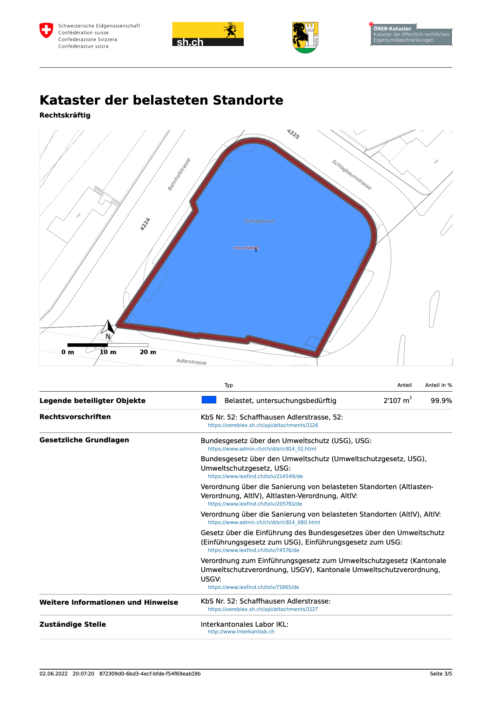

---
= ÖREB-Kataster richtig gemacht #6 - Quod erat demonstrandum
Stefan Ziegler
2022-06-02
:thoth-type: post
:thoth-status: published
:thoth-tags: ÖREB,ÖREB-Kataster,PostgreSQL,PostGIS,INTERLIS,ili2pg,ili2db,ilivalidator,Spring Boot,XSLT,XSL-FO
:idprefix:
---
Teil 1 - 5 zeigen wie man sich einen ÖREB-Kataster zusammenstöpselt. Dass das funktioniert, ist nicht sonderlich erstaunlich, da es ziemlich 1:1 dem entspricht, was https://agi.so.ch[wir] und wie es wir im Einsatz haben. Funktioniert es auch mit in anderen Kantonen?

Ja, klar. Man nehme z.B. die KbS des Kantons Schaffhausen im Rahmenmodell. Diese werden direkt aus dem MGDM mittels XSLT hergestellt. Die Idee finde ich interessant, freue mich aber auf die  Transformation für Fälle von MGDM, wo man Geodaten filtern muss. Welcome to XPath hell... Zudem natürlich alle Bundesdaten. Benötigt werden insbesondere noch die Konfiguration-INTERLIS-Transferdateien. Das sind:

**Zuständige Stellen:** Für unsere Gesamtsystem wird zwingend die katasterverantwortliche Stelle benötigt. Sie landet auf dem PDF-Ausdruck und natürlich auch in der XML-Datei.

Optional werden sämtliche zuständigen Stellen des Kantons und der Gemeinden benötigt. Werden diese zentral nachgeführt und verwaltet, kann in den Geodaten nur noch darauf verwiesen werden und sie müssen nicht mitgeliefert werden. Das hat den Vorteil, dass bei Mutationen einfach und schnell reagiert werden kann und dies nur an einer Stelle gemacht werden muss. Zudem ist es einfach &laquo;sauberer&raquo;, wenn im ÖREB-Kataster z.B. die Staatskanzlei nur einmal vorkommt und nicht x-fach. Die Staatskanzlei eines Kantons gibt es in der Realwelt ebenfalls nur einmal.

https://github.com/oereb/oereb-sh/blob/main/oereb`config/ch.sh.agi.oereb`zustaendigestellen_V2_0.xtf[https://github.com/oereb/oereb-sh/blob/main/oereb`config/ch.sh.agi.oereb`zustaendigestellen_V2_0.xtf]

**Gesetze:** Eine Transferdatei mit den Gesetzen wird zwingend benötigt, um die kantonalen gesetzlichen Grundlagen verwalten zu können.

https://github.com/oereb/oereb-sh/blob/main/oereb`config/ch.sh.sk.oereb`gesetze_V2_0.xtf[https://github.com/oereb/oereb-sh/blob/main/oereb`config/ch.sh.sk.oereb`gesetze_V2_0.xtf]

**Themen:** Die Themen-Konfiguration ist ebenfalls zwingend notwendig. Sie wird benötigt, um die kantonalen gesetzlichen Grundlagen den Themen zuzuweisen. Zusätzliche kantonale Themen und Subthemen werden auch in dieser Datei verwaltet.

https://github.com/oereb/oereb-sh/blob/main/oereb`config/ch.sh.agi.oereb`themen_V2_0.xtf[https://github.com/oereb/oereb-sh/blob/main/oereb`config/ch.sh.agi.oereb`themen_V2_0.xtf]


**Verfügbarkeit:** Die Verfügbarkeits-Konfiguration wird zwingend für die Steuerung der verfügbaren Themen und Gemeinden benötigt. Ebenfalls wird das Datum des Standes der Daten der amtlichen Vermessung in dieser Konfiguration verwaltet.

https://github.com/oereb/oereb-sh/blob/main/oereb`config/ch.sh.agi.oereb`verfuegbarkeit_V2_0.xtf[https://github.com/oereb/oereb-sh/blob/main/oereb`config/ch.sh.agi.oereb`verfuegbarkeit_V2_0.xtf]

**Grundbuch:** Wird zwingend benötigt, falls es Grundbuchkreise (o.ä.) gibt.

https://github.com/oereb/oereb-sh/blob/main/oereb`config/ch.sh.agi.oereb`grundbuchkreis_V2_0.xtf[https://github.com/oereb/oereb-sh/blob/main/oereb`config/ch.sh.agi.oereb`grundbuchkreis_V2_0.xtf]

**MapLayering:** Falls man die Opazität und die Reihenfolge der WMS-Bilder (resp. des Darstellungsdienstes) steuern will, ist diese Konfigruation zwingend. 

https://github.com/oereb/oereb-sh/blob/main/oereb`config/ch.sh.agi.oereb`maplayering_V2_0.xtf[https://github.com/oereb/oereb-sh/blob/main/oereb`config/ch.sh.agi.oereb`maplayering_V2_0.xtf]

**Logo:** Wird zwingend für die Verwaltung der Logos der Gemeinden und des Kantons benötigt.

https://github.com/oereb/oereb-sh/blob/main/oereb`config/ch.sh.agi.oereb`logo_V2_0.xtf[https://github.com/oereb/oereb-sh/blob/main/oereb`config/ch.sh.agi.oereb`logo_V2_0.xtf]

**Texte:** Wird zwingend benötigt, falls es neben den Bundestexten noch weitere kantonale Texte für den Glossar gibt. In meinen Beispiel für den Kanton Schaffhausen habe ich keine zusätzlichen Texte eingeführt.

Die Aufsplittung der Konfiguration kann man teilweise (es muss ja immer noch modellkonform sein) selber wählen. Wahrscheinlich macht man das eher themen-/kontextbezogen und abhängig vom Nachführungszyklus.

Im Dockerfile resp. in der https://github.com/oereb/oereb-sh/blob/main/oereb_stack/docker-compose.yml[docker-compose.yml-Datei] sieht man die übriggebliebene Konfiguration, die man _nicht_ mittels INTERLIS-Dateien verwalten kann:

- Timezone
- Datenbankverbindung
- Datenbankschema
- Minimale Grösse der Geometrien, die berücksichtigt werden beim Verschnitt.
- URL der katasterverantwortlichen Stelle 
- WMS für die Hintergrundkarte(n)

Pro ÖREB-Webservice-Instanz kann somit nur eine KVS vorhanden sein kann. D.h. es bräuchte im Rahmenmodell noch etwas wie &laquo;KVS pro Gemeinde&raquo;, damit es nicht für jeden Kanton eine eigene Webservice-Instanz braucht. 

Auf Stufe Datenbank könnte man bereits heute mehrere Kantone in das gleiche Schema schmeissen und es würde funktionieren.

Die Konfiguration mittels Rahmenmodell ist sehr transparent und man muss für verschiedene Schritte das Rad nicht neu erfinden:

- Nachführung: Entweder schnell mal von Hand oder mit https://qgis.org[QGIS].
- Validierung und Import in das Katastersystem: https://github.com/claeis/ilivalidator[`ilivalidator`] und https://github.com/claeis/ili2db[`ili2pg`]

Schreiten wir zur Tat und implementieren wir ein ÖREB-Katastersystem für den Kanton Schaffhausen:

`docker-compose up` (im https://github.com/oereb/oereb-sh/tree/main/oereb_stack[`oereb_stack`-Ordner])

Das startet eine leere ÖREB-Datenbank und den ÖREB-Webservice. Die https://github.com/oereb/oereb-sh/tree/main/oereb_gretljobs[GRETL-Jobs] konnte ich mit minimalen Anpassungen aus http://blog.sogeo.services/blog/2022/04/19/oereb-kataster-richtig-gemacht-3.html[Teil 3] übernehmen. 

Die magischen Env-Variablen müssen wir setzen:

```
export ORGGRADLEPROJECT_dbUriOerebV2="jdbc:postgresql://oereb-db/oereb"
export ORGGRADLEPROJECT_dbUserOerebV2="gretl"
export ORGGRADLEPROJECT_dbPwdOerebV2="gretl"
```

Sämtliche Datenimports werden mit einem Befehl im https://github.com/oereb/oereb-sh/tree/main/oereb_gretljobs[Ordner `oereb_gretljobs`] angestossen:

----
./start-gretl.sh --docker-image sogis/gretl:latest --docker-network oereb_stack_default --job-directory $PWD :oereb_av:replaceCadastralSurveyingData :oereb_plzo:importPLZO :oereb_bundesgesetze:importData :oereb_bundeskonfiguration:importBundeskonfiguration :oereb_kantonskonfiguration:importKantonskonfiguration :oereb_bundesdaten:importData :oereb_kbs:importData
----

Ich habe nur die Gemeinde Schaffhausen freigeschaltet. Aus diesem Grund wird auch nur die amtliche Vermessung dieser Gemeinde heruntergeladen und importiert. Der gesamte Importprozess dauert bei mir circa fünf Minuten, wobei das meiste für die amtliche Vermessung und die PLZ/Ortschaften draufgeht.

Testrequest &laquo;KbS ÖV und Baulinien Nationalstrassen&raquo;:

- http://localhost:8080/getegrid/xml/?EN=2689879,1284094
- http://localhost:8080/extract/xml?EGRID=CH615475087406
- http://localhost:8080/extract/pdf?EGRID=CH615475087406

Testrequest &laquo;KbS (mgdm2oereb)&raquo;:

- http://localhost:8080/getegrid/xml/?EN=2689819,1283962
- http://localhost:8080/extract/xml?EGRID=CH167308546127
- http://localhost:8080/extract/pdf?EGRID=CH167308546127



Eine Unschönheit weist der Auszug bei den gesetzlichen Grundlagen auf: Das USG und die USGV erscheinen doppelt. Das rührt daher, weil die gesetzlichen Grundlagen ebenfalls in den Geodaten bei den Dokumenten mitgeliefert werden und dann ebenfalls nochmals in meiner Konfiguration dem Thema zugeordnet werden. Die gesetzlichen Grundlagen sollten nicht mit den Geodaten mitgeliefert werden.

Die Frage, die mich aber nachts fast nicht mehr schlafen lässt: Warum um Herrgottswillen steht da auf dem https://geodienste.ch/services/av[geodienste.ch-WMS] &laquo;frei erhältlich&raquo;? Habe ich irgendwie falsche WMS-Endpunkte angezapft oder ist das ein spezieller WMS-Layer? Ich habe das Root-Element als Layer-Parameter gewählt. 


