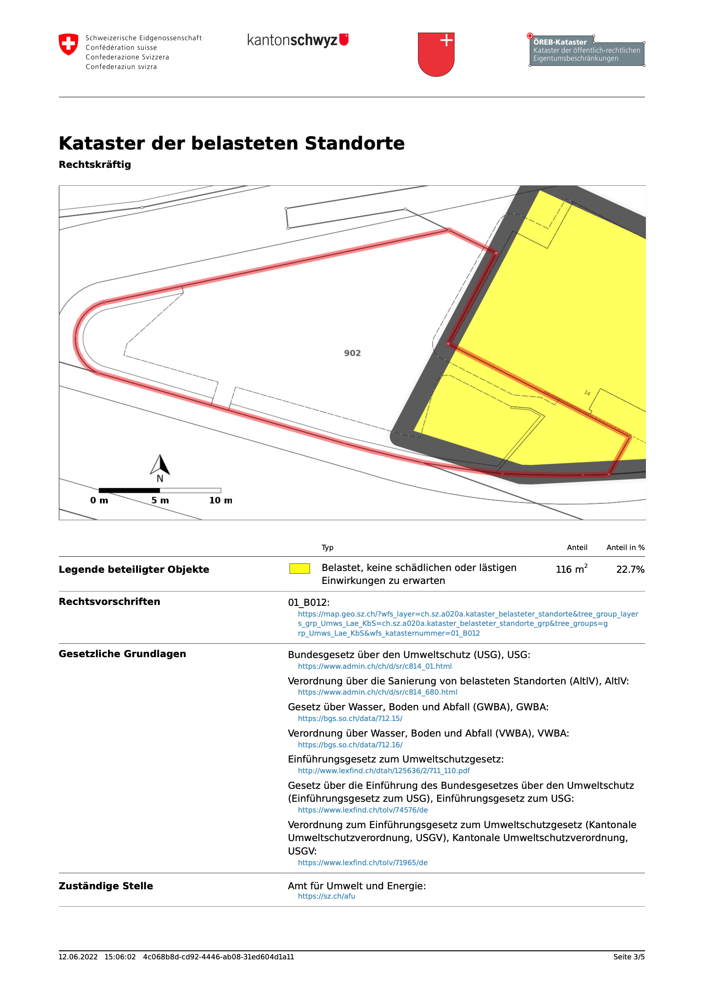

---
= ÖREB-Kataster richtig gemacht #7 - Multi-Tenancy
Stefan Ziegler
2022-06-12
:thoth-type: post
:thoth-status: published
:thoth-tags: ÖREB,ÖREB-Kataster,PostgreSQL,PostGIS,INTERLIS,ili2pg,ili2db,ilivalidator,Spring Boot,XSLT,XSL-FO
:idprefix:
---
Im http://blog.sogeo.services/blog/2022/06/02/oereb-kataster-richtig-gemacht-6.html[letzten Teil] wollte ich zeigen, dass das Solothurner System auch mit Daten anderer Kantone reibungsfrei, einfach und transparent funktioniert. Das tut es. Ein wichtiger Aspekt hat aber gefehlt: Der Testaufbau beinhaltete nur Daten eines Kantons. Herausforderung akzeptiert. Zwei Kantone sind langweilig, nehmen wir noch einen dritten hinzu. Das Schwierigste ist in der Regel in den Besitz von Daten im Rahmenmodell zu kommen. Weil diese nun nicht einfach vom jeweiligen Kanton herunterladbar sind, erzeuge ich aus dem MGDM der belasteten Standorte des Kantons Schwyz selber die Rahmenmodell-Transferstruktur. Die Daten im MGDM kann man auf https://geodienste.ch[geodienste.ch] herunterladen. Den Datenumbau machen wir nicht mit dem im letzten Teil erwähnten `mgdm2oereb`-Tool, sondern mit unserem Sql-Ansatz. D.h. ich importiere die Daten im MGDM mit https://github.com/claeis/ili2db[`ili2pg`] in die Datenbank, erzeuge ein Schema mit leeren Rahmenmodell-Tabellen und mit der &laquo;Power of Sql&raquo; baue ich die Daten von einer Struktur in die andere. Für den Datenexport kommt wieder `ili2pg` zum Zug. Diesen Ansatz verwenden wir bei uns konsequent für das Herstellen des Rahmenmodells und auch sonst für praktisch alles (z.B. KGDM -> MGDM). Die einzelnen Befehle und die SQL-Queries kann man sich im https://github.com/oereb/oereb-sz[Github-Repo] zu Gemüte führen. Das `mgdm2oereb`-Tool kann nicht verwendet werden, weil es mit der Version 1.5 des MGDM funktioniert. Die Daten des Kantons Schwyz liegen jedoch in der Version 1.4 vor.

Haben wir die KbS des Kantons Schwyz nun im Rahmenmodell https://raw.githubusercontent.com/oereb/oereb-sz/main/mgdm2oereb/ch.sz.afu.oereb_kataster_belasteter_standorte_V2_0.xtf[vorliegend], können wir die Konfigurationsdateien erstellen. Klammerbemerkung: Dabei sogar eine Premiere. Einmal im Leben https://geobasisdaten.ch/[geobasisdaten.ch] verwendet und zwar um die gesetzlichen Grundlagen des KbS im Kanton Schwyz herauszufinden. Wie beim Kanton Schaffhausen mache ich bloss das Minimum. D.h. ich schalte eine Gemeinde frei (Schwyz) damit sich die Fleissarbeit für mich in Grenzen hält. Die Konfigurationsdateien sind im https://github.com/oereb/poc_oereb_kataster/tree/main/oereb_config/sz[PoC-Repo] zu finden. Der Datenimport, den wir mit https://github.com/sogis/gretl[GRETL] (unser ETL-Werkzeug mit integriertem `ili2pg` etc.) machen, ist um https://github.com/oereb/poc_oereb_kataster/blob/main/README.md[die SZ-Jobs] angewachsen.

Und das ist es eigentlich auch bereits. Sind sämtliche Daten importiert, kann man Requests für drei Kantone machen:

SO:

- http://localhost:8080/extract/xml?EGRID=CH955832730623
- http://localhost:8080/extract/xml?EGRID=CH955832730623

SH:

- http://localhost:8080/extract/xml?EGRID=CH167308546127
- http://localhost:8080/extract/pdf?EGRID=CH167308546127

SZ:

- http://localhost:8080/extract/xml?EGRID=CH667722407539
- http://localhost:8080/extract/pdf?EGRID=CH667722407539

Die Antwort des SZ-Beispieles:

Mission accomplished. Aber leider auch nicht ganz so erfolgreich. Das PDF sieht zwar tiptop aus und auf den ersten Blick auch korrekt (gut, bis auf die hässliche fette Umrandung des geodienste.ch-WMS), aber auf den zweiten Blick sieht man die überflüssigen gesetzlichen Grundlagen. Es werden auch Gesetze und Verordnungen der Kantons Schaffhausen und Solothurn aufgelistet. Warum? Des Rätsels Lösung ist einfach. In den `ch.KANTON.agi.oereb_themen_V2_0.xtf`-Dateien weisen wir einem ÖREB-Thema weitere (kantonale oder kommunale) gesetzliche Grundlagen zu. D.h. in unserem gemeinsamen ÖREB-Katastersystem sind dem Thema `ch.BelasteteStandorte` gesetzliche Grundlagen von drei Kantonen zugewiesen. Das ist falsch. Entweder müsste man das Rahmenmodell anpassen (wie auch wegen der fehlenden Beziehung einer Gemeinde zu einer KVS) oder man löst es applikatorisch indem man Konventionen einführt (mit Baskets und/oder Datasets). Aber für mich noch kein Abbruchkriterium für eine gemeinsame ÖREB-Katasterinfrastruktur. 

Die Architektur bleibt für mich faszinierend einfach. Sie hat klare Schnittstellen, ist effizient und transparent und basiert auf robusten, vorhandenen Werkzeugen (PostGIS, `ili2db`, `ilivalidator`, ...). &laquo;Standing on the shoulders of giants&raquo; quasi. Vielleicht sollten wir wieder vermehrt einfache Dinge einfach lösen. Technisch wie auch organisatorisch.
