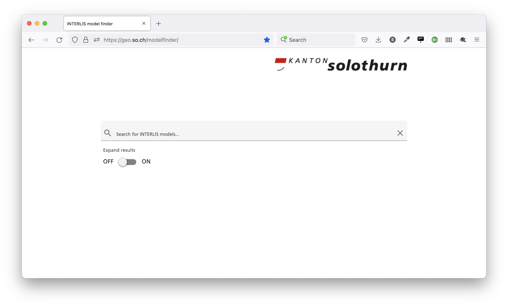
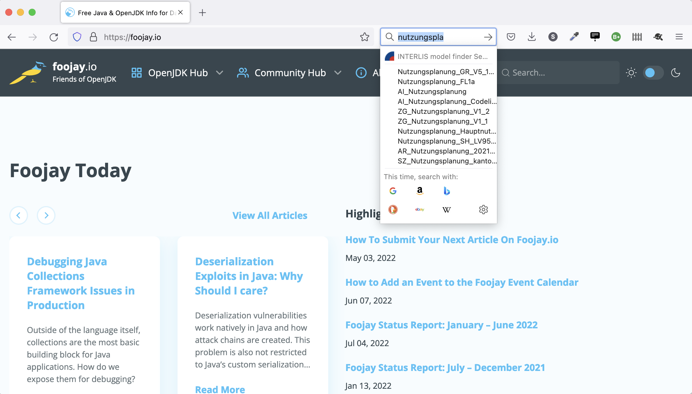
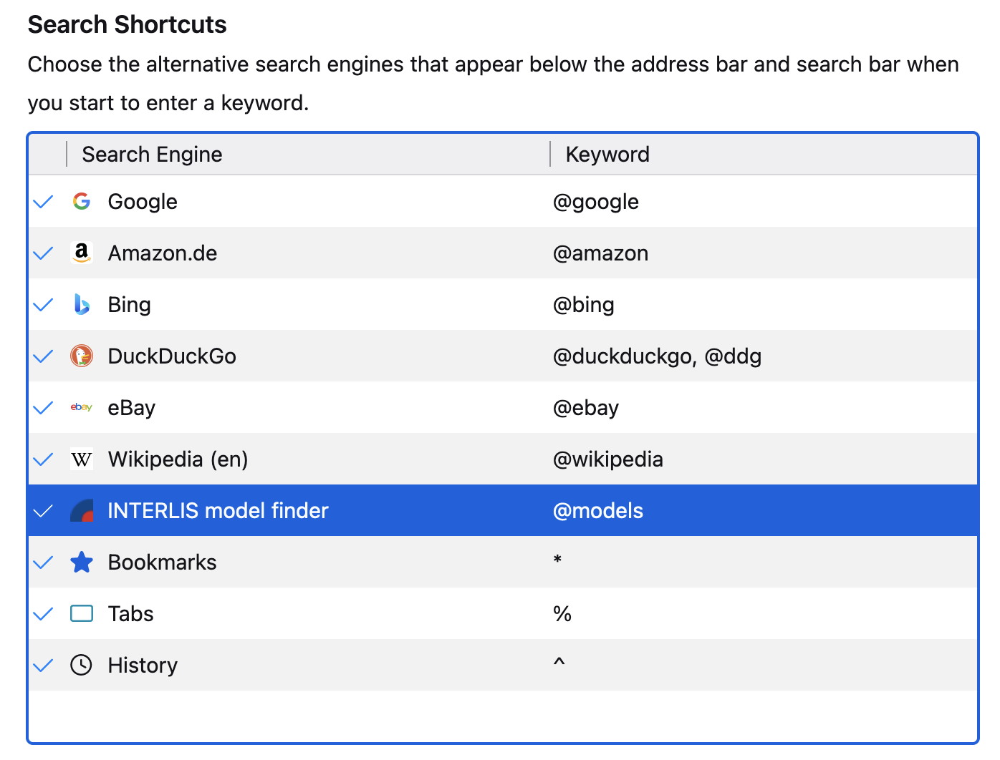
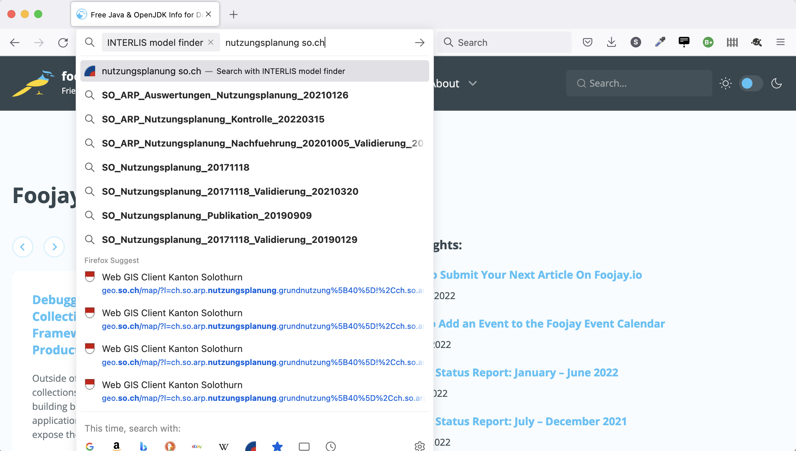

---
= State of INTERLIS model finder - Summer 2022
Stefan Ziegler
2022-07-18
:thoth-type: post
:thoth-status: published
:thoth-tags: INTERLIS,Java,Spring Boot,ili2c,GraalVM,GWT
:idprefix:
---
== Einleitung

Der https://geo.so.ch/modelfinder[INTERLIS model finder] ist aus der Not geboren. Wenn ich auf die Schnelle ein Modell anschauen wollte und nicht wusste, ob es ein Modell des https://models.geo.admin.ch/BLW/[BLW] oder des https://models.geo.admin.ch/BAFU/[BAFU] ist, erging es mir wie bei der Verwendung von https://en.wikipedia.org/wiki/USB_hardware#Connectors[USB-Typ-A-Steckern]: Erster Versuch, geht nicht. Also umdrehen und nochmals versuchen. Geht auch nicht. Nun dann, nochmals umdrehen und plötzlich geht es. Also zuerst beim BLW schauen, dort das Modell nicht gefunden, weiter zum BAFU, dort auch nichts gefunden und wieder zurück zum BLW und plötzlich sieht man es.

== Technologie 

Die Grundidee ist, mit im INTERLIS-Compiler https://github.com/claeis/ili2c/tree/master/src/main/java/ch/interlis/ilirepository[vorhandenen Methoden], die verschiedenen INTERLIS-Modellablagen (d.h. die dazugehörigen `ilimodels.xml`-Dateien) zu lesen und zu interpretieren und anschliessend mit https://lucene.apache.org/[Lucene] zu indexieren. Weil es (noch) sehr wenige Informationen sind, die man indexiert, muss man das nicht einmal persistieren, sondern kann den Index beim Hochfahren der Anwendung erstellen und dann natürlich regelmässig updaten (z.B. einmal pro Tag). Das Frontend ist mit https://www.gwtproject.org/[GWT] und https://github.com/DominoKit/domino-ui[_Domino-ui_] als zusätzliche Bibliothek erstellt. Als Web-Framework ist https://spring.io/projects/spring-boot[Spring Boot] gesetzt.

Damit entsteht eine modulare Java-Anwendung. Der Vorteil: Man kann im Java-Ökoystem verweilen und muss nicht mehrere Technologie-Stacks mischen. Klar schreibt man am Ende des Tages eine Browser-Anwendung und muss sich auch diesbezüglich ein wenig auskennen aber ich muss z.B. nicht zwei Build-Tools und -Prozesse kennen etc. pp. Es werden auch nicht drei Docker-Images benötigt (Datenbank, Backend, Frontend), sondern maximal ein Docker-Image. &laquo;notfalls&raquo; reicht auch eine JVM: `java -jar modelfinder.jar` und schon läuft die Anwendung.

Die Anwendung wird mit https://www.graalvm.org/[GraalVM] zu einem native image kompiliert. Dann ist keine JVM mehr notwendig und die Anwendung startet viel schneller. In OpenShift weisen wir der Anwendung 100MB RAM und 100m CPU zu. Eine Anwendung, die in einer JVM läuft, würde mit diesen beschränkten Ressourcen wohl gar nicht mehr starten. 

== Features

Was kann der INTERLIS model finder? Es werden alle Ablagen durchsucht, welche irgendwie mit https://models.interlis.ch[https://models.interlis.ch] verknüpft sind. Es werden die Attribute aus der `ilimodels.xml`-Datei indexiert (Details siehe https://github.com/sogis/modelfinder/blob/main/modelfinder-server/src/main/java/ch/so/agi/search/LuceneSearcher.java#L139[LuceneSearcher.java]).

Bei der Eingabe im Suchfeld werden die Attribute `file`, `title`, `issuer`, `technicalcontact`, `furtherinformation` und `idgeoiv` https://github.com/sogis/modelfinder/blob/main/modelfinder-server/src/main/java/ch/so/agi/search/LuceneSearcher.java#L139[durchsucht]. Das Resultat wird gruppiert nach der Modellablage. Bis https://github.com/claeis/ili2c/issues/70[ili2c Version 5.2.7] ist es nicht möglich exakt die URL der Modellablage zu bestimmen. Aus diesem Grund stimmt der Namen von Ablagen nicht, die einen Pfad aufweisen, da in diesem Fall nur die Domain verwendet wird.

Steuern lässt sich das Verhalten der Anwendung mittels Query-Parameter:

- **`query=[searchTerms]`:** Damit kann via URL eine Suche gestartet werden. Z.B. `query=Wald` sucht in allen Ablagen nach Modellen, bei denen das Wort &laquo;Wald&raquo; indexiert wurde.
- **`expanded=[true|false]`:** Wird `expanded=true` verwendet, sind die Modellablagen aufgeklappt und die Treffer sind sichtbar.
- **`ilisite=[repository name]`:** Damit lässt sich die Suche auf eine Modellablage einschränken. Achtung: Wegen der Domain-vs-Modellablagen-URL-Problematik (siehe oben) darf unter Umständen (noch) nicht die genaue URL der Modellablage verwendet werden, sondern nur der Domainname. 
- **`nologo=[true|false]`:** Falls `nologo=true` wird das Logo nicht dargestellt.

Wenn man Modelle, die irgendwas mit &laquo;Wald&raquo; zu tun haben, in der Modellablage des Bundes suchen will, die Resultate gleich sichtbar aufgeklappt haben und nicht immer das Solothurner Logo anschauen will, geht das so: https://geo.so.ch/modelfinder/?expanded=true&ilisite=models.geo.admin.ch&nologo=true&query=wald[https://geo.so.ch/modelfinder/?expanded=true&ilisite=models.geo.admin.ch&nologo=true&query=wald].

Profitipp #1: Kann man sich natürlich (ohne den `query`-Parameter) z.B. als Bookmark abspeichern.

Ein spannendes Feature ist der partielle https://en.wikipedia.org/wiki/OpenSearch[OpenSearch]-Support. Besucht man die https://geo.so.ch/modelfinder/[Webseite] mit Firefox zum ersten Mal, erscheint im Suchfenster die Lupe mit einem Pluszeichen auf grünem Grund:

Wenn man auf die Lupe klickt, erscheint ein kleines Fenster, wo man «Add search engine ‹INTERLIS model finder›» auswählen muss. Neben Wikipedia und anderen Suchen, sollte nun ein INTERLIS-Icon vorhanden sein. Tippt man &laquo;Wald&raquo; in das Suchfeld werden Resultate aus der Standardsuche vorgeschlagen und vorangegangene Suchbegriffe, es reicht ein Klick auf das INTERLIS-Icon und es wird nach INTERLIS-Modellen gesucht. Das funktioniert zu jedem Zeitpunkt, d.h. man muss sich nicht auf der INTERLIS model finder Webseite befinden. Wird INTERLIS model finder in Firefox zur Standardsuche gemacht, werden Treffer vorgeschlagen:

Profitipp #2: Man kann trotz Freitextsuche relativ streng den Kanton (oder Bund) eingrenzen indem man zusätzlich zum eigentlichen Suchterm z.B. noch &laquo;so.ch&raquo; miteintippt.

Natürlich kann man es niemandem übel nehmen, der nicht die Modellsuche als Standardsuche definiert. Trotzdem lässt sich die Suchfunktionalität in Wert setzen, indem man einen Shortcut setzt:

Jetzt ist es möglich mit `@models` und Tab-Taste klicken in der Address Bar nach Modell zu suchen und gleich auch Vorschläge zu bekommen:

In ähnlicher Form funktioniert das auch mit Chrome (Chromium). Dort ist die OpenSearch-Unterstützung zusätzlich mittels https://www.chromium.org/tab-to-search/[Tab-to-search] noch besser umgesetzt. Aber ich weiss nicht, ob das funktioniert, wenn sich die OpenSearch-Funktionalität hinter einem Pfad versteckt (wie hier) und nicht direkt hinter einem Domainnamen.

Wie und ob es bei Safari funktioniert? Keine Ahnung.

== Ausblick

Schnell kommt der Vorschlag, dass man auch nach Klassen etc. suchen könnte. Ja, aber ich denke, das wird bezüglich UX/UI herausfordernd. Reicht hier eine Freitextsuche oder muss geführter gesucht werden, um halbwegs sinnvolle Treffer zu bekommen. Hat überhaupt jemand schon einmal dieses Bedürfnis wirklich gehabt?

Der sinnvolle Umgang mit alten Modellversionen ist mir auch nicht so richtig klar. Sollen die überhaupt gefunden werden können? Sollen die bewusst gefiltert werden können?

Am wichtigsten scheint mir, dass die `ilimodels.xml`-Datei mit sinnvollen Inhalten gefüllt ist. Stand heute finde ich das https://models.geo.admin.ch/BAFU/Hazard_Mapping_V1_3.ili[aktuelle Naturgefahren-MGDM] nicht, weil nirgends das Wort &laquo;Naturgefahren&raquo; vorkommt. Weder in der `ilimodels.xml`-Datei noch im Modell selber. In diesem konkreten Fall könnten die `Tags`-Attribute helfen oder die `shortDescription`, die dann indexiert werden können. Das führt zur Fragestellung: &laquo;Wie erstelle und pflege ich eine INTERLIS-Modellablage&raquo;. Dazu später mehr.
