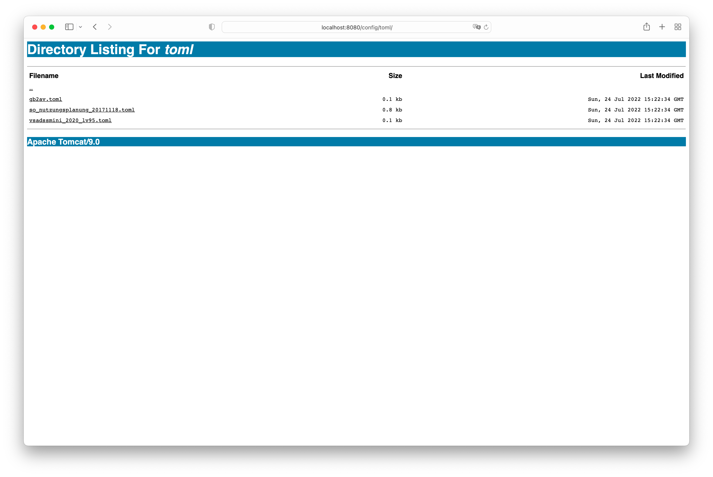
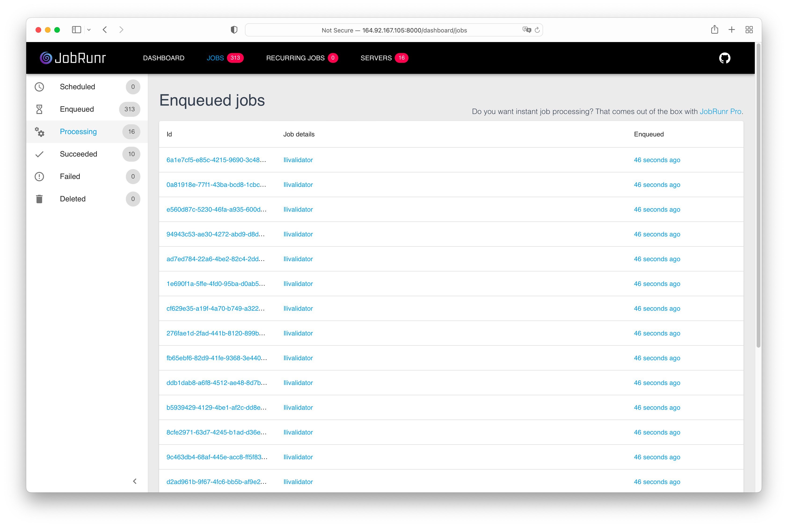
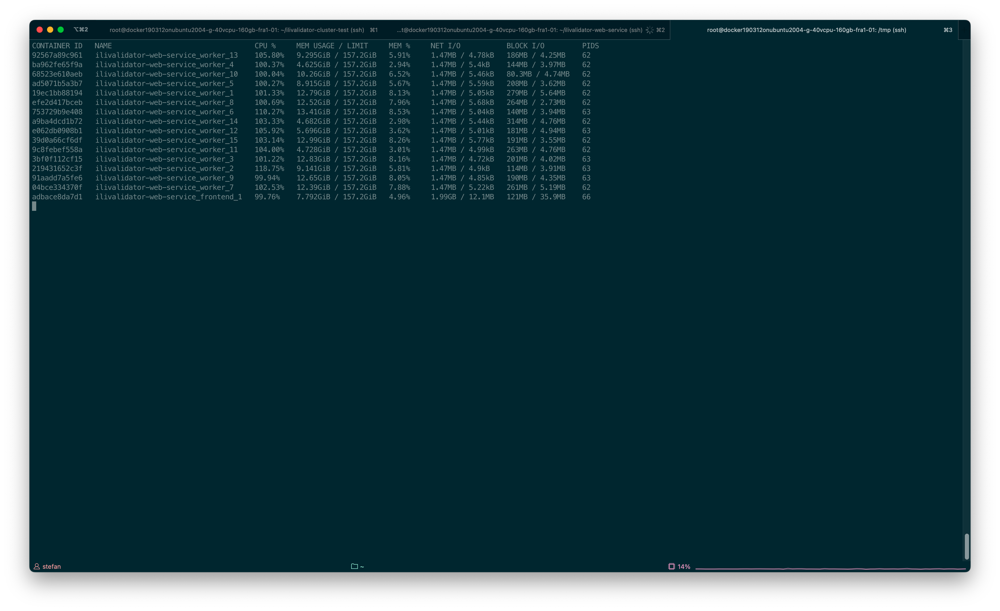

---
= INTERLIS leicht gemacht #29 - REST-API für ilivalidator-web-service
Stefan Ziegler
2022-07-24
:thoth-type: post
:thoth-status: published
:thoth-tags: INTERLIS,ilivalidator,jobrunr,Java
:idprefix:
---
Unser https://github.com/sogis/ilivalidator-web-service[ilivalidator-web-service] hat einige Neuerungen spendiert bekommen, unter anderem:

**Konfiguration**

Es ist möglich eigene Konfigurationen (aka _toml_- resp. _ini_-Dateien und zusätzliche INTERLIS-Modelle) zu verwenden. Der Webservice berücksichtigt zwei Verzeichnisse (`config/toml/` und `config/ili`) während der Prüfung einer INTERLIS-Transferdatei. Es werden standardmässig einige Solothurner Konfigurationen reinkopiert, was jedoch unterbunden werden kann. Das `config`-Verzeichnis und die beiden Unterverzeichnisse werden im Webservice via URL http://localhost:8080/config exponiert. Damit wird für die Benutzer die Prüfung transparenter, da sie eine allfällige zusätzliche Konfiguration sehen:

Siehe: https://github.com/sogis/ilivalidator-web-service#configuration-and-running

**REST-API**

Es gibt neben dem GUI neu eine REST-API für eine M2M-Kommunikation. Da es sich um _long running tasks_ handelt, kann kein synchroner Prozessablauf gewählt werden, d.h. man kann nicht eine Datei hochladen und die Verbindung zum Server bleibt offen, bis die Prüfung durch ist. Im GUI wird aus diesem Grund auf das Websocket-Protokoll gesetzt. Bei der REST-API verwenden wir jedoch &laquo;nur&raquo; HTTP. 

Wenn man eine Datei hochlädt, erhält man als Antwort den Statuscode `202 ACCEPTED` und den Header `Operation-Location`, der auf eine Ressource zeigt.

[source,bash,linenums]
----
curl -i -X POST -F file=@254900.itf http://localhost:8080/rest/jobs
----

liefert:

[source,bash,linenums]
----
HTTP/1.1 202
Operation-Location: http://localhost:8080/rest/jobs/4d4aa583-6575-4200-a39c-621a5190d36d
Content-Length: 0
Date: Sat, 23 Jul 2022 16:40:50 GMT
----

Die Ressource `/rest/jobs/4d4aa583-6575-4200-a39c-621a5190d36d` liefert mir Informationen über den Stand der Validierung meiner Datei:

[source,bash,linenums]
----
curl -i -X GET http://localhost:8080/rest/jobs/4d4aa583-6575-4200-a39c-621a5190d36d
----

liefert:

[source,bash,linenums]
----
HTTP/1.1 200
Retry-After: 30
Content-Type: application/json
Transfer-Encoding: chunked
Date: Sat, 23 Jul 2022 16:43:12 GMT

{"createdAt":"2022-07-23T16:42:15.68317767","updatedAt":"2022-07-23T16:42:15.68317767","status":"PROCESSING"}
----

Es gibt einen `Retry-Header`, der Clients anweist, 30 Sekunden zu warten bis zur nächsten Abfrage. Ist die Validierung abgeschlossen, enthält die Antwort Links zu den Logdateien:

[source,bash,linenums]
----
HTTP/1.1 200
Content-Type: application/json
Transfer-Encoding: chunked
Date: Sat, 23 Jul 2022 16:43:29 GMT

{"createdAt":"2022-07-23T16:42:15.68317767","updatedAt":"2022-07-23T16:43:16.011457796","status":"SUCCEEDED","logFileLocation":"http://localhost:8080/logs/ilivalidator_8148789347157812698/254900.itf.log","xtfLogFileLocation":"http://localhost:8080/logs/ilivalidator_8148789347157812698/254900.itf.log.xtf"}
----

Siehe: https://github.com/sogis/ilivalidator-web-service/blob/master/docs/rest-api-de.md

Die Joborchestrierung ist mit https://jobrunr.io[JobRunr] umgesetzt. Eine Bibliothek für verteiltes Background Processing. Die Persistierung wird über eine Datenbank gemacht. JobRunr hat viele Features und Einstellungsmöglichkeiten, ist aber trotzdem sehr einfach in der Handhabung. Ein interessantes Feature ist der Umgang mit nicht beendeten Jobs, z.B. bei einem Server-Absturz. Diese werden nach einem Restart nochmals ausgeführt. Es geht also nichts verloren. Verteile Prozessierung bedeutet in diesem Fall über die Grenzen der JVM und über die Grenzen von Servern hinweg, solange die &laquo;Arbeitstiere&raquo; Zugriff auf die gemeinsame Datenbank haben. Im absolut einfachsten Fall gibt es aber nur einen Webservice, dieser fungiert als Schnittstellenserver als auch als Validierungsserver und verwendet eine In-Memory-Datenbank.

**ilivalidator Cluster**

Was kann man mit der neuen REST-API und deren Umsetzung mit JobRunr machen? Zum Beispiel einen ilivalidator Cluster mit 15 Worker. Dazu reicht eine einfache `docker-compose`-Konfiguration:

[source,yaml,linenums]
----
version: '3'
services:
  frontend:
    image: sogis/ilivalidator-web-service:2
    environment:
      TZ: Europe/Zurich
    ports:
      - 8080:8080
      - 8000:8000
    volumes:
      - type: bind
        source: /tmp/docbase
        target: /docbase
      - type: bind
        source: /tmp/work
        target: /work
  worker:
    image: sogis/ilivalidator-web-service:2
    deploy:
      replicas: 15
    environment:
      TZ: Europe/Zurich
      JOBRUNR_DASHBOARD_ENABLED: "false"
      REST_API_ENABLED: "false"
      UNPACK_CONFIG_FILES: "false"
      CLEANER_ENABLED: "false"
    volumes:
      - type: bind
        source: /tmp/docbase
        target: /docbase
      - type: bind
        source: /tmp/work
        target: /work
----

Es wird ein (1) Frontend-Schnittstellen-Service gestartet, welcher die Uploads entgegennimmt. Es wird ein worker-Service mit 15 Replicas gestartet, die als JobRunr-Backgroundserver arbeiten. Beide Services verwenden das gleiche Dockerimage. Beim worker-Service werden einige Funktionalitäten ausgeschaltet, da diese nicht benötigt werden. Zudem ist der worker-Service von aussen nicht erreichbar. Sauberer wäre natürlich, wenn man Ressource-Limiten (RAM, CPU) setzt. Dies ist im Nicht-Swarm-Mode mit der Version 3 für die CPU nicht möglich und darum wird darauf verzichtet. Das sollte für unseren Test egal sein. 

Nun benötigt man genügend Server-Ressourcen, d.h. man mietet sich bei Digitalocean einen 40vCPU-Server mit 160GB RAM. Man sollte ihn einfach nicht vergessen zu löschen, da das Teil monatlich mit $1260.00 zu Buche schlägt.

Als Testdaten verwende ich die AV-Daten des Kantons Bern, die ich via https://geodienste.ch/services/av[geodienste.ch] heruntergeladen habe. Es handelt sich um 339 Gemeinden. Ein https://github.com/edigonzales/ilivalidator-cluster-test/blob/main/sendFiles.java[simples Jbang-Skript] lädt mir die Daten via REST-API zum Server hoch. Nun geht die Post ab. Nachfolgend ein Screenshot des JobRunr-Dashboards und eine `docker stats`-Ausgabe:

Sämtliche 339 Gemeinden konnten innerhalb von circa 17 Minuten geprüft werden. Limitierender Faktor war zu guter Letzt die Gemeinde Bern, welche 8 Minuten benötigt, wobei 2 davon als einzige Gemeinde. Diese sollte also möglichst zu Beginn hochgeladen werden.

Anschliessend versuchte ich 29 Worker zu verwenden, was aber nicht erfolgreich funktionierte. Ein Drittel der Dockercontainer wurden wieder runtergefahren. Der Grund war mir auf die Schnelle nicht klar (Hinweis: Ressourcen setzen!). Eventuell wird unter gewissen Umständen der I/O zum Problem, wenn 30+ Replicas grossen Traffic verursachen. 

Im Grunde genommen kann man den ilivalidator-web-service so einfachst beliebig horizontal skalieren. Aus Gründen sollten die Worker nicht auf dem gleichen Server laufen und Ressourcen (`limits` und `reservations` oder äquivalente Einstellungen) gesetzt werden.
