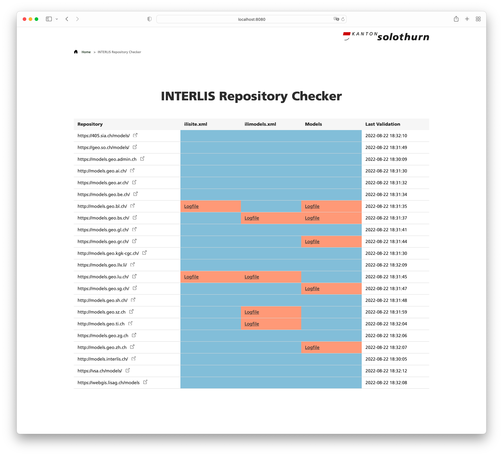

---
= INTERLIS leicht gemacht #30 - INTERLIS Repository Checker
Stefan Ziegler
2022-08-31
:thoth-type: post
:thoth-status: published
:thoth-tags: INTERLIS,ilivalidator,Java,Repository,ili2c
:idprefix:
---
Die INTERLIS-Modellablagen (aka INTERLIS-Repos) sind ein wichtiger Baustein im INTERLIS-Ökosystem. Sie dienen zur zentralen Publikation von INTERLIS-Modellen und helfen beim Arbeiten mit kompatiblen Werkzeugen. In erster Linie heisst das, dass man sich nicht mehr gross um die Modelldateien kümmern muss. Sie sind einfach &laquo;da&raquo;. Die Werkzeuge suchen und finden (hoffentlich) die benötigten Modelle in einem der Repositories. Für automatisierte Prozesse sollte man sich aber in der Regel nicht auf die Modellablagen verlassen, sondern die benötigten Modelle zum Prozess kopieren oder sich ein lokales Repository anlegen, welches alle benötigten Modelle spiegelt. Man will sich ja nicht unnötig von externen Anwendungen abhängig machen.

Viele Kantone und einige Vereine betreiben eine INTERLIS-Modellablage. Damit die Werkzeuge auch mit den Modellablagen problemlos zusammenspielen, sollten die Modellablagen auch korrekt sein. Der https://github.com/claeis/ili2c[_INTERLIS-Compiler_] bietet die Funktion `--check-repo-ilis` an, welche eine Ablage prüft. Leider ist nirgends gross dokumentiert was genau geprüft wird. Für die Prüfung zuständig ist die Klasse https://github.com/claeis/ili2c/blob/master/src/main/java/ch/interlis/ili2c/CheckReposIlis.java[CheckReposIlis]. Es werden folgende Sachverhalte geprüft:

- Existiert in der Modellablage eine `ilimodels.xml`-Datei?
- Ist die `ilimodels.xml`-Datei schemakonform? D.h. die Datei wird nicht mit https://github.com/claeis/ilivalidator[`ilivalidator`] geprüft, sondern sie wird &laquo;nur&raquo; gegen das XML-Schema geprüft.
- Sind die Modelle syntaktisch korrekt? (Prüfung mit dem Compiler).
- Stimmen die Metainformationen (wie z.B. md5-Hash) in der `ilimodels.xml`-Datei?
- Wahrscheinlich noch der eine oder andere übersehene Punkt.

Ich habe den Code nun in eine kleine Webanwendung gepackt, welche diese Prüfungen für INTERLIS-Modellablagen regelmässig durchführt und visualisiert. In Abweichung zu den oben erwähnten Tests, verwende ich für die Prüfung der `ilimodels.xml`-Datei `ilivalidator`. Die Repo-Prüffunktion im Compiler gibt es bereits länger als es `ilivalidator` gibt. Vielleicht gibt es aber noch andere Gründe warum eine XML-Schemaprüfung gemacht wird. Zusätzlich prüfe ich auch noch die `ilisite.xml`-Datei. Ebenfalls mit `ilivalidator`. Konkret hat das den Nachteil, dass https://github.com/claeis/ilivalidator/issues/351[ein Fehler] nicht gefunden wird, der mittels Schemaprüfung entdeckt wird.

Für mich schwierig war, dass alle Fehler, welche der Compiler loggt, wenn man `--check-repo-ilis` verwendet, bei mir ebenfalls in der Logdatei landen. Eventuell gibt es da noch die eine oder andere Meldung, die fehlt. Richtig nachhaltig ist meine Prüfmethode nicht, da ich den Code einfach kopiere und an einigen Stellen anpasse. Maintenance hell.

Verpackt als Dockerimage, lässt sich die native kompilierte Spring Boot Anwendung einfach und schnell starten:

```
docker run -p 8080:8080 -e TZ=Europe/Zurich sogis/interlis-repo-checker:latest
```

Konfigurieren lässt sie sich Anwendung mit einigen wenigen Env-Variablen:

- `CONNECT_TIMEOUT` und `READ_TIMEOUT`: Connect und read Timout für Protokollhandler, die `java.net.URLConnection` verwenden. Damit kann gesteuert werden, dass beim Lesen der Repositories nicht zu lange gewartet wird, bis eine Verbindung aufgebaut wird oder der Server die Antwort liefert.
- `REPOSITORIES`: Kommaseparierte Liste der Repositories, die geprüft werden sollen.
- `CHECK_CRON_EXPRESSION`: (Spring Boot) Cron Expression, die steuert wie häufig die Prüfung durchgeführt wird.
- `WORK_DIRECTORY`: Verzeichnis in das die Prüfresultate gespeichert werden.
- `WORK_DIRECTORY_PREFIX`: Präfix für `WORK_DIRECTORY`.

Die voreingestellten Werte sind in der https://github.com/edigonzales/repo-checker/blob/main/src/main/resources/application.properties[_application.properties_-Datei] definiert.

Nach dem Start der Webanwendung werden einmalig alle Modellablagen geprüft und es muss nicht gewartet werden bis der Cronjob läuft. Nach ein paar Minuten sollte sich unter http://localhost:8080 folgendes Bild zeigen:



Zwei Repositories weisen momentan bereits Fehler in der `ilisite.xml`-Datei auf. Die Fehlermeldung von `ilivalidator` ist `Error: unknown xml file`. Das Problem ist, dass der INTERLIS-Namespace fehlt. Anstelle von:

```
<TRANSFER xmlns="http://www.interlis.ch/INTERLIS2.3">
```

steht nur:

```
<TRANSFER>
```

In der `ilimodels.xml`-Datei gibt es allerlei Fehler: Doppelte TID, zu lange Texte und unerlaubte Zeichen. Spannender wird es bei den Modellen selbst. Ein Kanton listet das Modell INTERLIS als Abhängigkeit auf. Diese Modell wird vom Compiler nicht gefunden. Das Modell https://github.com/claeis/ili2c/issues/75[darf nicht gelistet werden]. Die Meldung sollte aber eine andere sein. Dann gibt es eigentliche Modellfehler und Unstimmigkeiten zwischen dem Modell und dem Eintrag in der `ilimodels.xml`-Datei.

Viele der Fehler lassen sich vermeiden, wenn man a) die Modellablagen nicht händisch nachführt (wer hat schon Bock einen md5-Hash abzutippen?) und b) nach dem Nachführen die Modellablagen auch prüft. Siehe dazu http://blog.sogeo.services/blog/2022/07/19/interlis-leicht-gemacht-number-28.html.

+++<s>Der Repochecker läuft unter folgender URL: https://geo.so.ch/repochecker</s>+++ Das Teil scheint mir noch ein Memoryleak zu haben und ist darum nicht online. Wer es testen will, einfach den obigen Dockerbefehl ausführen.