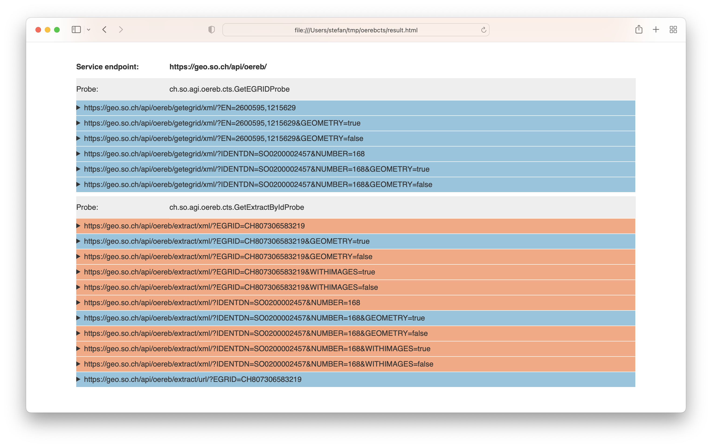
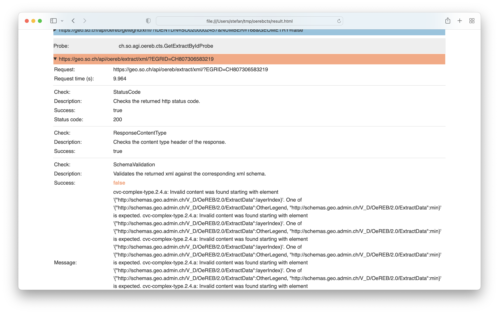

---
= ÖREB-Kataster richtig gemacht #8 - ÖREB-Kataster Compliance Test Suite
Stefan Ziegler
2022-10-02
:thoth-type: post
:thoth-status: published
:thoth-tags: ÖREB,ÖREB-Kataster,Java,XSLT
:idprefix:
---
Der ÖREB-Kataster ist durch das https://www.cadastre.ch/de/manual-oereb/publication/instruction.detail.document.html/cadastre-internet/de/documents/oereb-weisungen/Rahmenmodell-de.pdf.html[Rahmenmodell] und https://www.cadastre.ch/de/manual-oereb/service/webservice.html[verschiedene] https://www.cadastre.ch/de/services/publication.detail.document.html/cadastre-internet/de/documents/oereb-weisungen/Weisung-OEREB-Data-Extract-de.pdf.html[Weisungen] gut spezifiert. Das bedeutet, dass man eigentlich weiss, was man umsetzen muss. Das heisst ebenfalls, dass man das Umgesetzte gut prüfen kann. Warum sollte man das prüfen? Die sauber spezifizierte M2M-Schnittstelle bringt einfach nichts, wenn sie bei jedem Kanton anders ist. 

So eine Prüfbibliothek wäre ausserdem schick, um End-zu-End- oder Systemtests zu machen. Gesagt, getan: Ich habe mir als Proof-of-Concept https://github.com/edigonzales/oereb-cts[eine Anwendung resp. eine Bibliothek] geschrieben, die im Prinzip die beiden Aspekte - Aufruf des Services und Auszug - prüft (Stand heute: Teile davon). Das Ganze unter einen Hut zu bringen, fand ich noch herausfordernd:

Es gibt verschiedene Möglichkeiten einen Auszug (oder die GetEGRID-Antwort) anzufordern. Das kann z.B. eine Koordinate sein oder NBIdent und Grundstücksnummer. Und man kann eine Antwort mit oder ohne Geometrie resp. mit oder ohne Bilder anfordern. Das führt dazu, dass es viele Kombinationen gibt, die geprüft sein wollen und die verschiedenen Konfigurationen müssen von jemandem definiert werden. Hat man die Antwort, reicht es nicht diese gegenüber einem Schema zu prüfen, da der Inhalt ja abhängig von den Inputparametern ist. Das wiederum müsste bei der Konfiguration der Tests auch berücksichtigt werden. 

Ich habe mich daher entschieden, so wenig wie möglich von einem Menschen konfigurieren zu lassen und die vielen Kombinationen durch die Maschine selber zu machen. Das heisst, man muss nur den Service-Endpunkt und die notwendigen Parameter angeben, die für den Aufruf benötigt werden (z.B. `EGRID` oder `EN`). Fehlen die Parameter, wird der Test, welcher diese Parameter benötigt, nicht durchgeführt. Wenn `IDENTDN` und `NUMBER` fehlen, werden keine Tests durchgeführt, welche diese beiden benötigen. Momentan ist das alles über ein Ini-File zu konfigurieren:

[source,groovy,linenums]
----
[SO]
SERVICE_ENDPOINT=https://geo.so.ch/api/oereb/
EN=2600595,1215629
IDENTDN=SO0200002457
NUMBER=168
EGRID=CH807306583219
----

Was als Resultat zu erwarten ist, kann oftmals anhand der Request-Parameter eruiert werden: Falls `GEOMETRY=true` verwendet wird, muss in der Antwort ein Geometry-Element vorhanden sein. Was aber ohne menschliches Zutun nicht wirklich funktioniert, ist der Umgang mit leeren Antworten. Es kann korrekt sein, dass eine Antwort leer ist (also kein Grundstück). Woher weiss die Maschine das, ohne dass man es konfigurieren würde? Dieser Fall ist momentan nicht abgefangen. Bei der Konfiguration der Tests muss man also sicher sein, dass z.B. für den definierten `EGRID` auch wirklich ein Auszug zurückkommt.

Geprüft werden momentan der `GetEGRID`- und `extract`-Aufruf und die jeweiligen Antworten. Folgende Checks werden durchgeführt:

- Stimmt der HTTP Status Code?
- Stimmt der Response Content Type?
- Ist die Antwort schemakonform?
- Gibt es Geometrie-Elemente, wenn solche vorhanden sein müssen (resp. umgekehrt)?
- Gibt es eingebettete Bilder, wenn solche vorhanden sein müssen (resp. umgekehrt)?
- Sind alle Bundesthemen-Codes im XML-Inhaltsverzeichnis vorhanden? (`ConcernedTheme`, `NotConcernedTheme`, `ThemeWithoutData`)

Alle mir bekannten ÖREB-Kataster-V2-Webservice habe ich geprüft. Examplarisch ein Screenshot von unserem Dienst. Die Gesamtshow gibt es http://blog.sogeo.services/data/oereb-kataster-richtig-gemacht-8/result.html[hier].

Unser Fehler wurde auch bei der Abnahme erkannt und ist folgendes:

Wir sind für den Fall, dass keine Geometrien angefordert werden, nicht schemakonform: Es fehlt die Boundingbox. Klammerbemerkung: Man schaue sich die Request time an. Der Request dauerte 9s. Das sind circa 8.5 Sekunden zu lang. Grund dafür sind die Spezialisten, die seit geraumer Zeit bei verschiedenen Kantonen ziemlich stupide Tausende Requests in kürzester Zeit absetzen...

Das Gesamtbild ist in etwa folgendes: Die Fehler wiederholen sich. Man erkennt - behaupte ich mal - anhand der Fehler, welches System ein Kanton einsetzt. Typische Fehler sind:

- Grundstückstyp fehlt in der GetEGRID-Antwort
- Geometrieelement fehlt in der GetEGRID-Antwort
- Response Content Type ist &laquo;falsch&raquo;.
- Status Code bei der URL-Weiterleitung ist falsch.
- Fehlende Bundesthemen-Codes

Die Exoten dürfen auch nicht fehlen:

- Keine NBIdents in der Antwort vorhanden resp. &laquo;N/A&raquo;. In den Daten der amtlichen Vermessung gibt es für dieses Grundstück aber einen NBIdent.
- Fehlender &laquo;/&raquo;. Anstelle von `/oereb/getegrid/xml/?EN=YYYYYYYY,XXXXXXXX` funktioniert der Aufruf nur ohne den letzten Slash.
- Ignorieren von XML-Namespaces, d.h. es wird nur genau einer verwendet.

Wo ich mir aber selber nicht ganz sicher bin:

Ist der Response Content Type `application/xml; charset=UTF-8` wirklich falsch? In der Weisung steht nur `application/xml`. Eine interessante Erklärung was eine andere Spez erwartet, gibt es https://stackoverflow.com/questions/3272534/what-content-type-value-should-i-send-for-my-xml-sitemap[hier].

Und stimmt mein Test bezüglich der Bundesthemen-Codes? Meines Erachtens müssen alle Bundesthemen-Codes bei den &laquo;Themes&raquo; vorkommen. Momentan gibt es jetzt Kantone, die formell _keine_ Nutzungsplanung (`ch.Nutzungsplanung`) publizieren.

Ausserdem könnte man sich eventuell darauf einigen wie Links enkodiert werden sollen. Da gibt es unterschiedlichste Varianten. Es wird alles enkodiert, z.B. `https://geo.so.ch` wird zu `https%3A%2F%2Fgeo.so.ch` oder noch spannender ist das Verpacken eines solchen Links in einem CDATA-Block... Innerhalb eines Auszuges werden die Varianten auch gerne gemischt. Ich denke, dass man sich auf das Minimum beschränken sollte, was XML verlangt (z.B. &laquo;&&raquo; wird zu &laquo;amp&raquo;).

