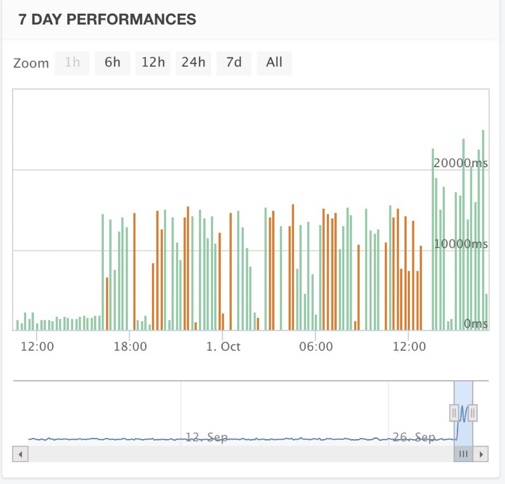
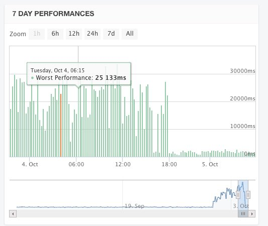
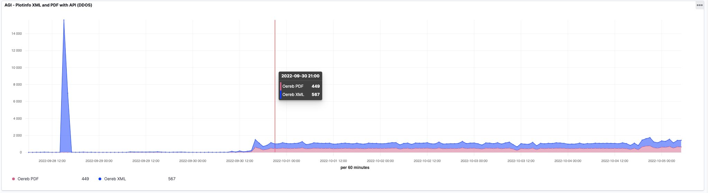

Oder vielleicht sind es auch mehrere Spassvögel. Wir wissen es nicht. Aber was ist passiert?

Plötzlich schlug unser OpenShift-Cluster Alarm. Genauer gesagt die https://docs.openshift.com/container-platform/4.11/applications/application-health.html[Livenessprobe]. Als Livenessprobe haben wir den https://docs.spring.io/spring-boot/docs/2.7.3/actuator-api/htmlsingle/#health[Standard-Health-Endpoint] von https://spring.io/projects/spring-boot[Spring Boot] verwendet. Dieser Endpoint prüft, ob die Anwendung gesund ist. Zur Beurteilung werden dazu auch die sogenannten Backing-Services herangezogen. D.h. in unserem Fall die Datenbank. Falls bei der Prüfung nun keine Datenbankverbindung mehr hergestellt werden kann, ist die Anwendung nicht mehr gesund und die Livenessprobe schlägt fehl und der Container wird https://kubernetes.io/docs/concepts/workloads/pods/pod-lifecycle[neu gestartet].

Aber warum gingen uns die Datenbankverbindungen aus? Irgend ein https://de.wikipedia.org/wiki/Havas#%C3%9Cbertragene_Bedeutung[Habasch] flutete uns mit XML-Anfragen. Wir haben bei uns zwei Instanzen/Pods mit dem Webservice am Laufen. Jeder Pod erhält 10 Datenbankverbindung resp. es wird ein DB-Connectionpool mit maximal 10 Verbindungen aufgebaut. Pro Anfrage benötigt die Anwendung 3 DB-Connections. Auch wenn die Abwicklung der Anfrage im Regelfall sehr schnell passiert, skaliert die Sache natürlich mit bloss 10 zur Verfügung stehender DB-Verbindungen nicht wirklich. Werden wir mit Anfragen geflutet und lassen diese auch auf die Anwendung los, hat diese eher früher als später ein Problem: Die DB-Verbindungen gehen aus und die Livenessprobe schlägt fehl, weil der Health-Endpoint ein `SELECT 1` macht, um zu prüfen, ob die Datenbank noch da ist resp. die Anwendung darauf zugreifen kann. Dass in einem solchen Fall nun der Pod neu gestartet wird, löst das Problem gar nicht, da dieser sofort wieder geflutet wird. Und zu guter Letzt geht es ja weniger um die Livenessprobe, sondern dass die &laquo;normalen&raquo; Benutzer des ÖREB-Katasters keine Anfragen machen mehr können, weil alles verstopft ist und/oder nicht mehr läuft.

Was machen? Als erstes haben wir gerade den Holzhammer hervorgenommen und die IP des Spassvogels in unserem API-Gateway (https://nginx.org/en/[nginx]) gesperrt. Im Wissen, dass der Spassvogel sich schnell eine neue IP besorgen kann. Zusätzlich haben wir mit ungutem Gefühl die Livenessprobe ausgeschaltet, weil die ja so nix bringt. Es dauerte dann nicht lange und es ging wieder von vorne los...

Also mussten wir mit mehr Hirn ran: Nach bisschen Überlegen kommt man auf die Idee eines https://www.nginx.com/blog/rate-limiting-nginx/[Rate Limiters]. Dieser sorgt dafür, dass nur ein eine konfigurierte Anzahl an Requests pro Zeiteinheit vom API-Gateway an die Anwendung weitergereicht wird. Das führte zu folgender Situation:

Kurz vor 18:00 Uhr haben wir den Rate Limiter eingeschaltet. Das führte bei https://statuscake.com[Statuscake] dazu, dass es plötzlich viele Ausfallmeldungen (rote Balken) des ÖREB-Webservices gab. Das war jedoch kein Ausfall des Servers, sondern wir haben den Test so konfiguriert, dass er fehlschlägt, wenn die Antwort länger als 15 Sekunden dauert. Weil wir wussten, dass wir mit Requests geflutet werden, haben wir zuerst einfach nur den 15-Sekunden-Threshold hochgeschraubt. Und siehe da: Kurz nach 12:00 Uhr wurde alles wieder grün. Was uns aber störte und wir nicht ganz verstanden haben, war der Umstand, dass auch Requests im Web GIS Client circa 20 Sekunden dauerten. Erstens ist das für den Anwender nicht toll und zweitens haben wir es nicht verstanden, weil der Rate Limiter nach der IP limitiert. Es stellte sich heraus, dass wir den Rate Limiter noch nicht korrekt konfiguriert hatten und dieses &laquo;Group-by-IP&raquo; nicht funktionierte. Als wir das korrigierten, sah die Grafik wieder super aus, d.h. _fair use_ Benutzer (meistens via Web GIS Client) sind nicht mehr betroffen.

Der Spassvogel hat wirklich eine Woche lang XML- _und_ PDF-Auszüge à discretion gesaugt, insgesamt zwischen 1000 und 1500 Auszüge pro Stunde. Summa summarum und geschätzt, waren es sämtliche Grundstücke des Kantons... Warum macht man sowas? Sinnvoll erscheint mir das nicht. Was will man mit den vielen Dateien machen? Man weiss ja nicht, ob etwas noch aktuell ist oder bereits veraltet!? Hier ein Ausschnitt aus einer Logging-Auswertung mit https://logit.io/[_logit.io_]:

Wir sind aber noch nicht fertig. Mit der Livenessprobe sind wir wie eingangs erwähnt nicht zufrieden, weil sie nicht das prüft, was sie soll. Und die Anwendung selber (also der ÖREB-Webservice) funktioniert zwar einwandfrei aber nur weil das API-Gateway sie vor Überlastung schützt.

Für die Livenessprobe ist der Standard-Health-Endpoint, welche die Backing-Services berücksichtigt schlichtweg das Falsche. Der Server ist ja trotzdem live aber eben nicht ready (Readinessprobe) Requests abzuarbeiten. [Spring Boot] hat dafür https://spring.io/blog/2020/03/25/liveness-and-readiness-probes-with-spring-boot[zwei separate Endpunkte]. Für den Liveness-Endpunkt werden die Backing-Services nicht mehr berücksichtigt.

Bleibt noch die Anwendung selber: Mit den Standardeinstellungen lassen wir die Anwendung bis zu 200 Threads (Requests) gleichzeitig abarbeiten (sehr vereinfacht beschrieben, weil kompliziert und ich nur _denke_, dass ich es richtig verstanden habe). Wie eingangs beschrieben, haben wir aber der Anwendung nur 10 Datenbankverbindungen zugewiesen und pro Request werden drei davon benötigt. Da muss man kein Einstein sein, um zu merken, dass das nicht aufgeht. Die maximale Anzahl sogenannter Worker-Threads muss im Einklang mit anderen Rahmenbedingungen sein: RAM, CPU aber auch DB-Connections. D.h. wir reduzieren diese Worker-Threads auf circa 3 oder 4. Das bedeutet jedoch nicht, dass weitere Requests mit einem 429 (_too many requests_) o.ä. beantwortet werden, denn es gibt verschiedene Queues, die dann greifen und wo die Requests parkiert werden (weiter weg von der eigentlich Anwendung, aber immer noch im Applikationsserver). Tests mit jMeter haben gezeigt, dass bei 32 parallelen Requests mit nur 3 Worker-Threads trotzdem alle Requests korrekt bearbeitet werden.

Der Spassvogel ist und bleibt zwar nicht ganz 100. Aber wir haben immerhin viel gelernt.
