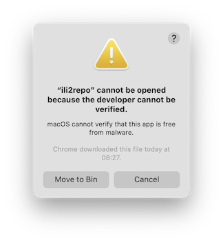
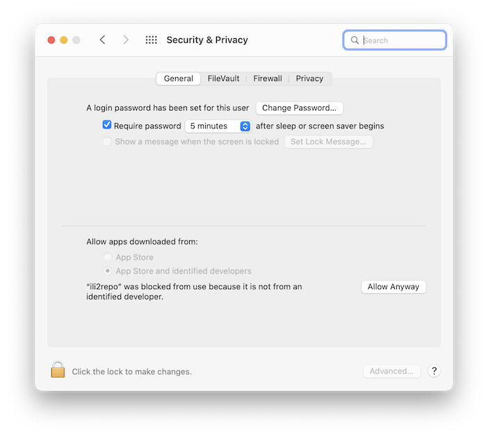
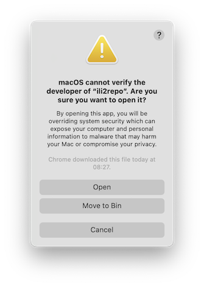
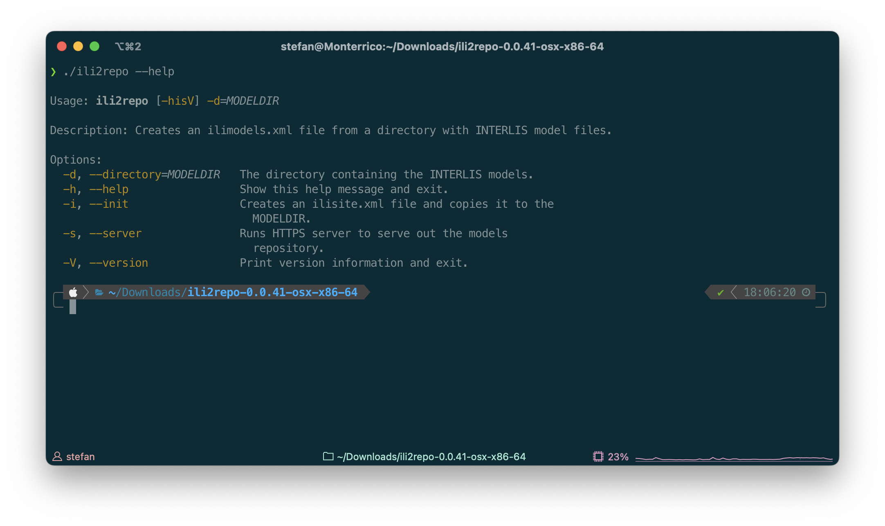
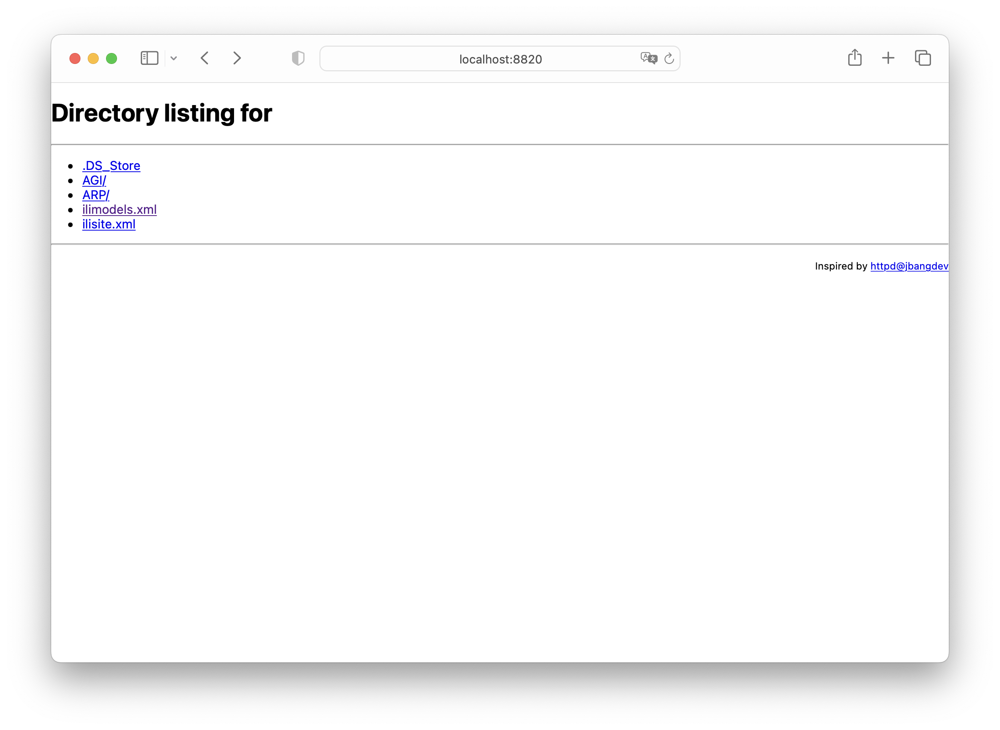

---
= INTERLIS leicht gemacht #31 - ili2repo
Stefan Ziegler
2022-10-17
:thoth-type: post
:thoth-status: published
:thoth-tags: INTERLIS,Java,Repository,ili2repo,Modellablage,GraalVM
:idprefix:
---
INTERLIS-Modellablagen sollten ab einem gewissen Zeitpunkt nicht mehr manuell nachgeführt werden. In einem früheren http://blog.sogeo.services/blog/2022/07/19/interlis-leicht-gemacht-number-28.html[Beitrag] habe ich gezeigt, wie wir das mittels eines https://gradle.org[Gradle]-Tasks machen. Hier nun eine vielleicht miliztauglichere Variante:

Das Kommandozeilenwerkzeug https://github.com/edigonzales/ili2repo[`ili2repo`] durchsucht ein Verzeichnis und seine Unterverzeichnisse nach INTERLIS-Modelldateien und erstellt daraus die `ilimodels.xml`-Datei. Es gibt zwei Varianten des Werkzeuges, welche https://github.com/edigonzales/ili2repo/releases/latest[hier] heruntergeladen werden können.

Die JVM-/Java-Variante (`ili2repo-<Version>.zip`) benötigt eine installierte Java Runtime 17 oder höher, ist jedoch betriebssystemunabhängig. Die Zip-Datei muss entpackt werden. Im Verzeichnis sind zwei Unterverzeichnisse `lib` und `bin`. Im `lib`-Verzeichnis sind sämtliche benötigten Java-Bibliotheken. Im `bin`-Verzeichnis ist eine Shellskript-Datei resp. eine Batch-Datei. Diese dienen zur Ausführung des Programmes.

Linux/macOS:

----
./bin/ili2repo --help
----

Windows:

----
./bin/ili2repo.bat --help
----

Die Native Binaries sind für das jeweilige Betriebssystem kompilierte Versionen, die keine Java Runtime benötigten. Aus diesem Grund muss für jedes Betriebssystem ein separates Binary hergestellt werden (https://www.graalvm.org/[GraalVM] to the rescue). Es stehen Binaries für Windows, Linux und macOS zur Verfügung (siehe Betriebssystemabkürzung im Namen der Zip-Datei). Das macOS-Binary läuft auf Intel wie auch auf Apple Silicon Prozessoren. 

----
./ili2repo --help
----

Im Gegensatz zu der Java-Variante erscheinen beim ersten Aufruf auf macOS und Windows Warnungen wegen fehlender Signierung des Binaries resp. wegen des unbekannten Entwicklers der Software. Man muss dem Betriebssystem das Ausführen des Programms einmalig explizit erlauben. Unter macOS erscheint direkt nach dem erstmaligen Ausführen von `./ili2repo`:

In den &laquo;Einstellungen&raquo; - &laquo;Security & Privacy&raquo; - &laquo;General&raquo; muss man mit &laquo;Allow Anyway&raquo; die Software entblocken:

Wenn man den obigen Befehl nochmals ausführt, erscheint wieder eine Meldung:

Diese Meldung muss man mit &laquo;Open&raquo; bestätigen.

Mit `./ili2repo --help` kann endlich die Hilfe angezeigt werden.

Für das Erstellen einer `ilimodels.xml`-Datei muss die Option `--directory` gefolgt vom Verzeichnisnamen mit den Datenmodellen angegeben werden:

----
./ili2repo --directory=path/to/models/
----

Es werden ebenfalls sämtliche Unterverzeichnisse nach Datenmodellen durchsucht. Die `ilimodels.xml`-Datei wird im obersten Verzeichnis erstellt (hier `models`). Sie wird mit https://github.com/claeis/ilivalidator[`ilivalidator`] geprüft.

Es werden folgende Metaattribute innerhalb des Datenmodells berücksichtigt und in die `ilimodels.xml`-Datei geschrieben:

- `technicalContact`
- `furtherInformation`
- `Title`
- `shortDescription`

Mit der Option `--init` wird im gleichen Verzeichnis eine `ilisite.xml`-Datei erstellt.

Im obersten Verzeichnis (Rootverzeichnis) sollten keine Datenmodelle platziert werden, sondern nur in Unterverzeichnissen. Da `ilimodels.xml` selber ein INTERLIS-Datenmodell ist und zu einem bestimmten Zeitpunkt noch nicht fertig ist, entsteht ein Durcheinander.

Es werden sämtliche Unterverzeichnisse berücksichtigt, so auch `replaced`- oder `obsolete`-Ordner. Bei einem mehr oder weniger offiziellen Konsens was wie behandelt werden soll, werde ich das ändern.

Der Servermodus `--server` dient zum Testen der vorgängig erzeugten `ilimodels.xml`-Datei. Es wird dazu ein ganz simpler HTTP-Server gestartet. Die INTERLIS-Modellablage ist unter der Url http://localhost:8820[http://localhost:8820] verfügbar:

Der Servermodus benötigt ebenfalls die Option `--directory`, damit `ili2repo` weiss welches Verzeichnis bereitgestellt werden soll. Es wird aber keine `ilimodels.xml`-Datei erstellt.
