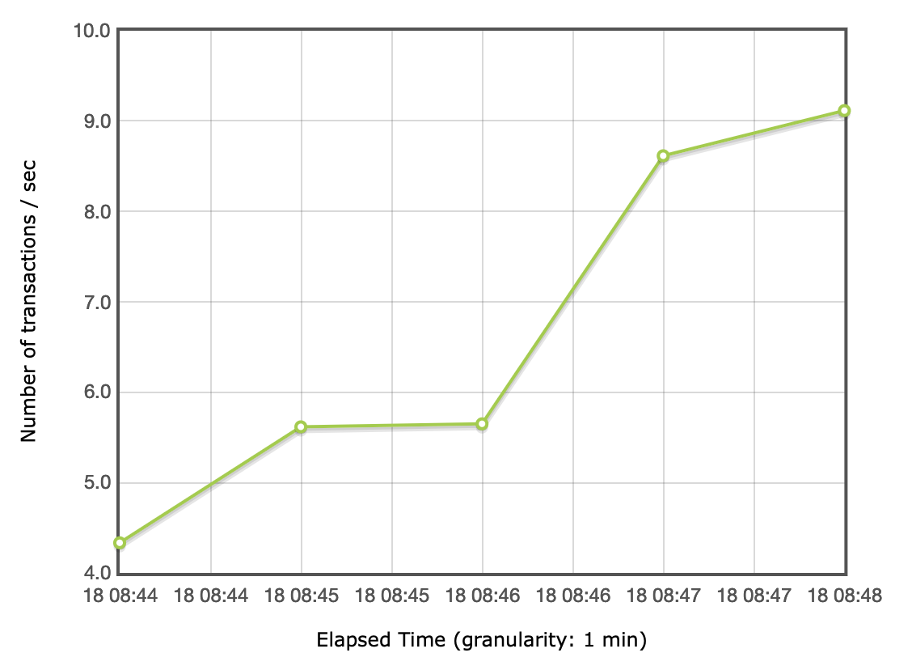
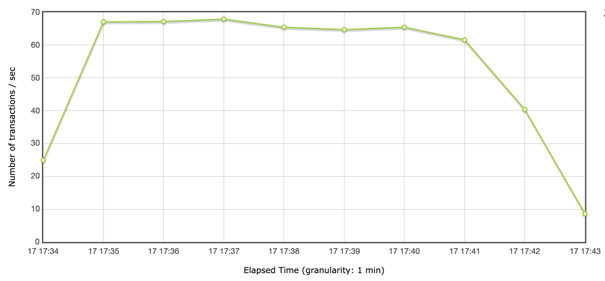
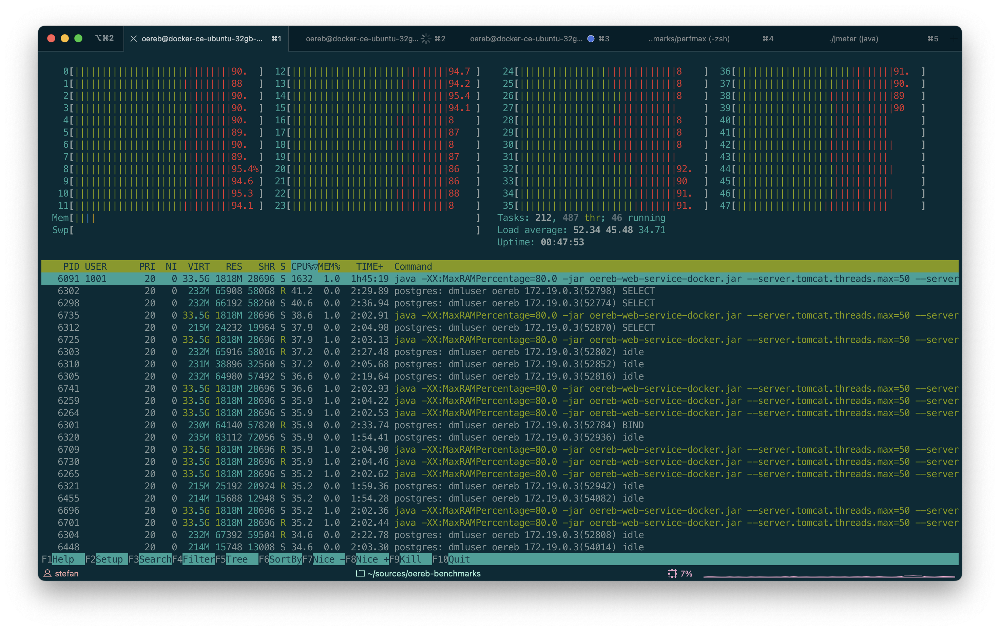
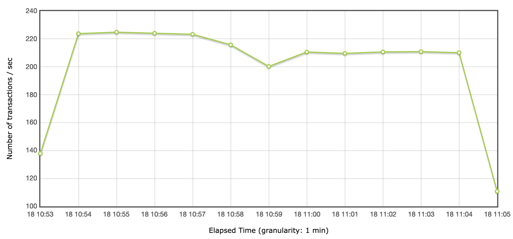

---
= ÖREB-Kataster richtig gemacht #10 - ÖREB on steroids
Stefan Ziegler
2022-10-18
:thoth-type: post
:thoth-status: published
:thoth-tags: ÖREB,ÖREB-Kataster,Spring Boot,Java,Hetzner,Benchmark
:idprefix:
---
Ich wollte 200 Requests/Sekunde und ich erhielt 200 Requests/Sekunde. Aber der Reihe nach:

Wegen des http://blog.sogeo.services/blog/2022/10/16/oereb-kataster-richtig-gemacht-9.html[ÖREB-Spassvogels] habe ich mit https://jmeter.apache.org/[jMeter] begonnen unseren https://github.com/claeis/oereb-web-service/[ÖREB-Webservice] zu benchmarken. Und nachdem ich das Zusammenspiel verschiedener Konfigurationsparameter verstanden zu haben glaubte, wollte ich ans Limit gehen. Was bringt man mit dem Teil mit handelsüblicher Hardware raus? Vor Augen hatte ich den grössten Cloudserver, den https://www.hetzner.com/de/cloud[Hetzner] zu bieten hat: CCX62. 48 vCPU und 192 GB RAM. Ungefähr 500 Euro pro Monat. Diese Cloudserver sind ziemlich praktisch, da sehr einfach aufzusetzen und sehr günstig und damit super geeignet für solche Tests.

Um den Workflow zu testen, habe ich mit einem kleineren Server begonnen: CPX51. Dieser hat 16 vCPU und 32 GB RAM und kostet 65 Euro pro Monat. Es ist im Gegensatz zum CCX ein &laquo;Standard-Server&raquo;. Der https://docs.hetzner.com/de/cloud/servers/overview#server-typen[Unterschied Standard vs Dedicated] ist mir aber irgendwie immer noch nicht zu 100% klar.

Das Testsetup sieht einfachheitshalber vor, dass alles auf einem Server läuft. Also sowohl das ÖREB-Katastersystem (Datenbank und Webservice) wie auch jMeter. Sowohl für die Datenbank wie auch für den Webservice verwendet ich Dockerimages. Das DB-Image ist unser ÖREB-Entwicklungsimage. Das Image für den Webservice entspricht dem Produktionsimage. Von beiden Images wird jeweils nur ein Container hochgefahren. Limits werden den Containern keine gesetzt.

Als Datengrundlage dienen mir die ÖREB-Katasterdaten des Kantons Solothurn. D.h. ich importiere auch für den ganzen Kanton die Grundstücke der amtliche Vermessung. Ebenfalls importiere ich sämtliche Bundesdaten und natürlich sämtliche Konfigurations-XML. Angefordert werden aber nur Grundstücke innerhalb der Bauzone, um zu verhindern, dass Auszüge _ohne_ Eigentumsbeschränkungen angefordert werden.

Getestet wird nur der XML-Auszug _ohne_ eingebettete Bilder und _ohne_ Geometrien. Ganz falsch und realitätsfremd dürfte der Benchmark nicht sein, da dies einem häufigen Usecase entspricht (Anfrage via Web GIS Client aka dynamischer Auszug). Zudem bei der Variante mit den eingebetteten Bildern der Herstellungsprozess dieser Bilder der dominierende Faktor sein wird (also letzten Endes der eingesetzte WMS-Server). 

Zum Starten habe ich mit einem Thread (also einem &laquo;parallelen&raquo; Request) begonnen:

Im Durchschnitt erreiche ich so 7 Requests/Sekunde. Ich weiss nicht woher die Steigerung gegen Ende kommt. Ist das tatsächlich die JVM, die sich warm läuft?

Das Maximum, das ich mit dem günstigeren Hetzner-Server raushole, ist bei 16 Threads. Dabei weise ich dem Webservice 50 DB-Connections zu und erlaube ihm selber 16 Worker-Threads:

Im Durchschnitt sind es 57 Requests/Sekunde. Peakperformance liegt bei knapp unter 70. 

Nach dem Wechsel auf den grossen Server kann man so richtig aus dem vollen Schöpfen:

Bei 196 parallelen Request erreiche ich das Maximum. Der Anwendung werden 180 DB-Connections und 60 Worker-Threads erlaubt:

Durchschnittlich werden so 211 Requests/Sekunde gemacht. Die Peakperformance liegt bei etwas über 220.

Ich denke die 200+ Requests/Sekunde dürfte auch für die KGK genügend sein. Wahrscheinlich hätte ein CH-weiter Kataster nie diese Anforderungen:

image::twitter.png[alt="twitter", align="center"]

RAM war im Gegensatz zu den CPU-Kernen nie ein Thema. Sieht eventuell anders aus, wenn man mit den eingebetteten Images hantieren muss resp. das PDF herstellen muss.

Vielleicht hilft der Benchmark auch dem einen oder anderen &laquo;XML ist langsam&raquo;-Vertreter. 

Ein weiteres Fazit: Man braucht keine Cloud und/oder kein Openshift, um performante Dienste anbieten zu können. Im Prinzip reicht ein anständiger Server. Und man kommt so gar nicht auf den Gedanken den Webservice mit 100 Millicores laufen zu lassen, dafür mit 10 Replikas... Scale up before you scale out.