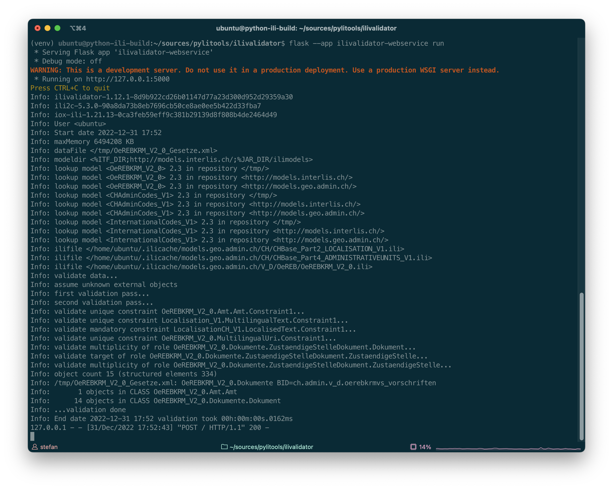

---
= INTERLIS leicht gemacht #34 - ilivalidator for Python 0.0.2
Stefan Ziegler
2022-12-31
:thoth-type: post
:thoth-status: published
:thoth-tags: INTERLIS,Python,Java,GraalVM
:idprefix:
---
Ich habe ein paar Features implementiert:

[https://github.com/claeis/ilivalidator]Ilivalidator erlaubt es mehrere INTERLIS-Transferdateien gleichzeitig und gemeinsam zu prüfen. Sollen mehrere Dateien _gleichzeitig_ (sprich mit einem Aufruf) geprüft werden, reicht es, wenn man die Dateien beim Kommandozeilenaufruf aneinander reiht:

```
java -jar ilivalidator.jar OeREBKRM_V2_0_Gesetze.xml OeREBKRM_V2_0_Themen.xml
```

Die Dateien werden unabhängig voneinander geprüft. Im vorliegenden Fall sind die ÖREB-Themen und die Gesetze miteinander verknüpft (Assoziation mit externen Rollen). Ob diese Verknüpfung stimmig ist, möchte man in der Regel wohl prüfen. D.h. die Dateien müssen _gemeinsam_ geprüft werden:

```
java -jar ilivalidator.jar --allObjectsAccessible OeREBKRM_V2_0_Gesetze.xml OeREBKRM_V2_0_Themen.xml
```

Ilivalidator meldet auch mit dieser Option keine Fehler. Wenn man im Themen.xml nun einen Verweis auf ein Gesetz verfälscht, z.B. `<Gesetz REF="mich.gibt.es.nicht"/>`, meldet `ilivalidator` einen Fehler:

```
Error: line 54: OeREBKRMkvs_V2_0.Thema.ThemaGesetz: No object found with OID mich.gibt.es.nicht.
```

Wird `--allObjectsAccessible` nicht verwendet, wird korrekterweise kein Fehler gefunden.

Neu kann man auch mit &laquo;ilivalidator for Python&raquo; mehrere Dateien prüfen. Der zwingende Methodenparameter `data_file_names` ist eine Liste:

[source,Python,linenums]
----
from ilivalidator import Ilivalidator

valid = Ilivalidator.validate(['OeREBKRM_V2_0_Gesetze.xml','OeREBKRM_V2_0_Themen.xml'])
----

Will man wie eingangs erklärt die Dateien gemeinsam prüfen, muss der Parameter `--allObjectsAccessible` übergeben werden. Dies funktioniert mit einem Dictionary, das optional ist:

[source,Python,linenums]
----
from ilivalidator import Ilivalidator

settings = {Ilivalidator.SETTING_ALL_OBJECTS_ACCESSIBLE: True}
valid = Ilivalidator.validate(['OeREBKRM_V2_0_Gesetze.xml','OeREBKRM_V2_0_Themen.xml'], settings)
----

Die Namen der Parameter sind als &laquo;Konstanten&raquo; verfügbar. Im Original ist `--allObjectsAccessible` eine Option ohne Argument. Hier muss (falls es verwendet wird) entweder True oder False gesetzt werden.

Neu sind folgende Optionen implementiert:

* `SETTING_ILIDIRS`: `--modeldir`
* `SETTING_MODELNAMES`: `--models` 
* `SETTING_ALL_OBJECTS_ACCESSIBLE`: `--allObjectsAccessible` 
* `SETTING_LOGFILE`: `--log` 
* `SETTING_LOGFILE_TIMESTAMP`: `--logtime` 
* `SETTING_XTFLOG`: `--xtflog` 
* `trace`: `--trace` 

Optionen, die im Original ohne Argument funktionieren, müssen hier immer mit einem Boolean-Werte verwendet werden.

Zusätzlich habe ich mit _pytest_ angefangen Tests zu schreiben. Bei der Native Shared Library ist mir noch nicht klar was und wie genau getestet werden kann/soll.

Ein einfachster ilivalidator-Webservice mit https://flask.palletsprojects.com/[_Flask_] (ohne Grüsel-Systemcalls):

```
pip install Flask
pip install ilivalidator==0.0.2
```

`ilivalidator-webservice.py`:

[source,Python,linenums]
----
import os
from flask import Flask, flash, request, redirect, url_for
from werkzeug.utils import secure_filename
from ilivalidator import Ilivalidator
import tempfile

UPLOAD_FOLDER = '/tmp'
ALLOWED_EXTENSIONS = {'xtf', 'xml', 'itf'}

app = Flask(__name__)
app.config['UPLOAD_FOLDER'] = UPLOAD_FOLDER

def allowed_file(filename):
    return '.' in filename and \
           filename.rsplit('.', 1)[1].lower() in ALLOWED_EXTENSIONS

@app.route('/', methods=['GET', 'POST'])
def upload_file():
    if request.method == 'POST':
        # check if the post request has the file part
        if 'file' not in request.files:
            flash('No file part')
            return redirect(request.url)
        file = request.files['file']
        # If the user does not select a file, the browser submits an
        # empty file without a filename.
        if file.filename == '':
            flash('No selected file')
            return redirect(request.url)
        if file and allowed_file(file.filename):
            filename = secure_filename(file.filename)
            filepath = os.path.join(app.config['UPLOAD_FOLDER'], filename)
            file.save(filepath)

            temp_dir = tempfile.TemporaryDirectory()
            log_file = os.path.join(temp_dir.name, "mylog.log")

            settings = {Ilivalidator.SETTING_LOGFILE: log_file}
            valid = Ilivalidator.validate([filepath], settings)

            with open(log_file,"r") as f:
                content = f.read()
                return content

            return "should not reach here"
    return '''
    <!doctype html>
    <title>Upload new File</title>
    <h1>Upload new File</h1>
    <form method=post enctype=multipart/form-data>
      <input type=file name=file>
      <input type=submit value=Upload>
    </form>
    '''
----

(Grundgerüst copy/paste von https://flask.palletsprojects.com/en/2.2.x/patterns/fileuploads/[hier].)

Die Flask-Anwendung starten:

```
flask --app ilivalidator-webservice run
```

Und mit `curl` eine INTERLIS-Transferdatei hochladen (oder mit dem Browser):

```
curl -X POST -F file=@OeREBKRM_V2_0_Gesetze.xml http://127.0.0.1:5000
```

Der Output sollte der Inhalt des Logfiles der Validierung sein:



What's next? Keine Ahnung. Ich persönlich habe keinen grossen Bedarf an den ilitools in Python. Trotzdem finde ich es eine sinnvolle Sache und es könnte der Verbreitung und Akzeptanz von INTERLIS helfen. Dann müssten aber die Python Aficionados und geostandards.ch aus dem https://geostandards.ch/[Sonnenaufgang] hervor geritten kommen.
