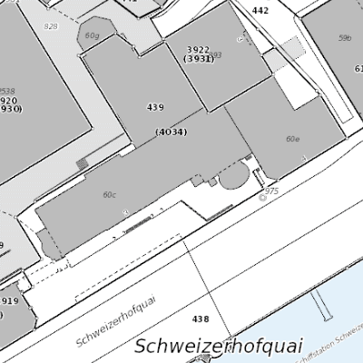
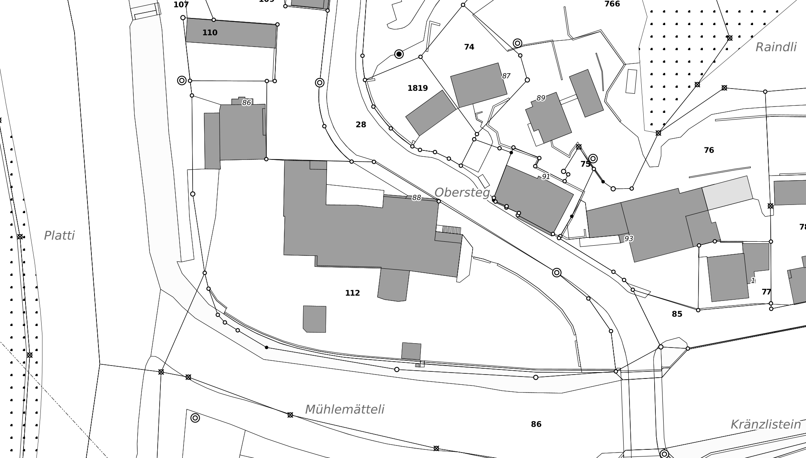
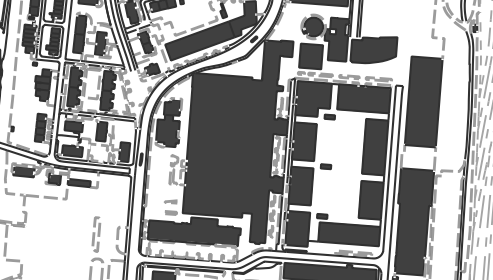
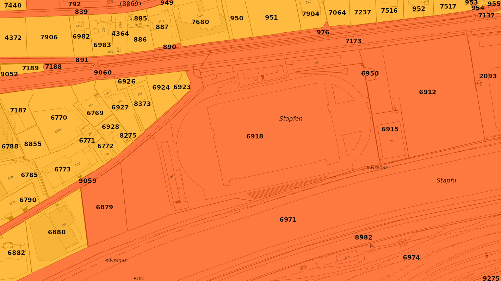
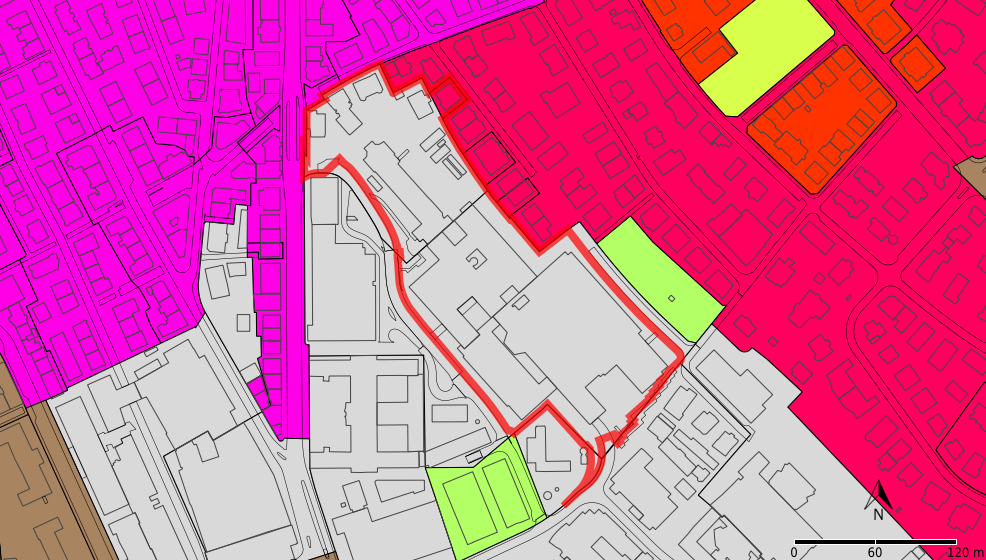
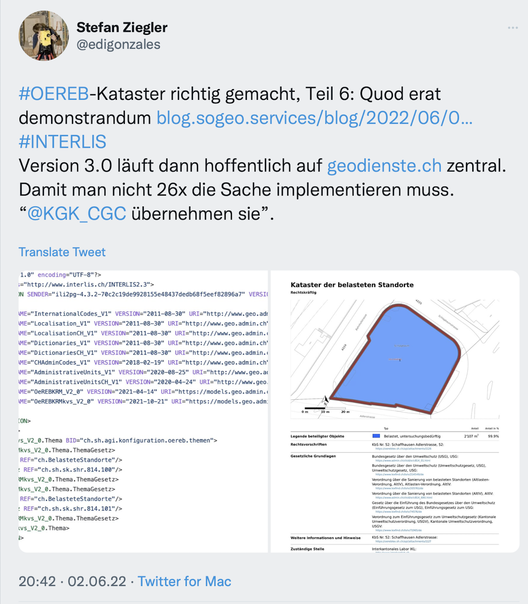

Ich habe die https://github.com/edigonzales/oereb-cts[Test Suite] um die Validierung der Endpunkte  &laquo;versions&raquo; und &laquo;capabilities&raquo; https://sogis-oereb-cts-remdc.ondigitalocean.app/[erweitert] und verschiedene Testresultate ein wenig unter die Lupe genommen.

**versions**

Beim Versions-Output prüfe ich neben der Schemakonformität tatsächlich auch den korrekten Wert der Version. Dies muss gemäss Weisung &laquo;extract-2.0&raquo; sein und nicht bloss &laquo;2.0&raquo;. Loben darf man den Kanton Luzern (und Solothurn), der das korrekt macht, im Gegensatz zu allen anderen. Beim Kanton Zürich kommt gar nix resp. 404 zurück. Der Kanton Wallis ist auch hier wieder auf Kriegsfuss mit den Namensräumen. In diesem Fall steht nicht mal eine XML-Deklaration (`<?xml version='1.0'?>`) am Anfang des Dokumentes. Was zwar streng genommen nicht zwingend ist aber, nun ja, gute Praxis wäre (&laquo;should&raquo;).

**capabilities**

Hier wird nur die Schemakonformität geprüft. Das Capabilities-Dokument bekommen die meisten hin. Der Kanton Freiburg leitet jedoch mit Status Code 307 weiter, was den Test fehl schlagen lässt. Die Kantone NW, OW und UR sind nicht schemakonform, weil der Topic-Code mit einer Zahl beginnt. Wieso sie das so machen, ist mir nicht klar. Der Topic-Code sollte doch gleich sein, wie später im Extract? Mein Lieblingskanton, der Kanton Tessin, hat zu lange Gemeindenummern (z.B. `531002`) und der Kanton Wallis hat wiederum Namespace-Probleme: Einerseits ist das Root-Element `GetCapabilitiesResponse` einem falschen Namespace zugewiesen (`http://schemas.geo.admin.ch/swisstopo/OeREBK/15/Extract`), was die Prüfung sofort abbrechen lässt und andererseits sind Topics vom Typ &laquo;Theme&raquo;, die einem anderem Namespace zugewiesen werden müssen, was hier nicht gemacht wird. Das Kantonskürzel bei kantonalen Themen muss in Grossbuchstaben geschrieben sein und nicht in Kleinbuchstaben (`ch.vs.Ueberlagernde_Nutzungsplanung`).

**Plan für das Grundbuch**

Ein Kränzchen muss man den Kantonen BE und BL winden. Diese verwenden für die Hintergrundkarte den Situationsplan (aka Plan für das Grundbuch) von https://geodienste.ch/services/av/info[geodienste.ch]. Das hat mich natürlich getriggert und ich musste den Dienst auch https://geo.so.ch/map/?k=7935c2a96[bei uns testen]. Leider werden die Gebäudenummern dargestellt, was im Kanton Solothurn dazu führt, dass Platzhalter-Werte dargestellt werden. Wir kennen keine eigentlichen Gebäudenummern und darum füllen die NF-Geometer Platzhalter ab, damit überhaupt ein EGID erfasst werden kann. Ist mir momentan noch nicht ganz klar, wie wir das lösen können. Sinnvoll wäre die Benutzung des geodienste.ch Services allemal, da er für teures Geld erstellt wurde und nun verwenden die aller meisten Kantone ihn nicht...

**Stabilität**

Interessant zu beobachten ist die Stabilität der Dienste, soweit dies mit solchen einfachen Tests überhaupt möglich ist. Die sonstigen Musterschüler BL und NE kämpfen hier ein wenig. Der Kanton BL hat nachweislich Aussetzer, die oftmals einen Auszug mit eingebetteten Bildern betreffen. Weil ich zuerst am eigenen Code zweifelte, habe ich bei https://statuscake.com[Statuscake] ein paar Tests am Laufen, die alle 5 Minuten einen Request machen. Statuscake bestätigt meine eigenen Beobachtungen. Das passiert maximal ein paar Mal pro Tag und kann natürlich irgendwas sein. Nicht zwingend der Dienst selber, sondern auch was unterwegs zwischen Eingang ins Kantonsnetz und ÖREB-Service.

Beim Kanton Neuenburg funktionieren plötzlich die Auszüge mit Bildern nicht mehr. Der Server wirft einen 500er Status Code. Interessanterweise funktioniert das PDF noch, jedoch im dynamischen Auszug werden keine Karten mehr dargestellt, obwohl die restliche Logik noch zu funktionieren scheint. Einmal mehr: Was sind gute Health-Checks für Kartendienste?

**Embedded Images**

Zu guter Letzt habe ich die eingebetteten Bilder angeschaut. Die Kantone AR, BS und SG funktionieren nicht, wenn man die Bilder anfordert und können nicht getestet werden.

Eine leider nicht ganz geklärte Frage ist, ob die Bilder mit 300 dpi ausgeliefert werden müssen. Die Weisung nimmt nur bei den Symbolen Stellung. Meines Erachtens ist es sinnvoll die Bilder in einer &laquo;brauchbaren&raquo; Qualität auszuliefern. Damit mit dem XML auch das PDF erstellt werden kann. Oder als Kunde will man vielleicht die Bilder in einer Word-Datei oder ähnlichem verwenden. Auch für solche Anwendungsfälle sind die 96 dpi wohl nicht wirklich genügend. Die Kanton AG, BE, BL, GR, LU, TI, ZG liefern keine 300 dpi aus. 

Eine eher eigenwillige Darstellung für den Plan für das Grundbuch verwenden die Kantone LU (blaue Gewässer), UR (eher &laquo;einfach&raquo;) und ZG (düster und dicke Linien):

Getreu dem Motto &laquo;Quadratisch, praktisch, gut&raquo; liefert der Kanton Luzern zudem seine Bilder in einem quadratischen Format aus. 

Wir im Kanton Solothurn sind meines Erachtens auch nicht ganz korrekt unterwegs beim Plan für das Grundbuch der Titelseite. Auf Wunsch der Nachführungsgeometer stellen wir bei uns den sogenannten &laquo;zukünftigen&raquo; Stand der Grundstücke dar. D.h. bei einer Mutation werden die immer noch rechtsgültigen (schwarzen) Grenzen nicht dargestellt, sondern in rot die zukünftigen Grenzen. Beim Plan für das Grundbuch für die ÖREB wird der rechtsgültige Zustand dargestellt (und keine projektierten Grundstücke).

Der Kanton Wallis liefert keine eingebetteten Bilder aus und liefert auch bei `WITHIMAGES=true` nur einen Verweis auf einen ESRI-Webdienst (!= WMS). Die Bilder der einzelnen ÖREB haben fälschlicherweise bereits den Plan für das Grundbuch als Hintergrund:

Das Bild resp. den Esri-Kartendienst-Request für die Titelseite (`PlanForLandRegisterMainPage`) wird nicht ausgeliefert und im Plan für das Grundbuch für die ÖREB (`PlanForLandRegister`) sind die Gebäude ausgefüllt.

Der Kanton Zürich liefert wie bereits in der ÖREB-Kataster Version 1.0 die Bilder der ÖREB mit Plan für das Grundbuch, Nordpfeil, Massstab und Bandierung:

Der Plan für das Grundbuch für die ÖREB (`PlanForLandRegister`) ist irgendwie merkwürdig:

**Conclusions**

Ich weiss nicht genau welche Kataster in welchem Abnahme-Status sind. Die gezeigte Folie an der letzten https://www.cadastre.ch/de/manual-oereb.detail.event.html/cadastre-internet/2022/OEREB2022.html[ÖREB-Kataster-Veranstaltung] war ähm irgendwie eher ein Zufallsprodukt (sorry). Übrigens: Kann jemand https://www.cadastre.ch/content/dam/cadastre-internet/de/divers-rdppf/Info-Veranstaltung-2022-de.zip[diese Zip-Datei] öffnen? In einer dieser Präsentationen sollte die Übersichtskarte mit den Status der Kantone sein. Leider kann ich sie nicht öffnen.

Trotz allem Erreichten im &laquo;Gesamtsystem&raquo; ÖREB-Kataster darf man sich nicht zu stark auf die Schultern klopfen. Anscheinend ist auch die technische Umsetzung des ÖREB-Katasters für die Kantone non-trivial. Trotzdem will man es 26 Mal umsetzen. Viele Kantone verwenden den gleichen Software-Stack. Abgesehen von tendenziell marginalen Fehlern, scheint es hier also eher ein Konfigurations- und Betriebsproblem zu sein? Ist der Software-Stack zu kompliziert? Fehlt Wissen in den Kantonen? Ich weiss es nicht. 

Bei ganz wenigen dünkt mich die Qualität schlichtweg ungenügend (teilweise wegen eines vermeintlichen Details). Wie soll ein Benutzer damit umgehen, wenn er nicht bloss einen Knopf im dynamischen Auszug drückt (anscheinend fokussiert sich unser aller Aufmerksamkeit da drauf), sondern wirklich mit den Schnittstellen arbeiten will und muss? Das ist in diesen Fällen schlichtweg nicht möglich oder verschiedentlich nur mit grausigen Workarounds (= Zusatz-Code = Zusatzaufwand. Ja ja und technisch ist immer alles möglich... technical debs und so). Hier sollte sowohl der Kanton und auch die Aufsicht besser hinschauen.

Die Abnahme resp. die Validierung des Katasters darf nicht unterschätzt werden. Klar kann man gegen das Schema prüfen. Jedoch ist das Schema relativ tolerant: D.h. eine einfache Schemaprüfung validiert positiv auch wenn man eingebettete Bilder anfordert aber keine zurück bekommt. Die Prüfung ist also abhängig vom Request und es sind sehr viele Kombinationen möglich. Ich prüfe z.B. nur XML-Auszüge. Man wollte als Option unbedingt noch JSON als (optionales) Outputformat, das bedeutet nun aber auch erhöhter Prüfungsaufwand und erhöhte Fehleranfälligkeit.

Leicht kritisch darf man zukünftige Weiterentwicklungen (weitere Rechtszustände, behördenverbindliche Daten, Grundstücksinformationsystem, ...) hinterfragen: Einfacher wird es nicht und wir kriegen bereits ein relativ einfaches Konstrukt nicht wirklich sauber auf die Reihe.

Alhamdulillah ist der ÖREB-Kataster nicht systemkritische Infrastruktur.

Ich bleibe dabei:

