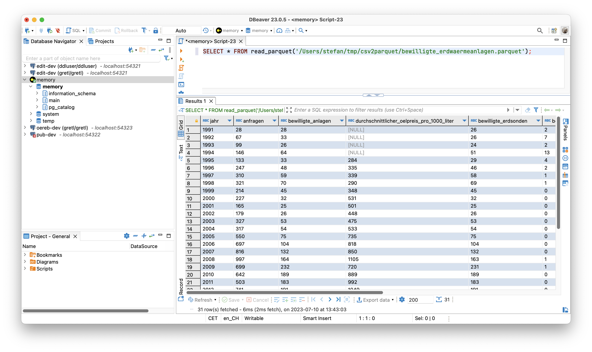
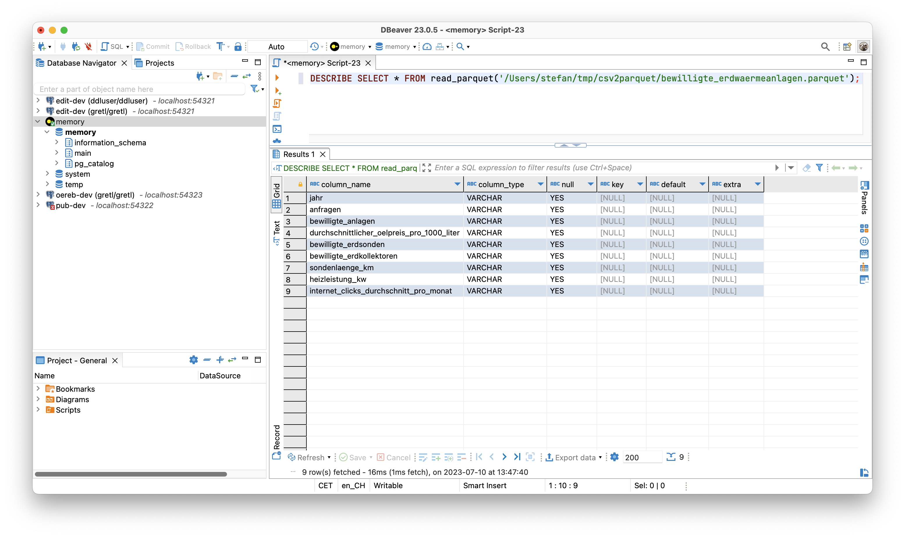

---
= OGD made easy #1 - csv2parquet
Stefan Ziegler
2023-07-10
:thoth-type: post
:thoth-status: published
:thoth-tags: OGD,INTERLIS,Java,CSV,Parquet
:idprefix:
---
Ob https://so.ch[wir] überhaupt mal OGD machen werden, steht noch in den Sternen. Es schadet aber wohl nichts, sich ein paar Gedanken zu den Abläufen und dem Einsatz und Zusammenspiel einzelner Komponenten zu machen. Synergien zu den Prozessen und den Werkzeugen unserer https://geo.so.ch/[GDI] gibt es mit genügend grosser Wahrscheinlichkeit.

CSV-Dateien spielen anscheinend eine https://www.stadt-zuerich.ch/portal/de/index/ogd/werkstatt/csv.html[grosse] https://www.zh.ch/de/politik-staat/opendata/leitlinien.html#-932898780[Rolle]. Gehen wir also davon aus, dass Fachstellen ihre offenen Daten im CSV-Format anliefern. Ein paar Fragen, die sich stellen:

- Wie beschreibt man CSV-Daten? (z.B. Was bedeutet das Attribut <xxx> genau?)
- Wie kontrolliert man CSV-Daten?
- Soll man neben CSV (und dem Klassiker XLSX) noch weitere, &laquo;bessere&raquo; Formate bereitstellen?

Die ersten beiden Fragestellungen lassen sich mit INTERLIS erledigen. Eine Antwort auf die letzte Frage könnte https://en.wikipedia.org/wiki/Apache_Parquet[Parquet] sein. Parquet ist ein spaltenorientiertes Dateiformat. Die Spezifikation ist quelloffen. Es eignet sich gut für die Abfrage und Verarbeitung von Daten. Und vielleicht am Profansten: Es gibt Datentypen, Rätselraten war gestern.

Was nun CSV mit INTERLIS zu tun hat und wie man eine CSV-Datei in eine Parquet-Datei umwandeln kann, zeige ich anhand meines kleinen Prototypes https://github.com/edigonzales/csv2parquet[_csv2parquet_]. Es handelt sich dabei um eine Java-Kommandozeilenanwendung und dient momentan vor allem Anschauungs- und Testzwecken. Früher oder später würde die Umwandlung bei uns wohl in unserem ETL-Werkzeug https://github.com/sogis/gretl[GRETL] integriert werden. Heruntergeladen werden kann die aktuellste Version https://github.com/edigonzales/csv2parquet/releases/[hier]. Die Zip-Datei entpacken und das Shell-Skript resp. die Batch-Datei auführen:

[source,xml,linenums]
----
./bin/csv2parquet --help
----

In der Konsole sollte der Hilfetext erscheinen. Die Anforderungen an die Anwendung sind moderat (Java 8 reicht). Leider muss man gefühlt das halbe Internet herunterladen. Die Zip-Datei ist circa 70MB gross. Der Grund dafür sind die - für mich und viele anderen - unnötigen Hadoop-Abhängigkeiten der https://github.com/apache/parquet-mr[Parquet-Bibliothek]. Es gibt einen https://issues.apache.org/jira/browse/PARQUET-1822?page=com.atlassian.jira.plugin.system.issuetabpanels%3Aall-tabpanel[Issue] dazu. Vergessen wir das aber wieder und konzentrieren uns auf die Funktionen und erstellen die erste Parquet-Datei aus einer CSV-Datei. Ausgewählt habe ich die https://raw.githubusercontent.com/edigonzales/csv2parquet/b9172dd298f7b55a45eb89e4deb0b5009de58300/src/test/data/bewilligte_erdwaermeanlagen/bewilligte_erdwaermeanlagen.csv[bewilligten Erdwärmeanlagen]. Das https://afu.so.ch[Amt für Umwelt] stellt viele Daten bereits heute freundlicherweise https://so.ch/verwaltung/bau-und-justizdepartement/amt-fuer-umwelt/umweltdaten/[online]. Der einfachst mögliche Aufruf ist:

[source,xml,linenums]
----
./bin/csv2parquet -i bewilligte_erdwaermeanlagen.csv
----

Damit das einfach so funktioniert, werden von der Software Annahmen bezüglich des Trennzeichens (Separator) und des Feldtrenners (Delimiter) getroffen. Standardwert für das Trennzeichen ist ein Semikolon und für den Feldtrenner ein leeres Zeichen (also kein Feldtrenner). Das entspricht dem Output von Excel:

[source,xml,linenums]
----
jahr;anfragen;bewilligte_anlagen;durchschnittlicher_oelpreis_pro_1000_liter;bewilligte_erdsonden;bewilligte_erdkollektoren;sondenlaenge_km;heizleistung_kw;internet_clicks_durchschnitt_pro_monat
1991;28;28;;26;2;;;
1992;67;33;;26;7;;;
1993;99;26;;24;2;;;
----

Wenn kein Zielverzeichnis (`--output`) angegeben wird, wird versucht die Parquet-Datei in das Quellverzeichnis zu schreiben. Jetzt haben wir zwar eine Parquet-Datei aber wie kann man sie anschauen? Für ganz rasches Quick 'n' Dirty reicht mir (eher aus Entwicklersicht) ein Online-Viewer, z.B. https://www.parquet-viewer.com/. Der Viewer hat anscheinend gerade in den letzten paar Tagen ein Update erfahren und einige Features sind nicht mehr gratis. Es gibt aber auch noch andere Möglichkeiten relativ einfach eine Parquet-Datei anzuschauen: Und zwar mit https://dbeaver.io/[dbeaver]. Wenn man dbeaver sowieso in Betrieb hat, muss man einmalig einen zusätzlichen https://duckdb.org/docs/guides/sql_editors/dbeaver.html[Treiber installieren] (basierend auf DuckDB). Wurde der Treiber installiert, kann man mit einem simplen https://duckdb.org/docs/guides/import/parquet_import[`SELECT`] die Daten anzeigen lassen:

Mit `DESCRIBE SELECT` kann man Informationen über die Attribute anzeigen und es fällt auf, dass der Datentyp immer Text ist:

Wie man das ändern kann, zeige ich gleich. Vorher möchte ich erläutern, wie man mit unterschiedlichen Trennzeichen und Feldtrennern umgeht. Als Beispiel verwende ich den gleichen https://raw.githubusercontent.com/edigonzales/csv2parquet/8a8b611928eb03be56d50f30a39ca31360dbfa24/src/test/data/bewilligte_erdwaermeanlagen/bewilligte_erdwaermeanlagen_komma_anfuehrungszeichen.csv[Datensatz] aber mit einem Komma als Trennzeichen und Anführungszeichen als Feldtrenner.

[source,csv,linenums]
----
"jahr","anfragen","bewilligte_anlagen","durchschnittlicher_oelpreis_pro_1000_liter","bewilligte_erdsonden","bewilligte_erdkollektoren","sondenlaenge_km","heizleistung_kw","internet_clicks_durchschnitt_pro_monat"
"1991","28","28","","26","2","","",""
"1992","67","33","","26","7","","",""
"1993","99","26","","24","2","","",""
----

Wenn ich _csv2parquet_ gleich wie im ersten Aufruf verwende, wird das mit einem Fehler (&laquo;org.apache.avro.SchemaParseException&raquo;) quittiert. Das Problem ist eben, dass die Zeilen nicht geparsed werden können. Wir müssen _csv2parquet_ mit dem richtigen Feld- und Trennzeichen konfigurieren. Das geschieht mit einer TOML-Datei:

[source,toml,linenums]
----
["ch.so.afu.bewilligte_erdwaermeanlagen"]
firstLineIsHeader=true
valueSeparator=","
valueDelimiter="\""
----

Was zwischen den eckigen Klammern steht, spielt momentan noch keine Rolle. Wichtig ist jedoch, dass der Text dazwischen immer zwischen Anführungszeichen steht. Die drei Optionen sind selbsterklärend. Das Anführungszeichen als Feldtrenner muss escaped werden. Der Aufruf ändert sich zu:

[source,xml,linenums]
----
./bin/csv2parquet -c config.toml -i bewilligte_erdwaermeanlagen_komma_anfuehrungszeichen.csv
----

Es resultiert wiederum eine Parquet-Datei, die aus reinen Text-Attributen besteht. Als weitere Option steht `encoding` zur Verfügung, um z.B. `ISO-8859-1` encodierte CSV-Dateien korrekt lesen zu können (Standard ist `UTF-8`).

Was augenfällig sein sollte, ist die Tatsache, dass man immer den Feldtrenner verwenden _muss_. Man kann also keine CSV-Dateien verwenden, in der z.B. Texte mit Anführungszeichen begrenzt werden, numerische Werte aber nicht. Zuerst fand ich das nicht gut, dann sehr gut, nun bin ich eher hin- und hergerissen. Malesh, ist nun mal so und müsste in der darunterliegenden Bibliothek geändert werden und verliert vor allem den Schrecken, wenn wir endlich INTERLIS ins Spiel bringen.

Man will wahrscheinlich die Daten, die geliefert werden, für die Anwender relativ gut beschreiben. Beschreibe ich die Daten akkurat, kann ich diese entsprechend der Beschreibug auch prüfen. Dank der Beschreibung der Daten kann ich ebenfalls den Datentyp in der Parquet-Datei definieren und muss mich nicht mit &laquo;Text&raquo; zufrieden geben. Für das alles kann man INTERLIS und sein Tool-Ökosystem verwenden. Auf der Hand liegt, dass für die Beschreibung ein INTERLIS-Modell verwendet wird. In unserem Fall mit den bewilligten Erdwärmeanlagen kann das so aussehen:

[source,xml,linenums]
----
INTERLIS 2.3;

MODEL SO_AFU_Bewilligte_Erdwaermeanlagen_20230616 (de)
AT "https://agi.so.ch"
VERSION "2023-06-16"  =

  TOPIC Bewilligte_Erdwaermeanlagen =

    CLASS Bewilligte_Erdwaermeanlagen =      
      /** Erhebungsjahr
       */
      jahr : MANDATORY INTERLIS.GregorianYear;
      /** Anzahl Anfragen
       */      
      anfragen : MANDATORY 0 .. 100000;
      /** Anzahl bewilligte Anlagen
       */      
      bewilligte_anlagen : 0 .. 100000;
      /** Durchschnittlicher Erdölpries pro 1000 Liter
       */      
      durchschnittlicher_oelpreis_pro_1000_liter : 0 .. 10000;
      /** Bewilligte Erdsonden
       */      
      bewilligte_erdsonden : 0 .. 100000;
      /** Bewilligte Erdkollektoren
       */      
      bewilligte_erdkollektoren: 0 .. 100000;
      /** Gesamte Bohrmeter / Sondenlänge in Kilometer
       */      
      sondenlaenge_km : 0.000 .. 10000.000;
      /** Gesamte Heizleistung in Kilowatt
       */      
      heizleistung_kw : 0.000 .. 10000.000;
      /** Anzahl Onlineanfragen via Web GIS Client
       */      
      internet_clicks_durchschnitt_pro_monat : 0 .. 100000;
    END Bewilligte_Erdwaermeanlagen;

  END Bewilligte_Erdwaermeanlagen;

END SO_AFU_Bewilligte_Erdwaermeanlagen_20230616.
----

Ins Auge springen zwei Dinge: die Beschreibung der Attribute und natürlich die Definition der Datentypen. Im vorliegenden Fall nicht sonderlich spannend, aber immerhin gibt es &laquo;Jahr&raquo;, &laquo;Integer&raquo; und sowas wie &laquo;Double&raquo;.

Schön und gut aber wie hilft mir das weiter? Hier kommt die https://github.com/claeis/iox-ili[iox-ili]- resp. https://github.com/claeis/iox-wkf[iox-wkf]-Bibliothek zum Zuge. Sie werden zwar vor allem in `ili2db` und `ilivalidator` eingesetzt, man kann damit eben auch z.B einen CSV-Reader oder Parquet-Writer implementieren. Ersteres haben wir vor Jahren bereits für https://github.com/sogis/gretl/[GRETL] gemacht. Hat man einen solchen IOX-Reader, ist es nicht mehr weit zum CSV-Validator, der sich ebenfalls leicht implementieren lässt und somit gleich/ähnlich wie `ilivalidator` funktioniert. Der Clou ist, dass das alles mit einem INTERLIS-Modell gesteuert wird. 

Für mich hiess das, ich musste vor allem zuerst den https://github.com/edigonzales/iox-parquet[Parquet-IOX-Writer] programmieren. Den CSV-IOX-Reader und den CSV-Validator gab es in GRETL bereits (bissle copy/paste mit Anpassungen...). Der Parquet-IOX-Writer hat mich einiges an Nerven gekostet: Der ganze Umgang mit Datum und Zeit scheint mir für Normalsterbliche mühsam. Grundsätzlich kennt Parquet UTC-berichtigte und lokale Zeiten. Ich wollte lokale Zeiten verwenden. Leider gab es einen hässlichen Bug. Aber Open Source to the Rescue: https://github.com/apache/parquet-mr/pull/1115[Man fixe es halt].

Die TOML-Datei muss nun um eine Zeile erweitert werden. Es muss definiert werden, welches Modell verwendet werden soll. Die Modelldatei darf dabei in einem Modellrepository sein oder im gleichen Verzeichnis wie die CSV-Datei vorliegen:

[source,toml,linenums]
----
["ch.so.afu.bewilligte_erdwaermeanlagen"]
firstLineIsHeader=true
valueSeparator=";"
models="SO_AFU_Bewilligte_Erdwaermeanlagen_20230616"
----

Ich verwende wieder die erste CSV-Datei (Export aus Excel). Aus diesem Grund habe ich &laquo;valueDelimiter&raquo; entfernt. Der Aufruf bleibt gleich wie vorhin:

[source,xml,linenums]
----
./bin/csv2parquet -c config.toml -i bewilligte_erdwaermeanlagen.csv
----

In der Konsole erscheint der bekannte Output von `ilivalidator`. Die resultierende Parquet-Datei schauen wir uns in dbeaver nochmals an:

Und siehe da: plötzlich sind da unterschiedliche Datentypen. Die Konfig-Datei könnte zukünftig in einem http://blog.sogeo.services/blog/2023/05/10/interlis-leicht-gemacht-number-35.html[Datenrepository bereitgestellt] werden. Dann würde ein Aufruf à la `-c ilidata:<identifier>` reichen und sie müsste nicht lokal vorliegen.

Mit der Verwendung von `ilivalidator` und INTERLIS als Validierungskomponente steht nun die Türe offen für alles was die beiden hergeben. Ein anderer https://raw.githubusercontent.com/edigonzales/csv2parquet/2b1e930754e0f618c705f9b929bb01c59167747b/src/test/data/abfallmengen_gemeinden/abfallmengen_gemeinden.csv[Test-Datensatz] beinhaltet die Abfallmengen pro Gemeinde pro Jahr und pro Abfallart. Das Modell sieht so aus:

[source,xml,linenums]
----
INTERLIS 2.3;

MODEL SO_AFU_Abfallmengen_Gemeinden_20230629 (de)
AT "https://afu.so.ch"
VERSION "2023-06-29"  =

  TOPIC Abfallmengen_Gemeinden =

    CLASS Abfallmengen_Gemeinden =      
      /** Erhebungsjahr
       */
      jahr : MANDATORY INTERLIS.GregorianYear;
      /** Art des Abfalls
       */      
      abfallart : MANDATORY TEXT*100;
      /** Kilogramm Abfall pro Einwohner
       */      
      abfall_kg_pro_einwohner : MANDATORY 0.00 .. 1000.00;
      /** Was bedeutet das genau?
       */      
      wiederverwertung : MANDATORY (ja, nein); 
      /** Aufzählabfallartersatz und Showcase für Constraints.
       */     
      !!@ ilivalid.msg = "Falscher Wert im Attribut 'abfallart': '{abfallart}'"
      MANDATORY CONSTRAINT abfallart=="Kehricht" OR abfallart=="Kehricht / Sperrgut" OR abfallart=="Papier / Karton" OR abfallart=="Grüngut" OR abfallart=="Textil" OR abfallart=="Weissblech" OR abfallart=="Aluminium" OR abfallart=="Metalle" OR abfallart=="Motoren / Speiseöl" OR abfallart=="Sonderabfälle" OR abfallart=="Strassensammlerschlamm" OR abfallart=="Wischgut" OR abfallart=="Glas (Glasbruch + Glassand)";
    END Abfallmengen_Gemeinden;

  END Abfallmengen_Gemeinden;

END SO_AFU_Abfallmengen_Gemeinden_20230629.
----

Das Modell verwendet für das Attribut `wiederverwendung` einen Aufzähltyp, d.h. es darf nur `ja` oder `nein` als Wert verwendet werden. Sehr hässlich aber wirkungsvoll ist der `MANDATORY CONSTRAINT`. Er dient als Ersatz für einen Aufzähltyp und prüft, ob nur erlaubte Abfallarten vorhanden sind. Man ist mit der Prüfung nicht auf das einzelne Objekte / den einzelnen Record eingeschränkt. Mit einem `SET CONSTRAINT` lassen sich Dinge über verschiedene Objekte / den ganzen Datensatz hinweg prüfen. So als spontanes Beispiel: Die Gesamtzahl der gelieferten Objekte darf einen bestimmten Wert nicht überschreiten: `SET CONSTRAINT INTERLIS.objectCount(ALL)==100;`. Oder noch bisschen exotischer ein Plausiblity Constraint, der prüft, ob ein Prozentteil der Objekte eine Bedingung erfüllen (z.B. `abfall_kg_pro_einwohner` muss in mindestens 30 Prozent der Fälle kleiner als 500 Kilogramm sein). Alles Dank INTERLIS frei Haus: korrekte Datentypen und eine sehr mächtige Datenprüfung.

