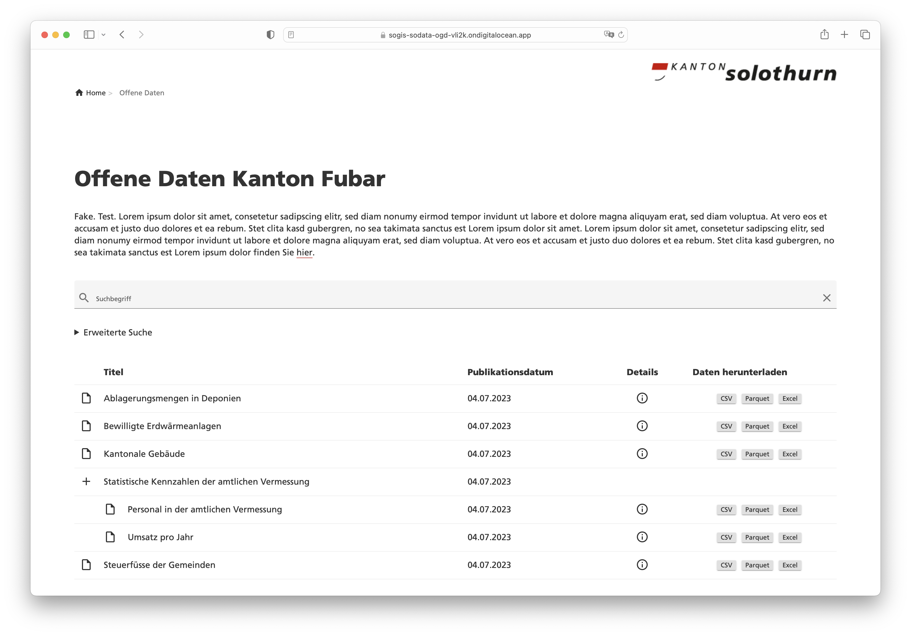

---
= OGD made easy #2 - Datenintegration und -publikation
Stefan Ziegler
2023-07-20
:thoth-type: post
:thoth-status: published
:thoth-tags: OGD,INTERLIS,Java,CSV,Parquet,GRETL
:idprefix:
---
Im http://blog.sogeo.services/blog/2023/07/10/ogd-made-easy-01.html[ersten Teil] ging es um die Umwandlung von CSV-Dateien in das Parquet-Format und um die Prüfung der CSV-Dateien mit einem https://github.com/edigonzales/csv2parquet[CLI-Tool]. Nun kann das CLI-Tool zwar zweckdienlich sein, aber für die automatisierte Integration in eine Dateninfrastruktur reicht es nicht und passt nicht in unseren Stack. Wir benötigten die Funktionalitäten als https://gradle.org[Gradle]-Task in unserem ETL-Werkzeug https://github.com/sogis/gretl[GRETL]. Gesagt, getan: es gibt nun drei neue GRETL-Tasks:

- https://github.com/sogis/gretl/blob/master/docs/user/index.md#csv2parquet-incubating[Csv2Parquet]
- https://github.com/sogis/gretl/blob/master/docs/user/index.md#csv2excel-incubating[Csv2Excel]
- https://github.com/sogis/gretl/blob/master/docs/user/index.md#ogdmetapublisher-incubating[OgdMetaPublisher]

Die ersten Beiden wandeln eine CSV-Datei in eine Parquet- resp. Excel-Datei um. Dabei wird - falls vorhanden - ein INTERLIS-Modell zwecks Bestimmung der Datentypen berücksichtigt. Der dritte Task erstellt aus einer TOML-Datei mit minimalen Metainformationen (Titel, Beschreibung, Datumsangaben, Zuständigkeiten) und dem Datenmodell eine Datei mit sämtlichen Metainformationen im INTERLIS-Format. Das https://github.com/sogis/gretl/blob/e6c97d76ffc5c8fdd20d333cd2d05429e60e38d8/gretl/src/main/resources/ogdmetapublisher/ili/SO_OGD_Metadata_20230629.ili[Datenmodell] ist angelehnt an https://www.dcat-ap.ch/[DCAT-AP CH]. 

Ein Intergrations-GRETL-Job sieht folgendermassen aus:

[source,java,linenums]
----
import ch.so.agi.gretl.tasks.*
import java.nio.file.Files
import java.nio.file.Paths
import de.undercouch.gradle.tasks.download.Download

apply plugin: 'ch.so.agi.gretl'

defaultTasks "runIntegrationJob"

def pathToTempFolder = System.getProperty("java.io.tmpdir")
def resultDir = file("./result")
resultDir.mkdirs()

def csvFileName = "ch.so.afu.abfallmengen_gemeinden.csv" 
def baseName = "ch.so.afu.abfallmengen_gemeinden"
def csvFileObj = file(Paths.get(resultDir.toString(), csvFileName))
def parquetFileName = baseName + ".parquet"
def excelFileName = baseName + ".xlsx"
def tomlFileName = baseName + ".toml"
def bucket = "ch.so.data-dev"
def modelName = "SO_AFU_Abfallmengen_Gemeinden_20230629"
def defaultModelDir = projectDir.toString()+";https://geo.so.ch/models"

// Könnte auch Upload durch Benutzer sein.
tasks.register('downloadCsv', Download) {
    src "https://s3.eu-central-1.amazonaws.com/ch.so.data.ingress-demo/$baseName/$csvFileName"
    dest csvFileObj 
    overwrite true

    doLast {
        println "File downloaded to: " + pathToTempFolder
    }
}

tasks.register('validateCsv', CsvValidator) {    
    dependsOn 'downloadCsv'
    dataFiles = [csvFileObj.toString()]
    firstLineIsHeader = true
    valueDelimiter = null
    valueSeparator = ";"
    models = modelName
    modeldir = defaultModelDir
}

tasks.register('createParquet', Csv2Parquet) {    
    dependsOn 'validateCsv'
    csvFile = csvFileObj
    firstLineIsHeader = true
    valueDelimiter = null
    valueSeparator = ";"
    models = modelName
    modeldir = defaultModelDir
    outputDir = file(resultDir)
}

tasks.register('createExcel', Csv2Excel) {
    dependsOn 'createParquet'
    csvFile = csvFileObj
    firstLineIsHeader = true
    valueDelimiter = null
    valueSeparator = ";"
    models = modelName
    modeldir = defaultModelDir
    outputDir = file(resultDir)
}

tasks.register('createMeta', OgdMetaPublisher) {
    dependsOn 'createExcel'
    configFile = file(tomlFileName)
    outputDir = resultDir
}

tasks.register('uploadFiles', S3Upload) {
    dependsOn 'createMeta'
    accessKey = awsAccessKeyAgi
    secretKey = awsSecretAccessKeyAgi
    sourceFiles = fileTree(resultDir) { include "*.parquet" include "*.xlsx" include "*.csv" include "*.xtf" }
    endPoint = "https://s3.eu-central-1.amazonaws.com"
    region = "eu-central-1"
    bucketName = bucket
    acl = "public-read"
}

tasks.register('runIntegrationJob') {
    dependsOn 'uploadFiles'
}
----

Die einzelnen Tasks führen überschaubare Aufgaben aus. Also z.B. Datei herunterladen oder CSV-Datei nach Excel umwandeln. Grundsätzlich gestalten wir unsere GRETL-Tasks immer so. Für die Geodatenpublikation haben wir jedoch einen sehr umfassenden &laquo;Publisher&raquo;-Task entwickeln lassen. Dieser exportiert die Daten aus der Datenbank, prüft diese, wandelt sie in unterschiedliche Format um und lädt die Dateien auf einen SFTP-Server. Dieser Task ist zwar sehr umfangreich aber er muss für unsere circa 150 Geodaten-Themen immer das Gleiche machen. Uns so kann es durchaus sinnvoll sein, einen sehr spezifischen und umfangreichen Task vorzuhalten. Auch im vorliegenden Fall könnte man früher oder später auf die Idee kommen, die Umwandlung der CSV-Datei, die Erstellung der Meta-Datei und das Hochladen zu kombinieren, da immer gleich. 

Als Ausführungsplattform und Orchestrator von GRETL-Jobs verwenden wir bei uns https://www.jenkins.io/[Jenkins]. Wir sind immer noch sehr zufrieden. Insbesondere mit der Flexibilität und den vielen Möglichkeiten, die man mit Jenkins hat. Andere verwenden z.B. https://gitlab.com/[GitLab]. Das ist so einfach möglich, weil GRETL letzten Endes nichts anderes ist als ein Gradle-Build-Job. D.h. man benötigt Gradle und Java. Am besten packt man sämtliche Abhängigkeiten in ein Docker-Image und schon hat man eine eigene GRETL-Runtime, die nur Docker benötigt. Um den Integrationsprozess zu testen (gut, könnte man auch lokal) und weil Jenkins und GitLab durch sind, probiere ich es noch mit https://github.com/features/actions[GitHub Actions]. Dazu mache ich mir ein GitHub-Repo mit https://github.com/edigonzales/ogd-jobs[sämtlichen Integrationsjobs]. Zusätzlich benötige ich die https://github.com/edigonzales/ogd-jobs/blob/main/.github/workflows/main.yaml[Konfiguration] der Action (aka Pipeline). Die Action-Konfiguration ist einfach und besteht aus einem parametrisierten Gradle-Job-Aufruf (Zeile 25). Der Benutzer muss beim Start den Job-Namen eintippen und dieser wird zur Laufzeit in der Action verwendet und es wird der gewünschte Integrationsjob ausgeführt. Im Job muss ein Standardtask (`defaultTask`) definiert werden. Die Actionkonfiguration sieht so aus:

[source,yaml,linenums]
----
name: ogd-job
on:
  workflow_dispatch:
    inputs:
      version:
        description: 'identifier?'
        required: true

jobs:  
  dataIntegration:
    env:
      ORG_GRADLE_PROJECT_awsAccessKeyAgi: ${{secrets.AWS_ACCESS_KEY_ID}}
      ORG_GRADLE_PROJECT_awsSecretAccessKeyAgi: ${{secrets.AWS_SECRET_ACCESS_KEY}}

    runs-on: ubuntu-latest

    container:
      image: sogis/gretl:latest

    steps:
      - uses: actions/checkout@v3

      - name: Run GRETL job
        run: |
          gradle -b ${{ github.event.inputs.version }}/build.gradle --init-script /home/gradle/init.gradle --no-daemon
----

Das Interessante sind die Zeilen 17 und 18. Hier wird definiert _in_ welchem Container der Job laufen soll. Wir wählen unser GRETL-Image. Nachfolgende Action-Steps werden direkt in diesem Container ausgeführt. Wir könnten auch ohne Dockerimage auskommen. Dann müssen aber die Abhängigkeiten von GRETL (als Gradle-Plugin) aus verschiedenen Maven-Repositories herunterladen werden, d.h. die Repositories müssen online sein. Mit Docker-Container dünkt es mich eleganter und zuverlässiger.

Die Daten und die Meta-Dateien liegen nach der Integration auf einer öffentlich zugänglichen Ablage (hier S3). Um den Zugang niederschwelliger zu gestalten, ist ein kleines Frontend sicher nicht verkehrt. Dazu verwende ich als Grundlage einfach die Anwendung, die Rahmen unseres https://data.geo.so.ch[neuen Datenbezuges] entstand. Et voilà: https://sogis-sodata-ogd-vli2k.ondigitalocean.app/.

Die Anwendung wurde mit https://www.gwtproject.org/[GWT] und https://spring.io/projects/spring-boot[Spring Boot] umgesetzt. Die während der Integration hergestellten Meta-Dateien werden geparsed und die notwendigen Informationen landen in einem https://lucene.apache.org/[Lucene-Index] (man geniesse und schätze das old school Webseiten-Layout!) für die Suche. Weil es sich bei den Meta-Dateien um INTERLIS-Transferdateien handelt, kann ich zum Parsen https://github.com/claeis/iox-ili[_iox-ili_] verwenden. Damit habe ich Zugriff auf die einzelnen Transferobjekte. Die Kommunikation (also die Antwort auf eine Suchanfrage) zwischen Client und Server basiert auf JSON. Aus diesem Grund muss ich aus dem geparsten XTF JSON-Objekte resp. -Strings herstellen können. Kostet mich nicht mehr als:

[source,java,linenums]
----
IoxEvent event = xtfReader.read();
while (event instanceof IoxEvent) {
    if (event instanceof ObjectEvent) {
        ObjectEvent objectEvent = (ObjectEvent) event;
        IomObject iomObj = objectEvent.getIomObject();        
        IomObject[] iomObjects = new IomObject[] {iomObj};                    
        Writer writer = new StringWriter();
        JsonGenerator jg = objectMapper.createGenerator(writer);
        Iox2jsonUtility.write(jg, iomObjects, td);
        jg.flush();
        jg.close();
        String jsonString = writer.toString();
        // do something with jsonString
    }
    event = xtfReader.read();
}
----

Für die Umwandlung eines Iom-Objektes in einen JSON-String gibt es die Klasse https://github.com/claeis/ili2db/blob/d30ee04aa484a803a3c352da91690495cf2fa3ae/src/ch/ehi/ili2db/json/Iox2jsonUtility.java#L27[`Iox2jsonUtility`]. Es wird immer ein zusätzliche Attribut `@type` erzeugt, welches der INTERLIS-Klasse (oder -Struktur) entspricht. Bei Objekten (im Gegensatz zu Strukturen) gibt es ein weiteres Zusatzattribut `@id`, welches der `TID` entspricht:

[source,json,linenums]
----
[
  {
    "@type": "SO_OGD_Metadata_20230629.Datasets.Dataset",
    "@id": "ch.so.agi.amtliche_vermessung_statistik",
    "Identifier": "ch.so.agi.amtliche_vermessung_statistik",
    "Title": "Statistische Kennzahlen der amtlichen Vermessung",
    "Description": "Statistische Kennzahlen der amtlichen Vermessung über Personal und Umsatz in den Jahren 1983 bis 2022.",
    "Publisher": {
      "@type": "SO_OGD_Metadata_20230629.Office_",
      "AgencyName": "Amt für Geoinformation",
      "Abbreviation": "AGI",
      "OfficeAtWeb": "https://agi.so.ch",
      "Email": "mailto:agi@bd.so.ch",
      "Phone": "032 627 75 92"
    },
    "Theme": "Statistik,Amtliche Vermessung",
    "Keywords": "Statistik,Amtliche Vermessung",
    "StartDate": "1983-01-01",
    "EndDate": "2022-12-31",
    "Resources": [
      {
        "@type": "SO_OGD_Metadata_20230629.Resource",
        "Identifier": "ch.so.agi.amtliche_vermessung_statistik.umsatz",
        "Title": "Umsatz pro Jahr",
        "Description": "Umsatz pro Jahr. Anzahl Gebäudemutationen und Grundstücksmutationen und Gesamtumsatz in Franken.",
        "Model": {
          "@type": "SO_OGD_Metadata_20230629.ModelLink",
          "Name": "SO_AGI_Amtliche_Vermessung_Statistik_Umsatz_20230625",
          "LocationHint": "https://geo.so.ch/models"
        },
     ....
----

Integration und Publikation geschafft. Als nächstes kommt Visualisierung und Data Crunching.
