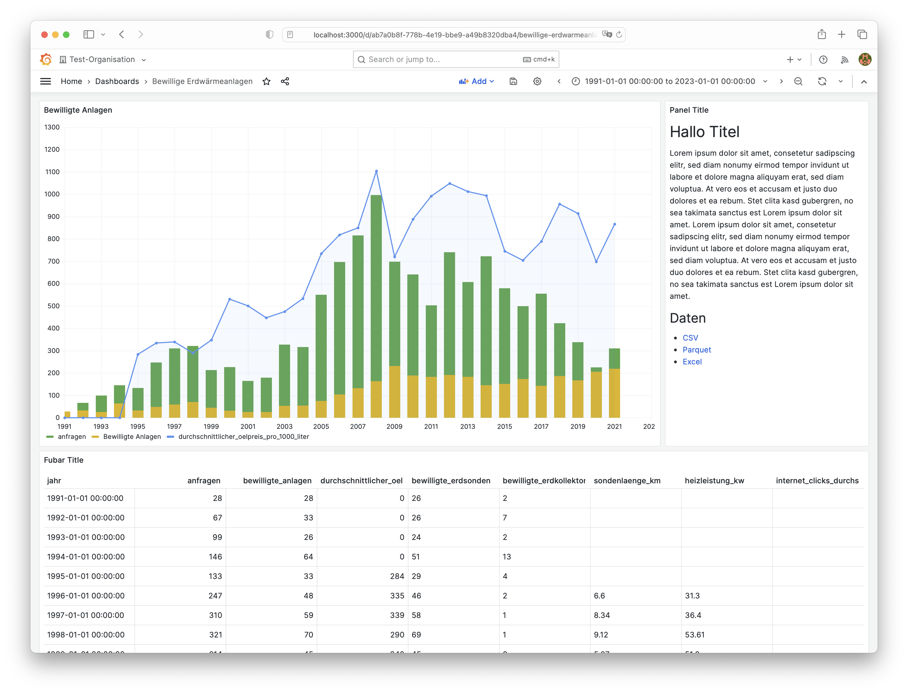
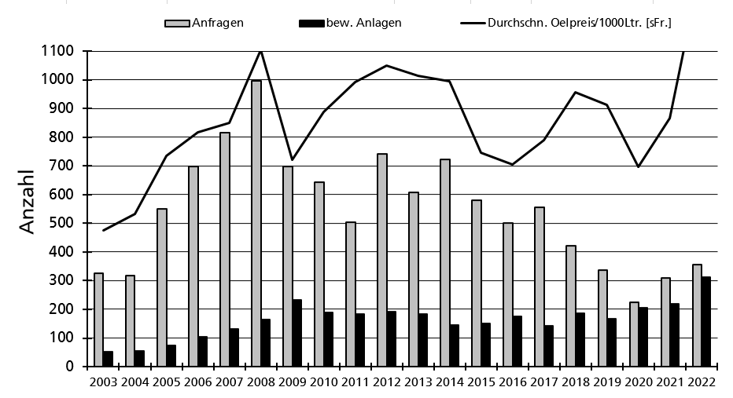
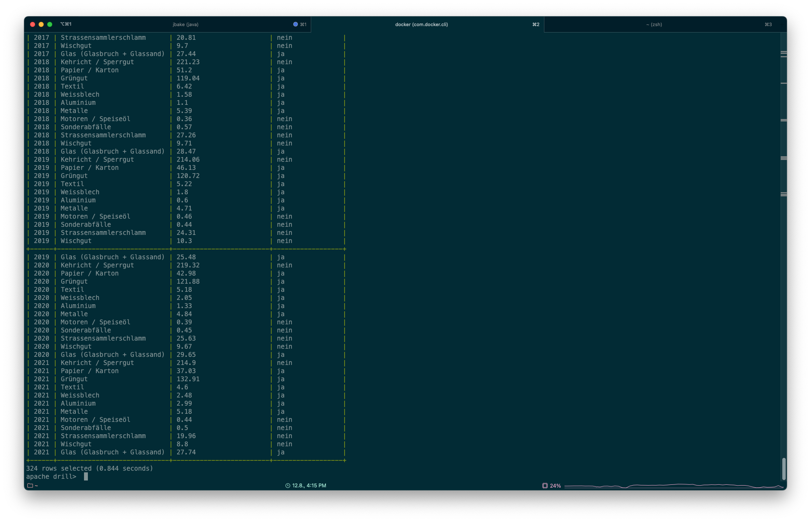
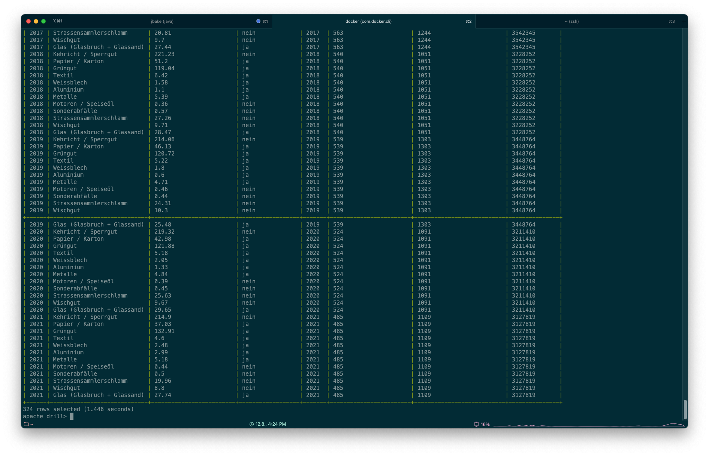
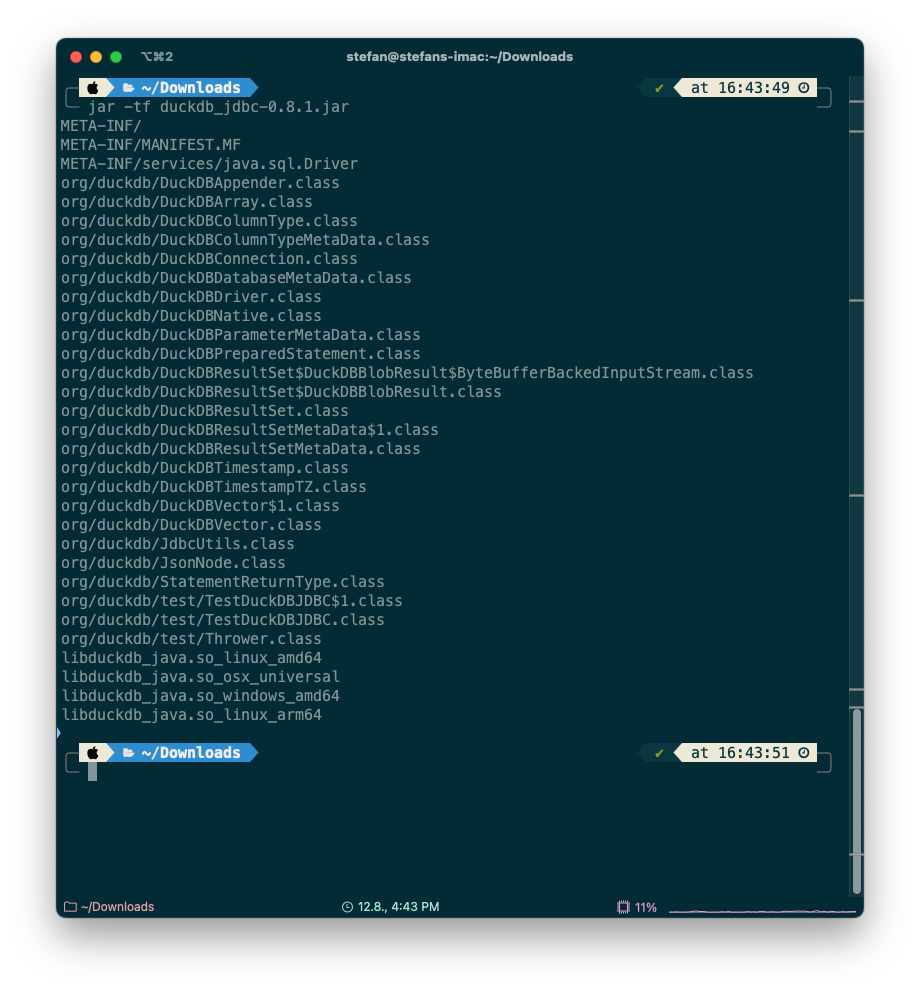
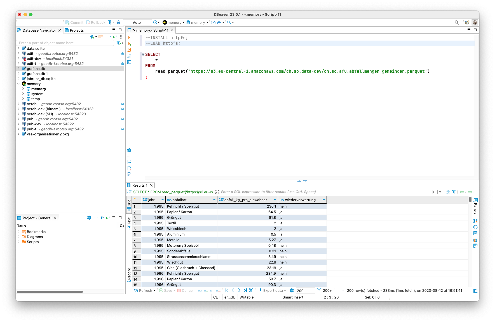

---
= OGD made easy #3 - Visualisierung und Data Crunching
Stefan Ziegler
2023-08-13
:thoth-type: post
:thoth-status: published
:thoth-tags: OGD,CSV,Parquet,Grafana,Dashbuilder,Drill,DuckDb
:idprefix:
---
Teil http://blog.sogeo.services/blog/2023/07/10/ogd-made-easy-01.html[1] und http://blog.sogeo.services/blog/2023/07/20/ogd-made-easy-02.html[2] behandeln die Integration und Bereitstellung von OGD-Daten. Viele Dienststellen möchten ihre Daten aber auch visualisiert haben. Insbesondere wenn es darum geht die Gemeindeflächen z.B. nach Steuerlast einzufärben (Choroplethenkarte), gelangen sie zu uns. Das ist bei uns jeweils immer bisschen Handarbeit und wir wünschten uns was Effizienteres. Wir hatten früher eine Lösung mit Excel, welche aber Maintenance-Hell war und wieder verschwunden ist. Eins vorneweg: Gefunden habe ich die perfekte Lösung noch nicht, sondern es ging mir ums Kennenlernen und Ausloten bestehender Lösungen für klassische (nicht-kartografische) Visualisierungen.

Ich bin Anfang des Jahres über https://www.dashbuilder.org/[Dashbuilder] gestolpert. Jetzt im Rahmen dieser Rumspielerei war der passende Anlass es auszuprobieren. Das Ausprobieren gestaltete sich aber relativ schwierig. Ich hatte extrem Mühe den Einstieg zu finden. Anscheinend ist da sehr viel im Fluss und m.E. leidet darunter die Dokumentation, was es natürlich für Aussenstehende wiederum schwieriger macht (z.B. Ankündigugen von Neuerungen in Blogs, die schon wieder passé sind). Zuerst gab es sowas wie einen visuellen Dashboardbuilder. Dieser ist - soweit ich es eben verstanden habe - Geschichte. Es brauchte auch eine Runtime, auf die man die zusammengebastelten Visualisierungen deployen konnte (musste?). Auch diese ist nicht mehr nötig. Neu schreibt man sein Zeugs nur noch mit https://noyaml.com/[YAML]. Diese Kröte könnte man ja noch Schlucken, wenn es top-notch dokumentiert wäre. Ist es aber nicht. Ich habe die Übung mit Dashbuilder abgebrochen und bin umgeschwenkt auf was Anderes.

Jeder Kubernetes- oder OpenShift-Leidgeplagte kennt es wohl: https://grafana.com/oss/[Grafana]. Grafana sagt von sich: &laquo;Grafana is the leading open source visualization and dashboarding platform that allows you to query, visualize, alert on, and understand your data no matter where it’s stored.&raquo; Klingt schon mal nicht schlecht. Vorsicht ist immer geboten, wenn ein OSS-Produkt nur von einer Firma bewirtschaftet wird. Das kann auch böse enden oder zumindest zu Unsicherheiten führen (siehe https://www.hashicorp.com/blog/hashicorp-adopts-business-source-license[HashiCorp]). Da ist z.B. https://qgis.org[QGIS] bezüglich OSS schon ein anderes Kaliber.

Unsere OGD-Daten haben wir von CSV nach Parquet und Excel umformatiert. Wie sieht es damit in Grafana aus? Eher mau. Es gibt zwar unzählige Datenquellen, die man anzapfen kann. Aber Parquet ist nicht https://grafana.com/docs/grafana/latest/datasources/[darunter]. Wenn man nicht gleich &laquo;all in&raquo; via https://grafana.com/docs/grafana/latest/datasources/postgres/[PostgreSQL] gehen will, bleibt fast nur noch CSV mit dem https://grafana.com/grafana/plugins/yesoreyeram-infinity-datasource/[Infinity-Plugin]. Hier natürlich sehr nervig, weil man entweder explizit den Datentyp casten muss oder aufpassen muss, dass Grafana resp. das Plugin den Datentyp aus dem CSV korrekt erkennt. Die Gestaltungsmöglichkeiten sind umfrangreich und die Dokumentation ist gut:

Als Vergleich dazu die Grafik aus der heute bereitgestellten Exceldatei.

Man kann Grafana-Dashboards der Öffentlichkeit ohne Login bereitstellen (Beta-Feature) oder es besteht die Möglichkeit, dass Teile davon als iFrame von anderen Anwendungen eingebunden werden können.

Ein ebenso spannender Aspekt ist das Data Crunching. Wir sind bei uns in der Geoinformation SQL-zentrisch unterwegs. GIS-Analysen etc. finden immer in der Datenbank statt (Dank Docker auch mal in einer Jenkins-Pipeline). Geht  SQL-mässig auch was, ohne die Daten in PostgreSQL zu importieren? 

Weil technisch faszinierend, habe ich zuerst https://drill.apache.org/[Apache Drill] ausprobiert. Man kann damit praktisch jede erdenkliche NoSQL-Datenbank mit richtigem https://drill.apache.org/docs/sql-reference/[SQL] (nicht irgendein Pseudo-Dialekt) ansprechen und zudem die Quellen verwalten. Es ist also möglich z.B. Parquet-Dateien auf S3 mit SQL abzufragen, wenn sie in Apache Drill freigeschaltet (oder je nach Sichtweise registriert) sind. Kann man gut finden oder auch schlecht. Kommt wohl auf die Anforderungen darauf an. Als Einzelbenutzer wäre mir so eine Verwaltung egal. Wenn jemand Apache Drill als Software in einer Organisation zur Verfügung stellt, will man wahrscheinlich sowas. Damit nicht zu viel Schabernack gemacht wird. _Drill_ lässt sich Standalone betreiben oder in einem mehr oder weniger aufwändigen Setup mit Zookeeper. Dann sind mehrere &laquo;Drillbits&raquo; möglich, um die Last besser zu verteilen. Interessant ist _Drill_ auch, weil es einen JDBC- und ODBC-Treiber gibt. Ich kann somit sämtliche registrierten Datenquellen in beliebigen Anwendungen mit SQL abfragen (z.B. dbeaver oder klassische BI-Werkzeuge). Neben all diesem steht auch eine einfache Konsole zur Verfügung, in der ich die SQL-Statements absetzen kann:

[source,sql]
----
SELECT * FROM s3.`ch.so.afu.abfallmengen_gemeinden.parquet`;
----

Wobei `s3` hier nur für den Namen des Storages dient und es nicht zwingend `s3` heissen muss für Daten auf S3. Man kann sich das vielleicht wie einen Schemanamen vorstellen.

Die Antwort wird in 0.8 Sekunden zurückgeliefert:

Man kann auch zwischen beliebigen Quellen joinen:

[source,sql,linenums]
----
SELECT 
    * 
FROM 
    s3.`ch.so.afu.abfallmengen_gemeinden.parquet` AS abfall
    LEFT JOIN s3.`ch.so.agi.amtliche_vermessung_statistik.umsatz.parquet` AS av_umsatz 
    ON av_umsatz.jahr = abfall.jahr
;
----

(Und ja, die Query hier ist sinnfrei.)

Die Ausführung der Query dauert circa 1.5 Sekunden.

Exports von Datanalysen in verschiedene Formate sind möglich. Erwähnenswert ist, dass man neben der Vielzahl von NoSQL-Datenbanken eben auch normale relationale Datenbanken ansprechen kann (solange es einen JDBC-Treiber gibt). Damit liessen sich Abfragen zwischen Parquet-Daten in einem Data Swamp und einem klassischen Datawarehouse machen.

Ein klein wenig mulmiges Gefühl bekomme ich, wenn ich mir die Performance anschaue. Sollten die Queries komplexer werden, weiss ich nicht, ob die Antwortzeiten komplett durch die Decke gehen.

Was wäre Data Crunching mit SQL, wenn man nicht auch https://duckdb.org/[DuckDB] anschauen würde? DuckDB ist quasi die Datenbank to go. Ein einziges Binary und fertig. Standardmässig werden erzeugte Tabellen nicht auf die Harddisk persistiert und man kann verschiedene Formate prozessieren, ohne sie importieren zu müssen. Es gibt auch einen JDBC-Treiber, um z.B. https://duckdb.org/docs/guides/sql_editors/dbeaver.html[dbeaver als Client] zu verwenden. Es ist aber kein reiner Java-Treiber, sondern es werden für verschiedene Betriebssystem Binaries in die Jar-Datei gepackt (wie beim SQLite-Treiber). Darum ist sie über 50MB gross. Aber es funktioniert tadellos.

Die letzten vier Dateien in der Auflistung sind die Binaries für Linux (amd und arm), Windows und macOS.

Um Parquet-Dateien auf S3 abzufragen, muss man zuerst einmalig die HTTPFS-Extension installieren und laden:

[source,sql,linenums]
----
INSTALL httpfs;
LOAD httpfs;
----

Anschliessend kann man beliebige Dateien, die via HTTP greifbar sind, abfragen:

Die Abfrage dauert circa 0.2 Sekunden. Der unsinnige Join mit der Statistik der amtlichen Vermessung sieht nun so aus:

[source,sql,linenums]
----
SELECT 
    * 
FROM 
    read_parquet('https://s3.eu-central-1.amazonaws.com/ch.so.data-dev/ch.so.afu.abfallmengen_gemeinden.parquet') AS abfall
    LEFT JOIN read_parquet('https://s3.eu-central-1.amazonaws.com/ch.so.data-dev/ch.so.agi.amtliche_vermessung_statistik.umsatz.parquet') AS av_umsatz
    ON av_umsatz.jahr = abfall.jahr
;
----

Die Query dauert nur 0.3 Sekunden. Was fast Faktor 5 schneller ist als mit Apache Drill. Woran es liegt, weiss ich nicht. Ich würde darauf tippen, das bereits die Umgehung des S3-Protokolls einen gewissen Einfluss hat. Nomen est omen: OGD-Daten sind frei verfügbar. Das ganze S3-Berechtigungs-Gedöns ist in diesem Fall nicht notwendig und es sind schlicht Dateien, die via HTTP lesbar sind. 

Daten (als erzeugte Tabellen) können exportiert (lokal in https://duckdb.org/docs/guides/import/parquet_export[verschiedene] https://duckdb.org/docs/guides/import/csv_export[Formate] oder auch nach https://duckdb.org/docs/guides/import/s3_export[S3]) werden. Es gibt eine https://duckdb.org/docs/extensions/spatial.html[Spatial-Extension], die GIS-Operationen implementiert. Und man kann sogar GDAL-Formate verwenden. Ziemlich abgefahren alles. Ganz frisch ist https://motherduck.com/blog/announcing-motherduck-duckdb-in-the-cloud/[Motherduck], wo Kollaboration und Cloud eine Rolle spielen sollen.

https://www.r-project.org/[_R_] würde sich für Data Crunching auch noch eignen. Hier fehlt mir irgendwie immer noch der Zugang. Für coole Dashboards könnte/müsste man sich zudem https://superset.apache.org/[Apache Superset] anschauen. 
