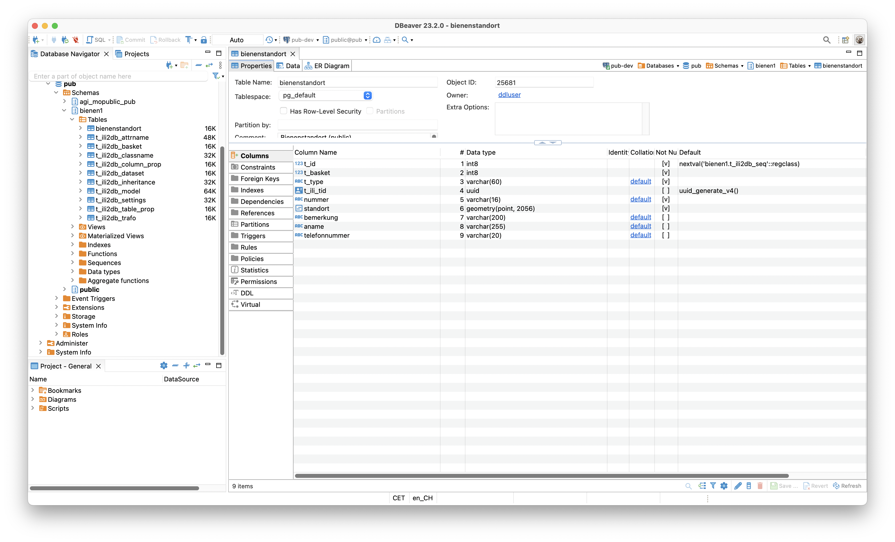

Es gibt (bald) ein neues INTERLIS-Werkzeug und es heisst https://github.com/claeis/ilishaper[`ilishaper`] (jaja, ich höre die Häme bereits: &laquo;shape...&raquo;). Ilishaper hat zwei Funktionen:

Die erste Funktion betrifft die INTERLIS-Modelldatei. Man kann aus einem Modell ein weiteres, reduziertes Modell ableiten. Dabei lassen sich Attribute, ganze Klassen und ganze Topics abstreifen. Dazu benötigt es eine Konfigurationsdatei:

[source,ini,linenums]
----
[Basismodell]
name=Derivatmodell
issuer=mailto:test@host
version=2023-01-01
doc=Neu generiertes Modell

[Basismodell.TopicT1.ClassA.Attr1]
ignore=true

[Basismodell.TopicT1.ClassB]
ignore=true

[Basismodell.TopicT2]
ignore=true

[Basismodell.TopicT1.ClassA]
filter=Attr5==#rot
----

Die Syntax dünkt mich mehr oder weniger selbsterklärend. Die ersten paar Zeilen betreffen die Modellinformationen: Man kann den Namen des Modells bestimmen und weitere Meta-Attribute. Interessant sind die letzten beiden Zeilen: Mit diesen lassen sich auch Objekte filtern. Im vorliegenden Fall werden sämtliche Objekte gefiltert, die den Aufzähltypwert `#rot` aufweisen. Das führt zur zweiten Funktion von `ilishaper`. Das Filtern hat ja keine Auswirkung beim Herstellen des Derivatmodelles, sondern erst wenn auch die INTERLIS-Transferdatei vom Basismodell ins Derivatmodell von `ilishaper` &laquo;geshaped&raquo; wird. Somit wird es möglich sein sowohl Zeilen wie auch Spalten abzustreifen.

Warum brauchen wir so was?

Die meisten unserer Geodaten sind öffentlich und frei verfügbar. Einige der Themen weisen jedoch teilweise geschützte Daten auf. Der Klassiker: eine Telefonnummer. Diese Information darf die Öffentlichkeit nicht sehen und ist nur für den internen Gebrauch. Auf Service-Stufe (also WMS etc.) haben wir das applikatorisch gelöst (im QGIS-Server). Bei der Bereitstellung der Geodaten als Datei (XTF, GeoPackage etc.) hatten wir keine Lösung. Der erste Ansatz, den wir verfolgten, war Vererbung. Wir modellierten das Modell mit den öffentlichen Informationen und dazu ein erweitertes Modell mit den zusätzlichen Informationen, die nicht öffentlich sind. Man ist nun in der Lage mit `ili2pg` Daten gemäss beiden Modellen zu exportieren (was eigentlich recht abgefahren ist). Ein Beispiel aus dem Fundus:

[source,ini,linenums]
----

INTERLIS 2.3;

MODEL SO_ALW_Bienenstandorte_20210529 (de)
AT "https://alw.so.ch"
VERSION "2021-05-26"  =
  IMPORTS GeometryCHLV95_V1;

  TOPIC Bienenstandorte =
    OID AS INTERLIS.UUIDOID;

    /** Bienenstandort (public)
     */
    CLASS Bienenstandort =
      /** Nummer
       */
      Nummer : MANDATORY TEXT*16;
      /** Standort
       */
      Standort : MANDATORY GeometryCHLV95_V1.Coord2;
      /** Bemerkung
       */
      Bemerkung : TEXT*200;
    END Bienenstandort;

  END Bienenstandorte;

END SO_ALW_Bienenstandorte_20210529.

MODEL SO_ALW_Bienenstandorte_protected_20210529 (de)
AT "mailto:stefan@localhost"
VERSION "2021-05-29"  =
  IMPORTS SO_ALW_Bienenstandorte_20210529;

  TOPIC Bienenstandorte
  EXTENDS SO_ALW_Bienenstandorte_20210529.Bienenstandorte =

    /** Bienenstandort mit allen (inkl. nicht-öffentlichen) Attributen.
     */
    CLASS Bienenstandort (EXTENDED) =
      /** Name des Imkers
       */
      Name : MANDATORY TEXT*255;
      /** Telefonnummer
       */
      Telefonnummer : TEXT*20;
    END Bienenstandort;

  END Bienenstandorte;

END SO_ALW_Bienenstandorte_protected_20210529.
----

Wenn wir das Modell mit `ili2pg` in der Datenbank abbilden, entsteht zwar trotz Vererbung mit passender Abbildungsregel nur eine Tabelle. Jedoch entstehen auch zwei zusätzliche Spalten `t_basket` und `t_type`:

Die `t_type`-Spalte schmerzt mich nicht sonderlich, das ist eine Konstante. Was mich mehr stört und nervt ist die `t_basket`-Spalte, um die ich mich kümmern muss. Es ist ein Fremdschlüssel zur `t_ili2db_basket`-Tabelle. Ich kann also nicht irgendwas reinschreiben. Und hier liegt der wirkliche Hund begraben: Zu den oben dargestellten Modellen (sogenannte flache Publikationsmodelle) gibt es bei uns in der Regel auch immer ein sauber normalisiertes Erfassungsmodell. Die Publikation vom Erfassungs- in das Publikationsmodell machen wir mit SQL. Und nun muss man sich plötzlich ziemlich mühsam (v.a. bei umfangreicheren Modellen) um diesen Fremdschlüssel kümmern. Und warum? Weil ich die Telefonnummer nicht publizieren will. Man muss also einen ziemlichen Handstand machen (Vererbung, zwei Modelle, komplizierter Datenumbau), um ein Attribut loszuwerden. Die Idee von `ilishaper` ist eben auch, diesen Prozess viel transparenter zu machen: man konfiguriert das Abstreifen eines Attributes in der Konfig-Datei und muss sich nicht um Baskets kümmern. Scheint mir so eine viel &laquo;expressivere&raquo; Lösung für das Problem zu sein. Zudem kann man mit dem Vererbungsmeccano nicht Zeilen filtern, was bei uns ebenfalls ab und wann verlangt wird.

Wir werden zukünftig ein Erfassungmodell machen, das nicht weiss, ob z.B. ein Attribut öffentlich oder nicht-öffentlich ist. Weiter werden wir ein Publikationsmodell mit öffentlichen und nicht-öffentlichen Daten erstellen. Dieses Publikationsmodell persistieren wir in der Datenbank und es dient ebenfalls für die Publikation der Daten als Service (siehe oben, Problem applikatorisch gelöst). Aus diesem Publikationsmodell erstellen wir _einmalig_ das reduzierte Publikationsmodell mit den öffentlichen Daten. Das Modell verschwindet natürlich nicht wieder, sondern wird genauso, wie alle anderen Modellen in der https://geo.so.ch/models/[INTERLIS-Modellablage] publiziert. Nach dem Export der Daten in das Publikationsmodell kommt der `ilishaper` zum Zuge und wandelt die Transferdatei in das reduzierte Publikationsmodell um, das jedermann zur Verfügung stehen wird.

Klar, es entsteht auch wieder Konfiguration aber trotzdem scheint mir dieses Vorgehen transparenter, einfacher und auch skalierbarer (unterschiedliche Derivatmodelle) zu sein.
