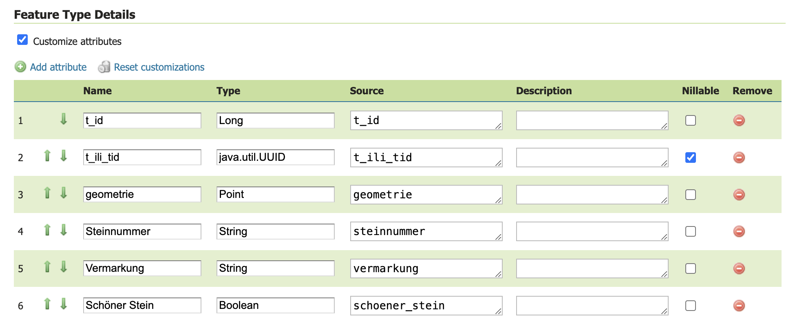
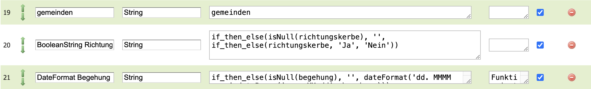
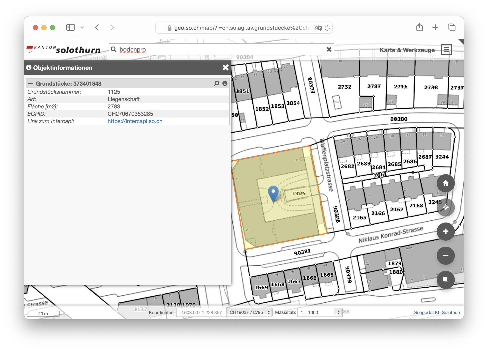
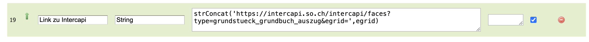
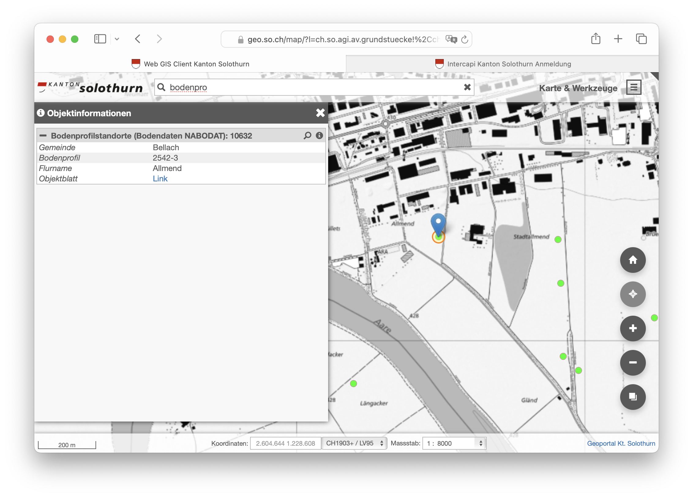

---
= GeoServer Magie #2 - More GetFeatureInfo witchcraft
Stefan Ziegler
2023-11-03
:thoth-type: post
:thoth-status: published
:thoth-tags: GeoServer,Freemarker,WMS,GetFeatureInfo,Java
:idprefix:
---
https://geoserver.org/[GeoServer] war schon immer der WMS-Server der Herzen, also meines Herzens. Ganz zu Beginn (muss 2001 oder früher gewesen sein) hatten wir https://mapserver.org/[MapServer] erfolgreich im Einsatz. GeoServer haben wir ein paar Jahre später für das Herstellen von grossformatigen PDF verwendet. Zu guter Letzt sind wir dem Marketing von QGIS-Server erlegen und haben auch diesen WMS-Server in Betrieb genommen. 

Ein wichtiges Ziel bei der Einführung des neuen Web GIS Clients (2016 - 2018) war die Reduktion der WMS-Server auf einen. Die Wahl fiel auf QGIS-Server. Weil wir früher oder später beim Web GIS Client und sämtlichen Services und Umsystemen über die Bücher müssen, darf man sich jetzt GeoServer wieder ins Gedächtnis rufen. 

Ich fand bei GeoServer immer gut, dass bereits viel mitkommt, das wir bei unserer Lösung zusätzlich programmieren lassen mussten, z.B.

- Identity and Access Management
- GUI für die Administration 
- Layergruppen zu einem Einzellayer gruppiert
- Mächtige Konfigurationsmöglichenkeiten bei der GetFeatureInfo-Funktion

Und um diese Konfigurationsmöglichenkeiten geht es hier und jetzt. Ich habe bereits vor http://blog.sogeo.services/blog/2018/09/10/geoserver-magie-1.html[fünf Jahren davon geschwärmt] und bin immer noch begeistert. Ich habe unsere Anforderungen an die Objektabfrage (die plusminus der GetFeatureInfo-Abfrage entspricht) rausgekramt und will wissen, wie das mit GeoServer ginge?

Anforderungen:

- Aliasnamen: Die Attributnamen aus der Datenbank sollen überschrieben werden können.
- Attribute sollen ausgeblendet resp. nicht angezeigt werden können.
- Reihenfolge der Attribute muss konfigurierbar sein
- Attributewerte sollen formatiert werden können. Z.B. &laquo;true&raquo; soll zu &laquo;Ja&raquo; formatiert werden.
- Neue Attribute sollen hinzugefügt werden können, z.B. ein Link auf eine Fachanwendung. Der Link ist nicht in der Datenquelle vorhanden.
- Der hinzukonfigurierte Link soll zudem verwendet werden können, um einen Report-Service aufzurufen. Dem Report-Service muss die Objekt-ID und die geklickte Koordinate mitgeliefert werden können.
- Fotos (Link auf URL) sollen automatisch dargestellt werden (nur HTML-Output).
- Allfällige JSON-Inhalte als Attributwert sollen als Key-Value gerendert werden (nur HTML-Output).
- Templating Engine für sehr spezifische Outputs.
- Beliebige SQL-Query: Das Resultat einer beliebigen SQL-Query wird als Key-Value in der GetFeatureInfo-Antwort zurückgeliefert.
- Beliebige Businesslogik: Es wird selbst programmierter Code ausgeführt und das Resultat wird als Key-Value in der GetFeatureInfo-Antwort zurückgeliefert. Haben wir wenig überraschend wirklich nicht so gerne und noch weniger gerne als die SQL-Query.

**Templating Engine** 

Wahrscheinlich das Wichtigste gleich zu Beginn: GetFeatureInfo-Antworten werden in GeoServer für die Formate GeoJSON und HTML mittels https://freemarker.apache.org/[Freemarker Templates] https://docs.geoserver.org/stable/en/user/tutorials/freemarker.html[konfiguriert]. Somit ist die Basis für viel Einflussnahme gelegt. Die Templates können global, pro Workspace oder für einen spezifischen Layer definiert werden.

Das Ziel ist natürlich ein möglichst generisches, globales Template herstellen zu können und nur für die absoluten Spezialfälle ein zusätzliches.

**Aliasnamen / Attribute ausblenden / Reihenfolge**

Diese drei Anforderungen können seit https://geoserver.org/announcements/2022/05/24/geoserver-2-21-0-released.html[Version 2.21.0] leicht umgesetzt werden: 

Der Attributnamen &laquo;schoener_Stein&raquo; wird zu &laquo;Schöner Stein&raquo;. Mit den Pfeilen kann man die Reihenfolge ändern und mit dem roten Button, kann man Attribute entfernen. Hat jetzt noch Luft nach oben, was die Benutzerfreundlichkeit betrifft: Ich würde lieber ein Attribut visuell &laquo;disablen&raquo; und nicht löschen. Und die Reihenfolge möchte ich mit Drag 'n' Drop verändern.

Wenn man die Attributnamen verändert, muss man unbedingt wissen, dass der XML/GML-Output nicht mehr zwingend funktioniert. GeoServer sendet eine WFS-FeatureCollection zurück. Attribute landen in XML-Tags. Was natürlich mit Umlauten und Leerzeichen nicht mehr funktioniert. Die erlaubten Antwortformate lassen sich aber in GeoServer konfigurieren.

**Attributwerte formatieren**

Inbesondere bei Boolean-Werten hat man das Bedürfnis diese anders als true/false zu rendern. Hier helfen uns die https://docs.geoserver.org/main/en/user/filter/function_reference.html[Filter-Funktionen]. Mit diesen lassen sich die Attributwerte verändern. Im folgenden Beispiel wird zuerst geprüft, ob der Werte null ist und anschliessend findet die eigentliche Umwandlung in den &laquo;schönen&raquo; String statt:

**Neue Attribute**

Wozu braucht man das? Wir verlinken regelmässig in der Antwort einer Objektabfrage zu anderen Fachanwendungen. Ein gutes Beispiel sind die Grundstücke. Klickt man auf das Grundstück, wird zusätzlich ein Link auf die Grundbuch-Webanwendung (Intercapi) gerendert:

Dieser Link soll nicht Bestandteil der eigentlichen Daten sein und er muss dynamisch sein. D.h. der Query-Parameter des Links ändert sich bei jedem Grundstück (z.B. `?egrid=CH270670353285`), damit man direkt beim angewählten Grundstück in der Fachanwendung landet. Stand heute machen wird das mit einem zusätzlichen, speziellen Jinja-Template. Mit GeoServer geht das einfacher: neue Attribute können mit &laquo;Add attribute&raquo; hinzugefügt werden. Mit den bereits erwähnten Filterfunktionen und dem Zugriff auf andere Attribute (hier &laquo;egrid&raquo;) kann der Link einfach zusammengestöpselt werden:

**Objekt-ID und geklickte Koordinate**

Wir haben einen eigenen Report-Service, der Zusatzinformationen zu Objekten als PDF oder Excel zurückliefert (siehe Objektblatt-Link). 

Dem Report-Service muss man die Objekt-ID (des geklickten Objekts) und/oder die geklickte Koordinate übergeben:

[source,bash,linenums]
----
https://geo.so.ch/api/v1/document/afu_bodenprofilstandorte?feature=10632&x=2604491.665269116&y=1228356.537479993&crs=EPSG%3A2056
----

Was der Report-Service mit diesen Informationen macht, ist ihm überlassen. Heute können wir in unserer Administrationsanwendung die (Jasper-)Reports direkt einem WMS-Layer zuweisen. Mit GeoServer würde man den Link wie oben als zusätzliches Attribut erfassen. Was aber noch fehlt, ist die geklickte Koordinate. Diese muss als Platzhalter im Link erfasst werden und kann im Freemarker Template zur Laufzeit berechnet und der Platzhalter ersetzt werden. Im Freemarker Template stehen gewisse Informationen immer zur Verfügung. So z.B. die GetFeatureInfo-Request-URL. Aus dieser lässt sich die geklickte Koordinate berechnen und dem Link hinzufügen. Das kann im globalen Template gemacht werden.

**Fotos rendern**

Im globalen Template kann geprüft werden, ob ein Link auf ein Foto zeigt. Mehr oder weniger muss nur die Endung geprüft werden. Ist es kein Foto, wird nur der Link gerendert, sonst das Bild.

**JSON-Inhalte rendern**

Objekte weisen bei uns manchmal Attribute auf, deren Inhalt JSON ist. Das rührt daher, dass einem Objekt z.B. mehrere Dokumente (mit den Attributen Link, Titel, offizielle Nummer, ...) zugewiesen sind. Das lösen wir so, dass wir diese unbekannte Anzahl an Dokumenten als JSON im Attribut kodieren. In der GetFeatureInfo-Antwort soll aber kein JSON-String stehen, sondern wie alle anderen Attribute im Key-Value-Stil gerendert werden. Auch diese Anforderung kann direkt in einem globalen Template gelöst werden. Herausfordernd ist, herauszufinden, ob es sich um JSON handelt oder um einen normalen String. Freemarker sieht in beiden Fällen nur einen String (weil GeoServer das bereits umwandelt). 

**Beliebige SQL-Query / Businesslogik**

In ganz wenigen Ausnahmefällen müssen wir Informationen zurückliefern, die nicht direkt vom geklickten Layer stammen. Für diesen Use Case haben wir zwei Lösungsvarianten: Wir können beliebiges SQL ausführen oder beliebigen Python-Code. Bei beiden Varianten gibt es sowas wie ein Interface, das implementiert werden muss, damit es generisch funktioniert.

Für GeoServer prototypisch umgesetzt habe ich nur die SQL-Variante. Vom Prinzip her ist die Python-Variante (in unserem Fall natürlich Java) sehr ähnlich. _Freemarker Templates_ erlauben das Ausführen von beliebigen statischen Java-Methoden. Diese müssen aber vorgängig explizit (aus Sicherheitsgründen) freigeschaltet werden. Wir schreiben einmalig eine Java-Klasse mit einer statischen Methode, die eine SQL-Query ausführt. Die SQL-Query steht in einer Datei, die z.B. in das GeoServer-Data-Directory kopiert wird. Die Java-Methode sucht anhand der Parameter die Datei und führt die SQL-Query aus und retourniert die Antwort als Liste von Maps. 

Gratis bekommt man zudem das DB-Connection-Pooling, weil man die Datasource via JNDI definiert. Wir teilen uns somit mit GeoServer den Connection Pool. 

Man könnte sogar soweit gehen, diese Logik in das generische, globale Freemarker Template zu integrieren. Ist meines Erachtens wahrscheinlich nicht sinnvoll, weil somit _jeder_ GetFeatureInfo-Request zuerst prüft, ob eine solche SQL-Query ausführt werden muss.

**Fazit**

GeoServer bietet sehr mächtige Konfigurationsmöglichenkeiten im Bereich des GetFeatureInfo-Requests an. Einiges, das wir benötigen und speziell entwickeln liessen, gibt es hier out-of-the-box.
