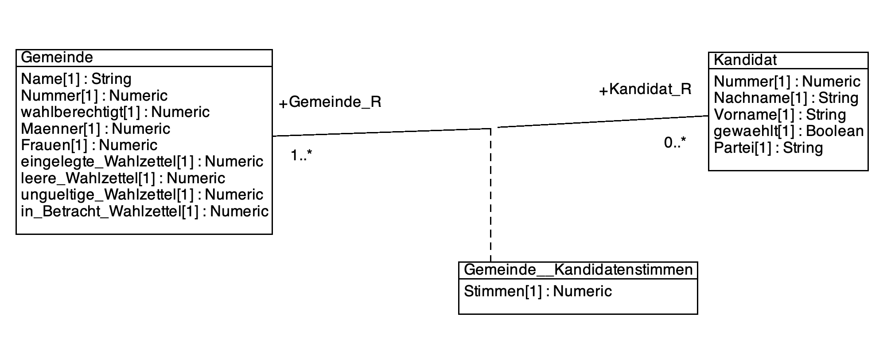
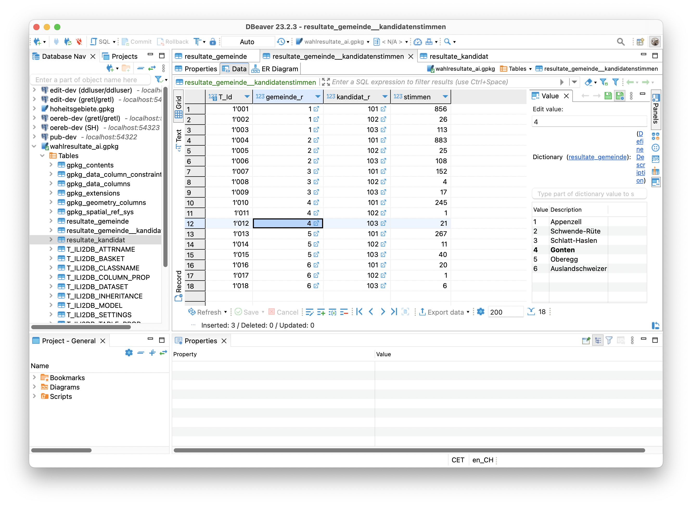

---
= INTERLIS leicht gemacht #39 - "Dear BFS, I fixed it for you."
Stefan Ziegler
2023-11-20
:thoth-type: post
:thoth-status: published
:thoth-tags: INTERLIS,ilivalidator
:idprefix:
---
Wie heisst es so schön: &laquo;Wer den Schaden hat, braucht für den Spott nicht zu sorgen&raquo;. Man weiss zwar (noch) nicht genau, wie das Wahl-Statistik-Debakel passiert ist, aber ein wenig frotzeln lässt sich schon. Die meisten Informationen stehen meines Erachtens in einem https://www.nzz.ch/visuals/exceldateien-und-fehlerhafte-programme-eine-rekonstruktion-wie-es-zum-falschen-wahlergebnis-kam-ld.1763604[NZZ-Artikel]. Lassen wir mal die Microservices (&laquo;Für jedes mögliche (kantonale) Datenformat existiert ein solches Programm.&raquo;: Ojeeeee...) beiseite und widmen uns den &laquo;Datenlieferungen&raquo; in Form einer Exceldatei. Ich weiss wirklich nicht, wie man auf eine solche Idee kommt. Aber Rohdaten (wenn man den Begriff verwenden darf) in einer Exceldatei als Transferformat? Ballsy! Ein weiterer Kritikpunkt ist die Datenstruktur: Nicht alles auf dieser Welt lässt sich als einfache Tabelle abbilden. Manchmal wäre ein normalisiertes Datenmodell definitiv die bessere Wahl. Dann zählt man die Gemeinden auch nicht dreifach.

Also: man nehme den https://img.nzz.ch/2023/11/01/d87c3470-f598-4966-a291-30e5b2a79db7.png?width=2240&height=569&fit=bounds&quality=75&auto=webp&crop=2577,654,x0,y0[Screenshot] aus dem NZZ-Artikel und generiere daraus ein INTERLIS-Modell:

Das Modell hat keinen Anspruch auf Vollständigkeit und Genialität. Wahrscheinlich fehlen noch ein paar Attribute, insbesondere müsste es sowohl Majorz- und Proporzwahlen abbilden können. Zuerst wollte ich mich an den https://www.ech.ch/de/ech/ech-0110/4.1[eCH-Standard] anlehnen. Den verstehe ich aber nicht so wirklich. Ich fühle mich damit genauso unwohl wie mit den eCH-Objektwesen-Standards. Ich finde sie massiv schlechter lesbar als INTERLIS-Modelle. 

Mein https://raw.githubusercontent.com/edigonzales/bfs-fix/f0235d35280177b9f9eb38f60b90e91a74794a5d/CH_BFS_Wahlresultate_20231109.ili[INTERLIS-Modell] ist sehr einfach gehalten. Trotzdem ist es natürlich nicht ganz so einfach wie die flache Exceldatei. Es gibt zwei Klassen: Gemeinde und Kandidaten. Die Gemeinde-Klasse beinhaltet Informationen zu einer Gemeinde, die Kandidaten-Klasse Informationen zu einem Kandidaten. Kandidat und Gemeinde stehen in einer Beziehung zueinander. Jeder Kandidat kann in jeder Gemeinde gewählt werden. Aus diesem Grund hat die Beziehung ein Stimmen-Attribut. Es beschreibt die Anzahl Stimmen, die ein Kandidat in einer Gemeinde geholt hat.

Mit `ili2gpkg` habe ich eine leere GeoPackage-Datei erstellt und die Zahlen aus dem Screenshot mit https://dbeaver.io/[dbeaver] übertragen. Das ging interessanterweise trotz der Beziehungen noch ganz entspannt, da dbeaver bei Fremdschlüsseln die möglichen Beziehungs-Records auflistet. Man kann anschliessend den zu verknüpfenden Record bequem mit einem Mausklick auswählen:

Nicht viel anstrengender als eine Exceldatei auszufüllen.

Was gewinnt das BFS damit? Es kann sowohl seine Microservices wie auch seine Excel-Importskripts wegwerfen. Wenn es die Geowelt hinkriegt, sollte auch das BFS eine standardisierte Lieferung hinkriegen. Trotz oder genau wegen des Föderalismus.

Interessant sind nun die Prüfmöglichkeiten, die dank INTERLIS gratis mitkommen:

Die Einfachsten sind die UNIQUE-Constraints. So darf die Gemeindenummer und die Kandidatenummer nur einmal pro Lieferung vorkommen (Kandidatenummer müsste wohl in Kombination mit Kanton geprüft werden). Die UNIQUE-Constraints helfen auch dabei, dass man in der Hitze des Gefechts eine Gemeinde nicht x-fach importiert.

Spannender sind die Constraints, die prüfen, ob das mitgelieferte Total gleich der Summe einzelner Werte ist. So bei den Stimmberechtigten, die als Total wie auch aufgeteilt in Frauen- und Männerstimmen, geliefert werden. Und bei bei den Wahlzetteln: Hier wird das Total geliefert, wie auch ungültige, leere etc. Die Constraints sind straight forward:

[source,ini,linenums]
----
!!@ name=korrekteAnzahlStimmen
!!@ ilivalid.msg="Eingelegte Wahlzettel ungleich Summe leere, ungültige und in Betracht gezogene Wahlzettel."
MANDATORY CONSTRAINT Math.add(Math.add(leere_Wahlzettel, ungueltige_Wahlzettel), in_Betracht_Wahlzettel) == eingelegte_Wahlzettel;

!!@ name=korrekteSummeMaennerFrauen
!!@ ilivalid.msg="Anzahl Stimmberechtigte ungleich Summe Maenner und Frauen."
MANDATORY CONSTRAINT Math.add(Maenner, Frauen) == wahlberechtigt;
----

Das Rechnen mit `Math.add` etc. ist ziemlich noisy und es wird schnell unübersichtlich. Mit INTERLIS 2.4 geht dann auch `+` usw.

Das sind alles Constraints, die für jede kantonale Lieferung in identischer Form gelten würden. Was macht man, wenn man spezifisch pro Kanton etwas prüfen will. Eine einfache Variante sind https://raw.githubusercontent.com/edigonzales/bfs-fix/f0235d35280177b9f9eb38f60b90e91a74794a5d/CH_BFS_Wahlresultate_20231109_Validierung_20231112.ili[Validierungsmodelle]. Besagter Kanton schickt einen Nationalrat nach Bern. D.h. das Attribut _gewaehlt_ in der Klasse _Kandidat_ darf nur ein einziges Mal den Wert _true_ aufweisen. Der für die Prüfung notwendige Constraint sieht so aus:

[source,ini,linenums]
----
!!@ name = korrekteAnzahlGewaehlter
!!@ ilivalid.msg = "Anzahl gewählter Personen ist nicht korrekt."
SET CONSTRAINT WHERE gewaehlt : INTERLIS.objectCount(ALL) == 1;
----

Eine andere, https://github.com/claeis/ilivalidator/issues/383[zukünftige] Variante ist die Verwendung von http://blog.sogeo.services/blog/2021/11/01/interlis-leicht-gemacht-number-26.html[Runtime-Parameter]. Man könnte den Constraint im Hauptmodell belassen und beim Prüfaufruf den für den Kanton korrekten Wert als Paramter mitliefern:

[source,bash,linenums]
----
java -jar ilivalidator.jar \
--runtimeParams "CH_BFS_Wahlresultate_20231109.anzahlGewaehlteKandidaten=1"
----

Der Constraint hat Zugriff auf den Runtime-Parameter:

[source,ini,linenums]
----
!!@ name = korrekteAnzahlGewaehlter
!!@ ilivalid.msg = "Anzahl gewählter Personen ist nicht korrekt."
SET CONSTRAINT WHERE gewaehlt : INTERLIS.objectCount(ALL) == PARAMETER CH_BFS_Wahlresultate_20231109.anzahlGewaehlteKandidaten;
----

Wer hätte das gedacht! INTERLIS hilft sogar bei der Publikation korrekter Wahlresultate. Spass beiseite. Ich bin auf den Bericht gespannt, der die ganze Sache untersuchen soll. Jedenfalls dünkt mich viel Optimierungspotenzial vorhanden. Die Vorteile mit INTERLIS liegen auf der Hand. Ein nicht ganz offensichtlicher Vorteil ist die gute Testbarkeit des gesamten Systems. Alles kann mit Testdaten bequem getestet werden und die Businesslogik ist nicht irgendwie verpackt in Skripts und Microservices, sondern in einem bestehenden Kommandozeilen-Werkzeug. Brauche ich wirklich Hipster-Microservices, kann ich die INTERLIS-Programmbibliotheken verwenden.

Die XTF-Datei zum Rumspielen und Provozieren von Fehlern kann https://raw.githubusercontent.com/edigonzales/bfs-fix/f0235d35280177b9f9eb38f60b90e91a74794a5d/fubar.xtf[heruntergeladen] werden.

INTERLIS: ein Angebot auch für das BFS.
