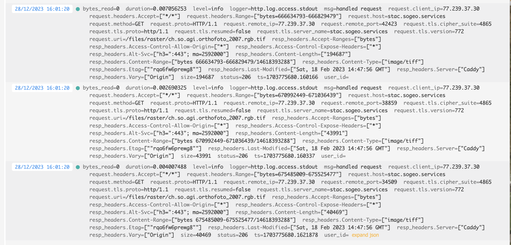

---
= HTTP-Statuscode 206 - Let's get started
Stefan Ziegler
2023-12-29
:thoth-type: post
:thoth-status: published
:thoth-tags: Statuscode, status, http, cloud, cloud native, flatgeobuf, geoparquet, parquet
:idprefix:
---
Des GIS-Menschen liebster HTTP-Statuscode sollte 206 sein. Warum? 206 heisst Partial Content und bedeutet, dass der angeforderte Teil erfolgreich übertragen wurde. D.h. es wird nicht die komplette Ressource angefordert, sondern nur Teile davon. Der Client teilt dem Server den gewünschten Teil mittels Content-Range-Header mit. Im Geo-Bereich kann das interessant werden, um mit Daten zu arbeiten ohne sie vollständig (z.B. die 50GB grosse Rasterdatei) herunterladen zu müssen. Die Daten müssen jedoch gewisse Bedingungen erfüllen, damit die 206-Magie auch greifen kann. Sie müssen also &laquo;cloud native&raquo; oder &laquo;cloud optimized&raquo; sein.

Als erstes ist mir vor ein 1-2 Jahren das https://www.cogeo.org/[Cloud Optimized GeoTIFF] begegnet. Damals ein wenig rumgespielt und wieder sein gelassen. Wie wahrscheinlich andere auch halten wir unsere Rasterdaten (Orthofotos, LiDAR-Derivate) in einzelnen Kacheln vor. Dazu eine VRT-Datei und für kleinere Massstäbe eine einzelne Übersichtsdatei. Das Handling ist immer ein wenig mühsam: Es sind teilweise mehrere tausend Dateien und man braucht zwingend die Übersichtsdatei für die kleineren Massstäbe. Ich denke, dass man bereits vor dem Cloud Optimized GeoTIFF einfach eine einzige grosse BigTIFF-Datei hätte herstellen können. Damit wäre zumindest unser Handling-Problem kleiner geworden. Andere Benefits hätten wir nicht gehabt. Insbesondere möchten unsere Kunden nicht wirklich 50GB runterladen, wenn sie bloss an einem Ausschnitt interessiert sind. 

Weil das Cloud Optimized GeoTIFF aber wirklich ziemlich genial ist, habe ich nochmals einen Anlauf unternommen und aus unseren tausenden Rasterdaten mit https://gdal.org[_GDAL_] jeweils ein einzelnes GeoTIFF erzeugt. Seit geraumer Zeit gibt es sogar ein spezielles https://gdal.org/drivers/raster/cog.html[`COG`-Profil]. Damit ist die Herstellung kinderleicht. Es werden sogar die internen Overviews erstellt (falls gewünscht). Die resultierenden GeoTIFFs habe ich auf einen Hetzner-Server geschmissen: https://stac.sogeo.services/files/raster/[https://stac.sogeo.services/files/raster/] und zugleich als https://radiantearth.github.io/stac-browser/#/external/stac.sogeo.services/catalog.json?.language=en[STAC-Katalog exponiert].

In QGIS kann man seit längerem GeoTIFFs auch mittels URL laden. Zum Ausprobieren lade ich so z.B das 13GB grosse Orthofoto https://stac.sogeo.services/files/raster/ch.so.agi.orthofoto_2007.rgb.tif[ch.so.agi.orthofoto_2007.rgb.tif] in QGIS. Die Performance ist genial und insbesondere in einem Bereich, in dem bereits relativ viele einzelne Kacheln geladen werden müssen, schneller als der WMS (der immer noch das VRT mit den vielen einzelnen TIFFs verwendet). Mit einer schnellen Internetverbindung beinahe so schnell als würde die Datei lokal vorliegen. 

Was passiert im Hintergrund? Dazu schaue ich mir die Logdatei des Webservers an:

Man sieht sehr schön den Statuscode (= 206), den Content-Range-Header und die ausgelieferte Grösse der Antwort. Es ist natürlich auch relativ performant, weil die Orthofotos ordentlich komprimiert sind. Wenn man &laquo;richtige&raquo; Rasterdaten (z.B. https://stac.sogeo.services/files/raster/ch.bl.agi.lidar_2018.dtm_slope.tif[ch.bl.agi.lidar_2018.dtm_slope.tif]) verwendet, wird die Menge der herunterzuladenden Daten bei einer Teilanfrage grösser, weil man die Ausgangsdaten nicht gleich stark komprimieren kann wie das Orthofoto. 

Ein wenig störend ist das erstmalige Laden der Datei. Das scheint lange zu dauern. In der Webserver-Logdatei sieht man viele 404er. QGIS (GDAL?) sucht nach verschiedenen Hilfs-/Metadateien (*.aux.xml etc.), die es nicht gibt. Bei mir sind das insgesamt 75 Requests ins Leere. Lokal spielt das weniger eine Rolle. Aber wenn 75 (ich kanns immer noch nicht ganz glauben) HTTP-GET-Requests gemacht werden müssen...
 
Wie sieht es mit Vektordaten aus? Eigentlich ziemlich ähnlich. Es gibt verschiedene Formate, die von sich behaupten (oder andere behaupten es) &laquo;cloude native&raquo; zu sein. Siehe Übersicht unter https://guide.cloudnativegeo.org/[cloudnativegeo.org]. Mit `ogr2ogr` habe ich unsere https://data.geo.so.ch[frei verfügbaren Vektordaten] nach FlatGeobuf und GeoParquet umgewandelt und ebenfalls auf den https://stac.sogeo.services/files[Hetzner-Server] kopiert und als https://radiantearth.github.io/stac-browser/#/external/stac.sogeo.services/catalog.json?.language=en[STAC-Katalog] exponiert. Bei einigen, wenigen Umwandlungen aus der GeoPackage-Datei kam es zu Fehlern. Stand heute ist mir der Grund noch nicht klar. Analog zu Rasterdaten können in QGIS auch Vektordaten mittels URL geladen werden. In der Webserver-Logdatei erscheinen wieder die 206-Statuscodes. FlatGeobuf funktioniert bei mir im Gegensatz zu GeoParquet wunderbar. GeoParquet wird in QGIS unter macOS noch nicht unterstützt, unter Windows ist mir damit QGIS abgestürzt.

Nun muss man aber auf den grundlegenden Unterschied zu den Rasterdaten aufmerksam machen, der bei kleinen Dateigrössen und schneller Internetverbindung zuerst gar nicht auffällt. Im Gegensatz zum Cloud Optimized GeoTIFF haben weder FlatGeobuf noch GeoParquet Overviews. Das bedeutet, dass ich je nach Zoomstufe relativ viele Daten - sprich irgendeinmal alle - herunterladen muss. Abhilfe schafft nur ein Format, dass auch Overviews unterstützt, z.B. https://github.com/protomaps/PMTiles[PMTiles]. Wobei mir nicht klar ist, ob das auch wieder zu verschnittenen Flächengeometrien (weil &laquo;Tile&raquo;) führt und wie man damit gut umgehen soll. Ich meine, wer will verschnittene Grundstücke?

Bei &laquo;anständigen&raquo; Zoomlevels ist die Performance von FlatGeobuf sehr gut. Insbesondere im Vergleich zu einer GeoPackage-Datei, die man ebenfalls als HTTP-Ressource in QGIS anzapfen kann. Zum Ausprobieren habe ich im https://stac.sogeo.services/files/test/[Test-Ordner] sowohl die AV-Bodenbedeckung wie auch die Grundnutzung der Nutzungsplanung in verschiedenen Formaten abgelegt.

Was nun? Im Prinzip kann der WMS für Rasterdaten einpacken. Wobei es vielleicht doch nicht ganz so einfach ist. Es würde zwar zu einer Vereinfachung des technischen Systems führen (kein Server mehr, nur Webspace), aber vielleicht will man die Rasterdaten mit einem Defaultstyle anbieten, oder einen Layer (z.B. Landeskarte) aus verschiedenen einzelnen Layern? Und für den Endbenutzer ist es wohl einfacher (wenn es bloss um die Darstellung geht) alles an einem Ort (also dem WMS) abzuholen. Aber als Ergänzung muss man es allemal anbieten.

Der WFS als dumber Dateidownload hat ausgedient. Ich sehe hier keine Vorteile mehr zur Variante FlatGeobuf/GeoParquet mit STAC (und einfacher und brauchbarer Integration im  QGIS Data Source Manager). Wenn ich die gesamte Bodenbedeckung via WFS herunterlade, klemmt es garantiert irgendwo. Sei es die Last beim WFS selber oder dann irgendwo in QGIS. Als Kunde weiss ich ja nicht einmal, ob der WFS-Server alle angeforderten Features ausgeliefert hat oder bloss die serverseitig eingestellte, maximale Anzahl. Bissle broken by design. Darum lieber FlatGeobuf o.ä. mit STAC.

Interessanter wird es bei gefilterten Requests, also z.B beim klassischen Nadelstich: Welche Grundnutzung gilt an der Koordinate X/Y? Wäre natürlich genial, wenn man auch hier auf einen Featureservice/WFS verzichten könnte und man bloss ein paar Parquet-Files bereitstellen müsste. Der Client könnte mit https://duckdb.org/[DuckDB] und SQL die Abfragen machen. Ob und wie das gehen könnte, gibt es in einem weiteren Blogpost zu lesen.