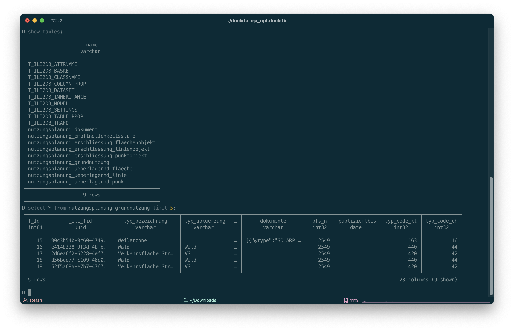

---
= INTERLIS leicht gemacht #40 - Let there be ili2duckdb
Stefan Ziegler
2024-01-15
:thoth-type: post
:thoth-status: published
:thoth-tags: INTERLIS,DuckDB,Java,ili2db,ili2duckdb
:idprefix:
---
Gleich ein zweifaches Jubiläum: 40. INTERLIS-Blogpost und https://blog.sogeo.services/blog/2014/01/03/smoothe-hoehenkurven.html[10 Jahre Blogging] (Neudeutsch: Content Creation). Und ja, immer noch mit https://blog.sogeo.services/feed.xml[RSS-Feed].

Ich https://blog.sogeo.services/blog/2023/12/30/statuscode-206-duckdbundparquet.html[mag] https://duckdb.org/[DuckDB]. Und weil es wirklich eine coole Sache ist und die Möglichkeiten, was man damit anstellen kann, beinahe grenzenlos sind, muss natürlich ili2duckdb her. Ganz generell lässt sich behaupten: Wo ein https://de.wikipedia.org/wiki/Java_Database_Connectivity[JDBC-Treiber], da ein ili2db-Flavor. https://github.com/claeis/ili2db[Ili2db] ist so aufgebaut, dass man relativ einfach eine neue Datenbankvariante hinzufügen kann. Voraussetzung ist eben das Vorhandensein eines https://duckdb.org/docs/api/java[JDBC-Treibers] und das Schreiben einiger Java-Klassen. In den Java-Klassen muss man vendor-spezifisches Zeugs regeln. Also z.B. wie die Datentypen der spezifischen Datenbank heissen: Ist es `BIGINT` oder `INT8`? Oder wie muss ein Datum formatiert sein, damit ich es mit einem Insert-Befehl importieren kann? Solche Geschichten halt. Da es bereits verschiedenste Flavor gibt, konnte ich viel spicken resp. vor allem verstehen, welche Klassen und Methoden welche Bedeutung haben.

Ein https://github.com/edigonzales/ili2db/commit/6c94c3853c64ac9db313902378a6fa340824e097[initialer Commit] habe ich gemacht. Die Arbeit war soweit ziemlich straight forward aber trotzdem lehrreich: Man lernt `ili2db`, DuckDB und die Fähigkeiten des JDBC-Treibers besser kennen. Im Commit fehlen unter anderem noch Tests. Ich habe `ili2duckdb` nur manuell, also mit eigenen XTF, getestet. Was sind meine Erkenntnisse, was ist der Stand?

**JDBC-Treiber:**
Es handelt sich um einen sogenannten Typ-2-Treiber. D.h. neben Java-Code braucht es eine zusätzliche Bibliothek, die jedoch &laquo;versteckt&raquo; in der Jar-Datei ist. Die Bibliothek ist in der Regel betriebssystem-spezifisch, was bedeutet, dass der JDBC-Treiber nur auf kompatiblen Betriebssytemen funktioniert. Sowohl als Programmierer wie auch als Anwendert merkt man das in den allermeisten Fällen gar nicht. Die DuckDB-Lib läuft auf Linux, macOS und Windows. Soweit alles kein Problem. Das gleiche gilt übrigens auch für `ili2gpkg`.

**JDBC-Test-Code:**
Damit man überhaupt versteht, was der JDBC-Treiber kann, lohnte es sich für mich eine eigene Java-Klasse zum Rumspielen zu haben, die nur Inserts und Selects macht. Die ganze ili2db-Magie gibt es da nicht und ich gewann Klarheit warum ein Fehler auftritt.

**Dateigrösse:**
Momentan dünken mich die resultierenden DuckDB-Dateien gross. Ein Testdatensatz als GeoPackage ist 220KB gross, die DuckDB-Variante 4.2MB. Ob ich noch was besser machen kann, oder das eher auf Seiten DuckDB zu suchen ist, weiss ich nicht. Sie schwärmen jedenfalls von ihrer https://duckdb.org/2022/10/28/lightweight-compression.html[Compression]. Was verlinkter Beitrag nicht berücksichtigt, sind die Geometrien. Soweit für mich nachvollziehbar, sind die Geometrien in DuckDB nicht komprimiert. Vielleicht liegt es alleine daran.

**init.sql:**
Die spatial skills von DuckDB sind in eine https://duckdb.org/docs/extensions/spatial[Extension] ausgelagert. Diese Extension muss man installieren und laden. Das Installieren muss nur einmalig gemacht werden und `ili2db` bietet dazu Möglichkeiten. Beim Laden wirds komplizierter. Dies muss - soweit ich es verstehe - immer gemacht werden, wenn eine neue DB-Verbindung gemacht wird. Nun ist es so, dass `ili2db` nicht alles mit der gleichen Verbindung macht. D.h. nach dem Installieren der Extension wird die DB-Verbindung geschlossen, das Laden bringt hier nichts (mehr). Es muss also ein Weg gefunden werden, wie beim Anlegen der Tabellen oder beim Importieren der Daten die Extension mit der gleichen Verbindung, die auch für die nachfolgenden SQL-Befehle verwendet wird, vorgängig geladen werden kann. Mir ist nur die Variante mit der `--preScript`-Option eingefallen. Aber vielleicht hat `ili2db` noch irgendwo was anderes, wo man sich einhaken kann.

**ST_GeomFromWKB:**
DuckDB kennt die Funktion `ST_GeomFromWKB(BLOB)` und so dachte ich, dass man das identisch wie bei PostGIS machen kann: Ili2db parst das XTF und wandelt die Geometrie nach WKB um und übergibt die WKB-Geometrie anschliessend dem SQL-Insert-Statement. Nur hat das - warum auch immer - nicht funktioniert. Abhilfe schafft die Verwendung von `ST_GeomFromHEXWKB()` und die vorgängige Umwandlung in einen HEX-String.

**ADD CONSTRAINT:**
Ili2db erzeugt zuerst die Tabelle und fügt anschliessend mit `ADD CONSTRAINT`-Befehlen die Constraints hinzu. Da DuckDB diese Synax nicht kennt, sondern man Constraints nur beim Anlegen der Tabellen erzeugen kann, gibt es momentan keine Constraints.

**Geometrie-Support:**
Ja, der Geometrie-Support in DuckDB ist schon nicht ganz auf PostGIS-Niveau. So gehen M- und Z-Werte nicht und SRID werden auch keine unterstützt. Compound Curves (Kreisbogen) habe ich schon gar nicht probiert.

Das Resultat kann sich sehen lassen:

More to come https://www.youtube.com/watch?v=8BX70FI7hfI[...]

