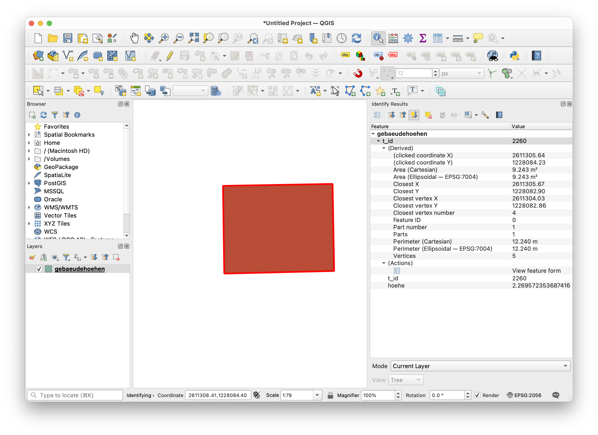

---
= DuckDB - Lizenzgebühren zu hoch? Try DuckDB!
Stefan Ziegler
2024-01-28
:thoth-type: post
:thoth-status: published
:thoth-tags: DuckDB, PostGIS, PostgreSQL, SQL, Raster
:idprefix:
---
Aus aktuellem Anlass zwei anschauliche Beispiele warum https://duckdb.org/[DuckDB] eine tolle Sache ist. Im Grundsatz geht es um sogenannte &laquo;federated queries&raquo;, also die Fähigkeit, Daten von mehreren, verteilten oder heterogenen Datenquellen abzufragen / zu analysieren / umzubauen und so zu tun, als wäre es eine einzige einheitliche Quelle.

**Beispiel 1**

Ich möchte an einer bestimmten Koordinate den Zonentyp kennen, die Gemeindenummer und den Steuerfuss der Gemeinde. Gut, das Beispiel ist brutal gefaked, aber egal. Gehen wir davon aus, dass die Nutzungsplanung in der DuckDB vorliegt:

[source,xml,linenums]
----
java -jar ili2duckdb-5.1.1-SNAPSHOT.jar --dbfile arp_npl_2549.duckdb \ 
--disableValidation --defaultSrsCode 2056 --nameByTopic \
--models SO_ARP_Nutzungsplanung_Publikation_20201005 \
--preScript init.sql --doSchemaImport \
--import ilidata:2549.ch.so.arp.nutzungsplanung.kommunal
----

Gentle Reminder, dass die ilidata-Unterstützung in allen ili2db-Varianten ein https://blog.sogeo.services/blog/2023/05/10/interlis-leicht-gemacht-number-35.html[geniales Feature] ist.

Die Gemeindegrenzen sind in einer PostgreSQL-Datenbank gespeichert. Die Steuerfüsse liegen in einer Parquet-Datei auf S3 vor. 

Die PostgreSQL-Datenbank müssen wir in der DuckDB registrieren:

[source,sql,linenums]
----
ATTACH 'dbname=pub user=ddluser password=ddluser host=127.0.0.1 port=54322' AS pg (TYPE postgres);
----

Und dann geht es bereits los mit goold old SQL:

[source,sql,linenums]
----
SELECT 
    npl.typ_bezeichnung,
    npl.bfs_nr,
    gem.gemeindename,
    taxes.steuerfuss_in_prozent
FROM 
    nutzungsplanung_grundnutzung AS npl
    LEFT JOIN pg.agi_hoheitsgrenzen.hoheitsgrenzen_gemeindegrenze AS gem 
    ON npl.bfs_nr = gem.bfs_gemeindenummer
    LEFT JOIN 'https://s3.myregion.amazonaws.com/xxxxxxxxx/ch.so.agem.steuerfuesse.natuerliche_personen.parquet' AS taxes
    ON gem.gemeindename = taxes.gemeinde
WHERE 
    ST_Intersects(ST_Point(2611477,1233990), npl.geometrie)
    AND 
    taxes.jahr = 2022 
;
----

Man kann das Resultat auch als DuckDB-Tabelle persistieren oder eine View erstellen: `CREATE VIEW v1 AS ...`. Das Resultat als Excel-Datei exportieren, ist auch nur ein `COPY`-Befehl:

[source,sql,linenums]
----
COPY (SELECT * FROM v1) TO 'output.xlsx' WITH (FORMAT GDAL, DRIVER 'xlsx');
----

**Beispiel 2**

Dieses Beispiel ist tatsächlich ein realer Usecase. Jedoch kann ich ihn in der Realität noch nicht bis zum bitteren Ende durchspielen. Das bittere Ende ist das Exportformat: http://giswiki.org/wiki/Generate[Arc GENERATE]. WTF!? Wahrscheinlich von Jack Dangermond persönlich in Assembler geschrieben. Ein Müsterchen gefällig:

[source,sql,linenums]
----
OBJECTID	FLAECHE	DK_HABS	DK_GEBTYP	DK_GEBNUTZDK_EMPFST	DK_OBERFL	BESCHAEFT	OIDDS	HOEHE
478362209		1	1		501			7.10
2611228.895	1227828.112	7.10
2611230.401	1227836.795	7.10
2611242.775	1227834.644	7.10
2611240.585	1227822.074	7.10
2611240.642	1227822.064	7.10
2611240.619	1227821.936	7.10
2611232.357	1227823.369	7.10
2611233.055	1227827.390	7.10
2611228.895	1227828.112	7.10
END
----

Scheint mir aber sehr simpel zu sein. Mir fehlt nur der passende https://github.com/claeis/iox-wkf[IoxWriter], den ich dann in https://gretl.app[GRETL] ansteuern kann und Daten via SQL exportieren kann. Womit wir wieder bei SQL angekommen sind. PostGIS kann auch Raster und kann auch Raster mit cloud optimized geotiff. Das hat den Vorteil, dass die Datenbank nicht ins Unermessliche wächst. Für meinen vorliegenden Fall benötige ich das Geotiff mit den Gebäudehöhen (abgleitet aus LiDAR-Daten). Das https://stac.sogeo.services/files/raster/ch.so.agi.lidar_2019.ndsm_buildings.tif[GeoTIFF] ist 2.1GB gross. Wenn ich die Daten aber nicht komplett in die DB importiere, ist die &laquo;Raster-&raquo;Tabelle bloss 67MB gross. 

Was ich benötige ist der Grundriss eines Gebäude aus der amtlichen Vermessung und die durchschnittliche Gebäudehöhe. Also ein Verschnitt zwischen Vektor und Raster. In PostgreSQL sieht das z.B. so aus:

[source,sql,linenums]
----
WITH buildings AS 
(
    SELECT 
        t_id,
        geometrie AS geometrie
    FROM 
        agi_dm01avsoch24.bodenbedeckung_boflaeche 
    WHERE 
        art = 'Gebaeude'
    AND     
        ST_Intersects(ST_SetSRID(ST_MakePoint(2611306, 1228084), 2056), geometrie)
)
,
clipped_tiles AS 
(
  SELECT 
    ST_Clip(elev.rast, buildings.geometrie) AS rast, 
    elev.rid,
    buildings.t_id
  FROM 
    agi_lidar_2019_ndsm.buildings AS elev
  JOIN 
    buildings
    ON ST_Intersects(buildings.geometrie, ST_ConvexHull(elev.rast))
)
,
stats AS 
(
    SELECT 
        t_id,
        (ST_SummaryStatsAgg(rast, 1, true)).*
    FROM 
        clipped_tiles
    GROUP BY
        t_id
)
SELECT 
    buildings.t_id,
    buildings.geometrie,
    stats.mean AS hoehe
FROM 
    buildings
    LEFT JOIN stats 
    ON buildings.t_id = stats.t_id
;
----

Und mit DuckDB? DuckDB kann auch Queries direkt in der attachten PostgreSQL-Datenbank ausführen, z.B.

[source,sql,linenums]
----
SELECT * FROM postgres_query('pg', 'SELECT postgis_full_version()');
----

Anstelle `SELECT postgis_full_version()` muss ich meine CTE von oben ausführen. Ich erstelle ein View und exportiere sie in eine Shapedatei:

[source,sql,linenums]
----
CREATE VIEW v2 AS
SELECT 
    * 
FROM 
    postgres_query('pg', '...')
;
----

[source,sql,linenums]
----
COPY (SELECT * EXCLUDE geometrie, ST_GeomFromWkb(geometrie) FROM v2) TO 'gebaeudehoehen.shp' WITH (FORMAT GDAL, DRIVER 'ESRI Shapefile', SRS 'EPSG:2056');
----

Beweis in QGIS:

Und das Beste: DuckDB ist https://github.com/duckdb/duckdb[Open Source] und man bezahlt keine Lizenzgebühren.

