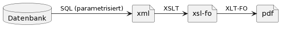
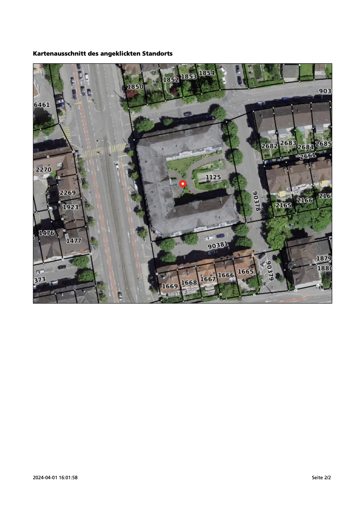
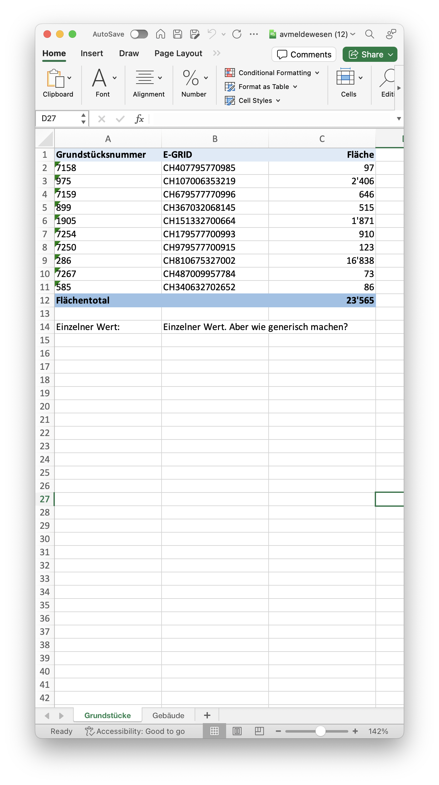
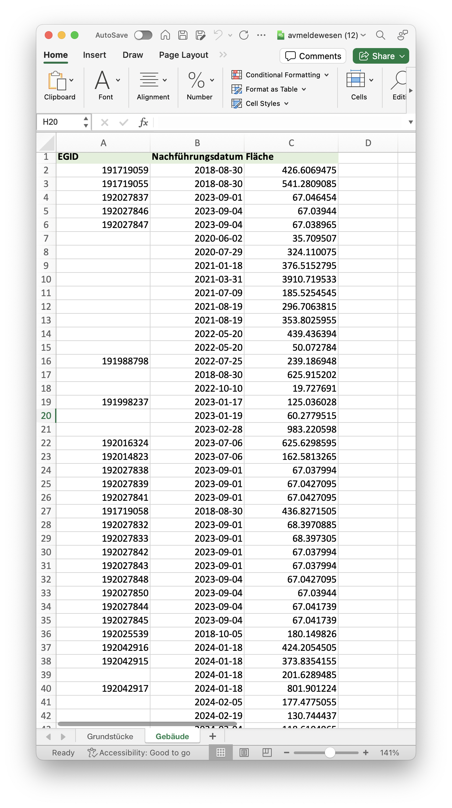

---
= Oops! I accidentally made a report server
Stefan Ziegler
2024-04-02
:thoth-type: post
:thoth-status: published
:thoth-tags: XML, XSL-FO, XSLT, PostgreSQL, SQL, XLS, Excel, XLSX, FOP, Saxon
:idprefix:
---
Für das Erstellen von sogenannten Objektblättern verwenden wir JasperReports. Unter Objektblatt verstehen wir vor allem ein PDF mit Informationen zu einem https://geo.so.ch/api/v1/document/kantonsgrenzsteine?feature=22460&x=2639079.084623869&y=1256177.19874576&crs=EPSG%3A2056[einzelnen Objekt] oder zu einem Standort. Standardmässig werden die Feature-ID, die Koordinaten und das Koordinatensystem dem Report-Server übermittelt. Es können aber beliebige Parameter dem Jasper-Report übermittelt werden. Diese dienen meistens der Filterung via SQL-Query. Immer häufiger kommt vor, dass neben Objektblättern https://geo.so.ch/api/v1/document/arp_uebersicht_massnahmen_agglomerationsprogramm.xlsx?feature=382121&x=2606750.801906189&y=1228100.4484159572&crs=EPSG%3A2056[(Excel-)Listen] gewünscht werden.

Warum gefällt uns die jetzige Situation nicht? 

Der eigentliche Server, den wir einsetzen, ist nicht JasperReports-Server, sondern wurde im Rahmen des &laquo;neuen&raquo; Web GIS Clients auf Basis der JasperReports-Bibliothek und https://spring.io/projects/spring-boot[Spring Boot] durch den Lieferanten 2017/2018 selber entwickelt. Ein Update hat der Server nie erfahren. Sowohl bei der JasperReports-Bibliothek als auch bei Spring Boot (Version 1.5...) nicht. Funktional gibt es ebenfalls einige Unschönheiten. So sind maximal Verbindungen zu fünf verschiedenen Datenbanken möglich und dann war da noch was mit Jasper-Subreports, was nicht funktionierte. Richtig Spass macht die Arbeit mit JasperReports auch nicht. Das Studio ist so ein GUI-Moloch und nicht intuitiv. Zwar beherrscht JasperReports viele Ausgabeformate (PDF, DOCX, XLSX, HTML) aber richtig brauchbar dünkt mich nur die PDF-Augabe. Bereits die XLSX-Ausgabe ist ein Gefrickel. 

So richtig zufrieden waren wir also nie. Ab und wann schaut man über den Gartenzaun und entdeckt, dass die kantonale Informatik auch einen Report-Server im Angebot haben: https://www.dox42.com/[_dox42_]. Für ein Thema setzen wir nun auf dieses Pferd: Der Klick in die Karte löst eine SQL-Query aus und die Resultate werden mittels https://dox42.so.ch/dox42restservice.ashx?Operation=GenerateDocument&ReturnAction.Format=pdf&DocTemplate=c%3a%5cdox42Server%5ctemplates%5cAFU%5cEWS_moeglich.docx&InputParam.p_koordinate_x=2607907&InputParam.p_koordinate_y=1228277&InputParam.p_grundstueck=1125%20(Solothurn)&InputParam.p_gemeinde=Solothurn&InputParam.p_tiefe=100&InputParam.p_tiefe_gruende=Instabiler_UG&InputParam.p_gw=true[GET-Request] an den dox42-Server geschickt. Das Gute daran ist, dass wir es nicht selber betreiben müssen und dass man die Report-Templates direkt in Word oder Excel machen kann. Ein heikler Punkt sind halt die Organisationsgrenzen. Für uns ist es sehr wichtig, dass wir durcharbeiten können. Wir können es uns nicht leisten, dass der Sachbearbeiter, der das Thema / das Projekt umsetzt, ein Ticket machen muss, um irgendein Detail am Report zu ändern und/oder um diesen in die Produktion zu deployen. Ein No-Go.

Mit diesen Rahmenbedingungen haben wir uns entschlossen ein Projekt zur Ablösung oder Weiterentwicklung unseres Report-Servers zu machen. An einer Brainstorming-Sitzung kam plötzlich die Frage auf, wie der https://geo.so.ch/api/oereb/extract/pdf/?EGRID=CH857632820629[ÖREB-Katasterauszug] gemacht wird und warum man das nicht für alle Reports so machen will/kann. Unser ÖREB-Katasterauszug wird mit https://blog.sogeo.services/blog/2018/12/31/xslt-xslfo-2-pdf4oereb.html[XSL-FO] aus dem ÖREB-XML-Auszug hergestellt. Und das macht er tatsächlich https://monitoring.oereb.services/detail.xhtml?identifier=SO&probe=extract[gut] und stabil. Rein funktional betrachtet, dürfte damit wohl fast jede Anforderung an ein Objektblatt abgedeckt sein (nicht die Excelliste). Als Input benötigt man jedoch eine XML-Datei, deren Schema beim ÖREB-Kataster spezifiert ist. Diesen Weg (ein XML-Schema definieren), möchte man kaum  für jedes Thema beschreiten, weil aufwändig und schlichtweg nicht nötig. Die XML-Datei wäre ja nur dazu da, die PDF-Datei herzustellen und es bliebe alles in der gleichen Organisation und niemand anderes muss sich auf die Struktur der XML-Datei verlassen können. Es reduziert sich nun auf die Frage: Kann man eine XML-Datei praktikabel herstellen? Ja. Weil die Informationen zum Objektblatt sowieso alle in einer Datenbank vorliegen, kann mir die https://www.postgresql.org/docs/16/functions-xml.html[Datenbank] auch das XML herstellen und ich brauche dazu https://blog.jooq.org/stop-mapping-stuff-in-your-middleware-use-sqls-xml-or-json-operators-instead/[keine Middleware]. 

Der Deal ist der folgende: Es gibt pro Objektblatt eine https://github.com/edigonzales/dox43/blob/3a93a81/src/main/resources/grundstuecksbeschrieb/grundstuecksbeschrieb.ini[ini-Datei]. In dieser steht momentan nur die Datenbank-ID, damit die Anwendung weiss, an welche Datenbank sie die SQL-Query aus der https://github.com/edigonzales/dox43/blob/3a93a81/src/main/resources/grundstuecksbeschrieb/grundstuecksbeschrieb.sql[zweiten Datei] schicken muss. Die Query kann von aussen mit beliebigen Parametern (aus GET- und/oder POST-Request) alimentiert werden. Die Query liefert einen String zurück, der gültiges XML ist. Wichtig dabei ist, dass nur genau ein einziger Record mit einer Spalte zurückgeliefert wird. Diese temporäre XML-Datei wird dann mittels der XSL-Transformation aus der https://github.com/edigonzales/dox43/blob/3a93a81/src/main/resources/grundstuecksbeschrieb/grundstuecksbeschrieb.xsl[dritten Datei] zu einem XSL-FO-Dokument und dieses zu einem PDF gemacht. Fertig. Zum vielleicht besseren Verständnis das Ablaufschema visualisiert:

Der Aufruf bleibt im Prinzip gleich wie bei der bestehenden Lösung: `http://localhost:8080/reports/grundstuecksbeschrieb?feature=22460&x=2639079&y=1256177&format=pdf`.

Das Tolle an dieser Lösung dünkt mich, dass man die Schritte sehr bequem einzeln entwickeln kann. So kann ich mir zuerst ein Dummy-XML händisch machen und damit die XSL-Transformation entwickeln. Oder ich sehe es als Zielstruktur meiner SQL-Query und kümmere mich zuerst um diese. GUI braucht es dazu auch keines. Ebenfalls habe ich das Gefühl, dass die Lösung transparenter ist. Bei den JasperReports passiert das SQL irgendwo unübersichtlich in den Reports (=Debugging-Hölle). Bei meiner Lösung sammle ich die Daten zuerst und übergebe sie dem Arbeitsschritt, der die Daten rendern soll.

Die Resultate können sich sehen lassen. Als Beispiel habe ich das Erdwärmesondestandortblatt umgesetzt. Die XML-Datei, die ich mittels SQL-Query herstellen muss, ist simpel:

[source,xml,linenums]
----
<?xml version="1.0" standalone="yes"?>
<ewsstandort>
  <gbnr>3317</gbnr>
  <grundbuch>Solothurn</grundbuch>
  <gemeinde>Solothurn</gemeinde>
  <easting>2605775</easting>
  <northing>1228417</northing>
  <tiefe>100</tiefe>
  <tiefe_grund>Instabiler_UG</tiefe_grund>
  <grundwasser>true</grundwasser>
  <getmap>https://geo.so.ch/ows/somap?SERVICE=WMS&amp;VERSION=1.3.0&amp;REQUEST=GetMap&amp;FORMAT=image%2Fpng&amp;TRANSPARENT=false&amp;LAYERS=ch.so.agi.hintergrundkarte_ortho,ch.so.agi.av.grundstuecke&amp;STYLES=&amp;SRS=EPSG%3A2056&amp;CRS=EPSG%3A2056&amp;TILED=false&amp;OPACITIES=255&amp;DPI=96&amp;WIDTH=600&amp;HEIGHT=480&amp;BBOX=2607821.625%2C1228212.5%2C2607980.375%2C1228339.5&amp;MARKER=X-%3E2607901%7CY-%3E1228276</getmap>
</ewsstandort>
----

Apache FOP macht übrigens aus dem GetMap-Request tatsächlich ein Bild im PDF:

Also: PDF ist gegessen. Was ist jedoch mit unseren Excellisten? Da verfolge ich in Teilen den gleichen Ansatz. Mit dem Unterschied, dass ich hier mit einer Excel-Template-Datei arbeiten muss. Mit https://jxls.sourceforge.net/[Jxls] gibt es eine gute Excel-Templating-Engine. D.h. man schreibt in der Excel-Datei, die später als Template dienen soll, gewisse Anweisungen in die Zellen und als Notiz zu Zellen. Vom Wesen her nicht ganz unterschiedlich zu z.B. Jinja2-Templates. Im Gegensatz zum Objektblatt interessiert mich beim Listenreport in der Regel mehr als bloss ein Objekt. Entsprechend darf die https://github.com/edigonzales/dox43/blob/3a93a81/src/main/resources/avmeldewesen/avmeldewesen-grundstuecke.sql[SQL-Query] auch mehr als einen Record und eine Spalte zurückliefern. Es werden mehrere SQL-Queries (eine pro Datei) für ein Listenreport unterstützt, damit z.B. mehrere Sheets abgefüllt werden können:

Ob man mit Jxls elaborierte Excellisten (Grafiken o.ä.) erstellen kann, weiss ich anhand meines ersten Gehversuchs noch nicht. Unser Projekt wird zeigen müssen, ob unsere Anforderungen mit diesen beiden Ansätzen plusminus erfüllt werden können.

