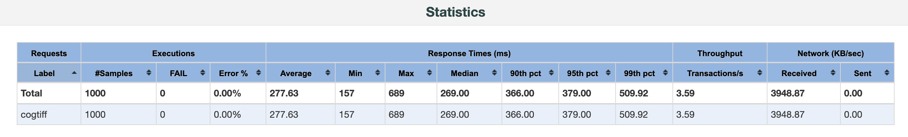
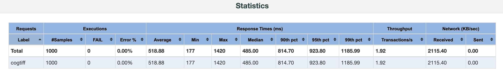
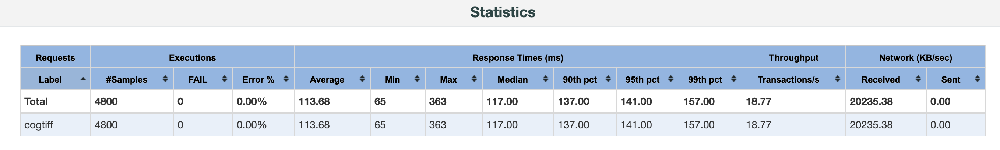
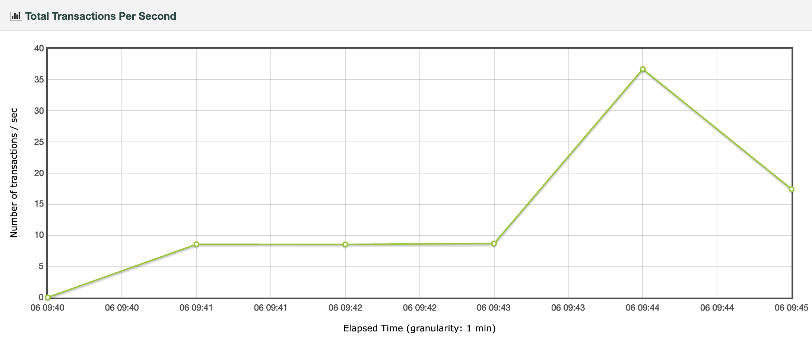
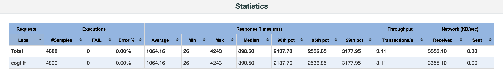
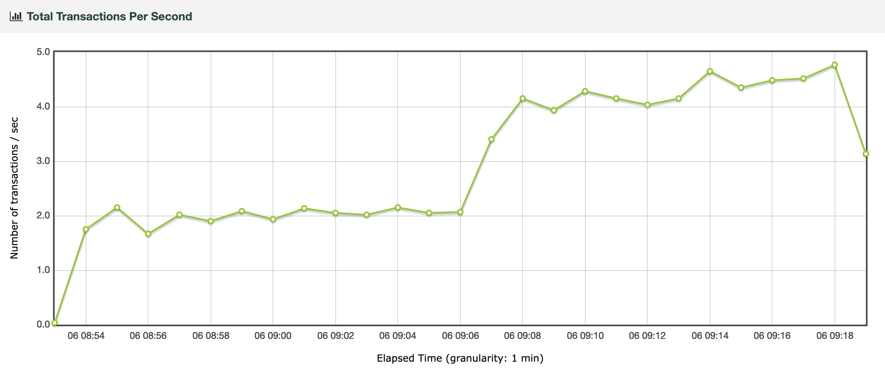

---
= HTTP-Statuscode 206 - Cloud Optimized GeoTIFF Benchmark
Stefan Ziegler
2024-05-13
:thoth-type: post
:thoth-status: published
:thoth-tags: Statuscode, status, http, cloud, serverless, cogtiff, geotiff
:idprefix:
---
&laquo;Mach' Cloud Optimized GeoTIFF!&raquo; sagen sie. &laquo;Dann brauchst du keinen WMS mehr!&raquo; behaupten sie. Gesagt, https://blog.sogeo.services/blog/2023/12/29/statuscode-206-letsgetstarted.html[getan]. &laquo;Das macht alles viel einfacher!&raquo; beteuern sie. Zumindest letzteres ist leider nur die halbe Wahrheit, wenn man das Ganze auch in einer kantonalen Infrastruktur aufbauen will. Aber natürlich bleibe ich trotzdem grosser Freund von diesem cloud native / cloud optimizeten Geozeugs. 

Wo hakt es nun?

Zum Testen habe ich auf einem Hetzner-Cloud-Server unsere Rasterdaten als Cloud Optimized GeoTIFF deployed und mittels https://caddyserver.com/[Caddy] https://stac.sogeo.services/files/raster/[öffentlich verfügbar] gemacht. In QGIS bisschen rumgespielt und mit der Performance absolut zufrieden gewesen. Ok, dann lass' es uns in der kantonalen Infrastruktur umsetzen. Wir haben einen &laquo;dummen&raquo; Webserver, der die Vektor- und Rasterdaten ähnlich wie bei meinem Hetzner-Test https://files.geo.so.ch/[öffentlich zugänglich] macht. Ich freute mich schon die E-Mail mit den Neuigkeiten rauszuhauen und mit bestem Digitaliserungsboomer-Marketingsprech über unsere Cloud-Errungenschaften und so zu schreiben. Gott sei Dank noch vorher mit dem Orthofoto (swissimage 2021 kantonale Abdeckung, circa 30GB) getestet und mich gefragt warum das interessanterweise vor allem beim schnellen Zoomen sehr käsig ist. Es ist signifikant langsamer als die Hetzner-Variante, die erst noch weiter entfernt ist. Der Super-GAU ist jedoch, dass QGIS manchmal die Rasterdatei gar nicht als solche erkennt und mit einer Fehlermeldung quittiert. Ob beide Probleme irgendwie zusammenhängen wissen wir, wie so vieles, noch nicht.

Letzteres scheint einen Zusammenhang zu haben mit den https://trac.osgeo.org/gdal/wiki/CloudOptimizedGeoTIFF#HowtoreaditwithGDAL[GDAL-Umgebungsvariablen], die verhindern, dass unnötige HTTP-Requests gemacht werden. Und/oder mit dem Umstand, dass unser Webserver keinen HEAD-Request unterstützt. Who knows.

Ziemlich nervig ist ebenfalls die schlechtere Performance gegenüber der Hetzner-Variante. Das kann doch fast nicht sein, müsste man meinen. Um es aber der zentralen IT, die ausnahmweise diesen File-Webserver für uns betreibt, schwarz auf weiss darlegen zu können, muss ein sauberes Benchmarking her. Grundsätzlich natürlich sofort an https://jmeter.apache.org/[jMeter] gedacht. Wie simuliert man nun aber solche Range Requests? Ein Range Request ist bloss ein normaler HTTP-GET-Request mit einem `Range`-Header, der - nomen est omen - den gewünschten Byterange angibt:

[source,bash,linenums]
----
curl -v -X GET -H "Range: bytes=26201587777-26202626445" https://files.geo.so.ch/ch.swisstopo.swissimage_2021.rgb/aktuell/ch.swisstopo.swissimage_2021.rgb.tif
----

Ich habe mir mit Java und https://www.jbang.dev/[jBang] ein https://github.com/edigonzales/cogtiff_benchmark/blob/dda77de/sampler/cogtiff_request_sampler.java[Java-Skript] geschrieben, dass mir innerhalb der Grösse der Zieldatei einen Byterange zwischen 200KB und 2MB ausrechnet. Man müsste im Webserver-Logfile schauen, ob das circa der Realität entspricht. Diese Range Requests sind nicht mehr ganz so einfach zum Faken wie WMS-Requests mit Boundingbox und Pixel-Anzahl. Gehen wir aber davon aus, dass meine Ranges mehr oder weniger mit der Realität vergleichbar sind. Diese Byteranges werden in einer CSV-Datei gespeichert und können von jMeter als dynamischen Header-Wert verwendet werden.

Erster Versuch war von zu Hause aus, also mit langsamerer Internetverbindung. Ich habe hier nur mit einem Thread getestet. Mit dem Hetzner-Server erreiche ich durchschnittlich einen Throughput von 3.6 Requests pro Sekunde:

Mit der Inhouse-Variante erreiche ich nur lausige 1.9 Requests pro Sekunde:

Als Gegenprobe habe ich das Gleiche mit Objectstorage von Exoscale probiert. Dort erreiche ich sehr ähnliche Werte wie mit dem Hetzner-Rechner.

Und nun noch im Büro mit schnellerer Internetverbindung und mit mehreren Threads (1, 2, 4 und 8). Mit Hetzner erreiche ich durchschnittlich 18.8 Requests pro Sekunde mit einem Maximum von fast 40 Requests pro Sekunde bei 8 Threads:

Mit der Inhouse-Variante sieht es düster aus. Im Durchschnitt 3.1 Requests pro Sekunde und ein Maximum von knapp 5 Requests pro Sekunde. Mit einem Thread erreiche ich ziemlich exakt den gleichen Throughput wie von zu Hause aus:

Auch hier die Gegenprobe mit S3 von Exoscale mit sehr ähnlichen (leicht besseren) Resultaten als mit Hetzner.

Wo ist das Problem mit der Inhouse-Variante? Man weiss es nicht. Irgendwo im Netzwerk? WAF? Zu wenig Ressourcen dem Webserver zugewiesen? Zu langsames Filesystem? Frustrierend sind die vielen Meetings ohne Outcome. Es liegt ja auf dem Tisch, dass etwas faul ist im Staate Dänemark oder mindestens Solothurn und dass es offensichtlich mit dem 5 Euro-Rechner von Hetzner massiv schneller geht. Obwohl die Cloud Optimized GeoTIFF Sache sehr simpel erscheint und &laquo;eigentlich&raquo; auch ist, gibt es ein paar Stolpersteine auf dem Weg zur Glückseligkeit.