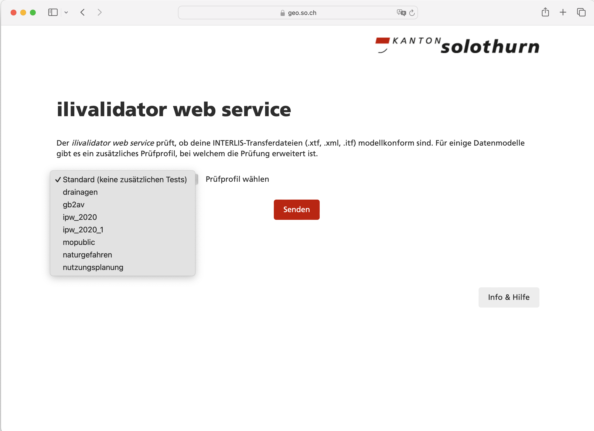
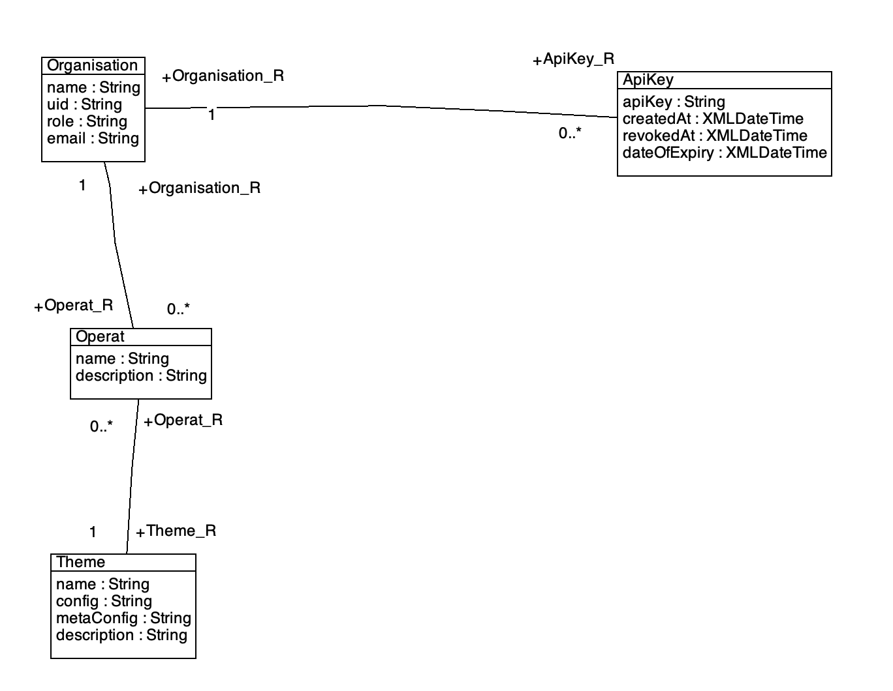
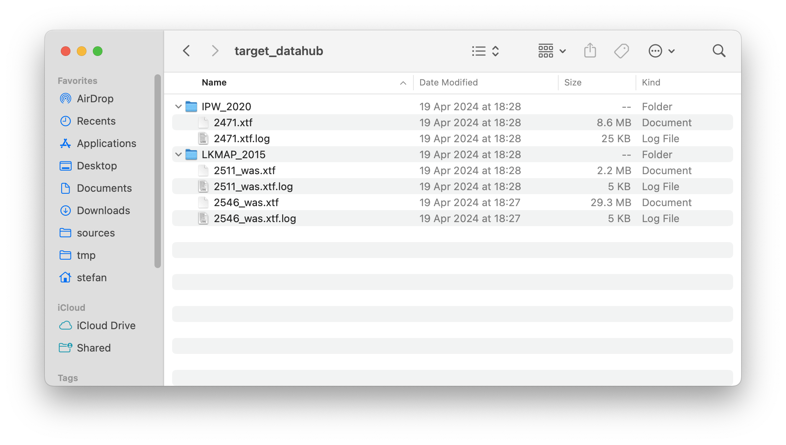
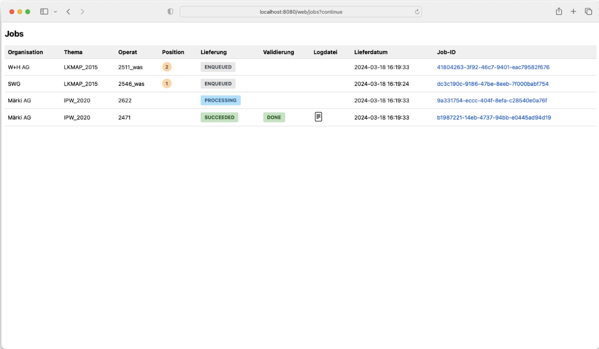

---
= INTERLIS leicht gemacht #41 - Hello Datahub
Stefan Ziegler
2024-05-29
:thoth-type: post
:thoth-status: published
:thoth-tags: INTERLIS,Java,ilivalidator,datahub,Spring Boot,JobRunr,Apache Cayenne
:idprefix:
---
Seit knapp https://blog.sogeo.services/blog/2016/11/09/interlis-leicht-gemacht-number-14.html[acht Jahren] bieten wir einen https://geo.so.ch/ilivalidator/[INTERLIS-Webservice] in einfacher Form an: Datei hochladen und gut ist. In seiner letzten Iteration wurden sogenannte Prüfprofile eingeführt. Der Benutzer soll/muss das entsprechende Prüfprofil in einer Comobox oder via Query-Parameter auswählen. 

Ein Prüfprofil ist letzten Endes nur eine `metaConfig`-Konfiguration, die für ein bestimmtes Thema die Konfigurationen der Software und der Prüfung steuert. Die `metaConfig`-Datei muss in diesem Fall nicht auf dem Server vorliegen, sondern es wird automatisch und selbständig in den INTERLIS-Data-Repositories (aka ilidata.xml) nach ihr gesucht (analog der Modelle). Diese Laufzeitabhängigkeit von anderen Repositories ist zwar nicht das Gelbe vom Ei aber weil wir die Konfigurationen an verschiedenen Stellen benötigen, gehen wir diesen Deal ein. Letzten Endes war es ein bewusster Entscheid. Vorteilhaft bei dieser Lösung dünkt mich, dass ein Anwender so die genau gleiche Validierung bei sich lokal durchführen kann, ohne die Daten zuerst hochladen zu müssen.

Das Bedürfnis, dass nach einer erfolgreichen Prüfung eine automatische Anlieferung der Daten erfolgt, hatten wir bis jetzt nicht. Einzig die Daten der amtlichen Vermessung werden mindestens wöchentlich an den Kanton geliefert. Hier setzen wir immer noch auf das Infogrips-Universum. Das Einpflegen neuer Daten in die Nutzungsplanung machen wir selber (ausser bei kompletten Ortsplanungsrevisionen) und Leitungskataster machen wir noch nicht. Andere Themen fallen nicht ins Gewicht. Mit der Einführung des neuen Datenmodelles in der amtlichen Vermessung ist jedoch der richtige Zeitpunkt gekommen, den Anlieferungsprozess der amtlichen Vermessung zu überdenken und wir sind zum Schluss gekommen, dass wir hier ebenfalls die &laquo;ilivalidator-Schiene&raquo; fahren wollen.

Die Anforderungen an den Prozess sind grob:

- &laquo;ftp put&raquo;- oder &laquo;curl -X POST&raquo;-Niveau für einfache Automatisierung auf Seiten Datenlieferant.
- Passwort muss durch Datenlieferant veränderbar sein.
- Beliebige Datenmodelle: Auch wenn wir zuerst nur den DMAV-Anlieferungsprozess implementieren werden, muss es für beliebige andere Modell funktionieren.
- Daten werden geprüft und in einem Verzeichnis abgelegt. Weitere Prozessierungsschritte sind (momentan) nicht Aufgabe des Datahubs.
- Übersicht Lieferstatus für Datenlieferanten und AGI (GUI und Rest-API)

Nach reiflicher Überlegung und einigen Diskussionen haben wir uns bei der Authentifizierung auf einen API-Key geeinigt. Dieser wird als Header mitgeschickt und wir können dadurch die Anlieferung mit einem simplen `curl`-Befehl umsetzen. Der API-Key kann durch die Anwender selbständig widerrufen werden, ebenso können neue oder zusätzliche API-Keys angefordert werden. Das führt - auch zwecks besserem Verständnis - zum Datenmodell, welches die Konfiguration des Datahubs beschreibt. Selbstverständlich wurde es mit INTERLIS gemacht:

Es ist bewusst sehr einfach gehalten: Es gibt ein Thema, z.B. die Grundstücke der amtlichen Vermessung. Der Name ist der Identifikatior, z.B. `DMAV_Grundstuecke`. Auf Anhieb nicht ganz einfach zu verstehen, ist der Fakt, dass `ilivalidator` eine `config`- als auch eine `metaConfig`-Option https://github.com/claeis/ilivalidator/blob/master/docs/ilivalidator.rst#aufruf-syntax[kennt]. Die `config`-Option steuert die Prüfung, die `metaConfig`-Option steuert die Software. In der `metaConfig`-Konfiguration wiederum kann man auf eine `config`-Konfiguration verweisen... Klingt alles sau-kompliziert, ist es aber eigentlich gar nicht so. Vielleicht hilft ein Blick in eine https://geo.so.ch/models/AFU/VSADSSMINI_2020_LV95_IPW_20230605-meta.ini[Beispiel-metaConfig-Datei] und eine https://geo.so.ch/models/AFU/VSADSSMINI_2020_LV95_IPW_20230605.ini[Beispiel-config-Datei]. D.h. auch, dass die Theme-Klasse sogar noch abgespeckt werden könnte, da der Verweis auf eine `metaConfig`-Konfiguration reichen würde.

Als zweite Klasse gibt es das Operat. Das Operat entspricht einem ili2db-Dataset, in der amtlichen Vermessung ist das die Gemeinde. Wahrscheinlich kommt früher oder später das Bedürfnis, dass Operate eines gleichen Themas unterschiedliche Validierungskonfigurationen haben dürfen. Dann müsste auch die Klasse Operat ein `metaConfig`-Attribut aufweisen. Jedes Operat ist einem Thema zugeordnet.

Die dritte Klasse ist die Organisation. Hier geht es um die Autorisierung: Wer darf welches Operat zu welchem Thema liefern. Als letztes Puzzleteil gibt es die ApiKey-Klasse. Jeder API-Key ist einer Organisation zugewiesen ist.

Langer Rede, kurzer Sinn. Hier ein curl-Aufruf einer Anlieferung der Grundstücke der amtlichen Vermessung der Gemeinde Solothurn:

[source,bash,linenums]
----
curl -v -X POST --header "X-API-KEY:c0bb04eb-789b-4063-95ad-bd86a06c6aff" \
-F 'file=@Grundstuecke_Solothurn.xtf' -F 'theme=DMAV_Grundstuecke' -F 'operat=2601' \ 
http://localhost:8080/api/deliveries
----

Als Antwort liefert der Datahub sofort (nachdem die Datei hochgeladen wurde) einen Statuscode 202 (= Accepted) zurück und einen Link, um den Status des Jobs einsehen zu können:

[source,bash,linenums]
----
http://localhost:8080/api/jobs/B0820978-B325-4C66-87F1-7F21C8DA4819
----

Im Gegensatz zu unserer heutigen Lösung spielen die Dateinamen keine Rolle. Die Dateien werden nach erfolgreicher Prüfung automatisch entsprechend dem Operatsnamen umbenannt und in das Themenverzeichnis kopiert. Dort stehen sie für nachgelagerte Prozesse, in diesem Fall für den Import in die Datenbank, zur Verfügung. Ili2db resp. https://gretl.app/[GRETL] kann so automatisch die Datei dem richtigen Dataset zuweisen (nämlich dem Dateinamen ohne Extension). Hier ein Beispiel mit den Themen `IPW_2020` und `LKMAP_2015` und einigen Operaten:

Es wird - auch bewusst - nicht geprüft, ob der Inhalt der Daten dem angegebenen Operat/Dataset entspricht. Wir hatten in fast 20 Jahren ein oder zwei Mal ein solches Malheur in der amtlichen Vermessung. Ein Fehler, der anscheinend nicht häufig vorkommt. Die Auswirkungen wären heute (noch) nicht schlimm und schnell zu beheben. Zudem eine robuste und generische Umsetzung mich herausfordernd dünkt.

Den Anwendern steht, zusätzlich zur Abfrage via Jobs-API, eine einfache filterbare Job-Übersichtstabelle zur Verfügung. Ebenfalls werden die Resultate der Validierung per E-Mail verschickt. 

Zukünftig werden API-Keys nach einer gewissen Zeit automatisch ungültig. Die Organisation wird frühzeitig informiert werden, dass sie einen neuen Key lösen muss. Zudem wird ein API-Key sofort von der Anwendung selber widerrufen, wenn anstelle &laquo;https&raquo; nur &laquo;http&raquo; in der Datahub-URL verwendet wurde. Ein neuer resp. zusätzlicher Key kann mit der Key-API erzeugt werden:

[source,bash,linenums]
----
curl -i -X POST --header "X-API-KEY:c0bb04eb-789b-4063-95ad-bd86a06c6aff" \
http://localhost:8080/api/keys
----

Die Anwendung kennt aufgrund des mitgelieferten API-Keys die Organisation und kann den neuen Key dieser zuordnen. Der neue Key wird nicht in der Antwort mitgeschickt, sondern an die hinterlegte E-Mail-Adresse geschickt. Damit wird verhindert, dass ein kompromittierter Key für zuviel Schabernack verwendet werden kann. Die Nachführung der E-Mail-Adressen übernehmen wir selber und kann von Benutzern nicht selber verändert werden. Erstens gibt das einen zusätzlichen Schutz und zweitens kommt das sehr selten vor.

Keys können auch gelöscht/widerrufen werden:

[source,bash,linenums]
----
curl -i -X DELETE --header "X-API-KEY:c0bb04eb-789b-4063-95ad-bd86a06c6aff" \
http://localhost:8080/api/keys/e2b76dce-5160-429b-96ec-0c64ed7c5027
----

Umgesetzt wurde der https://github.com/sogis/datahub[Datahub] mit Spring Boot. Wir verwenden, wie bereits beim ilivalidator-web-service, die https://www.jobrunr.io/[JobRunr-Bibliothek] für das interne Jobmanagement. Die Anwendung nimmt eine Lieferung entgegen, speichert die Daten in einem temporären Verzeichnis ab und macht einen Eintrag in die JobRunr-Queue. Die Queue kann im Memory sein oder in einer Datenbank (wie in unserem Fall). Es können beliebig viele Worker registriert werden, um die Queue abzuarbeiten. Der Worker muss nicht einmal im gleichen Netzwerk liegen, sondern muss einzig Zugriff auf die Queue haben und in unserem Fall auf die XTF-Datei zugreifen können (was z.B. mit Objectstorage leicht möglich wäre). Die Anwendung ist so konzipiert, dass sie sowohl Frontend wie auch Worker sein kann (steuerbar über Env-Variablen). Der Overhead des Frontends scheint mir zu gering, um die Trennung in zwei separate Anwendungen (Frontend inkl. Rest-API und Worker) zu rechtfertigen. Dafür gewinne ich einfacheres Entwickeln und für minimale Anforderungen reicht das Deployment einer einzelnen Anwendung.

Die Authentifizierung und Authorisierung ist mit Spring Security gemacht, das &laquo;Frontend&raquo; (also die einzelne, filterbare Tabelle) mit Jakarta Faces (der Screenshot zeigt noch einen Mockup). 

Das Datenmodell wurde mit `ili2pg` in der PostgreSQL-Datenbank implementiert, um mit https://cayenne.apache.org/[Apache Cayenne] mit dem Database First Approach die Java-Klassen erzeugen zu können.  

As simple as it gets: Einfache Gesamtarchitektur, eine Programmiersprache, eine Modellierungsprache.

https://github.com/sogis/datahub[https://github.com/sogis/datahub]
