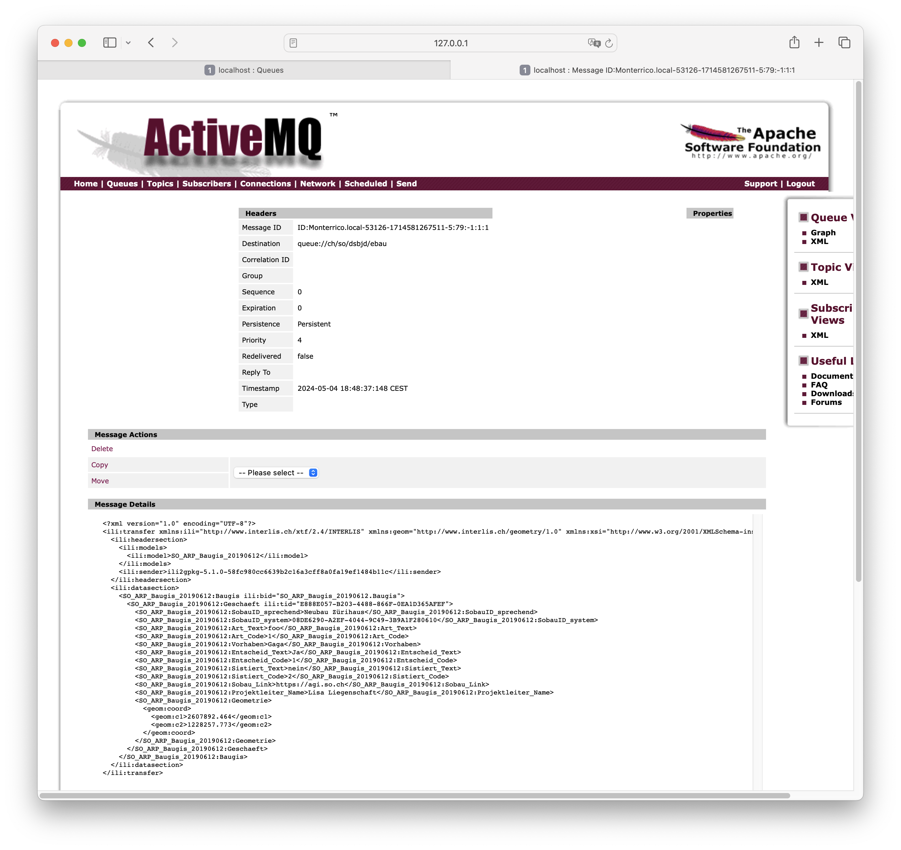

---
= INTERLIS leicht gemacht #42 - INTERLIS over the wire
Stefan Ziegler
2024-05-31
:thoth-type: post
:thoth-status: published
:thoth-tags: INTERLIS,Java,ilivalidator,Apache Camel,Python,Apache ActiveMQ,JBang 
:idprefix:
---
Seit über 20 Jahren landen Informationen über Baugesuche ausserhalb der Bauzone in unserer GDI. Die erste Generation einer Geschäftskontrolle wurde noch selber programmiert. Interessant war dabei, dass die Lokalisierung quasi im Zentrum stand: Das Geschäft musste mit einem Klick in die Karte eröffnet werden. Heute mit einer externen Lösung ist das nicht mehr so gelöst. Nichtsdestotrotz landen die Koordinaten des Baugesuches und weitere Informationen in unserer Datenbank und werden als geschützter WMS-Layer publiziert. Die Daten werden von der externen Anwendung via unserem https://geo.so.ch/api/data/v1/api/[Dataservice (einfache Rest-API und JSON)] in die Datenbank gespeichert. Ganz geglückt ist die Integration nicht, da das Fehlerhandling - warum auch immer - eher medioker ist: Falls es beim Zurückschreiben (PUT oder POST) einen Fehler gibt, war es das. Der Benutzer bemerkt diesen Fehler nicht und die Anwendung macht auch nichts. So weit, so gut. Ist jetzt noch nicht per se ein Negativpunkt für ein Rest-API.

Der Kanton realisiert zur Zeit das https://so.ch/verwaltung/bau-und-justizdepartement/departementssekretariat/projekt-elektronisches-baubewilligungsverfahren-ebauso/[Projekt &laquo;Elektronisches Baubewilligungsverfahren (eBauSO)&raquo;] und auch hier ist das Zurückschreiben der Geoinformationen zum Baugesuch ein Thema, das behandelt werden muss. Entweder machen wir es in verbesserter Form mit dem Rest-API, dessen Signatur wir aber abgekündigt haben (und in Zukunft OGC API - Features verwenden wollen). Oder wir ziehen andere Lösungsvarianten in Betracht. Dazu muss man die Anforderungen kennen: Die externe Anwendung kennt immer die Lokalisierung des vom Benutzer (Baugesuchssteller oder Leitbehörde etc.) bearbeitenden Baugesuchs (ohne GDI, ohne WMS) und kann sie auf einer eigenen Karte darstellen. Für die Behörden ist ebenso wichtig zu wissen, ob es andere aktuelle oder ältere Baugesuche gibt, die sich auf dem Grundstücke oder in der Nähe befinden. Diese Information muss aber nicht zwingend real-time sein. Das heisst, wenn ein Baugesuchssteller ein neues Baugesuch eröffnet, müssen die Behörden nicht zum gleichen Zeitpunkt die Koordinaten im geschützten WMS-Layer sehen. Wenn wir wählen können, ist uns ein filebasierter Austausch mit INTERLIS lieber. Eine Variante wäre z.B. eine tägliche Gesamtlieferung aller Baugesuchsinformationen. Da jedoch pro Jahr circa 6'000 Baugesuche erstellt werden, skaliert das dann doch nicht so gut. Eine andere Variante eines dateibasierten Austausches ist, dass man pro Geschäft eine Datei erstellt und nur jeweils bei Veränderungen im Geschäft die Datei exportiert und irgendwo hinkopiert, wo wir sie herunterladen können. Mit `ili2pg` resp. https://gretl.app[GRETL] können wir die Daten einfach in die Datenbank importeren. Ein Geschäft = eine Datei = ein Dataset. Ganz fire and forget ist dieser Ansatz aber nicht: Man kann mit diesem Ansatz keine Geschäfte direkt löschen, sondern es wird ein Status-Attribut benötigt, das diese Information speichert und ein nachgelagerter Prozess müsste, so gewollt, den Punkt in der Datenbank löschen (oder in der Karte einfach nicht darstellen). Zudem spielt die Reihenfolge eine wichtige Rolle: Z.B. darf die Löschmeldung nicht vor einer anderen Änderung in die Datenbank importiert werden. Dieses Problem löst sich auf, falls die  externe Anwendung immer den gleichen Dateinamen für das Geschäft verwendet und die Dateien am Zielort einfach überschrieben werden. Die Geschichte des Geschäfts wird in unserer Datenbank nicht abgebildet, so dürfen einzelne Zwischenzustände also fehlen. Umsetzen würden wir es ganz simpel: Externe Anwendung speichert die Daten auf einem FTP-Server und wir machen bissle GRETL und Jenkins und gut ist.

Mit diesem Ansatz sind wir im Bereich von Messaging angekommen. Man könnte die letzte Variante auch mit einem Message Broker umsetzen, ohne Umweg über Dateien exportieren und rumschieben. Gesagt, getan: Spasseshalber https://activemq.apache.org/[Apache ActiveMQ] heruntergeladen und gestartet. Apache ActiveMQ ist ein Open Source Message Broker, der das https://projects.eclipse.org/projects/ee4j.messaging[Jakarta Messaging API] (JMS) implementiert. Damit er auch ausserhalb der Java-Welt einsetzbar ist, unterstützt ActiveMQ auch andere Protokolle, z.B. REST, https://stomp.github.io/[STOMP] oder WebSocket. ActiveMQ kennt zwei Modi: Queue und Topic. Bei der Queue gibt es einen Producer und einen Verbraucher. Wurde die Nachricht vom Verbraucher empfangen, wird sie aus der Queue gelöscht. Topic entspricht einem Publisher/Subscriber-Modell. Hier können mehrere Subscriber die Nachricht empfangen. 

Faken wir also unseren Usecase mit einem Python-Producer und einem Java-Consumer. Der Python-Producer verschickt die Nachricht mittels STOMP:

[source,python,linenums]
----
import stomp

# Create a connection to ActiveMQ
conn = stomp.Connection12([('localhost', 61613)], auto_content_length=False) #https://github.com/jasonrbriggs/stomp.py/issues/216
conn.connect(login='admin', passcode='admin', wait=True)

# Send a message to a specific destination (queue)
destination = 'ch/so/dsbjd/ebau'
message = '''<?xml version="1.0" encoding="UTF-8"?>
<ili:transfer xmlns:ili="http://www.interlis.ch/xtf/2.4/INTERLIS" xmlns:geom="http://www.interlis.ch/geometry/1.0" xmlns:xsi="http://www.w3.org/2001/XMLSchema-instance" xmlns:SO_ARP_Baugis_20190612="http://www.interlis.ch/xtf/2.4/SO_ARP_Baugis_20190612">
  <ili:headersection>
    <ili:models>
      <ili:model>SO_ARP_Baugis_20190612</ili:model>
    </ili:models>
    <ili:sender>ili2gpkg-5.1.0-58fc980cc6639b2c16a3cff8a0fa19ef1484b11c</ili:sender>
  </ili:headersection>
  <ili:datasection>
    <SO_ARP_Baugis_20190612:Baugis ili:bid="SO_ARP_Baugis_20190612.Baugis">
      <SO_ARP_Baugis_20190612:Geschaeft ili:tid="E888E057-B203-4488-866F-0EA1D365AFEF">
        <SO_ARP_Baugis_20190612:SobauID_sprechend>Neubau Zürihaus</SO_ARP_Baugis_20190612:SobauID_sprechend>
        <SO_ARP_Baugis_20190612:SobauID_system>08DE6290-A2EF-4044-9C49-3B9A1F280610</SO_ARP_Baugis_20190612:SobauID_system>
        <SO_ARP_Baugis_20190612:Art_Text>foo</SO_ARP_Baugis_20190612:Art_Text>
        <SO_ARP_Baugis_20190612:Art_Code>1</SO_ARP_Baugis_20190612:Art_Code>
        <SO_ARP_Baugis_20190612:Vorhaben>Gaga</SO_ARP_Baugis_20190612:Vorhaben>
        <SO_ARP_Baugis_20190612:Entscheid_Text>Ja</SO_ARP_Baugis_20190612:Entscheid_Text>
        <SO_ARP_Baugis_20190612:Entscheid_Code>1</SO_ARP_Baugis_20190612:Entscheid_Code>
        <SO_ARP_Baugis_20190612:Sistiert_Text>nein</SO_ARP_Baugis_20190612:Sistiert_Text>
        <SO_ARP_Baugis_20190612:Sistiert_Code>2</SO_ARP_Baugis_20190612:Sistiert_Code>
        <SO_ARP_Baugis_20190612:Sobau_Link>https://agi.so.ch</SO_ARP_Baugis_20190612:Sobau_Link>
        <SO_ARP_Baugis_20190612:Projektleiter_Name>Lisa Liegenschaft</SO_ARP_Baugis_20190612:Projektleiter_Name>
        <SO_ARP_Baugis_20190612:Geometrie>
          <geom:coord>
            <geom:c1>2607892.464</geom:c1>
            <geom:c2>1228257.773</geom:c2>
          </geom:coord>
        </SO_ARP_Baugis_20190612:Geometrie>
      </SO_ARP_Baugis_20190612:Geschaeft>
    </SO_ARP_Baugis_20190612:Baugis>
  </ili:datasection>
</ili:transfer>
'''

conn.send(body=message, destination=destination, headers={'persistent' :'true'})

# Disconnect from ActiveMQ
conn.disconnect()
----

Zum Herstellen des INTERLIS-XML in Python würde für unseren Anwendungfalls reines Templating reichen. Man muss nur die Attribut- resp. Elementwerte austauschen. 

Wird die Nachricht verschickt und es gibt noch keinen Consumer, kann man die Nachricht in der Enterprise-90er-Jahre-Vibes-Oberfläche von ActiveMQ betrachten:

Interessanterweise überlebten die Nachrichten im Broker einen Restart zuerst nicht. Anscheinend ist es eine Eigenschaft der Nachricht selber, ob sie _persistent_ ist oder eben nicht. Mit STOMP muss das via Header gelöst werden (siehe Zeile 43).

Den Konsumenten bauen wir mit https://camel.apache.org/[Apache Camel]. Apache Camel ist ein in Java geschriebenes Open Source Integration Framework. Mit https://www.jbang.dev/[JBang]-Zuckerguss drüber, kann man mit einer einzigen Datei Java-Code sehr viel erreichen. Die sogenannte Route (siehe Zeile 27 `... extends RouteBuilder`) lädt vom Message Broker die Nachricht herunter (Zeile 38-40), speichert sie in einer Datei (Zeile 41-42) und validiert diese mit `ilivalidator` (Zeile 46-51). Falls die Nachricht valide ist, wird sie mit `ili2pg` importiert (nicht implementiert, Zeile 54-55), ansonsten wird eine entsprechende Meldung geloggt.

[source,python,linenums]
----
//REPOS mavencentral,ehi=https://jars.interlis.ch/
//DEPS ch.interlis:ilivalidator:1.14.1
//DEPS ch.ehi:ehibasics:1.4.1
//DEPS org.apache.camel:camel-bom:4.5.0@pom
//DEPS org.apache.camel:camel-main
//DEPS org.apache.camel:camel-activemq
//DEPS org.apache.camel:camel-debug
//DEPS org.apache.camel:camel-file
//DEPS org.apache.camel:camel-health
//DEPS org.apache.camel:camel-jms

import ch.ehi.basics.settings.Settings;
import org.interlis2.validator.Validator;

import org.apache.camel.main.Main;
import org.apache.activemq.ActiveMQConnectionFactory;
import org.apache.camel.Exchange;
import org.apache.camel.Predicate;
import org.apache.camel.builder.RouteBuilder;
import org.apache.camel.component.activemq.ActiveMQComponent;

import static org.apache.activemq.ActiveMQConnection.DEFAULT_BROKER_URL;

import java.nio.file.Paths;
import java.util.UUID;

public class consume_messages extends RouteBuilder {
    private static final String TMP_DIR = "/Users/stefan/tmp/";

    Main main = new Main();
    
    @Override
    public void configure() throws Exception {
        // Kann man sich sparen, falls Default-Url verwendet wird.
        main.bind("activemq", ActiveMQComponent.activeMQComponent(DEFAULT_BROKER_URL));
        main.bind("activemqConnectionFactory", ActiveMQConnectionFactory.class);

        from("activemq:queue:ch/so/dsbjd/ebau" +
            "?username=user" +
            "&password=1234")
        .setHeader("CamelFileName", method(consume_messages.class, "generateFileName"))
        .to("file:"+TMP_DIR)
        .choice()
            .when(new Predicate() {
                @Override
                public boolean matches(Exchange exchange) {
                    Settings settings = new Settings();
                    settings.setValue(Validator.SETTING_ILIDIRS, ".;"+Validator.SETTING_DEFAULT_ILIDIRS);
                    String fileName = (String) exchange.getIn().getHeader("CamelFileName");
                    boolean valid = Validator.runValidation(Paths.get(TMP_DIR, fileName).toString(), settings);
                    return valid;
                }
            }).process(exchange -> {
                System.out.println("File is valid and will be imported: " + exchange.getIn().getHeader("CamelFileName"));
                // ili2pg...
            })
            .otherwise().log("File is NOT valid.")
        .end();
    }

    public static String generateFileName() {
        UUID uuid = UUID.randomUUID();
        return uuid.toString() + ".xtf";
    }
}
----

Der Dateinamen (Zeile 139) ist im Codebeispiel einfach eine random UUID. Damit könnte ich für den ili2pg-Import nicht auf den Dateinamen als Dataset zurückgreifen, sondern müsste z.B. zuerst die TID aus der XML-Nachricht rauslesen (siehe Anforderungen oben).

Bringt INTERLIS in solchen Fällen etwas? Mich dünkt ja. Ich kann die Nachricht vor der Weiterverarbeitung mit dem vollen INTERLIS-Arsenal prüfen. Die Prüfung bekomme ich mit `ilivalidator` geschenkt. Anschliessend kann ich die Daten mit `ili2db` in die Datenbank importieren. Diesen Schritt bekomme ich ebenfalls geschenkt. Es fallen praktisch keine Zeilen Businesslogik an. Ich muss keine Zeile Code ändern, wenn das Datenmodell ändert oder wenn ich den Messaging-Ansatz für ein komplett anderes Thema wähle. Zudem interessieren mich hier beim Empfangen der Nachricht die Information über das Geschäft nicht (also der einzelne Record / das einzelne Objekt). D.h. ich muss gar nicht auf diese Stufe runter. Ansonsten könnte die Validierung mit https://beanvalidation.org/3.0/[Beans Validiation] erfolgen und der Import mit einem https://jakarta.ee/specifications/persistence/[ORM] gemacht werden. Aber da würde massiv mehr Code anfallen und man müsste es für jedes Thema / jedes Modell separat lösen. Und falls das Modell umfangreicher wird (mit Assoziationen etc.) wird das schnell hässlich. Wenn wir bei XML bleiben aber nicht INTERLIS machen wollen, könnte man die Validierung mit XSD machen. Das ist definitiv einige Stufen weniger praktikabel und elegant als mit INTERLIS. Zudem fehlt mir etwas für den generischen Import in die Datenbank. Das ähnliche Problem hatten wir bei der Realisierung des neuen Meldewesens für die amtlichen Vermessung. Wir bekommen die Nachrichten im Standard https://www.ech.ch/de/ech/ech-0132/2.1.0[eCH-0132]. Ist im Prinzip dead on arrival, weil wir als erstes die XML-Datei in eine INTERLIS-Datei gemäss https://geo.so.ch/models/AGI/SO_AGI_SGV_Meldungen_20221109.ili[einem eigenen Modell] https://github.com/sogis/gretljobs/blob/main/agi_av_meldewesen/xml2xtf.xsl[umtransformieren] (müssen), damit wir möglichst viel Aufwand und Code sparen. Das als einer der verschiedenen Kritikpunkte an den eCH-Objektwesen-Standards.

https://github.com/edigonzales/message-broker-playground

