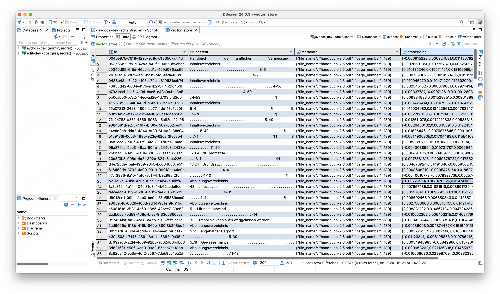
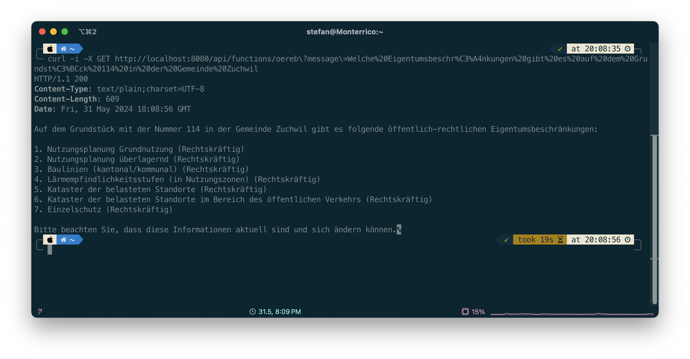

---
= AI - Let the journey begin
Stefan Ziegler
2024-06-03
:thoth-type: post
:thoth-status: published
:thoth-tags: Java,Spring Boot, AI, KI, LangChain4j, OpenAI, ChatGPT, GPT4, GPT
:idprefix:
---
Als NVIDA-Aktionär muss ich das Thema jetzt pushen; die Investition soll sich ja lohnen. Wie jeder andere auch verwende ich hin- und wieder ChatGPT und freue mich über sinnvolle Antworten vor allem als Hilfe zum Programmieren. Der Zugang zum Thema fällt mir aber schwer: LLM, Tokens, RAG, Prompt Engineering, Fine Tuning... WTF? Um das Thema nicht nur den Luftikussen und Verkäufern zu überlassen, muss ich mich hier auch minimal schlau machen. Und wie gelingt mir das am besten? Ich brauche eine (halb-)konkrete Fragestellung und Werkzeuge, mit denen ich was anstellen kann. Welcome https://spring.io/projects/spring-ai[Spring AI] und https://docs.langchain4j.dev/[LangChain4j]. Beides sind Java-Frameworks, die das Arbeiten mit den unterschiedlichsten LLM und AI-Diensten vereinfachen, in dem sie als Abstraktionsschicht dienen. Das hilft ungemein in Zeiten, in denen gefühlt jeden Tag das neue, beste LLM entsteht. Man will also das LLM austauschen können, ohne den Code ändern zu müssen. Spring AI - nomen est omen - dient vor allem im Spring-Umfeld und LangChain4j ganz allgemein im Java-Umfeld. Die konkrete Fragestellung ist jetzt nicht so originell: Ich will mit eigenen Daten arbeiten und Antworten bekommen auf Fragen wie:

- Wer ist Amtschef im Amt für Raumplanung im Kanton Solothurn?
- Müssen Obstkulturen in der amtlichen Vermessung aufgenommen werden?
- Was sind die Rechtsgrundlagen für eine Gemeindegrenzregulierung?
- Welche Eigentumsbeschränkungen gibt es auf dem Grundstück 114 in der Gemeinde Zuchwil?

Die LLM können aus verschiedenen Gründen diese Fragen meistens nicht beantworten. Entweder weil sie nicht mit diesen Daten trainiert wurden. Denke kaum, dass sie das &laquo;Das Handbuch der amtlichen Vermessung Kanton Solothurn&raquo; irgendwann zu Gesicht bekommen haben oder aber sie wurden anhand nicht mehr aktueller Daten trainiert (knowledge cut off date).

Folgende Beispiele sind mit dem gpt4-Modell durchgespielt. D.h. Informationen landen immer auf einem fremden Server. Aus diesem Grund verwende ich nur frei verfügbare Daten und mein Lieblingsbeispiel &laquo;Wem gehört das Grundstück XY in der Gemeinde YZ?&raquo; lasse ich vorderhand im Giftschrank. Möchte ja meinen Job behalten. Interessant wären in diesem Zusammenhang natürlich lokal / inhouse laufende Modelle wie z.B. https://llama.meta.com/llama3/[llama3]. Auf meinem Notebook macht das keinen Spass und die https://www.hetzner.com/de/dedicated-rootserver/matrix-gpu/[200 Euro pro Monat für einen Hetzner-Server] waren mir dann doch zu viel.

Eine einfache Variante mit eigenen Daten zu arbeiten, ist _prompt stuffing_. Dabei werden die Information einfach mit der Frage mitgeschickt. Ein paar Amtschefs habe ich in beispielhaft in einer Markdown-Datei erfasst:

[source,md,linenums]
----
## Bau- und Justizdepartement (BJD)

- Amt für Umwelt (AfU): Gabriel Zenklusen
- Amt für Raumplaung (ARP): Sacha Peter
- Amt für Denkmalpflege und Archäologie (ADA): Stefan Blank
- Amt für Verkehr und Tiefbau (AVT): Roger Schibler
- Hochbauamt (HBA): Guido Keune
- Motorfahrzeugkontrolle (MFK): Kenneth Lützelschwab
- Amt für Geoinformation (AGI): Stefan Ziegler

## Volkwirtschaftsdepartement (VWD)

- Amt für Landwirtschaft (ALW): Felix Schibli
- Amt für Wald, Jagd und Fischerei (AWJF): Rolf Manser
- Amt für Gemeinden (AGEM): Grolimund André 
- Amt für Militär und Bevölkerungsschutz (AMB): Diego Ochsner
- Amt für Wirtschaft und Arbeit (AWA): R. Frei

## Departement des Innern (DDI)

- Amt für Gesellschaft und Soziales (AGS): Sandro Müller
- Gesundheitsamt (GESA): Peter Eberhard
- Migrationsamt: Johanna Schwegler
- Amt für Justizvollzug (AJUV): Michael Leutwyler
----

Diese Daten müssen irgendwie zum LLM gelangen. Dazu wird ein Prompt-Template mit Einleitung und Platzhaltern für den Kontext (aka unseren eigenen Daten) und der eigentliche Frage benötigt:

[source,foo,linenums]
----
Verwende den folgenden Inhalt, um die Frage am Ende zu beantworten. 
Wnn du die Antwort nicht kennst, antworte mit 
"Ich kenne die Antwort leider nicht".

{context}

Frage: {question}
----

Mit Spring AI kann ich einen Restcontroller schreiben und aus dem Prompt-Template einen Prompt machen:

[source,md,linenums]
----

@Value("classpath:/docs/organisation-kanton-solothurn.md")
private Resource docsToStuffResource;

....

@GetMapping("/api/output/stuff/organisation")
public String getOrganisationInfo(
        @RequestParam(value = "message", defaultValue = "Wer ist Amtschef oder Amtschefin im Amt für Umwelt des Kantons Solothurn") String message
        ) {
            
    PromptTemplate promptTemplate = new PromptTemplate(organisationKantonSolothurnResource);
    Map<String,Object> map = new HashMap<>();
    map.put("question", message);
    map.put("context", docsToStuffResource);
    
    Prompt prompt = promptTemplate.create(map);
    ChatResponse response = chatClient.call(prompt);
    
    return response.getResult().getOutput().getContent();
}
----

Die Platzhalter werden mit der Frage (`message`-Parameter) und dem Inhalt der Markdown-Datei (`docsToStuffResource`) ersetzt und anschliessend wird das Ganze zu OpenAI hochgeladen und GPT-4 liefert mir die korrekte Antwort. Auch die Frage der Anzahl Departemente wird richtig beantwortet.

Was kann man machen, wenn wir nicht nur eine einzelne Markdown-Datei vorliegen haben, sondern 100 oder 1000 PDF, E-Mails, Word-Dateien etc.? Das Prinzip bleibt das gleiche, nur dass wir nicht alle Dokumente hochladen, sondern nur den (hoffentlich) relevanten Teil. Wir können/sollten aus zwei Gründen nicht alle Dokumente hochladen: Einerseits sind die sogenannten Tokens die Währung in diesem AI-Zirkus. D.h. es wird pro Input- und Output-Token abgerechnet. Es ist massiv teurer 100 PDF-Seiten hochzuladen als bloss einen Paragraphen daraus. Tokens entsprechend Wortteilen und man rechnet mit circa https://platform.openai.com/tokenizer[1.25 Token pro Wort]. Andererseits können die LLM nicht mit unendlich vielen Tokens umgehen. Hier gibt es grosse Unterschiede zwischen den LLM und die maximale Anzahl wächst ständig mit neuen Generationen der LLM.

Die Lösung für dieses Problem heisst RAG (Retrieval Augmented Generation) und Embeddings. Kann ich nicht richtig erklären, ergoogelt sich man besser. Kurzum: Unsere 1000 Dateien werden in einen Vektorstore importiert und bei einer Anfrage wird zuerst nach den zur Frage möglichst passendsten Inhalten gesucht und nur diese werden zum LLM geschickt. Vektorstores gibt es wie Sand am Meer. Spring AI hat zum rumpröbeln einen filebasierten Store, ich verwende PostgreSQL mit der https://github.com/pgvector/pgvector[pgvector-Extension]. Für viele Anwendungsfälle reicht PostgreSQL wohl. Bei meinen Beispielen war die Dokumentensuche in der Datenbank jedenfalls nicht der zeitlimitierende Faktor. Spring AI bietet für den Import von Dateien verschieden Reader an. Ich habe für drei Dokumente der amtlichen Vermessung den PDF-Reader verwendet. Es handelt sich um das circa https://s3.eu-central-1.amazonaws.com/ch.so.agi.av.lnf.handbuch/handbuch-2.6.zip[190-seitige Handbuch der amtlichen Vermessung Kanton Solothurn], sowie um die https://so.ch/fileadmin/internet/bjd/bjd-agi/pdf/AmtlicheVermessung/Weisungen/Weisung_Vermarkung_150122.pdf[Vermarkungsweisung] und die Weisung betreffend https://so.ch/fileadmin/internet/bjd/bjd-agi/pdf/AmtlicheVermessung/Weisungen/Weisung_Regulierung_Gemeindegrenzen_230310.pdf[Gemeindegrenzregulierungen]. Es kann auch mal vorkommen, dass die PDF-Datei nicht gelesen werden kann oder dass komische Meldungen wegen Fonts im Log erscheinen. Warum ist mir nicht ganz klar. Entweder ist die PDF-Datei korrupt oder es liegt am PDF-Reader. Spring AI verwendet zum Lesen der PDF-Dateien https://pdfbox.apache.org/[Apache PDFBox] und es gibt ergänzend einen https://docs.spring.io/spring-ai/docs/current/api/org/springframework/ai/reader/tika/TikaDocumentReader.html[Tika-Reader] mit dem man https://tika.apache.org/2.9.0/formats.html[alles mögliche lesen] kann. 

Nach dem Import, der bei mir circa zwei Minuten gedauert (dauert die Vektorberechnung so lange?) hat, sieht es in der Datenbank so aus:

Stelle ich eine Frage werden zuerst die https://github.com/edigonzales/spring-ai-avdocs/blob/02214c8/src/main/java/dev/edigonzales/avdocs/SpringAssistantCommand.java#L55[_n_ ähnlichsten Dokumente(-nteile) in der Datenbank gesucht]. Das _n_ darf man selber wählen. Anschliessend wird diese Information wieder in ein https://github.com/edigonzales/spring-ai-avdocs/blob/02214c8/src/main/java/dev/edigonzales/avdocs/SpringAssistantCommand.java#L39[Prompt-Template gestopft]:

[source,foo,linenums]
----
Sie sind ein hilfreicher und freundlicher KI-Assistent, 
der Fragen zur amtlichen Vermessung des Kantons Solothurn 
beantworten kann. Verwenden Sie die Informationen aus dem 
Abschnitt DOKUMENTE, um genaue Antworten zu geben. 
Wenn sie unsicher sind oder die Antwort nicht im Abschnitt 
DOKUMENTE zu finden ist, geben sie einfach an, dass sie
die Antwort nicht kennen.

Bitte verwenden sie in der Antwort keine "ß", sondern "ss".

FRAGE:
{input}

DOKUMENTE:
{documents}
----

Anhand der Metadaten (siehe Spalte _metadata_ in der DB-Tabelle) weiss die Anwendung aus welchen Original-Dokumenten die Information für die Antwort stammen und kann diese dem Benutzer auch mitteilen.

Zu korrekten Antworten haben folgende Fragen geführt:

- Müssen Obstkulturen aufgenommen werden?
- Müssen Apfelbäume aufgenommen werden?
- Dürfen Kunststoffzeichen für die Vermarkung verwendet werden?
- Was sind die Rechtsgrundlagen für eine Gemeindegrenzregulierung?

Bei anderen Fragen wurde halluziniert:

- Wie ist die Gebäudedefinition?
- Was gehört bei einer Gemeindegrenzregulierung auf den Regulierungsplan?
- Wann kommt es zu einer Gemeindegrenzregulierung?

Eingangs habe ich die Frage &laquo;Welche Eigentumsbeschränkungen gibt es auf dem Grundstück 114 in der Gemeinde Zuchwil?&raquo; beispielhaft aufgeführt. Ist sowas möglich? Ja. Verschiedene LLM kennen das Prinzip des https://platform.openai.com/docs/guides/function-calling[Function]  https://docs.spring.io/spring-ai/reference/api/functions.html[Callings]. Dabei können vom Entwickler beliebige Funktionen eingehängt werden. Die Funktion führt beliebigen Code aus und liefert eine Antwort zurück, die das LLM verwenden kann. In meinem Fall sind es sogar zwei Funktionen. Eine liefert den E-GRID eines Grundstückes anhand des Gemeindenamens und der Grundstücksnummer. Die zweite Funktion ruft mit dem E-GRID als Identifier den ÖREB-Webservice auf, liest aus dem XML die betroffenen Themen aus und liefert diese als Liste zurück. Die LLM sind dahingehend trainiert, dass sie möglichst gut wissen, wann sie die Funktion(en) aufrufen müssen. Das Ganze ist aber schon bisschen magisch. Mir ist noch nicht ganz klar, was und wie genau hier rein spielt. Die Funktionen werden https://github.com/edigonzales/spring-ai-demo/blob/4d89fa7/src/main/java/dev/edigonzales/demo/functions/GrunstueckFunctionConfiguration.java#L12[annotiert] und es hilft sicher hier was sinnvolles reinzuschreiben (rede ich mir jedenfalls ein).

Die Frage nach den Eigentumsbeschränkungen konnte beantwortet werden:

Anscheinend wird wirklich zuerst anhand des Gemeindenamens und der GB-Nummer die https://github.com/edigonzales/spring-ai-demo/blob/4d89fa7/src/main/java/dev/edigonzales/demo/functions/GrundstueckService.java[Grundstuecks-Funktion] aufgerufen und anschliessend mit dem jetzt bekannten E-GRID die https://github.com/edigonzales/spring-ai-demo/blob/4d89fa7/src/main/java/dev/edigonzales/demo/functions/OerebService.java[ÖREB-Funktion], die nur eine https://github.com/edigonzales/spring-ai-demo/blob/4d89fa7/src/main/java/dev/edigonzales/demo/functions/GrundstueckService.java#L21[Java-Liste] zurückliefert. Der schön formatierte Text stammt vom LLM. Faszinierend.

Links: 

- Viel Code stammt aus den https://www.youtube.com/playlist?list=PLZV0a2jwt22uoDm3LNDFvN6i2cAVU_HTH[Beispielen] von Dan Vega.
- https://github.com/edigonzales/spring-ai-demo
- https://github.com/edigonzales/spring-ai-avdocs
