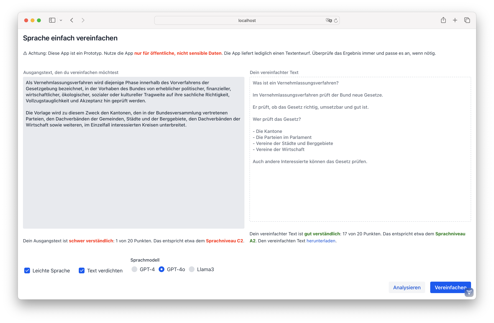
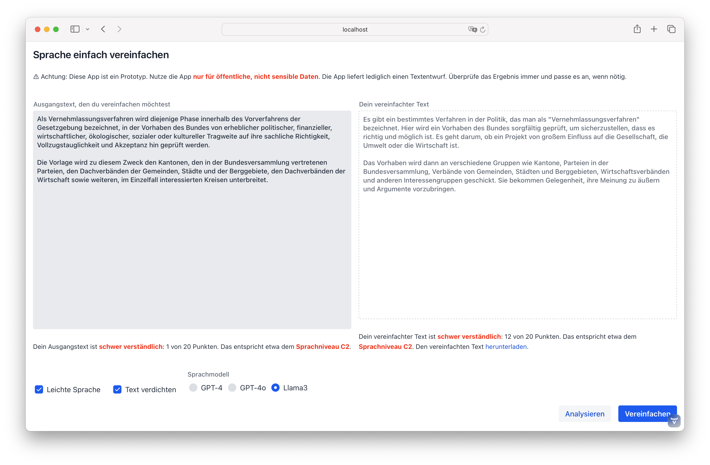

---
= AI - Behördensprache ade
Stefan Ziegler
2024-06-24
:thoth-type: post
:thoth-status: published
:thoth-tags: Java,Spring Boot, Vaadin, AI, KI, Ollama, Llama3, OpenAI, ChatGPT, GPT4, GPT
:idprefix:
---
https://www.youtube.com/watch?v=ZiqWi6SpqOg[&laquo;Talent borrows, Genius steals&raquo;]: Das https://www.zh.ch/de/direktion-der-justiz-und-des-innern/statistisches-amt.html[Statistische Amt] des Kantons Zürich hat einen sehr interessanten https://github.com/machinelearningZH/simply-simplify-language[Prototypen] zur Vereinfachung von Texten in https://www.edi.admin.ch/dam/edi/de/dokumente/gleichstellung/E-Accessibility/empfehlungen_informationen_leichtesprache_gebaerdensprache.pdf.download.pdf/Empfehlungen%20f%C3%BCr%20Verwaltungen%20zur%20Erstellung%20von%20Informationen%20in%20Leichter%20Sprache%20und%20Geb%C3%A4rdensprache.pdf[einfache und leichte] Sprache entwickelt. (Meine Eselsbrücke: Die leichte Sprache ist noch einfacher, als die einfache Sprache.) Für mich war klar, das will ich auch ausprobieren. Was mich jedoch besonders interessiert, ist, wie gut ein frei verfügbares LLM (Llama3) die Aufgabe meistert. Das Ganze hat sich natürlich aufwändiger als geplant herausgestellt. Aber der Reihe nach:

Der ZH-Prototyp ist mit Python und https://streamlit.io/[_Streamlit_] umgesetzt. Ich habe mit beidem wenig bis keine Erfahrung und darum dachte ich, dass ich den GUI-Teil schnell mit https://vaadin.com/[_Vaadin_] umsetzen kann. Das eigentlich GUI ging tatsächlich schnell, es stellte sich jedoch heraus, dass die Anwendung auch noch einen beträchtlichen Teil an Businesslogik beinhaltet: Nämlich die Analyse resp. Bewertung der Texte. Letzten Endes läuft es auf die Einstufung der Texte (vorher/nachher) in ein https://en.wikipedia.org/wiki/Common_European_Framework_of_Reference_for_Languages[CEFR-Level] hinaus. Die Anwendung verwendet https://spacy.io/[_spaCy_], eine NLP-Bibliothek, um https://github.com/machinelearningZH/simply-simplify-language/blob/main/_streamlit_app/sprache-vereinfachen.py#L153[bestimmte Parameter] zu berechnen. Mit diesen Parametern wird anschliessend die https://github.com/machinelearningZH/simply-simplify-language/blob/main/_streamlit_app/sprache-vereinfachen.py#L232[Verständlichkeit] eines Textes berechnet. Die Formel haben sie mittels eines Logistic Regression Modelles hergeleitet. Dieses spaCy-Teil gibt es natürlich nicht 1:1 in Java. Ich habe mit https://dev.languagetool.org/[languagetool] eine Java-Bibliothek gefunden, die ähnliche Funktionen aufweist. Verschiedene Parameter weisen beim Ausprobieren die exakt gleichen Werte aus, andere - z.B. der https://github.com/machinelearningZH/simply-simplify-language/blob/main/_streamlit_app/sprache-vereinfachen.py#L161[common word score] - nicht. Soweit ich es nachvollziehen kann, liegt es daran, dass unterschiedlich &laquo;lemmatized&raquo; wird. Das führt natürlich zur Frage, ob die erwähnte Formel auch in meinem Stack stimmt. Wahrscheinlich weniger gut, als im Original. Trotzdem führt es meines Erachtens zu plausiblen und sinnvollen (leicht unterschiedlichen) Punktzahlen.

Neben dieser Analyse-Logik hat der Kanton Zürich sicher auch einiges an Zeit in die https://github.com/edigonzales/simply-simplify-language-java/tree/main/src/main/resources/prompts[Prompts] investiert, die für die guten Resultat unabdingbar sind. Auch hier: Ehre, wem Ehre gebührt.

Mein Prototyp mit Vaadin und einem Resultat mit GPT-4o:

Die Resultate dünken mich ziemlich gut. Mit GPT-4o scheint mir schneller als GPT-4 zu sein und häufiger mit Aufzählungn zu arbeiten als GPT-4.

Wie sieht es mit Llama3 aus? Die Herausforderung war eine brauchbare Testumgebung zu finden. Lokal mit meinem M1-Prozessor macht es wirklich gar keinen Spass. Ein Mitarbeiter hat auf seinem Gamer-PC mit einer _RTX 4080 Super_ Grafikkarte gezeigt, dass die (gefühlte) Geschwindigkeit nahe an ChatGPT 4 ist. Machte ich mich also auf die Suche nach einem Cloud-Anbieter, der GPU-Rechner im Programm hat. Die wirklich grossen Hyperscaler waren mir entweder zu kompliziert (Azure, weil noch nie was gemacht mit) oder dermassen undurchschaubar im Angebot (AWS), dass ich nicht wusste, welche Instanz nun geeignet ist für meine Tests. Hetzner hat zwar einen GPU-Rechner im Angebot, jedoch mit hohen Setup-Gebühren. OVHCloud hätte zwar viele unterschiedliche GPU-Rechner im Angebot. Als Neukunde kann man diese jedoch, trotz hinterlegter Kreditkarte, nicht verwenden. Eine Anfrage wurde abgelehnt. Keine Ahnung warum. Als halber Freund von DigitalOcean bin ich über Paperspace gestolpert. Die wurden vor kurzem von DigitalOcean aufgekauft und haben GPU-Rechner im Angebot. Auch hier muss man sich mittels Ticket die Rechner freischalten lassen aber danach kann man frisch fröhlich verschiedenste GPU-Rechner auswählen. 

Ich habe mich für einen Rechner mit einer Ampere A4000 Nvidia Karte für $0.76/h entschieden. Die richtige Coolen würden A100-80Gx8 für $25.44/h wählen... 

Ollama installieren geht eigentlich ganz passabel, es installiert jedoch einen neuen Kernel (soweit ich es verstanden habe) und dauert darum ein Weilchen und die VM muss gerebootet werden. Anschliessend reicht:

[source,bash,linenums]
----
ollama run llama3
----

Das startet Ollama mit Llama3 als LLM. Man muss Ollama beibringen, dass er nicht bloss auf 127.0.0.1 hören soll, sondern auf allen lokalen Interfaces. Dazu muss die Env-Variable `OLLAMA_HOST=0.0.0.0` in der Datei `/etc/systemd/system/ollama.service` gesetzt werden. Ollama ist nun auch von extern ansprechbar (so natürlich nie in Produktion gehen). Prüfen kann man es mit curl:

[source,bash,linenums]
----
curl http://74.82.28.177:11434/api/generate -d '{
  "model": "llama3",
  "prompt": "Why is the sky blue?"
}'
----

Die Geschwindigkeit kann sich wirklich https://youtu.be/V87j4nev-_Q[sehen lassen]. 

Wie gut funktioniert es aber mit unserem Behördensprache-ade-Tool? Die Geschwindigkeit ist trotz umfangreicherer Prompts auf GPT-4o-Niveau. Die Qualität der vereinfachten Texte ist jedoch weniger gut resp. sie erreichen nur Punktzahlen zwischen 10 und 15 (der Ausgangstext hat eine Punktzahl von 1). Das ist zwar ein wenig ernüchternd aber soweit ich es nachvollziehen konnte, ist Llama3 nicht wirklich auf die deutsche Sprache trainiert. Es gibt auf HuggingFace Llama3-basierte Modelle, die mit https://huggingface.co/DiscoResearch/Llama3-German-8B[deutschen Token] feingetuned wurden. Ob mit einem solchen Modell bessere Ergebnisse erzielt werden können, müsste man noch ausprobieren.

Nichtsdestotrotz finde ich es wichtig, dass es frei verfügbare LLM gibt. Für Organisationen werden sie spannend, wenn man &laquo;KI machen&raquo; will und keine Kompromisse beim Datenschutz und der digitalen Souveränität eingehen will/kann. 

Ausprobieren:

[source,bash,linenums]
----
docker run -p8080:8080 -e OPENAI_API_KEY=123456789 edigonzales/simply-simplify-language
----

Für Llama3 müssen die https://github.com/edigonzales/simply-simplify-language-java/blob/main/src/main/resources/application.properties#L17[zwei Env-Variablen] gesetzt werden.

Links:

 - Original: https://github.com/machinelearningZH/simply-simplify-language/
 - Shameless plug: https://github.com/edigonzales/simply-simplify-language-java/
