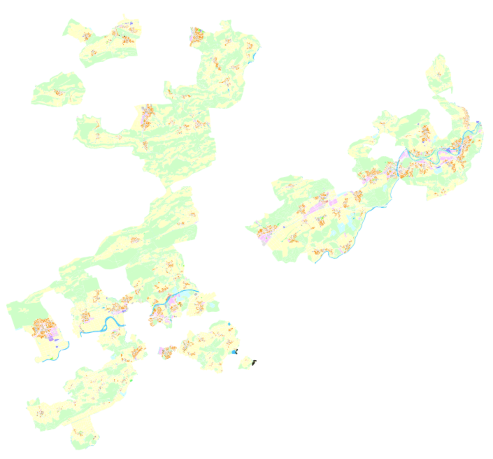
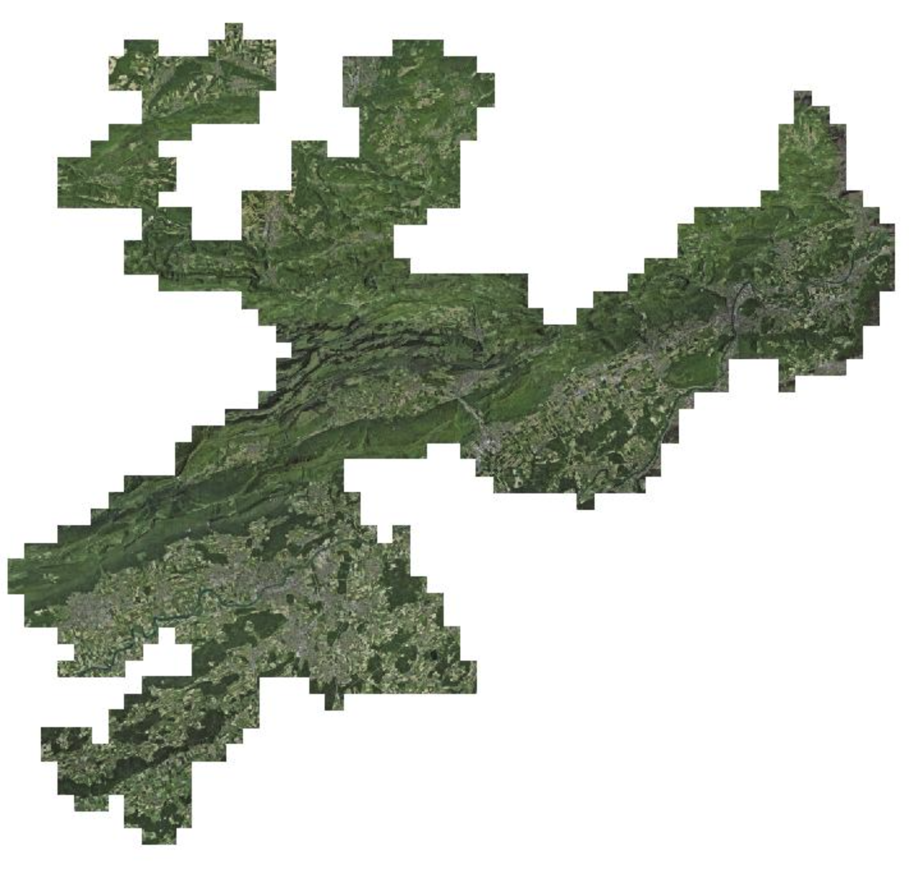
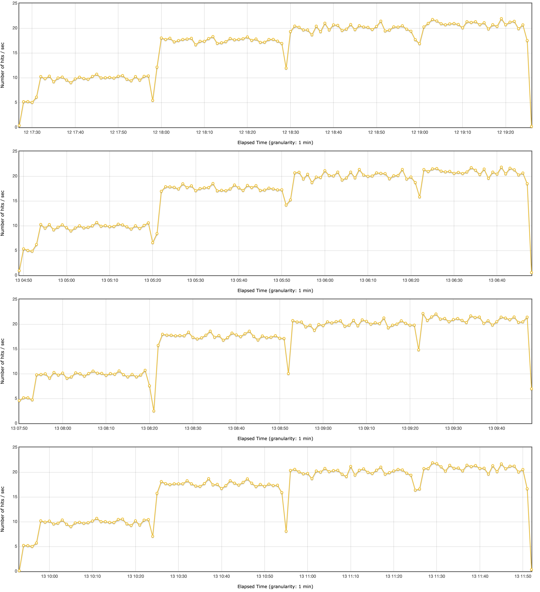
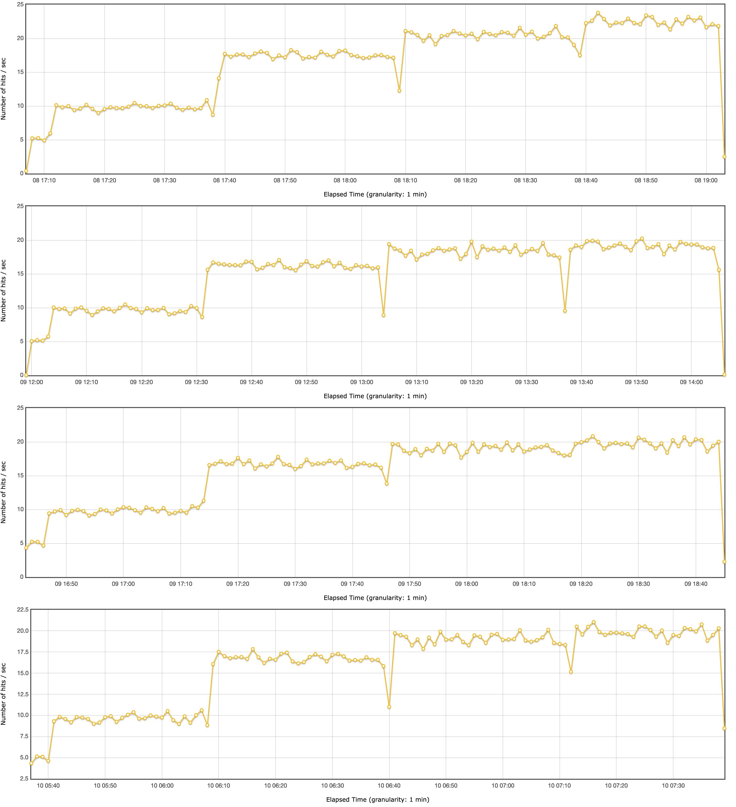
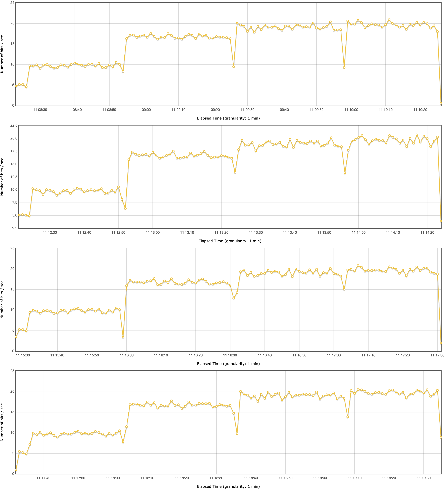
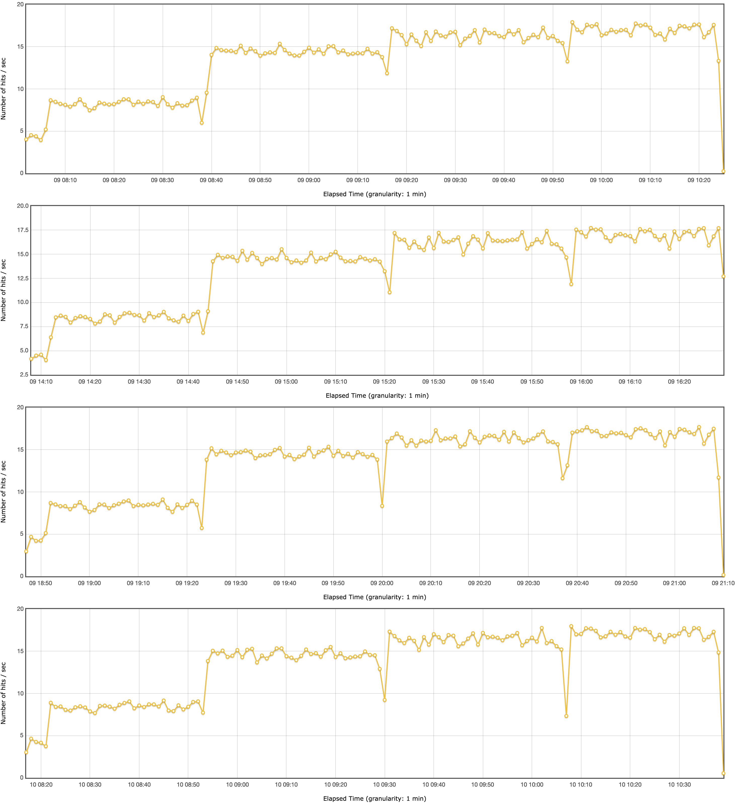
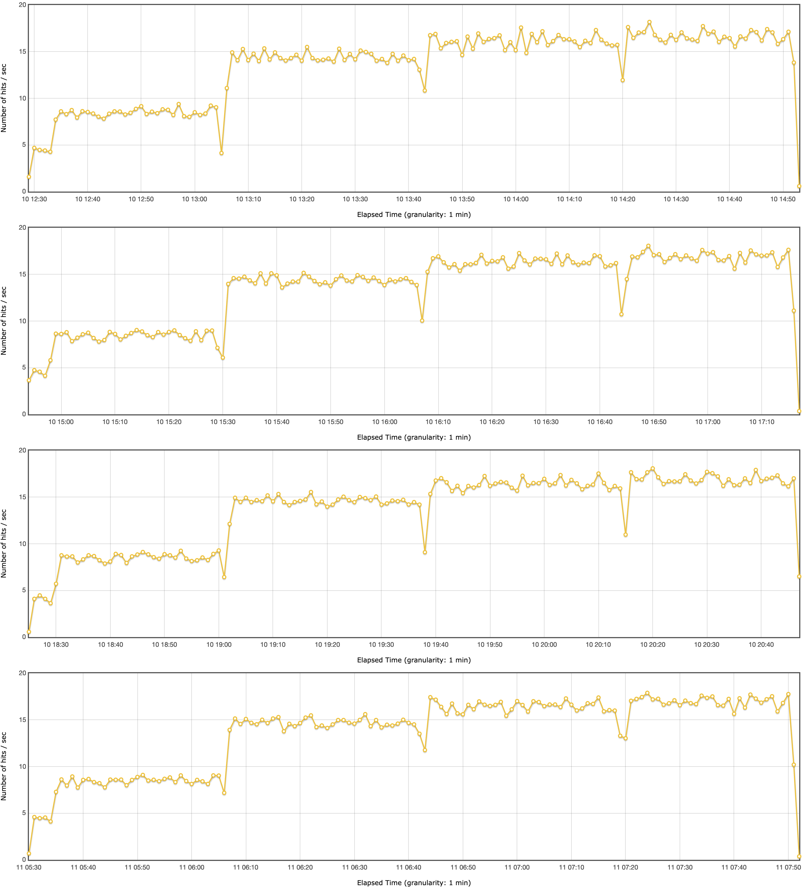
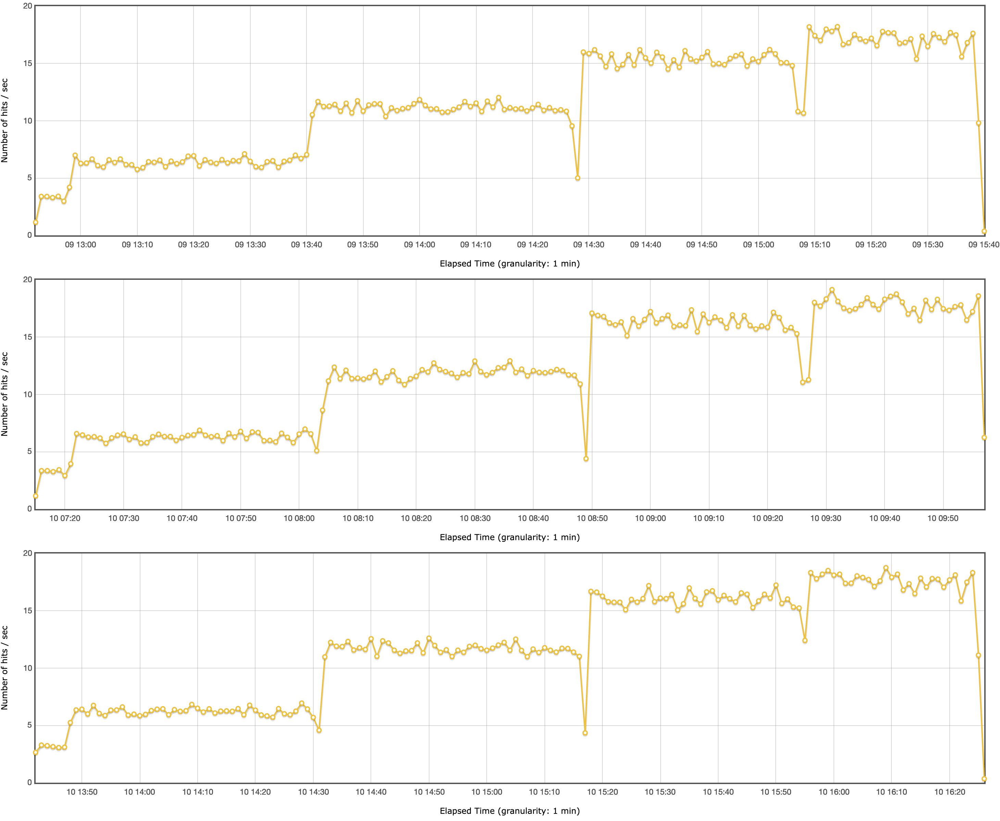
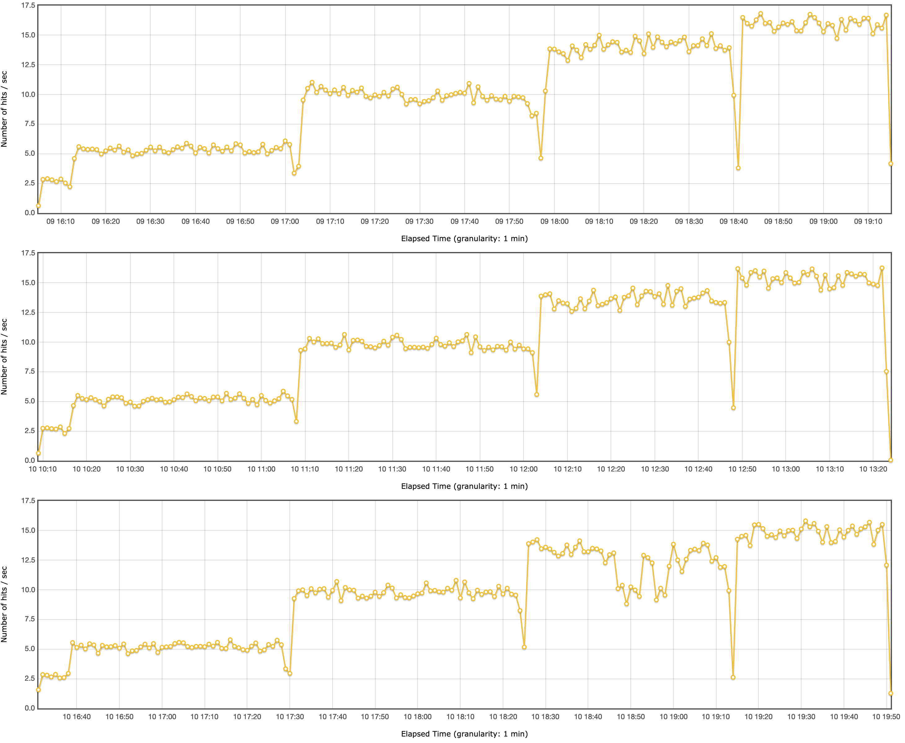

---
= GeoServer on steroids
Stefan Ziegler
2024-10-15
:thoth-type: post
:thoth-status: published
:thoth-tags: Java, GeoServer, GraalVM, OpenJDK, GeoScript
:idprefix:
---
https://blog.sogeo.services/tags/GraalVM.html[Ich] mag https://www.graalvm.org/[GraalVM]. Sei es um Java-Anwendungen zu einem Native Image runterzukompilieren oder Python mit Java zu verheiraten. Ein weiterer spannender Punkt ist der eigene https://www.graalvm.org/latest/reference-manual/java/compiler/[Graal JIT Compiler]. Dieser kann zu einer Performancesteigerung der Java-Anwendung führen und zwar ohne, dass man an dieser überhaupt was ändern muss. Nur die Runtime (&laquo;Java-Variante&raquo;) austauschen und gut ist. So hat der Wechsel zum Graal JIT Compiler z.B. bei der https://www.morling.dev/blog/one-billion-row-challenge/[1BRC] eine https://x.com/gunnarmorling/status/1843649474545287202/photo/3[Performancesteigerung von acht Prozent] gebracht. Bei mir selber habe ich solche Unterschiede noch keine festgestellt. Vor https://blog.sogeo.services/blog/2021/11/28/interlis-leicht-gemacht-number-27.html[ein paar Jahren] habe ich mit https://github.com/claeis/ilivalidator[`ilivalidator`] und https://github.com/claeis/ili2db[`ili2pg`] ein paar Benchmarks gemacht, die aber nicht sonderlich aussagekräftig waren und nicht gezeigt hätten, dass GraalVM bedeutend schneller ist. Weil wir uns zur Zeit überlegen von QGIS Server auf https://geoserver.org[GeoServer] zu wechseln, wäre das jedenfalls ein Anwendungfall, den man untersuchen könnte, da der Server zu Bürozeiten relativ stark beansprucht wird und somit eine genügend hohe Dauerlast besteht. Obwohl wir bereits heute viele Java-Anwendungen in Betrieb haben, hat keine davon eine ähnliche Last zu tragen wie ein möglicher, zukünftiger Java-Kartendienst.

Nun benötige ich ein Testszenario, das aus mehr als bloss vier Flächen und zwei Punkten besteht. Ich habe mich dazu entschieden die Nutzungsplanung und ein Orthofoto (swissimage 2021) zu verwenden. Die Nutzungsplanung steht als Vektordatensatz in einzelnen INTERLIS-Transferdateien https://files.geo.so.ch/ch.so.arp.nutzungsplanung.kommunal/aktuell/[zur Verfügung], die ich https://github.com/edigonzales/geoserver-benchmarks/blob/461afff02f2b9bf1e96dd9339eb39ddccc2a95da/gretl/build.gradle[ruckzuck] mit https://gretl.app[GRETL] in eine gedockerte PostgreSQL/PostGIS-Datenbank importieren kann. Die SLD-Datei hatte ich noch von früheren Spielereien rumliegen:

Das Orthofoto liegt als 30 GB grosses cloud optimized GeoTIFF _lokal_ vor:

Für das eigentliche Benchmarking verwendete ich https://jmeter.apache.org/[JMeter]. Man definiert in JMeter sowas wie eine Basis-URL (also in unserem Fall einen WMS-GetMap-Request) mit Platzhaltern für die Parameter (WIDTH, HEIGHT, BBOX und LAYERS), die bei jedem von JMeter gemachten Request dynamisch befüttert werden. Die Werte für die Platzhalter können in einer CSV-Datei gespeichert werden:

[source,bash,linenums]
----
width;height;bbox;layer
2102;2119;2605738.274269104,1236815.4005975279,2605773.134554806,1236850.5428170345;ch.swisstopo.swissimage_2021.rgb
3308;1924;2619968.8471599706,1256153.9242204945,2632686.446437572,1263550.7383106109;ch.swisstopo.swissimage_2021.rgb
3320;1896;2610788.4627983514,1256404.5859801334,2617948.8869838137,1260493.7920812287;ch.swisstopo.swissimage_2021.rgb
3470;1797;2634212.7299694223,1248533.8556387443,2641987.561823341,1252560.1878697216;ch.swisstopo.swissimage_2021.rgb
1972;2126;2592921.414637569,1242392.7718350205,2601610.971095325,1251760.9244867398;nutzungsplanung_grundnutzung
3391;1803;2597536.2772151744,1211156.517151424,2632904.225935421,1229961.7107646957;ch.swisstopo.swissimage_2021.rgb
3551;1134;2604904.606863846,1237243.4070413096,2623471.839928261,1243172.7909599373;nutzungsplanung_grundnutzung
...
----

Wie habe ich die CSV-Datei mit Random-Werten hergestellt? Als Grundlage diente mir ein https://github.com/edigonzales-dumpster/geoserver-tests/blob/35e7010a6ca6eb246c4d5612b23c269904ed1afc/benchmark/scripts/wms_request.py[Python-Skript] von den legendären https://wiki.osgeo.org/wiki/FOSS4G_Benchmark[FOSS4G Performance Shoot-outs]. Das Skript hat verschiedene Parameter mit dem man den Output steuern kann: So ist es möglich einen Range für WIDTH und HEIGHT anzugeben und die übergeordnete Region, in der die BBOX der einzelnen GetMap-Requests liegen sollen. Zusätzlich lässt sich ein Auflösungsrange angeben, was nichts anderes ist als Massstabsbereiche. Als letztes Zückerchen kann man eine Shapedatei angeben, um sicherzustellen, dass die berechnete Bounding Box entweder komplett innerhalb der Shapefilegeometrien liegt oder diese mindestens schneidet (intersects), was in unserem Fall sinnvoll ist, da ich keine Requests will, die ins Leere zeigen. Für diese Geometrieoperationen verwendet das Python-Skript Bindings für OGR/GDAL. Das war mir ein (Installations-)Graus. Ich habe das Skript ChatGPT geschickt mit der Bitte um eine Umwandlung nach https://github.com/geoscript/geoscript-groovy[GeoScript Groovy]. Das hat sogar https://github.com/edigonzales/geoserver-benchmarks/blob/e7ee9c96372d67a0db8b862300fab824fdd99df6/scripts/wms_requests.groovy[halbwegs gut] funktioniert und weil es für GeoScript eine https://jericks.github.io/geoscript-groovy-cookbook/#uber-jar[Uber Jar] gibt, ist die Installation nur ein Download dieser Jar-Datei. Der Aufruf des Skriptes ist simpel: `java -jar geoscript-groovy-app-1.22.0.jar script wms_requests.groovy`. Maximal so kompliziert sollte &laquo;geo-scripting&raquo; sein. Dünkt mich angenehmer als Python-Bindings installieren und auf Teufel komm raus die passenden OGR/GDAL-Libs (mit Conda oder dergleichen).
 
Ich habe mich dazu entschieden, dass ich für WIDTH und HEIGHT einen Range von 3840x2160 Pixel und 1920x1080 Pixel und einen Massstab von circa 1:350'000 bis 1:350 zulasse. Da ich nur zwei Layer zur Auswahl habe, wählt das Skript wahlweise einen der beiden aus und schreibt ihn in die CSV-Datei.

Bei der Hardware habe ich mich für https://www.hetzner.com/de/cloud/[Hetzner-Server] entschieden. Ich habe die Benchmarks auf zwei unterschiedlichen Servern durchgeführt. Einmal auf einem Server mit shared vCPU und einmal mit dedicated vCPU. Shared bedeutet, dass die vCPU mit anderen VM geteilt wird. Mit wie vielen ist nicht klar. Bei den VM mit dedicated vCPU muss sich die VM die vCPU nicht mit anderen teilen. Die Preise sind entsprechend sehr unterschiedlich. Ich habe mich jeweils für 16 Kerne und 32 GB RAM entschieden. Die Shared-Variante (ARM-Prozessoren) kostet 26.70 Euro, die Dedicated-Variante 103.77 Euro (pro Monat). Also viermal so viel.

Die Datenbank läuft gedockert auf der gleichen VM. GeoServer (2.26.0) läuft ungedockert in Tomcat. Bezüglich CPU-Zuweisung habe ich weder bei der Datenbank noch bei GeoServer etwas gemacht. Tomcats Heap Memory habe ich beim Start resp. als Maximum auf 4GB beschränkt.

Den Benchmark habe ich mit 2, 4, 8, 12 und 16 Threads laufen lassen. Er sollte unbedingt nicht im GUI gestartet werden, sondern in der Konsole, z.B.:

[source,bash,linenums]
----
./bin/jmeter -n -t benchmark.jmx  -l graal-17-g1gc-v1.jtl -e -o graal-17-g1gc-v1
----

Der Befehl erzeugt einen HTML-Report mit allerlei Grafiken. Leider ist mir zu spät in den Sinn gekommen, dass ich v.a. the Throughput auch gerne als Daten hätte, damit ich sie gemeinsam in einem Diagramm darstellen kann. So bleiben mir nur die automatisch generierten Grafiken pro Run, die man halt visuell vergleichen muss.

Getestet habe ich folgende Java-/GraalVM-Versionen:

- GraalVM 17
- GraalVM 21
- OpenJDK 11
- OpenJDK 17

Auf der Dedicated-vCPU-VM habe ich den Benchmark für jede Version vier Mal laufen lassen. Zusätzlich kommen noch Varianten mit unterschiedlichen Garbage Collector (G1GC vs ParallelGC) hinzu. Auf der Shared-vCPU-VM habe ich nicht im gleichen Umfang getestet.

Und finally habe ich einen Anwendungsfall, bei dem GraalVM signifikant schneller ist und mehr Throughput schafft. Wobei GraalVM 17 und 21 praktisch identisch sind mit leichten Vorteilen für GraalVM 21 (visuell verglichen).

GraalVM 21 (dedicated, G1GC):

GraalVM 17 (dedicated, G1GC):

Die Sprünge zwischen der Anzahl Threads ist klar ersichtlich. Einzig beim Sprung von 12 auf 16 Threads ist mit nicht viel mehr Throughput zu rechnen.

GraalVM 17 (dedicated, ParallelGC):

Die Verwendung vom ParallelGC bringt hier (im Gegensatz zur https://blog.sogeo.services/blog/2021/11/28/interlis-leicht-gemacht-number-27.html[INTERLIS-Validierung mit `ilivalidator`]) nichts.

OpenJDK 17 (dedicated, G1GC):

Wenn GraalVM bei 16 Threads immer um die 20 requests/second pendelt, so sind es bei OpenJDK klar weniger (circa 17.5 requests/second).

OpenJDK 11 (dedicated, G1GC):

OpenJDK 11 ist praktisch identisch zu OpenJDK 17.

Interessant sind ebenfalls die Resultate der Shared-vCPU-VM.

GraalVM 17 (shared, G1GC):

OpenJDK 17 (shared, G1GC):

Einerseits zeigt sich das gleiche Bild: GraalVM vs OpenJDK. Spannend ist aber der Throughput bei 12 und 16 Threads. Da kommt GraalVM  beinahe an die Resultate von OpenJDK auf der Dedicated-vCPU-VM heran. Und sowieso sind die Resultate nicht übel, wenn man bedenkt, dass man nur einen Viertel bezahlt.

Fazit: Use GraalVM! Grob geschätzt sind es 15% mehr Durchsatz. Aber Achtung: Den RAM-Verbrauch habe ich z.B. nicht angeschaut. Dazu kann ich gar keine Aussage machen. 

Links:

 - https://github.com/edigonzales/geoserver-benchmarks/tree/main/results
