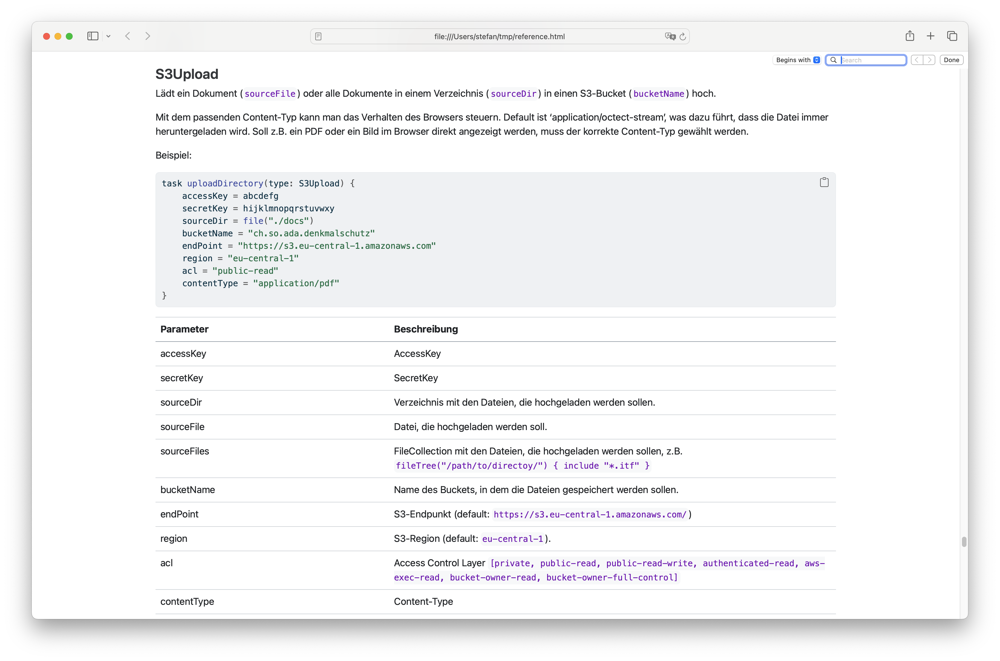

---
= Documentation as Code
Stefan Ziegler
2024-10-17
:thoth-type: post
:thoth-status: published
:thoth-tags: Quarto, GRETL, Markdown, Java, Doclet
:idprefix:
---
Documentation as Code: Und zwar in zweifacher Hinsicht. Einerseits will ich Dokumentation wie Code behandeln und andererseits steckt ein Grossteil der Informationen, die ich in der Dokumentation haben will, direkt beim Quellcode (also eher _from_ Code). Konkret geht es um die https://gretl.app[GRETL]-Dokumentation. Zu Beginn gab es &laquo;nur&raquo; die https://github.com/sogis/gretl/blob/master/docs/user/index.md[Referenzdokumentation] als einzelne Markdown-Datei im GRETL-Git-Repository. Diese wird manuell nachgeführt. Es gibt eine Beschreibung des Tasks, die erklären soll für was der Task verwendet werden kann, gefolgt von Beispielen und der Auflistung sämtlicher für den Benutzer relevanten Properties (also z.B. der Name der Datei, die man mit `ilivalidator` geprüft haben will) in einer Tabelle. Die Tabelle besteht aus Propertyname und Beschreibung (ggf. noch mit Defaultwert). Letztes Jahr folgte die Webseite https://gretl.app[gretl.app], die neben weiteren Informationen auch die Referenzdokumentation beinhaltet. Die Webseite ist mit https://quarto.org/[Quarto] gemacht und wird in einem von https://github.com/sogis/gretl[GRETL] separaten https://github.com/sogis/gretl-docs[Github-Repository] vorgehalten. Das führt jetzt natürlich zum Problem, dass die Referenzdokumentation an zwei Orten vorgehalten wird und erst noch händisch nachgeführt werden muss. Aus dem Code-Repository möchte ich die Referenzdokumentation nicht entfernen, aber den Webseiten-Code auch nicht ins Code-Repository migrieren. Ein weiteres Problem ist das händische Nachführen der Referenzdokumentation. Die Prosabeschreibung des Tasks und die Beispiele tuen mir nicht weh, jedoch schmerzt mich die Tabelle mit den Properties, da diese Information bereits (fast vollständig) im GRETL-Quellcode bei den Custom Tasks vorhanden ist. Ausserdem stört mich, dass der Datentyp in der Tabelle nicht ersichtlich ist, ebenso fehlt die Information, ob ein Property optional ist oder nicht.

Für letzteres (technisches) Problem hatte ich relativ schnell eine Idee: Mit Javadoc gibt es ein Werkzeug, das aus den Java-Quelltexten automatisch HTML-Output generiert. Dazu gibt es ein https://openjdk.org/groups/compiler/using-new-doclet.html[Doclet API] mit dem man eigene sogenannte Doclets schreiben kann und so Informationen aus den Java-Quelltexten in beliebige Formate schreiben kann. Die Idee war nun, dass ich mir ein Doclet schreibe, das die Task-Properties in eine Markdown-Tabelle schreibt. Diese Markdown-Tabelle (pro Task) referenziere ich als externe Quelle im &laquo;Rahmen-Referenzdokumentations-Markdown&raquo; (mit der Prosa-Beschreibung und den Beispielen) und generiere so die fertige Referenzdokumentation resp. Webseite.

Das Doclet zu implementieren war nicht allzu schwierig. Trotzdem gab es eine Herausforderung zu meistern: Eigentlich ist sonnenklar, was von der Java-Klasse (welche den Task implementiert) in der Tabelle landen soll. Nämlich die Properties, die für den Anwender später relevant sind (wieder das Beispiel mit dem Namen der Datei, die geprüft werden soll). Die Java-Klasse (weil vererbt) hat noch viele andere Properties resp. Fields und Methoden, die für meinen Anwendungsfall nicht relevant sind. Im einfachsten Fall sieht der Quellcode eines Custum-Gradle-Tasks so aus:

[source,java,linenums]
----
public class S3Download extends DefaultTask {
    /**
    * AWS Access Key
    */
    @Input
    public String accessKey;
    
    @Input
    public String secretKey;

    @Input
    public String bucketName;
    
    @Input 
    public String key;
    
    @OutputDirectory
    public File downloadDir;
    
    @Input
    @Optional
    public String endPoint = "https://s3.eu-central-1.amazonaws.com";
    
    @Input
    public String region = "eu-central-1";
        
    @TaskAction
    public void upload() {
        // do something
    }
}
----

Man sieht, dass die Properties annotiert sind. Man findet dank den Annotationen genau die Properties, die man will. Hat das Property einen Kommentar, kann man auch diesen mit der Doclet-API auslesen. Leicht komplizierter wird es, weil es auch noch weitere Arten gibt einen Task zu schreiben:

[source,java,linenums]
----
public class S3Upload extends DefaultTask {
    private String accessKey;
    private String secretKey;
    private Object sourceDir;
    private Object sourceFile;
    private Object sourceFiles;
    private String bucketName;
    private String endPoint = "https://s3.eu-central-1.amazonaws.com";
    private String region = "eu-central-1";
    private String acl = null;
    private String contentType = null;
    private Map<String,String> metaData = null;

    /**
    * AWS Access Key
    */
    @Input
    public String getAccessKey() {
        return accessKey;
    }

    @Input
    public String getSecretKey() {
        return secretKey;
    }

    public void setAccessKey(String accessKey) {
        this.accessKey = accessKey;
    }

    public void setSecretKey(String secretKey) {
        this.secretKey = secretKey;
    }
    ...
----

Die Annotationen stehen bei dieser Variante nicht mehr bei den Properties, sondern bei der Getter-Methode. Eine dritte Variante kennt gar keine Properties (im Quellcode) mehr, sondern es wird nur noch ein abstrakter Getter geschrieben:

[source,java,linenums]
----
public abstract class S3Upload extends DefaultTask {
    /**
    * AWS Access Key
    */
    @Input
    public abstract Property<String> getAccessKey();

    @Input
    public abstract Property<String> getSecretKey();
    ...
----

Das Doclet muss mit diesen Varianten umgehen können und als Produkt sowas ausspucken:

[source,markdown,linenums]
----
Parameter | Datentyp | Beschreibung | Optional
----------|----------|-------------|-------------
accessKey | `Property<String>` | AWS Access Key | nein
secretKey | `Property<String>` |  | nein
----

Das https://github.com/edigonzales/gretl-doclet[Doclet]-Proof-of-Concept liefert und ich kann die Markdown-Tabellen in Quarto einbinden. Das löst das technische Problem. 

Das organisatorische Problem (wo liegt welcher Code?) ist mit dem Doclet noch nicht gelöst. Für die Lösungsfindung kommt erschwerend hinzu, dass ich auch die Dokumentation verschiedener GRETL-Versionen greifbar haben will. Wir verwenden bei uns häufig zwei Versionen parallel und für diese möchte ich die korrekte Dokumentation bereitstellen. Nach ein paar schlechten Lösungen bin ich glaub auf die bisher beste Variante gestossen: 

Die Referenzdokumentation verbleibt originär im GRETL-Repository. Das Release-Management von GRETL sieht vor, dass jeder Commit (in bestimmten Branches) zu einem Release führt. Die vollständige Version (major.minor.patch) von GRETL ist nur innerhalb der Pipeline (Github Action) bekannt, da die Patch-Nummer der Job-Run-Nummer entspricht (was aber auch nicht super genial ist, da diese nicht ewig stabil ist). D.h. dass während eines GRETL-Builds die Referenzdokumentation hergestellt wird, zuerst mit Javadoc die Markdown-Tabellen, anschliessend wird mit Quarto eine einzelne HTML-Seite hergestellt. Jede Version dieser HTML-Seite wird irgendwohin deployed (z.B. S3). So in etwa wie https://docs.interlis.ch[docs.interlis.ch] (leicht _anderes_ CSS, versprochen):

Die Webseite https://gretl.app[gretl.app] zeigt weiterhin nur eine Version und wird auch weiterhin in einem separaten Repo verwaltet. Die Pipeline, welche die Webseite herstellt, wird nur bei Bedarf (manuell) ausgelöst (oder z.B. aus dem main-Branch von GRETL getriggert). Die Pipeline muss auch den GRETL-Quellcode auschecken und die Referenzdokumentation als Teil der Webseite herstellen.

Soweit meine Idee zur Organisation. Gibt es weitere Vorschläge?
