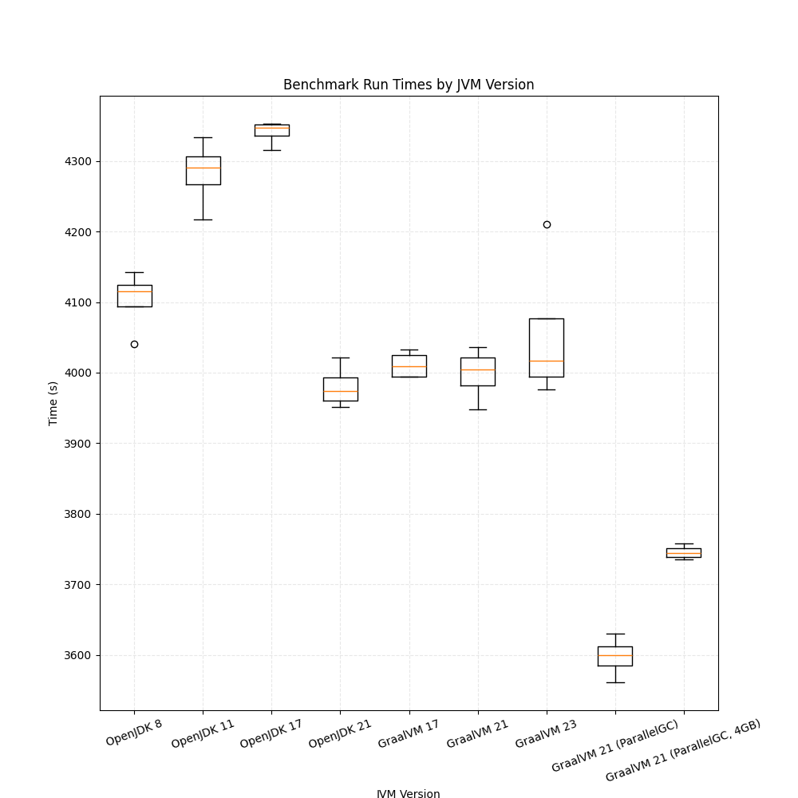

---
= INTERLIS leicht gemacht #43 - ilivalidator JVM-Benchmarking (revisited)
Stefan Ziegler
2024-10-20
:thoth-type: post
:thoth-status: published
:thoth-tags: INTERLIS,Java,ilivalidator,JVM,GraalVM,OpenJDK
:idprefix:
---
Angespornt durch mein https://blog.sogeo.services/blog/2024/10/15/geoserver_on_steroids.html[GeoServer-Benchmarking] wollte ich https://blog.sogeo.services/blog/2021/11/28/interlis-leicht-gemacht-number-27.html[ein weiteres Mal] das Verhalten von https://github.com/claeis/ilivalidator[`ilivalidator`]  mit verschiedenen JVM-Varianten unter die Lupe nehmen. Gibt es irgendwelche Kombinationen von JVM-Version, RAM-Zuteilung, Garbage-Collector, die besonders schnell oder langsam sind?

Für das Benchmarking habe ich die Nutzungsplanung des Kantons Thurgau verwendet. Diese ist als einzelne XTF-Datei auf https://geodienste.ch/downloads/npl_nutzungsplanung?data_format=xtf_canton[geodienste.ch] bereitgestellt und hat darum eine entsprechende Grösse und https://github.com/claeis/ilivalidator[`ilivalidator`] hat einiges zu rechnen. Letztes Mal habe ich noch INTERLIS-1-Datensätze geprüft. Das lasse ich sein, das sollte langsam Geschichte sein. 

Als Hardware dient mir der Dedicated-vCPU-Server aus dem https://blog.sogeo.services/blog/2024/10/15/geoserver_on_steroids.html[GeoServer-Benchmarking] mit 32 GB RAM und 16 Kernen, wobei die Anzahl Kerne für dieses Benchmarking nebensächlich ist.

Mit einem https://www.jbang.dev/[JBang]-&laquo;Java-Skript&raquo; prüfe ich 100 Mal die Transferdatei inkl. Katalog und schreibe die benötigte Zeit in Sekunden in die Konsole:

[source,java,linenums]
----
///usr/bin/env jbang "$0" "$@" ; exit $?
//REPOS mavenCentral,ehi=https://jars.interlis.ch/
//DEPS ch.interlis:ilivalidator:1.14.3

import org.interlis2.validator.Validator;
import ch.ehi.basics.settings.Settings;

import static java.lang.System.*;

import java.text.SimpleDateFormat;
import java.util.Date;

public class run_ilivalidator {

    public static void main(String... args) {
        SimpleDateFormat dateFormat = new SimpleDateFormat("yyyy-MM-dd HH:mm:ss.SSS");

        long startTime = System.currentTimeMillis();
        Date startDate = new Date(startTime);
        out.println("Start Time: " + dateFormat.format(startDate));

        Settings settings = new Settings();
        settings.setValue(Validator.SETTING_ALL_OBJECTS_ACCESSIBLE, Validator.TRUE);
        settings.setValue(Validator.SETTING_ILIDIRS, ".");

        for (int i=0; i<100; i++) {
            boolean valid = Validator.runValidation(new String[] {"Nutzungsplanung_Catalogue_CH_V1_2_20210901.xml", "Nutzungsplanung_LV95_V1_2.xtf"}, settings);
        }

        long endTime = System.currentTimeMillis();
        Date endDate = new Date(endTime);
        System.out.println("End Time: " + dateFormat.format(endDate));

        long timeTaken = endTime - startTime;
        out.println("Time taken: " + timeTaken / 1000 + " seconds");
    }
}
----

Die INTERLIS-Datenmodelle lagen alle lokal vor und es mussten keine Requests zu anderen Repos gemacht werden. Die 100-fache Ausführung (= 100 x ~40s) der Validierung innerhalb der gleichen JVM sollte vorhandene Performanceunterschiede hervorheben. Für jede verwendete JVM habe ich den Benchmark 4 Mal durchgeführt. Verwendet wurden folgende JVM:

- GraalVM 23
- GraalVM 21
- GraalVM 17
- OpenJDK 21
- OpenJDK 17
- OpenJDK 11
- OpenJDK 8

Das Resultat habe ich in einem Matplotlib-Chart zusammengestellt. Eigentlich wollte ich bloss Punkte zeichnen, das habe ich jedoch nicht hingekriegt. Darum gibts jetzt pseudo-wissenschaftliche Boxplots:

Es scheint als gäbe es einen klaren Gewinner in meinem Testszenario: GraalVM mit ParallelGC. Wobei man davon ausgehen kann, dass ab OpenJDK 21 und GraalVM 17 alle gleich aufliegen (auch mit ParallelGC). Interessant ist die Verschlechterung von OpenJDK bis zur Version 17. 

Die JVM verwendete die Hälfte des vorhandenen RAM: 16 GB. Ich habe die Variante GraalVM 21 (ParallelGC) mit 4 GB Heap laufen lassen und komme auf ein minimal schlechteres Resultat. Der Versuch mit 2 GB war nicht erfolgreich und führte zu Out of Memory Fehlern. Der RAM-Verbrauch ist relativ gering, steigt jedoch rapide an bei AREA-Validierungen (soweit meine Beobachtung).

Eine allgemein gültige Empfehlung ist schwierig anhand dieses Testes. Letztes Mal hat INTERLIS 1 eine leicht andere Resultatcharakteristik gezeigt als INTERLIS 2. Eventuell führen stark unterschiedliche Datensätze (viele oder wenig Geometrien, AREA- oder keine AREA-Prüfung, viele oder wenig Constraints) zu unterschiedlichen Resultaten. Aber bis auf weiteres würde ich (für institutionaliserte Betreiber) eine aktuelle JVM empfehlen (ab 21) und ParallelGC.

Links:

- https://github.com/edigonzales/ilivalidator-benchmark