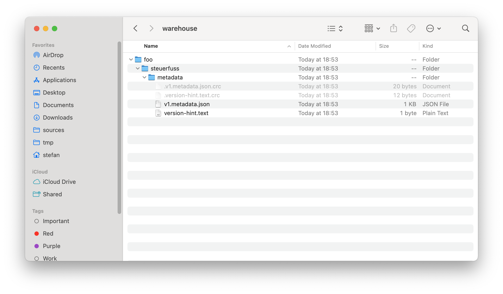
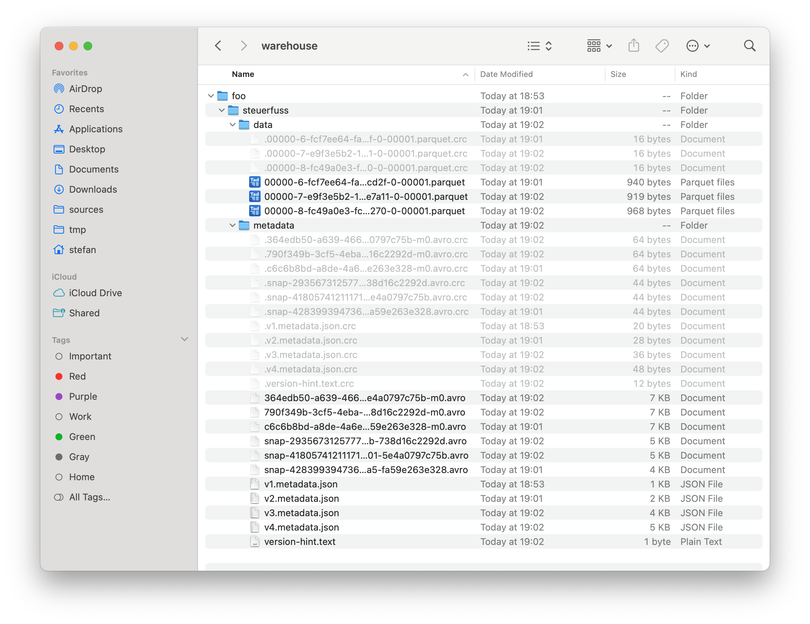
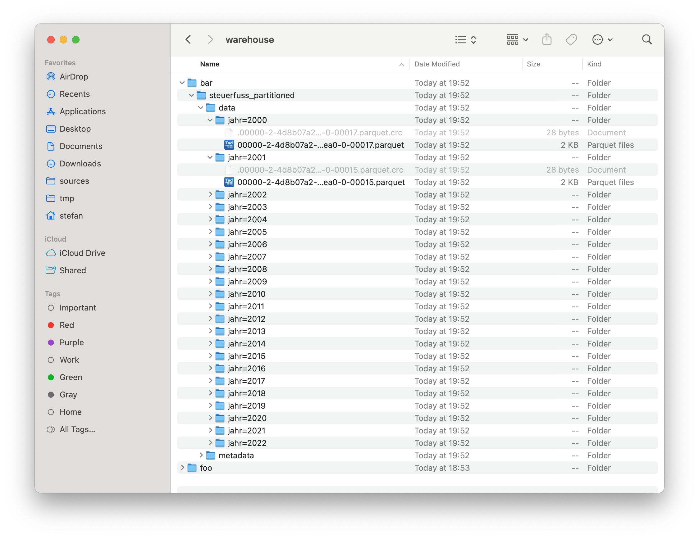

---
= The house at the lake #1 - Iceberg ahead
Stefan Ziegler
2025-01-05
:thoth-type: post
:thoth-status: published
:thoth-tags: Iceberg,Lakehouse,Data Lake,Parquet,Spark
:idprefix:
---
Data Lake, Data Swamp, Data Lakehouse... Man kommt fast nicht hinterher. Kaum meint man minimal etwas verstanden zu haben, kommt schon was neues. Weil auch im Kanton nun ab und an das Stichwort &laquo;Dateninfrastruktur&raquo; fällt, wollte ich mich ein wenig in die Data Lake Thematik einlesen. Nur eben um zu merken, dass man jetzt keinen Data Lake mehr macht, sondern eben ein Data Lakehouse. Ich habe nie wirklich verstanden, was so genial am Data Lake sein soll. Da werden lustig unstrukturiert irgendwo Daten abgelegt. Wie man nun darauf zugreift, resp. überhaupt was finden soll - haha im Data Swamp - entzieht sich meiner Kenntnis. Und da kommt nun das Data Lakehouse ins Spiel: Vielleicht lässt sich sagen, dass ein Data Lakehouse aus einem Data Lake besteht, der mit Metadaten und Data Governance angereichert wird (und so wieder mehr einem Data Warehouse ähnelt).

Statt eines Haufens von Dateien in beliebigen Formaten gibt es im Lakehouse z.B. ein einziges Tabellenformat und die Daten werden dort gespeichert. Der Datenzugriff erfolgt dann mit diversen Clients via Metadaten auf dieses Tabellenformat und nicht mehr direkt auf die Dateien. Es wird auch häufig von Katalogen gesprochen. Hier hat es bei mir noch nicht klick gemacht. Wahrscheinlich - déformation professionnelle - verstehe ich was anderes darunter. Vielleicht wird es auch verschiedene Kataloge geben müssen: eher was technisches für die Maschinen und etwas für den Menschen, der nach einem bestimmten Thema sucht und nicht weiss, wie eine bestimmte Tabelle genau heisst.

Das Tabellenformat ist das Tabellenformat. D.h. es darf nicht mit einem Dateiformat verwechselt werden, welches wiederum vom Tabellenformat verwendet werden kann, um die Daten tatsächlich zu speichern und es ist eben auch &laquo;nur&raquo; das Tabellenformat: Es stellt nicht eine Berechnungsengine zur Verfügung, so wie man das vom klassischen Data Warehouse kann, wo die relationale Datenbank sich um das Speichern der Daten kümmert und auch die Bearbeitungsmöglichkeit derselben mittels SQL zur Verfügung stellt. Wenn man mit den Daten in einem Data Lakehouse auch arbeiten will, braucht es noch mindestens eine weitere Kompenente.

Ein für ein Data Lakehouse sinnvolles Tabellenformat muss  https://en.wikipedia.org/wiki/ACID[ACID]-Transaktionen unterstützen, so wie man es auch von relationen Datenbanken kennt. Ein solches Tabellenformat ist z.B. https://iceberg.apache.org/[Apache Iceberg]. Es gibt noch weitere aber von Iceberg liest man momentan relativ viel und anscheined hat Iceberg den &laquo;table format war&raquo; gewonnen. Und mit Iceberg wollte ich nun mal arbeiten, um ein Gespür zu bekommen, was das genau heisst und was für Komponenten im Spiel sind.

Apache Iceberg ist nicht etwas, was man einfach mittels &laquo;setup.exe&raquo; installiert. Es ist vor allem eine Spezifikation, bietet aber auch noch ein paar Libraries an, damit bestehende Werkzeuge damit arbeiten können. Starten müssen wir aber mit https://spark.apache.org/[Apache Spark]. Das wird unser Client, um Daten in Iceberg speichern zu können. Ich https://spark.apache.org/downloads.html[wähle] die Version 3.5.4 und den Package-Typ &laquo;Pre-built for Apache Hadoop 3.3 and later&raquo;. Grundvoraussetzung ist, dass Java installiert ist. Mit Version 11 und 17 liegt man nicht falsch. Mit Version 21 geht es noch nicht. Spark bietet drei Benutzerinterfaces an: SQL, Scala-Shell und Python-Shell. Falls man Scala (Version 2.12) und Python verwenden will, muss man diese ebenfalls installieren. Scala habe ich mit https://sdkman.io/[SDKMAN] installiert und Python hatte ich bereits installiert gehabt. Apache Spark entzippt man und ergänzt die PATH-Variable, z.B. in der _.zshrc_-Datei:

----
export SPARK_HOME=/Users/stefan/apps/spark-3.5.4-bin-hadoop3
export PATH=$SPARK_HOME/bin:$SPARK_HOME/sbin:$PATH
----

Der Aufruf `spark-shell --version` sollte circa folgenden Output liefern:

----
25/01/04 18:24:26 WARN Utils: Your hostname, Monterrico.local resolves to a loopback address: 127.0.0.1; using 10.0.1.12 instead (on interface en0)
25/01/04 18:24:26 WARN Utils: Set SPARK_LOCAL_IP if you need to bind to another address
Welcome to
      ____              __
     / __/__  ___ _____/ /__
    _\ \/ _ \/ _ `/ __/  '_/
   /___/ .__/\_,_/_/ /_/\_\   version 3.5.4
      /_/

Using Scala version 2.12.18, OpenJDK 64-Bit Server VM, 17.0.10
Branch HEAD
Compiled by user yangjie01 on 2024-12-17T04:51:46Z
Revision a6f220d951742f4074b37772485ee0ec7a774e7d
Url https://github.com/apache/spark
Type --help for more information.
----

Und nun wirds kompliziert: die Kataloge ins Spiel. Wir müssen eine Spark-Session (egal bei welchem der drei Interfaces) so konfigurieren, dass man mit Iceberg zusammenarbeiten kann. Mit `spark-sql` sieht ein Start-Aufruf so aus:

----
spark-sql --packages org.apache.iceberg:iceberg-spark-runtime-3.5_2.12:1.7.1 \
--conf spark.sql.extensions=org.apache.iceberg.spark.extensions.IcebergSparkSessionExtensions \
--conf spark.sql.catalog.local=org.apache.iceberg.spark.SparkCatalog \
--conf spark.sql.catalog.local.type=hadoop \
--conf spark.sql.catalog.local.warehouse=/Users/stefan/tmp/warehouse
----

Es wird eine zusätzliche Library benötigt. Dabei ist auf die passende Version zu achten: `3.5` für Spark, `2.12` für Scala und `1.7.1` für Iceberg. Beim Start wird die Jar-Datei herunterladen. Man kann sie aber auch einmalig herunterladen und in den _jars_-Ordern der Spark-Installation kopieren.

Mit der zweiten Zeile teilen wir Spark mit, dass wir Iceberg-Extensions verwenden wollen. Und dann kommen drei Zeilen mit den Katalogen und ich kann immer noch nicht genau abgrenzen, ob es ein Spark-Katalog, ein Iceberg-Katalog oder was auch immer ist. Jedenfalls verstehe ich es so, dass es darum geht den Typ des Iceberg-Kataloges auszuwählen. Mit `hadoop` wählen wir die einfachste file-basierte Variante eines Katalogs aus (eignet sich nicht für Produktion). Die Daten selber werden unter `warehouse` gespeichert. Hier wird in Produktion häufig ein S3-Bucket stehen. Der Namen des Katalogs ist `local` und darf auch anders heissen und trotzdem ein lokaler Katalog sein. Den Befehl setzt man in der Konsole ab und falls alles gut geht, erscheint: `spark-sql (default)>`. 

Zeit, um Tabellen und Daten zu erzeugen:

[source,sql,linenums]
----
CREATE TABLE local.foo.steuerfuss (jahr int, gemeinde string, steuerfuss int) USING iceberg;
----

Die Tabellen werden qualifiziert angesprochen, wobei `local` der Katalog ist, `foo` der Namespace (entspricht plusminus einem DB-Schema) und `steuerfuss` der Tabellenname ist. 

Auf dem Dateisystem werden erste Verzeichnisse und Dateien erstellt:

[source,sql,linenums]
----
INSERT INTO local.foo.steuerfuss (jahr, gemeinde, steuerfuss) VALUES (2000, 'Aedermannsdorf', 150);
----

[source,sql,linenums]
----
INSERT INTO local.foo.steuerfuss (jahr, gemeinde, steuerfuss) VALUES (2000, 'Aeschi (SO)', 135);
----

[source,sql,linenums]
----
INSERT INTO local.foo.steuerfuss (jahr, gemeinde, steuerfuss) VALUES (2000, 'Balm bei Günsberg', 110);
----

Mit `SELECT` kann ich mir die drei Records anzeigen lassen:

----
spark-sql (default)> SELECT * FROM local.foo.steuerfuss;
2000	Aeschi (SO)	135
2000	Aedermannsdorf	150
2000	Balm bei Günsberg	110
Time taken: 0.067 seconds, Fetched 3 row(s)
spark-sql (default)>
----

Viel interessanter ist jedoch, was auf dem Dateisystem abging:

Es gibt mehr Metadaten und einen _data_-Ordner. In diesem _data_-Ordner sind drei Parquet-Dateien. Die Daten speichert Iceberg in Parquet-Dateien (andere Formate stehen zur Auswahl). Was besonders auffällt, ist natürlich, dass es drei Stück gibt und wir haben drei INSERT-Befehle gemacht. Häufig führt wahrscheinlich schon jeder INSERT-Befehl zu einer zusätzlichen Datei, wobei ein INSERT-Befehl natürlich mehrere Records beinhalten kann. In unserem Fall ist in jeder Parquet-Datei auch jeweils nur genau ein Record. Man kann die maximale Grösse von Parquet-Dateien konfigurieren und man will  bei ganz vielen vorliegenden Dateien aus Performancegründen diese zu einer grösseren zusammenführen können (auch das ist möglich mit sogenannten &laquo;compaction jobs&raquo;).

Apache Iceberg unterstützt Snapshots und Time Travel. Jede Transaktion (in unserem Fall die drei INSERT-Befehle) führt zu einem Snapshot:

----
spark-sql (default)> SELECT * FROM local.foo.steuerfuss.snapshots;
2025-01-04 19:01:55.286	4283993947365810884	NULL	append	/Users/stefan/tmp/warehouse/foo/steuerfuss/metadata/snap-4283993947365810884-1-c6c6b8bd-a8de-4a6e-88a5-fa59e263e328.avro	{"added-data-files":"1","added-files-size":"940","added-records":"1","app-id":"local-1736012466059","changed-partition-count":"1","engine-name":"spark","engine-version":"3.5.4","iceberg-version":"Apache Iceberg 1.7.1 (commit 4a432839233f2343a9eae8255532f911f06358ef)","spark.app.id":"local-1736012466059","total-data-files":"1","total-delete-files":"0","total-equality-deletes":"0","total-files-size":"940","total-position-deletes":"0","total-records":"1"}
2025-01-04 19:02:01.306	4180574121117132588	4283993947365810884	append	/Users/stefan/tmp/warehouse/foo/steuerfuss/metadata/snap-4180574121117132588-1-364edb50-a639-4665-8e01-5e4a0797c75b.avro	{"added-data-files":"1","added-files-size":"919","added-records":"1","app-id":"local-1736012466059","changed-partition-count":"1","engine-name":"spark","engine-version":"3.5.4","iceberg-version":"Apache Iceberg 1.7.1 (commit 4a432839233f2343a9eae8255532f911f06358ef)","spark.app.id":"local-1736012466059","total-data-files":"2","total-delete-files":"0","total-equality-deletes":"0","total-files-size":"1859","total-position-deletes":"0","total-records":"2"}
2025-01-04 19:02:05.316	2935673125777738477	4180574121117132588	append	/Users/stefan/tmp/warehouse/foo/steuerfuss/metadata/snap-2935673125777738477-1-790f349b-3cf5-4eba-b95b-738d16c2292d.avro	{"added-data-files":"1","added-files-size":"968","added-records":"1","app-id":"local-1736012466059","changed-partition-count":"1","engine-name":"spark","engine-version":"3.5.4","iceberg-version":"Apache Iceberg 1.7.1 (commit 4a432839233f2343a9eae8255532f911f06358ef)","spark.app.id":"local-1736012466059","total-data-files":"3","total-delete-files":"0","total-equality-deletes":"0","total-files-size":"2827","total-position-deletes":"0","total-records":"3"}
Time taken: 0.055 seconds, Fetched 3 row(s)
spark-sql (default)>
----

Die erste Spalte ist der Zeitstempel und die zweite Spalte die Snapshot-ID. Mit dieser ID kann ich einfach einen bestimmten Datenstand aufrufen:

----
spark-sql (default)> SELECT * FROM local.foo.steuerfuss VERSION AS OF 4180574121117132588;
2000	Aedermannsdorf	150
2000	Aeschi (SO)	135
Time taken: 0.065 seconds, Fetched 2 row(s)
spark-sql (default)>
----

Und schon sind es nur noch zwei Records. Ähnlich funktioniert es mit dem Timestamp:

----
spark-sql (default)> SELECT * FROM local.foo.steuerfuss TIMESTAMP AS OF '2025-01-04 19:01:55.286';
2000	Aedermannsdorf	150
Time taken: 0.066 seconds, Fetched 1 row(s)
spark-sql (default)>
----

Snapshots kann und soll man wohl von Zeit zu Zeit löschen, da sonst auch wieder die Performance massiv leidet. Es beschleicht mich das Gefühl, dass die &laquo;korrekte&raquo; Konfiguration von Iceberg auch nicht ganz ohne ist.

Ein weiteres interessantes Feature von Apache Iceberg ist das Partitioning. Nehmen wir an, wir haben einen sehr grossen Datensatz. Es gibt pro Jahr (das als Attribut im Tabellenschema vorhanden ist) sehr viele Records. Abfragen werden häufig für ein bestimmtes Jahr gemacht. Dann können die Daten in der Tabelle auch gruppiert nach Jahr gespeichert werden. So werden die Queries viel schneller. Als Beispiel importieren wir mit der Python-Shell eine Parquet-Datei mit den Steuerfüssen sämtlicher Gemeinden für die Jahre 2000 - 2022. Das Starten ist gleich wie bei der SQL-Shell, nur mit `pyspark`:

----
pyspark --packages org.apache.iceberg:iceberg-spark-runtime-3.5_2.12:1.7.1 \
--conf spark.sql.extensions=org.apache.iceberg.spark.extensions.IcebergSparkSessionExtensions \
--conf spark.sql.catalog.local=org.apache.iceberg.spark.SparkCatalog \
--conf spark.sql.catalog.local.type=hadoop \
--conf spark.sql.catalog.local.warehouse=/Users/stefan/tmp/warehouse
----

Mit Python ist es möglich auf Basis einer Parquet-Datei eine Tabelle zu erstellen und sämtliche Daten innerhalb einer Transaktion zu importieren:

[source,python,linenums]
----
from pyspark.sql import SparkSession

parquet_df = spark.read.parquet("/Users/stefan/Downloads/ch.so.agem.steuerfuesse.natuerliche_personen.parquet")
print(parquet_df)

parquet_df.writeTo("local.bar.steuerfuss_partitioned").partitionedBy("jahr").using("iceberg").createOrReplace()
----

Die Befehle dünken mich selbsterklärend. Die Struktur auf dem Dateisystem sieht entsprechend gegliedert aus:

Zu guter Letzt nochmal was zu meiner Nemesis, den Katalogen: Wie erwähnt gibt es verschiedene Typen von Iceberg-Katalogen. Ein weiterer Typ ist &laquo;jdbc&raquo;. In diesem Fall werden bestimmte Metainformationen in einer relationalen Datenbank gespeichert. Die Konfiguration (mit Scala) ist folgendermassen:

----
import org.apache.spark.sql.SparkSession

val spark = SparkSession.builder()
  .appName("IcebergExample")
  .config("spark.sql.catalog.local", "org.apache.iceberg.spark.SparkCatalog")
  .config("spark.sql.catalog.local.type", "jdbc")
  .config("spark.sql.catalog.local.jdbc.url", "jdbc:sqlite:/Users/stefan/tmp/iceberg_metadata.db")
  .config("spark.sql.catalog.local.jdbc.driver", "org.sqlite.JDBC")
  .config("spark.sql.catalog.local.warehouse", "file:/Users/stefan/tmp/warehouse")
  .getOrCreate()

import spark.implicits._

spark.sql("CREATE TABLE local.default.sample_table (id INT, name STRING) USING iceberg")
----

Dabei darf man sich nicht irritieren lassen, dass die SQLite-Datenbank erst nach dem Erstellen einer ersten Iceberg-Tabelle erzeugt wird (Hallo Zukunfts-Stefan).

Mein Lakehouse-Zwischenfazit: Abklären, was man eigentlich will und was die Anforderungen sind, sollte man schon noch vor der Realisierung eines Data Lakehouses. Vielleicht reicht auch wie fast immer eine PostgreSQL-Datenbank und bisschen Parquet-Dateien und DuckDB. Wir werden wohl nicht so schnell hunderte von Petabytes an Daten vorliegen haben.

Links:

- https://www.upsolver.com/blog/apache-iceberg-vs-parquet-file-formats-vs-table-formats
- https://medium.com/@ajanthabhat/iceberg-catalogs-choosing-the-right-one-for-your-needs-77ff6dcfaec0
- https://medium.com/snowflake/polaris-catalog-if-you-have-been-napping-9005909dc1fa
- Geospatial Support: https://github.com/apache/iceberg/issues/10260