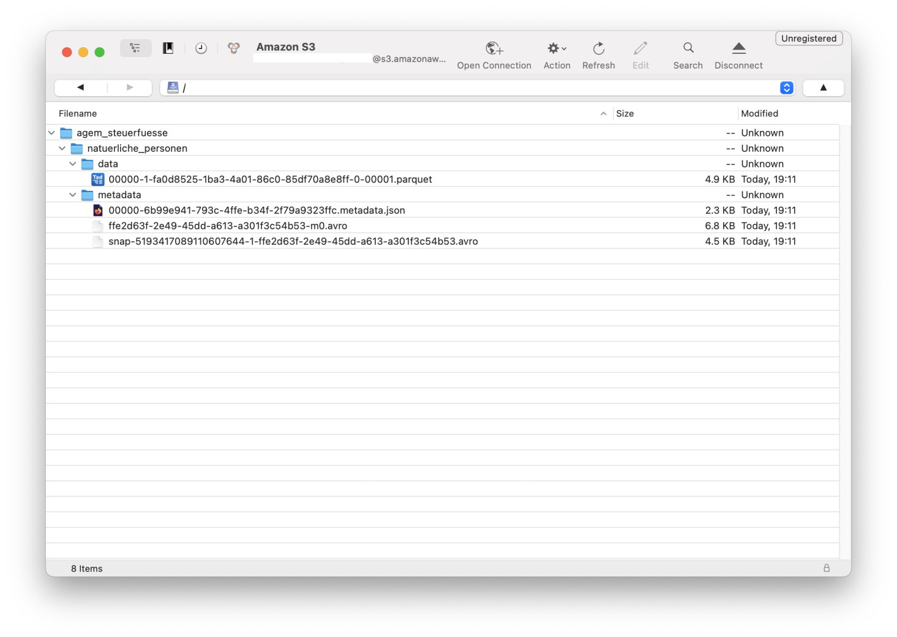

---
= The house at the lake #2 - Start your engines
Stefan Ziegler
2025-01-12
:thoth-type: post
:thoth-status: published
:thoth-tags: Iceberg,Lakehouse,Data Lake,Parquet,Spark,DuckDB,Trino,JDBC,Python
:idprefix:
---
Nachdem wir uns im https://blog.sogeo.services/blog/2025/01/05/house-at-the-lake-01.html[ersten Teil] um das Speichern der Daten in unserem Data Lakehouse gekümmert haben, möchten wir jetzt mit den Daten arbeiten, d.h. wir brauchen eine Compute oder Query Engine. Es gibt verschiedene Engines, die auf https://iceberg.apache.org/[Iceberg] Tables zugreifen können. Anschliessend drei Beispiele dazu. Es sei nochmals darauf hingewiesen, dass man es nicht mit drei verschiedenen Datenbankklienten vergleichen kann. In DB-Fall verursachen die Klienten die (gleiche) Last auf dem Datenbankserver. Aufgrund der Trennung von Speichern und Compute in einem Data Lakehouse, liegt die Rechenlast bei der Query Engine selber.

Die erste Möglichkeit haben wir bereits im https://blog.sogeo.services/blog/2025/01/05/house-at-the-lake-01.html[vorangegangenen Blogbeitrag] kennengelernt: https://spark.apache.org/[Spark]. Spark diente mir hauptsächlich zum Anlegen der Iceberg-Tabellen. Man kann damit aber auch beliebige Analysen machen. Es gibt drei Benutzerinterfaces: SQL, Scala und Python. Die beiden letzten würde man wohl verwenden, wenn man für seine Analyse weitere Bibliotheken verwende möchte oder muss. Ich setze mir als Ziel die Tabelle der Steuerfüsse der natürlichen Personen, die ich in mein Data Lakehouse importiert habe, in eine Excel-Datei zu exportieren. Ich verwende für dieses Beispiel _pyspark_ und muss zuerst noch weitere Bibliotheken herunterladen:

----
python -m venv .venv
source .venv/bin/activate
pip install setuptools pandas openpyxl
----

Das Python-Skript sieht wie folgt aus:

[source,bash,linenums]
----
from pyspark.sql import SparkSession
import pandas as pd

spark = SparkSession.builder \
    .appName("IcebergLocal") \
    .config("spark.sql.extensions", "org.apache.iceberg.spark.extensions.IcebergSparkSessionExtensions") \
    .config("spark.sql.catalog.local", "org.apache.iceberg.spark.SparkCatalog") \
    .config("spark.sql.catalog.local.type", "hadoop") \
    .config("spark.sql.catalog.local.warehouse", "/Users/stefan/tmp/warehouse/") \
    .getOrCreate()

spark.sql("USE local.agem_steuerfuesse")

result_df = spark.sql("""
    SELECT 
        *
    FROM 
        natuerliche_personen
"""
)

result_df.show()

pandas_df = result_df.select("*").toPandas()
pandas_df.to_excel("/Users/stefan/tmp/myresult.xlsx", index=False)
----

Der Aufruf muss nicht in der Shell passieren, sondern kann als pyspark-Befehl auf der Konsole ausgeführt werden:

----
pyspark --packages org.apache.iceberg:iceberg-spark-runtime-3.5_2.12:1.7.1 < to_excel.py
----

Man benötigt für den Export in eine Excel-Datei https://pandas.pydata.org/[Pandas]. Dazu muss der Spark Dataframe in einen Pandas Dataframe umgewandelt werden. 

So weit, so unspektakulär. Spannender wird es mit der zweiten Möglichkeit: DuckDB:

Mit DuckDB erweitere ich meinen Anwendungsfall ein wenig. Ich möchte die Steuerfüsse in eine Excel-Datei exportieren. Zusätzlich soll die Fläche jeder Gemeinde als Spalte mitexportiert werden (bisschen Geo muss ja sein...). DuckDB hat eine https://duckdb.org/docs/extensions/iceberg.html[Iceberg Extension], die man installieren muss. Die Anwendung ist relativ simpel. Man kann auf die Live-Daten, Metadaten und Snapshots zugreifen:

[source,sql,linenums]
----
SELECT count(*)
FROM iceberg_scan('/Users/stefan/tmp/warehouse/agem_steuerfuesse/natuerliche_personen', allow_moved_paths = true) AS f;

SELECT *
FROM iceberg_metadata('/Users/stefan/tmp/warehouse/agem_steuerfuesse/natuerliche_personen', allow_moved_paths = true);

SELECT *
FROM iceberg_snapshots('/Users/stefan/tmp/warehouse/agem_steuerfuesse/natuerliche_personen');
----

Nach Iceberg schreiben geht noch nicht. Was - soweit ich es verstanden habe - auch noch https://github.com/duckdb/duckdb-iceberg/issues/16[nicht] (gut) unterstützt wird, sind die Kataloge. DuckDB benötigt eine `version-hint.text`-Datei. Diese verweist auf die aktuelle Version der Daten. Fehlt diese, kann man versuchen direkt die https://github.com/duckdb/duckdb-iceberg/issues/29[Metadaten-JSON-Datei] anzugeben. Aber von nativer Katalogunterstützung ist man noch ein Stück weit entfernt. 

Meinen Anwendungsfall kann ich mit purem SQL umsetzen:

[source,sql,linenums]
----
CREATE TEMP TABLE myresult AS
WITH steuern AS (
  SELECT
    *
  FROM 
    iceberg_scan('/Users/stefan/tmp/warehouse/agem_steuerfuesse/natuerliche_personen', allow_moved_paths = true)
)
SELECT 
  gemndname,
  ST_Area(geom),
  steuerfuss_in_prozent
FROM 
  ST_Read('/vsizip//vsicurl/https://files.geo.so.ch/ch.so.agi.av.hoheitsgrenzen/aktuell/ch.so.agi.av.hoheitsgrenzen.shp.zip', layer='gemeindegrenze') AS g
  LEFT JOIN steuern 
  ON g.gemndname = steuern.gemeinde
;	
COPY (SELECT * FROM myresult) TO '/Users/stefan/tmp/myresult.xlsx' WITH (FORMAT GDAL, DRIVER 'xlsx');
----

Immer wieder schön zu sehen, dass man dank https://gdal.org/en/stable/user/virtual_file_systems.html[_gdal/ogr_] die Daten nicht einmal vorgängig herunterladen muss.

Die dritte Variante ist die aufwändigste und wohl auch die &laquo;most enterprisey&raquo;: https://trino.io/[Trino]. Trino ist eine clusterfähige SQL Query Engine. Die Clusterfähigkeit interessiert uns beim Rumspielen nicht. Spark ist ebenfalls clusterfähig, im Gegensatz zu DuckDB, wo zudem die Last nicht auf einem Server anfällt, sondern auf meinem Rechner. Trino hat mit https://prestodb.io/[Presto] noch etwas ähnliches wie einen Klon (oder wie man das nennen mag). Presto scheint mir eher das Community-Projekt zu sein. Weil ich aber zuerst ein Trino-Dockerimage gefunden habe, mache ich es jetzt damit.

Weil Trino in einem Dockercontainer läuft, muss ich mir Gedanken bezüglich des Zugriffs auf die Iceberg-Tabellen und den Katalog machen. Entweder mounte ich meine lokalen Tabellen einfach in den Container rein oder ich mache es gleich &laquo;richtig&raquo; (kompliziert) und speichere die Tabellen auf S3 und den Katalog in einer PostgreSQL-Datenbank. Letzteres ist keine Herausforderung, da wir es bereits mit SQLite im https://blog.sogeo.services/blog/2025/01/05/house-at-the-lake-01.html[ersten Teil] gemacht haben. 

Weil ich für meinen Anwendungsfall Geodaten benötige, starte ich eine weitere Datenbank, welche die Rolle des (Geo-)Datawarehouses übernimmt. Meine `docker-compose`-Datei:

[source,yaml,linenums]
----
services:
  pub-db:
    image: sogis/postgis:16-3.4-bookworm
    environment:
      POSTGRES_DB: pub
      POSTGRES_USER: postgres
      POSTGRES_PASSWORD: secret
    ports:
      - "54322:5432"
    volumes:
      - type: volume
        source: pgdata_pub
        target: /var/lib/postgresql/data
  iceberg-db:
    image: sogis/postgis:16-3.4-bookworm
    environment:
      POSTGRES_DB: iceberg
      POSTGRES_USER: postgres
      POSTGRES_PASSWORD: secret
    ports:
      - "54324:5432"
    volumes:
      - type: volume
        source: pgdata_iceberg
        target: /var/lib/postgresql/data
  trino:
    image: trinodb/trino
    ports:
      - "8080:8080"
volumes:
  pgdata_pub:
  pgdata_iceberg:
----

Für das Anlegen des Icebgerg-Kataloges und für den Datenimport verwende ich wieder Spark. Leider gibt es keine Möglichkeit einen Schemanamen zu definieren. So landen sämtliche Tabellen des Katalogs im public-Schema. Das Anlegen der Steuerfuss-Tabelle und Importieren der Daten war soweit auch kein Problem. Man muss einzig die korrekten Spark-Konfig-Parameter herausfinden. Das kann ein wenig hakelig sein. Was ich nicht geschafft habe, sind die AWS-S3-Credentials als Parameter zu definieren. Es funktioniert aber problemlos, wenn ich sie als Env-Variable definiere.

Mein pyspark-Skript sieht wie folgt aus:

[source,sql,linenums]
----
from pyspark.sql import SparkSession

spark = SparkSession.builder \
    .appName("IcebergS3") \
    .config("spark.sql.catalog.iceberg", "org.apache.iceberg.spark.SparkCatalog") \
    .config("spark.sql.catalog.iceberg.type", "jdbc") \
    .config("spark.sql.catalog.iceberg.uri", "jdbc:postgresql://localhost:54324/iceberg") \
    .config("spark.sql.catalog.iceberg.jdbc.user", "postgres") \
    .config("spark.sql.catalog.iceberg.jdbc.password", "secret") \
    .config("spark.sql.catalog.iceberg.warehouse", "s3://XXXXXXXXXXXXXXX") \
    .config("spark.sql.catalog.iceberg.io-impl", "org.apache.iceberg.aws.s3.S3FileIO") \
    .config("spark.hadoop.fs.s3a.impl", "org.apache.hadoop.fs.s3a.S3AFileSystem") \
    .config("spark.hadoop.fs.s3a.connection.ssl.enabled", "true") \
    .config("spark.hadoop.fs.s3a.path.style.access", "true") \
    .config("spark.sql.catalog.iceberg.s3.endpoint","https://s3-eu-central-1.amazonaws.com/") \
    .getOrCreate()

parquet_df = spark.read.parquet("/Users/stefan/Downloads/ch.so.agem.steuerfuesse.natuerliche_personen.parquet")
print(parquet_df)

parquet_df.writeTo("iceberg.agem_steuerfuesse.natuerliche_personen").using("iceberg").createOrReplace()
----

Erscheinen keine Fehlermeldungen, sollte der Import funktioniert haben:

Wenn man mit `docker compose up` die Container startet, passiert schon einiges aber noch nicht genau das, was man eigentlich will. Trino hat noch keinen Zugriff auf die Geodatenbank und auf die Iceberg-Tabellen. Dazu müssen mittels https://trino.io/docs/current/connector.html[Connectoren] https://trino.io/docs/current/overview/concepts.html#trino-concept-catalog[Kataloge] definiert werden. Es sind Properties-Dateien, die in einen bestimmten Ordner (`/etc/trino/catalog/`) kopiert werden müssen. Ich habe es so gelöst, dass ich diese in den Container reinmounte. D.h. die `docker-compose`-Datei muss beim Trino-Service um ein Volume erweitert werden:

[source,yaml,linenums]
----
    volumes:
      - type: bind
        source: /Users/stefan/tmp/trino
        target: /etc/trino
----

Die Konfig-Datei `pgpub.properties` für PostgreSQL:

[source,properties,linenums]
----
connector.name=postgresql
connection-url=jdbc:postgresql://pub-db:5432/pub
connection-user=postgres
connection-password=secret
----

Die Konfig-Datei `iceberg.properties` für die Iceberg-Tabellen auf S3:

[source,properties,linenums]
----
connector.name=iceberg
fs.native-s3.enabled=true
iceberg.catalog.type=jdbc
iceberg.jdbc-catalog.catalog-name=iceberg
iceberg.jdbc-catalog.driver-class=org.postgresql.Driver
iceberg.jdbc-catalog.connection-url=jdbc:postgresql://iceberg-db:5432/iceberg
iceberg.jdbc-catalog.connection-user=postgres
iceberg.jdbc-catalog.connection-password=secret
iceberg.jdbc-catalog.default-warehouse-dir=s3://XXXXXXXXXXXXXXX
s3.endpoint=https://s3-eu-central-1.amazonaws.com/
s3.region=eu-central-1
s3.aws-access-key=YYYYYYYYYYYY
s3.aws-secret-key=ZZZZZZZZZZZZ
----

Falls der Container immer noch startet, sollte alles korrekt konfiguriert sein. Für Trino existiert ein JDBC-Treiber. Somit kann ich z.B. mit https://dbeaver.io/[_DBeaver_] elegant auf alle konfigurierten Trino-Kataloge zugreifen. Trino unterstützt https://trino.io/docs/current/functions/geospatial.html[eine Vielzahl] von Geo-Funktionen und ich kann, wie bei DuckDB, eine SQL-Query absetzen, die Daten aus verschiedenen Quellen holt:

[source,sql,linenums]
----
SELECT
  np.gemeinde,
  ST_Area(hg.geometrie),
  np.steuerfuss_in_prozent
FROM 
  pgpub.agi_hoheitsgrenzen_pub_v1.hoheitsgrenzen_gemeindegrenze AS hg 
  LEFT JOIN iceberg.agem_steuerfuesse.natuerliche_personen AS np 
  ON np.gemeinde = hg.gemeindename
WHERE 
  jahr = 2000
;
----

Im Gegensatz zu DuckDB kann ich nicht direkt nach Excel exportieren. Als Workaround kann ich das https://trino.io/docs/current/client/cli.html[CLI-Tool] verwenden und ein good old CSV erstellen:

----
java -jar trino-cli-468-executable.jar http://localhost:8080 --file=query.sql --output-format=CSV > myresult.csv
----

Auf den ersten Blick erscheint DuckDB eleganter und leichtgewichtiger. Ist es auch, nur vergleicht man Äpfel mit Birnen. Bei Trino läuft die Query auf einem Server resp. kann die Last in einem Cluster auf verschiedene Server verteilt werden. DuckDB läuft im Regelfall bei mir lokal auf dem PC. Ein anderer gewichtiger Unterschied ist die ganze Authentifizierung und Autorisierung. Trino ist hier https://trino.io/docs/current/security.html[enorm mächtig]. Man kann out-of-the-box bis auf Stufe Tabelle berechtigen. Mit https://trino.io/docs/current/security/opa-access-control.html[weiteren Komponenten] sogar bis auf Stufe Attribut. Mit DuckDB kann ich zwar auch Iceberg-Tabellen auf S3 benutzen. Wenn ich die S3-Credentials habe, sehe ich jedoch sämtliche Tabellen dieses Kataloges. Somit müsste also in einer Organisation der Zugang auf Iceberg-Tabellen einzig mittels einer Query Engine geschehen, die sich auch um die Autorisierung kümmert. Mehr Freiheiten hätte man, wenn sich der Iceberg-Katalog darum kümmert. Dann wäre es egal mit welcher Iceberg-Query-Engine ich auf die Tabellen zugreife. Mit https://polaris.apache.org/[_Apache Polaris_] will man das so umsetzen. _Polaris_ implementiert die https://iceberg.apache.org/concepts/catalog/#overview[REST-Variante] eines Iceberg-Kataloges. Hier bannt sich - nach dem table format war - der nächste Krieg an: &laquo;The War of the Catalogs&raquo; (_Apache Polaris_ vs https://www.unitycatalog.io/[_Databricks Unity_]). 
