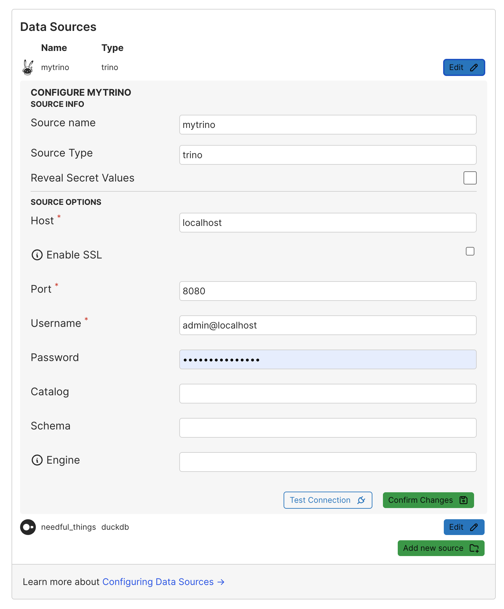
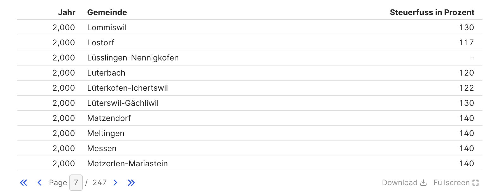
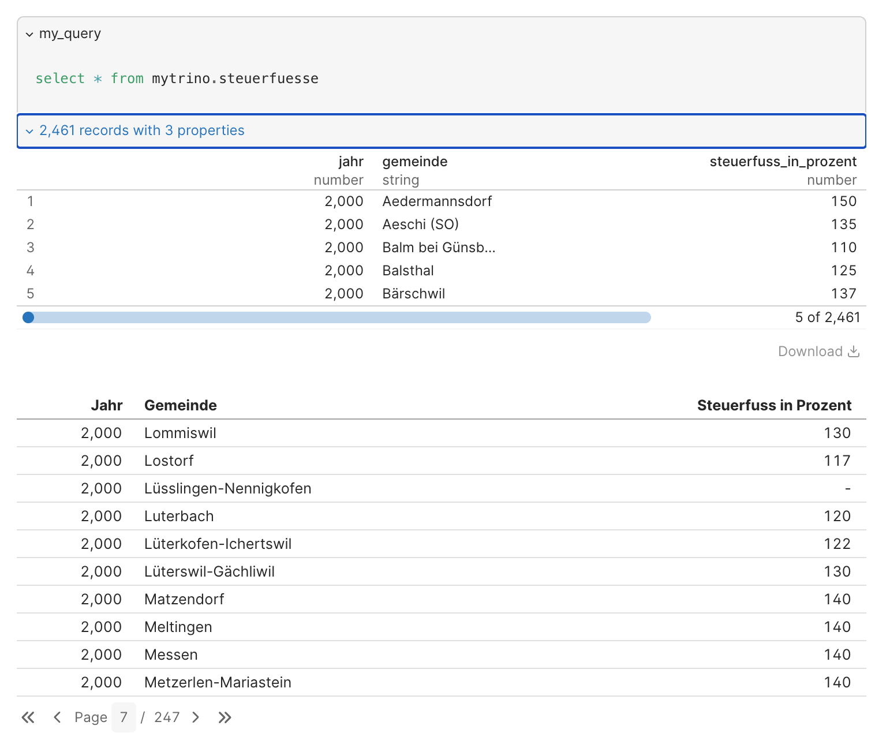
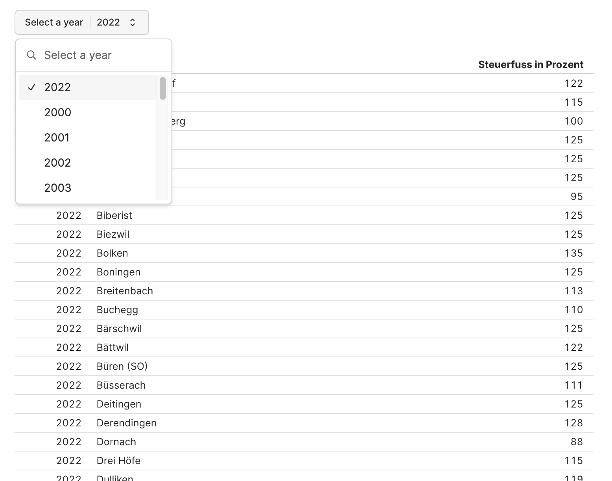
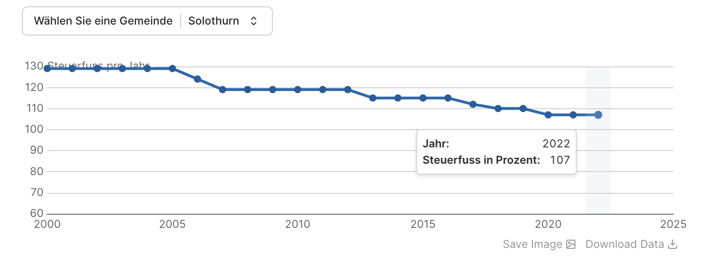
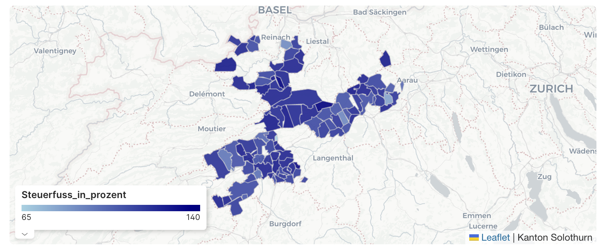

---
= The house at the lake #3 - The dashboard diaries
Stefan Ziegler
2025-01-26
:thoth-type: post
:thoth-status: published
:thoth-tags: Iceberg,Lakehouse,Data Lake,Parquet,DuckDB,Trino,Markdown,Evidence
:idprefix:
---
Sie gehören halt einfach dazu: Dashboards. Ich habe mich mit der Visualisierung von (OGD-)Daten vor knapp 1.5 Jahren schon einmal https://blog.sogeo.services/blog/2023/08/13/ogd-made-easy-03.html[auseinandergesetzt]. Damals habe ich mir https://grafana.com/[Grafana] angeschaut und wie man damit nette Grafiken und Auswertungen in Dashboards herstellen kann. So richtig überzeugt hat es mich nachhaltig nicht. Am meisten störte mich, dass man keine Parquet-Dateien direkt verwenden konnte, sondern nur CSV (via Plugin) und somit das Wissen über die Datentypen verloren geht. Fairerweise muss man erwähnen, dass momentan meine selber gesetzte Rahmenbedingung ist, dass sämtliche Daten via z.B. https://trino.io/[Trino] greifbar sind (siehe https://blog.sogeo.services/blog/2025/01/12/house-at-the-lake-02.html[Teil 2]). Parquet-Dateien direkt (ohne serverseitige Query-Engine o.ä.) anzapfen ist und bleibt natürlich ein Plus einer möglichen Lösung.

Nun wollte ich mir endlich https://superset.apache.org/[Apache Superset] genauer anschauen. Und habe es doch wieder sein lassen. Mir macht immer noch die schiere &laquo;Grösse&raquo; Angst. Ich weiss selber nicht so ganz genau, was ich damit meine. Aber wenn man sich die Anleitung zur https://superset.apache.org/docs/installation/architecture[Installation] anschaut, dünkt es mich trotz Docker irgendwie overwhelming. Vor etwas mehr als einem Jahr stiess ich auf einen https://motherduck.com/blog/the-future-of-bi-bi-as-code-duckdb-impact/[Blogbeitrag] von https://motherduck.com/[MotherDuck]. Sie haben drei BI-as-code Lösungen vorgestellt. Mir gefiel vor allem https://evidence.dev/[Evidence] und die Möglichkeit das Endprodukt als statische Webseite zu deployen. Also, schaue ich mir anstelle von Apache Superset Evidence an:

Evidence funktioniert kurz zusammengefasst ganz einfach: Man schreibt SQL-Queries in einer Markdown-Datei und buildet die statische Webseite. That's it. Klar gibt es auch hier eine gewisse Lernkurve. Aber dass der Master die Markdown-Dateien sind und ich diese in ein Git-Repository einchecken kann, ist schon ziemlich cool und kommt unserer Arbeitsweise sehr entgegen. 

Es gibt zwar ein VSCode-Plugin, ich habe jedoch alles mit der Kommandozeile durchexerziert. Ein neues Projekt erstellt man mit folgenden Befehlen:

[source,bash,linenums]
----
npx degit evidence-dev/template my-project
cd my-project
npm install
npm run sources
npm run dev
----

Interessant sind die beiden letzten Befehle. `npm run dev` startet die Entwicklungsumgebung. Der Entwicklungsserver buildet die Webseite während des Entwickelns und stellt diese bereit. Zudem stellt er eine Weboberfläche zur Verfügung, die unter anderem zur Konfiguration neuer Datenquellen dient. Und um Datenquellen geht es auch beim zweitletzten Befehl: `npm run sources`. Hat man nämlich Datenquellen definiert, müssen die Daten aus der Quelle exportiert werden, damit Evidence auf sie zugreifen kann. Das passiert mit diesem Befehl. Dieser Schritt ist quasi der Kern des Ganzen und soll mit einem Beispiel erklärt werden:

Ich möchte die Steuerfüsse der Gemeinden (der natürlichen Personen) visualisieren. Die Daten stecken in einem Data Lakehouse basierend auf https://iceberg.apache.org/[Apache Iceberg] (siehe https://blog.sogeo.services/blog/2025/01/05/house-at-the-lake-01.html[Teil 1]). Die Iceberg-Tabellen sind auf AWS S3 gespeichert und mittels Trino und SQL für Mensch und Maschine greifbar (siehe https://blog.sogeo.services/blog/2025/01/12/house-at-the-lake-02.html[Teil 2]). Daraus folgt, dass Evidence entweder sowas wie einen Connector für Iceberg-Tabellen benötigt (hat es nicht) oder aber für Trino (hat es):



Bestätigt man die Angaben, wird im Projektverzeichnis ein Ordner `sources/mytrino` erstellt. In diesem Ordner gibt es mindestens eine Datei `connection.yaml` mit den Connection-Parametern. Eine zweite Datei wird erstellt, falls die Connection ein Passwort benötigt. Diese Datei sollte man nicht in ein Repo einchecken. Der nächste Schritt ist der Export aus der Datenquelle, um mit den Daten in Evidence arbeiten zu können. Dabei handelt es sich um eine SQL-Query, die in einer Datei (z.B. `steuerfuesse.sql`) im soeben erstellten Ordner gespeichert wird. Die Query kann völlig beliebig sein und kann von ganz einfach bis ganz kompliziert reichen. Die SQL-Syntax muss der Syntax der Datenquelle entsprechen. In meinem Fall also Trino. Meine Query ist denkbar einfach: 

----
SELECT 
  * 
FROM 
  iceberg.agem_steuerfuesse.natuerliche_personen
---- 

Der Befehl `npm run sources` exportiert das Resultat dieser Query in eine Parquet-Datei. Falls beim Export was schief geht, sieht man das in der Konsole. Bei mir ist es bei einem anderen Beispiel vorgekommen, dass gewisse Datentypen von PostgreSQL (via Trino) Probleme bereiteten. Aber nicht exotische Datentypen, sondern `varchar(256)`. Abhilfe hat dann das Casten nach `varchar` gebracht. Scheint mir ein Bug zu sein. Wo die Parquet-Datei liegt, muss mich nicht interessieren.

Als erstes will ich in meinem Dashboard einfach eine Tabelle mit den Steuerfüssen. Wie geht das? Ich erstelle im `pages`-Ordner eine neue Markdown-Datei `fubar.md` und schreibe folgendes rein:

[source,markdown,linenums]
----
```sql my_query
select * from mytrino.steuerfuesse
```
<DataTable data={my_query} />
----

Mit der SELECT-Query lese ich Daten aus der vorhin erstellten Parquet-Datei. Identifiziert wird die Parquet-Datei dabei über den Namen der Datenquelle (resp. des Ordners) und dem Namen der SQL-Datei (welche die Daten aus der Original-Datenquelle exportiert). Hier muss ich die DuckDB-SQL-Syntax verwenden. Warum? Weil mit DuckDB auf die Parquet-Datei zugegriffen wird. Die resultierenden Daten will ich in einem DataTable-Widget präsentiert bekommen. Im Widget greife ich über den Namen der Query auf die Daten zu. Das Resultat nach einem Page-Refresh:



Noch ziemlich unspektakulär. Geschenkt bekommt man einen CSV-Download und einen Fullscreen-Modus. 

Einiges gefällt mir noch nicht: Ich möchte z.B. mindestens 150 Gemeinden anzeigen und bei den Jahreszahlen will ich keine Tausendertrennzeichen. Das ist alles einstellbar über Optionen des Widgets:

[source,markdown,linenums]
----
```sql my_query
select * from mytrino.steuerfuesse
```
<DataTable data={my_query} rows=150>
   <Column id=jahr title="Jahr" fmt='###0' />
   <Column id=gemeinde />
   <Column id=steuerfuss_in_prozent />
</DataTable>
----

Es wird die Excelsyntax für die Formatierung verwendet.

Es gibt sowas wie einen Debugmodus. Dieser nennt sich &laquo;Show Queries&raquo; und zeigt auf der Webseite die verwendete Query, sowie das Resultat der Query:



Eine typische Anforderung ist das Filtern von Daten. In meinem Fall will ich die Tabelle für ein bestimmtes Jahr filtern. Auch das dünkt mich logisch und straight forward. Ich brauche zusätzlich eine Query, um herauszufinden, welche Jahre überhaupt vorhanden sind und ein Dropdown-Widget, wo der Benutzer das zu filternde Jahr auswählen kann:

[source,markdown,linenums]
----
```sql unique_years
select 
  jahr 
from 
  mytrino.steuerfuesse 
group by 
  1
order by 
  jahr
```

<Dropdown
    name=selected_year
    data={unique_years}
    value=jahr
    title="Select a year"
    noDefault=true
/>

```sql my_query_filtered_by_year
select 
  * 
from 
  mytrino.steuerfuesse
where
  jahr = '${inputs.selected_year.value}'
order by
  jahr,gemeinde
```

<DataTable data={my_query_filtered_by_year} rows=all>
   <Column id=jahr title="Jahr" fmt='###0' />
   <Column id=gemeinde />
   <Column id=steuerfuss_in_prozent />
</DataTable>
----



Ähnlich einfach umzusetzen sind Linecharts, z.B. die Entwicklung des Steuerfusses in einer Gemeinde:

[source,markdown,linenums]
----
```sql unique_gemeinden
select 
  gemeinde 
from 
  mytrino.steuerfuesse 
group by 
  1
order by 
  gemeinde
```

<Dropdown
    name=selected_gemeinde
    data={unique_gemeinden}
    value=gemeinde
    title="Wählen Sie eine Gemeinde"
    noDefault=true
/>

```sql query_steuerfuesse_filtered_by_gemeinden
select 
  * 
from 
  mytrino.steuerfuesse
where
  gemeinde = '${inputs.selected_gemeinde.value}'
order by
  jahr,gemeinde
```

<LineChart 
    data={query_steuerfuesse_filtered_by_gemeinden}
    x=jahr
    y=steuerfuss_in_prozent 
    yAxisTitle="Steuerfuss pro Jahr"
    markers=true
    xFmt='###0'
    yMin=60
/>
----



Als letztes Beispiel möchte ich die Steuerfüsse in einer Karte darstellen. Dazu wird eine GeoJSON-Datei mit den Polygonen, die man anzeigen will, benötigt (EPSG:4326). In unserem Fall die Gemeindegrenzen des Kantons Solothurn. Die Datei speichert man im _static_-Ordner im Projektverzeichnis. Den _static_-Ordner muss man erstellen, falls er nicht existiert. 

[source,markdown,linenums]
----
```sql my_query
SELECT
    *
FROM 
    mytrino.steuerfuesse
WHERE 
    jahr = 2022
```

<AreaMap 
    data={my_query} 
    areaCol=gemeinde
    geoJsonUrl='/kanton_solothurn.geojson'
    geoId=gemeindename
    value=steuerfuss_in_prozent
    title='Steuerfüsse (natürliche Personen)'
    attribution='Kanton Solothurn'
/>
----

Das Mapping der Gemeinde zur Geometrie wird über `areaCol=gemeinde` gesteuert. D.h. die GeoJSON-Datei hat ein Property `gemeinde` und das Query-Resultat hat ebenfalls ein Attribut `gemeinde`. Die Zuweisung des Wertes erfolgt über `value=steuerfuss_in_prozent`. Was ich mir noch nicht genau angeschaut habe, ist die Übersteuerung der Farbgebung. Sowohl hier bei der Karte wie auch bei den anderen Beispielen. Einiges scheint mir jedoch möglich zu sein.



Man erkennt, dass verschiedene Gemeinden fehlen. Das liegt entweder daran, dass ich Zeitstände versuche zu matchen, die nicht passen (wegen Gemeindefusionen) oder das Mapping der Gemeindenamen funktioniert nicht, weil eventuell die Namen unterschiedlich geschrieben sind.

Als letztes muss ich mein Projekt builden: `npm run build`. Das erstellt einen `build`-Ordner, dessen Inhalt ich als statische Homepage irgendwo hin deployen kann. Evidence hat auch ein Hostingangebot, das für öffentliche Dashboards gratis ist.

Links:

- Sämtliche verfügbaren Widgets/Komponenten: https://docs.evidence.dev/components/all-components/
- Beispiele mit Evidence: https://evidence.dev/examples
