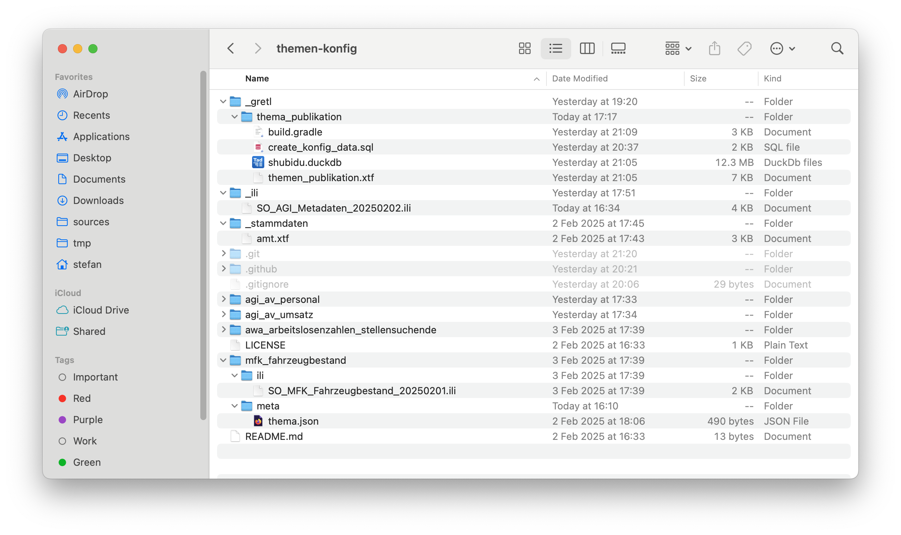

In einer Geodateninfrastruktur fällt eine Unmenge an Konfiguration an. Unter Konfiguration verstehe ich in diesem Kontext nicht die direkte, technische Steuerung einer Software (z.B. wie viel RAM wird der Software zugewiesen), sondern z.B. die Darstellung eines WMS-Layers. Im Falle von QGIS wäre das eine QML-Datei. Oder auch das INTERLIS-Datenmodell kann man als Konfigurationsartefakt ansehen. Ebenso unsere https://github.com/sogis/gretljobs[GRETL-Jobs], die aus einer https://gradle.org[Gradle] Build-Datei und in der Regel aus SQL-Dateien bestehen.

Unsere Konfigurationen sind an unterschiedlichen Orten gespeichert und werden mit unterschiedlichen Ansätzen bearbeitet. Die Dienste (WMS, WFS, Dataservice) und die Datenabgabe werden über eine Webanwendung bearbeitet. Z.B. wählt man eine Datenbanktabelle aus, lädt die QML-Datei hoch und definiert unter Umständen noch ein paar Aliase für die Attributnamen. Diese Informationen werden anschliessend in einer Datenbank gespeichert und daraus die QGS-Datei für QGIS-Server hergestellt. Ein weiterer Teil unserer Konfigruation wird in Git-Repositories gespeichert. Dazu gehören die GRETL-Jobs und die Schema-Jobs (dienen zum Anlegen von Datenbankschemen mit https://gretl.app[GRETL]). Das &laquo;GUI&raquo; ist der Texteditor nach Wahl. Zu guter Letzt liegt der Master sämtlicher Datenmodelle im https://github.com/sogis/sogis-interlis-repository[Datenmodell-Repository].

Obwohl sich einiges über eine längere Zeit entwickelt hat, ist das Grundkonzept circa sechs bis sieben Jahre alt und in dieser Zeit konnten wir viele Erfahrungen sammeln. Obwohl wir nicht direkt unzufrieden mit der Webanwendung sind, bin ich der Meinung, dass wir erfolgreicher mit dem Git-Ansatz arbeiten. Das hängt vor allem damit zusammen, dass die Webanwendung sehr umfangreich geworden ist und immer mehr verknüpfte Informationen verwalten muss. Dadurch ist sie leider auch nicht intuitiver geworden. Funktional bietet sie viel: so kann ich z.B. auf Knopfdruck herausfinden, welche Datenbanktabelle in welchem WMS-Layer steckt. Dieses Wissen ist insbesondere bei Modelländerungen (und daraus folgend Datenbankschemaänderungen) wichtig. 

Die Grundidee ist, dass wir sämtliche Konfiguration in Zukunft in einem Themen-Git-Repository speichern und -- falls immer sinnvoll möglich -- nur noch mit dem Texteditor arbeiten. Am liebsten hätten wir pro Datenthema ein eigenes Git-Repository aber wahrscheinlich machen wir ein Mono-Repo mit den Themen als Unterordner. Bei der Menge an Themen scheint uns das übersichtlicher zu sein. Nehmen wir als Beispiel das Thema https://geo.so.ch/map/?k=c46753707[_Bauzonengrenzen_]. Heute gibt es im GRETL-Jobs-Repository den Unterordner https://github.com/sogis/gretljobs/tree/main/arp_bauzonengrenzen_pub[_arp_bauzonengrenzen_pub_]. In diesem Unterordner steckt der GRETL-Job, der die Daten aus der Edit-DB herstellt und in der Pub-DB speichert. Ebenfalls gehört der Export nach XTF, GeoPackage und Shapefile dazu. Dieser GRETL-Job würde im Themen-Repo im Ordner _arp_bauzonen_ zukünftig im Unterordner _gretl_ zu liegen kommen. Der Schema-Job, mit dem wir das Schema in der Datenbank anlegen, im Unterordner _schema_. Das Datenmodell im Unterordner _ili_ etc. pp. Notwendige Konfigurationen für die verschiedenen https://www.duden.de/rechtschreibung/Software[Softwares] (Dienste, Datenabgabe, ...) würden mit GRETL in einer Pipeline (Github-Action, Jenkins, ...) hergestellt.

Zwei schnell identifizierte Herausforderungen sind die referentielle Integrität, die es mit dem neuen Ansatz nicht geschenkt gibt und die Frage nach dem passenden Format für die Datenerfassung im Texteditor. Anhand eines konkreten Beispieles (die Datenabgabe) können Lösungen für beide Herausforderungen gezeigt werden. Ich verwende hier Statistikdaten und nicht unsere Geodaten. Grund dafür ist, dass wir womöglich zukünftig die eine oder andere Synergie nutzen wollen. Alles in allem ist der Prozess sehr ähnlich aber einfacher. Mein Themen-Git-Repo sieht für vier Themen so aus:

Man erkennt die vier Themen: zwei vom AGI, je eines vom AWA und der MFK. Diese sind immer gleich aufgebaut. Es gibt einen _ili_- und einen _meta_-Unterordner. Fehlen tut noch mindestens der _gretl_-Unterordner mit dem GRETL-Job, der die Daten entegennimmt, in eine Parquet-Datei umwandelt und auf eine Ablage kopiert. Das Datenmodell im _ili_-Ordner wird benötigt, um das &laquo;best practice Datenformat CSV&raquo; (Anonym, 2025) zu prüfen. Wenn die Daten bereitgestellt werden, braucht es noch Metadaten dazu. Das sind eine Beschreibung, Stichworte, Publikationsdatum etc. Die ersten beiden sind statisch und können einmalig definiert werden. Das Publikationsdatum ist dynamisch und ändert sich mit jeder Publikation der Daten. Die statischen Daten speichern wir in einer JSON-Datei `thema.json` im Unterordner _meta_. Der Inhalt der Datei ist circa folgender:

[source,json,linenums]
----
{
    "ID" : "ch.so.mfk.fahrzeugbestand",
    "Titel" : "Fahrzeugbestand",
    "Beschreibung" : "Fahrzeugbestand seit 1991 im Kanton Solothurn gruppiert in verschiedene Kategorien. Wird jährlich aktualisiert.",
    "Datenherr" : "ch.so.mfk",
    "Modell" : "SO_MFK_Fahrzeugbestand_20250201",
    "Tags" : [
        "Fahrzeug",
        "Bestand",
        "PKW",
        "Auto",
        "Lastwagen",
        "Anzahl"
    ] 
}
----

Zwei Attribute sind von besonderem Interesse: Die `ID` darf natürlich in der gesamten Dateninfrastruktur nur einmal vorkommen. Heute nimmt mir die Datenbank diese Aufgabe ab. Ohne Datenbank muss ich das anders lösen. Das zweite interessante Attribut ist der `Datenherr`. Natürlich wird später für den Benutzer bei den Metadaten nicht einfach `ch.so.mfk` stehen, sondern die normale Adresse mit Kontaktdaten. Hier in der JSON-Datei steht nur der Fremdschlüssel. Und ja, er ist sprechend und folgt einer Logik. Aber dünkt mich handlebar. Die Adresse und Kontaktdaten der Ämter stecken in einer XTF-Datei `amt.xtf` im Ordner `stammdaten`.

Das Publikationsdatum wird während der Datenpublikation mit einem GRETL-Job ebenfalls in eine JSON-Datei geschrieben. Diese wird bei den publizierten Daten gespeichert (hier z.B. S3) und nicht im Themen-Repo. In der Datei steckt nur die ID und das Datum:

[source,json,linenums]
----
{
    "ID" : "ch.so.mfk.fahrzeugbestand",
    "publiziertAm" : "2025-02-01"
}
----

Wie kann man verhindern, dass die `ID` wirklich nur einmal vorkommt ist? Und wie kann ich eine Konfigurationsdatei mit allen Themen herstellen, die ich für meine Datenabgabe-Anwendung benötige und auch das Publikationsdatum beinhaltet und die korrekte Adresse des Datenherrn? Die Antwort ist natürlich _INTERLIS_, GRETL und https://duckdb.org/[DuckDB].

Als erstes braucht es ein Metamodell. Ein unvollständiges kann z.B. so aussehen:

[source,xml,linenums]
----
INTERLIS 2.4;

MODEL SO_AGI_Metadaten_20250202 (de)
AT "https://agi.so.ch"
VERSION "2025-02-02" =
  DOMAIN

    SOOID = OID TEXT*255;

  STRUCTURE Amt_ =
    Name : MANDATORY TEXT;
    Abkuerzung : TEXT*10;
    Abteilung : TEXT;
    AmtImWeb : MANDATORY URI;
    Zeile1 : TEXT*50;
    Zeile2 : TEXT*50;
    Strasse : MANDATORY TEXT*50;
    Hausnr : MANDATORY TEXT*10;
    PLZ : MANDATORY TEXT*4;
    Ort : MANDATORY TEXT*100;
  END Amt_;

  TOPIC Amt =
    OID AS SO_AGI_Metadaten_20250202.SOOID;

    CLASS Amt EXTENDS SO_AGI_Metadaten_20250202.Amt_ = 
      UNIQUE Abkuerzung, Abteilung;
    END Amt;
  END Amt;

  TOPIC ThemaPublikation =
    OID AS SO_AGI_Metadaten_20250202.SOOID;

    CLASS ThemaPublikation =
        ID : MANDATORY TEXT*100;
        Titel : MANDATORY TEXT*200;
        Beschreibung : TEXT*2000;
        Datenherr : MANDATORY SO_AGI_Metadaten_20250202.Amt_;
        Modell : TEXT*100;
        publiziertAm : INTERLIS.XMLDate;
        Tags : TEXT;
        UNIQUE ID;
    END ThemaPublikation;

  END ThemaPublikation;

END SO_AGI_Metadaten_20250202.
----

Die Klasse `Amt` im Topic `Amt` benötige ich zum Vorhalten der Ämterinformationen. Die Klasse `ThemaPublikation` im Topic `ThemaPublikation` brauche ich zum Herstellen der Konfigurationsdatei für meine Datenabgabe-Software. In dieser Klasse sieht man, dass `ID` eindeutig sein muss. Wie geht es weiter?

Es braucht einen GRETL-Job, der sowohl lokal beim Entwickeln resp. bei der Bearbeitung der Informationen ausgeführt werden kann wie auch in einer Pipeline. Es wird mehrere Jobs geben, da sie verschiedene Zwecke erfüllen müssen. Geht es nur darum zu prüfen, ob die ID eindeutig ist, muss ich die erwähnte Konfigurationsdatei für die Datenabgabe-Software nicht herstellen. Und es wird weitere Konfigurationsdateien geben, die ebenfals mittels GRETL-Jobs hergestellt werden (und weiteren Klassen im Metamodell). Der GRETL-Job für das Herstellen der Konfigurationsdatei sieht so aus:

[source,groovy,linenums]
----
import java.nio.file.Paths
import ch.so.agi.gretl.tasks.*
import ch.so.agi.gretl.api.*
import de.undercouch.gradle.tasks.download.Download

apply plugin: 'ch.so.agi.gretl'
apply plugin: 'de.undercouch.download'

defaultTasks 'uploadToExoscale'

def awsAccessKey = System.getenv("AWS_ACCESS_KEY_ID")
def awsSecretAccessKey = System.getenv("AWS_SECRET_ACCESS_KEY")
def awsRegion = System.getenv("AWS_DEFAULT_REGION")
def awsEndpoint = System.getenv("AWS_ENDPOINT_URL")

tasks.register("createStammdatenSchema", Ili2duckdbImportSchema) {
    dbfile = file("shubidu.duckdb")
    models = "SO_AGI_Metadaten_20250202"
    modeldir = rootProject.projectDir.toString() + "/../../_ili/" + ";http://models.interlis.ch"
    dbschema = "stammdaten"
    nameByTopic = true
    smart2Inheritance = true
    createEnumTabs = true
}

tasks.register("importStammdaten", Ili2duckdbImport) {
    dependsOn 'createStammdatenSchema'
    dbfile = file("shubidu.duckdb")
    models = "SO_AGI_Metadaten_20250202"
    modeldir = rootProject.projectDir.toString() + "/../../_ili/" + ";http://models.interlis.ch"
    dbschema = "stammdaten"
    dataFile = file("../../_stammdaten/amt.xtf")
}

tasks.register("createKonfigSchema", Ili2duckdbImportSchema) {
    dependsOn 'importStammdaten'
    dbfile = file("shubidu.duckdb")
    models = "SO_AGI_Metadaten_20250202"
    modeldir = rootProject.projectDir.toString() + "/../../_ili/" + ";http://models.interlis.ch"
    dbschema = "konfig"
    nameByTopic = true
    smart2Inheritance = true
    createEnumTabs = true
}

def pwd = rootProject.projectDir.toString()
def dbUri = "jdbc:duckdb:$pwd/shubidu.duckdb".toString()
def dbUser = ""
def dbPass = ""

tasks.register("createKonfigData", SqlExecutor) {
    dependsOn 'createKonfigSchema'
    database = [dbUri, dbUser, dbPass]
    sqlFiles = ['create_konfig_data.sql']
}

tasks.register("exportKonfigData", Ili2duckdbExport) {
    dependsOn 'createKonfigData'
    dbfile = file("shubidu.duckdb")
    models = "SO_AGI_Metadaten_20250202"
    modeldir = rootProject.projectDir.toString() + "/../../_ili/" + ";http://models.interlis.ch"
    dbschema = "konfig"
    dataFile = file("themen_publikation.xtf")
}

tasks.register('uploadToExoscale', S3Upload) {
    dependsOn 'exportKonfigData'
    accessKey = awsAccessKey
    secretKey = awsSecretAccessKey
    sourceFile = file('themen_publikation.xtf')
    endPoint = awsEndpoint
    region = awsRegion
    bucketName = 'XXXXX.YYYYY.ZZZZZ'
    acl = "public-read"
}
----

Als erstes importiere ich die Stammdaten (mit den Ämterinfos) in eine DuckDB. Anschliessend erstelle ich ein weiteres Schema `konfig` in der gleichen DuckDB. In diesem Schema muss ich aus den vorliegenden JSON-Dateien (lokal und S3) und den Ämterinfos die Klasse `ThemaPublikation` abfüllen. Ist das gemacht, exportiere ich die Klasse in eine XTF-Datei / in die Konfigurationsdatei. Das Wichtigste passiert im Task `createKonfigData`. Hier wird einzig mit SQL und DuckDB-Magie die Klasse `ThemaPublikation` befüllt:

[source,groovy,linenums]
----
CREATE OR REPLACE SECRET asecret (
    TYPE S3,
    PROVIDER CREDENTIAL_CHAIN,
    CHAIN 'env',
    ENDPOINT 'sos-xx-yy-z.exo.io'
);

DROP TABLE IF EXISTS
    themapublikation_tmp
;
CREATE TEMP TABLE themapublikation_tmp AS 
SELECT
    nextval('konfig.t_ili2db_seq') AS T_Id,
    '_' || nextval('konfig.t_ili2db_seq') AS T_Ili_Tid,
    m.ID AS id,
    m.Titel AS titel,
    m.Beschreibung AS beschreibung,
    m.Modell AS modell,
    m.tags,
    m.datenherr,
    p.publiziertAm AS publiziertAm
FROM
    read_json('*/meta/thema.json') AS m
    LEFT JOIN read_json('s3://XXXXX.YYYYY.ZZZZZ/*/publishedat.json') AS p
    ON m.ID = p.ID
;

DELETE FROM
    konfig.themapublikation_themapublikation
;
INSERT INTO 
    konfig.themapublikation_themapublikation
    (
        T_Id,
        T_Ili_Tid,
        id,
        titel,
        beschreibung,
        modell,
        tags,
        publiziertam
    )
SELECT 
    T_Id,
    T_Ili_Tid,
    id,
    titel,
    beschreibung,
    modell,
    list_aggregate(tags, 'string_agg', ',') AS tags,
    publiziertam
FROM 
    themapublikation_tmp 
;

DELETE FROM 
    konfig.amt_
;
INSERT INTO 
    konfig.amt_
    (
        T_Id,
        aname,
        abkuerzung,
        abteilung,
        amtimweb,
        zeile1,
        zeile2,
        strasse,
        hausnr,
        plz,
        ort,
        thempblktn_thmpblktion_datenherr
    )
SELECT 
    nextval('konfig.t_ili2db_seq') AS T_Id,
    aname,
    abkuerzung,
    abteilung,
    amtimweb,
    zeile1,
    zeile2,
    strasse,
    hausnr,
    plz,
    ort,
    themapublikation_tmp.T_Id AS thempblktn_thmpblktion_datenherr
FROM 
    themapublikation_tmp
    LEFT JOIN stammdaten.amt_amt AS amt 
    ON themapublikation_tmp.datenherr = amt.T_Ili_Tid 
;
----

DuckDB stellt die `read_json()`-Funktion bereit. Mit dieser kann ich JSON-Dateien lesen und sie wie Tabellen ansprechen (ohne sie importieren zu müssen) und die Funktion https://duckdb.org/docs/data/multiple_files/overview.html[unterstützt] die https://en.wikipedia.org/wiki/Glob_(programming)[glob-Syntax]. Vereinfacht gesagt, kann ich sämtliche `thema.json`-Dateien an der gleichen Stelle in den Unterordnern ansprechen (siehe Zeile 23). Gleiches gilt auch für die JSON-Dateien, die im S3-Bucket bei den publizierten Daten liegen und das Publikationsdatum beinhalten. Die Ämterinfos hole ich einfachst aus dem anderen Schema.

Falls nun eine ID doppelt vorkommt oder man auf ein Amt verweist, das es nicht gibt, wird spätestens beim Export `ilivalidator` einen Fehler melden. Gewisse Constraints werden bereits auf der Datenbank angelegt. So auch der UNIQUE-Constraint. In diesem Fall wird schon der Datenumbau einen Fehler melden. Der gesamte Prozess dauert lokal circa 20 Sekunden. Dünkt mich vertretbar. Wahrscheinlich wird es zusätzlich eine read-only Metadatenbank als Webanwendung geben. Sowohl für uns zum Nachschlagen wie auch für die Kunden/Benutzer.

Man kann das Ganze noch ein wenig weitertreiben, indem man z.B. nicht mehr direkt in den main-Branch pushen darf, sondern via separatem Branch, der die Github Action durchlaufen muss. Die Github Action ist mit GRETL auch sehr einfach. Man kann der Action sagen, dass sie auf einem bestimmten Dockerimage laufen soll:

[source,yml,linenums]
----
name: thema_publikation

on:
  push

jobs:  

  build:

    env:
      AWS_ACCESS_KEY_ID: ${{secrets.AWS_ACCESS_KEY_ID}}
      AWS_SECRET_ACCESS_KEY: ${{secrets.AWS_SECRET_ACCESS_KEY}}
      AWS_DEFAULT_REGION: ${{secrets.AWS_DEFAULT_REGION}}
      AWS_ENDPOINT_URL: ${{secrets.AWS_ENDPOINT_URL}}

    runs-on: ubuntu-latest

    container:
      image: sogis/gretl:3.1

    steps:
      - uses: actions/checkout@v4

      - name: Run GRETL job
        run: |
          gradle -b _gretl/thema_publikation/build.gradle --init-script /home/gradle/init.gradle uploadToExoscale --no-daemon
----

Ein weiterer Anwendungsfall von INTERLIS-, GRETL- und DuckDB-Magie.
