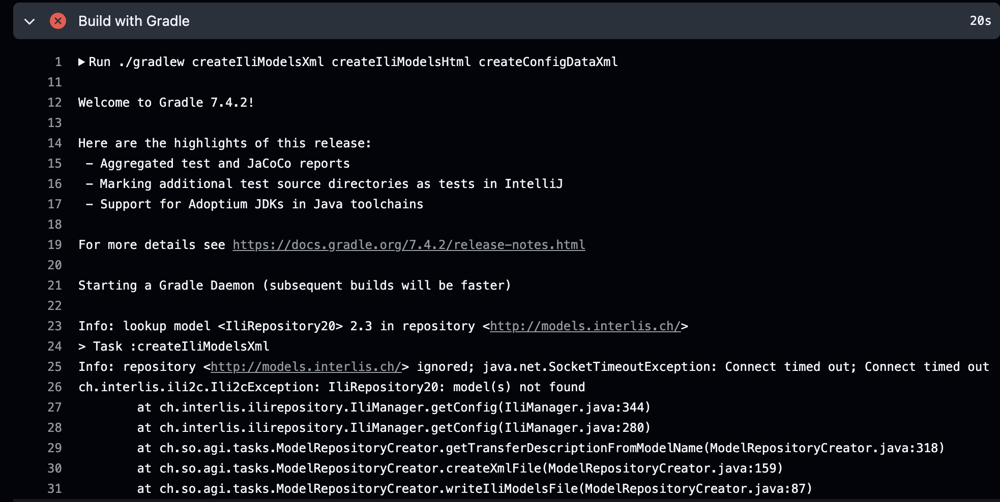
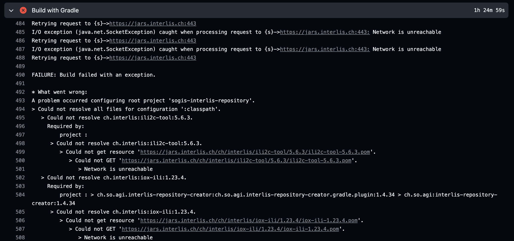

---
= INTERLIS leicht gemacht #48 - Der INTERLIS-Super-GAU 
Stefan Ziegler
2025-04-11
:thoth-type: post
:thoth-status: published
:thoth-tags: INTERLIS,Java,Infomaniak,Github,Reposilite
:idprefix:
---
Was ist passiert? Ich wollte ein nachgeführtes Modell in unsere https://geo.so.ch/models[INTERLIS-Modellablage] (aka INTERLIS-Repository) publizieren. Wie es sich gehört, ist dieser Prozess automatisiert. Wir müssen bloss die Modelldatei in ein https://github.com/sogis/sogis-interlis-repository[Github-Repository] einchecken und dann beginnt die Pipeline / die Github-Action zu laufen. Ein https://plugins.gradle.org/plugin/ch.so.agi.interlis-repository-creator[Gradle-Plugin] sucht alle Modelldateien im Repository und liest die notwendigen Informationen aus diesen aus und erstellt die `ilimodels.xml`-Datei und ein Dockerimage, das automatisch in unseren OpenShift-Cluster deployed wird. Das Dockerimage wird vor dem Pushen in die Registry in der Pipeline mit `--check-repo-ilis` https://github.com/sogis/sogis-interlis-repository/blob/master/build.gradle#L133[geprüft].

Das Unheil fing am 27. April 2025 an: Die Pipeline lief nicht mehr durch. Das kann schon mal vorkommen, kleiner Schluckauf irgendwo. Im konkreten Fall war es auch nicht super tragisch, da ich das nachgeführte Modell einfach temporär dort speichern kann, wo es auch verwendet wird. Damit konnte ich immerhin weiterarbeiten. Am nächsten Morgen geschaut, ob die Pipeline nun durchläuft. Mmmh, immer noch nicht. Die Logdatei der Action meldet folgendes:

Mein Gradle-Plugin findet die Mutter aller INTERLIS-Modellablagen nicht. Das Plugin muss das https://models.interlis.ch/core/IliRepository20.ili[IliRepository20]-Modell kompilieren, um die `ilimodels.xml`-Datei herstellen zu können. Ich hatte den Compiler in https://github.com/sogis/interlis-repository-creator/blob/ee9196c4eb8cce1e8b86fa70ecf25da64c6e52e7/src/main/java/ch/so/agi/tasks/ModelRepositoryCreator.java#L312[meinem Code] so konfiguriert, dass er nicht lokale Modelle verwendet, sondern das Modell in den externen Repositories sucht. Und genau das Repository mit dem gewünschten Modell war aus der Github Action nicht mehr erreichbar. Mit dem Repository schien jedoch alles in Ordnung zu sein. Mit dem Browser konnte ich darauf zugreifen.

Was machen? Eine E-Mail in die Runde ohne grosse Erkenntnisse und anschliessend im INTERLIS-Forum nachgeschaut: Immerhin hatten https://interlis.discourse.group/t/models-interlis-ch-down/364[andere auch Probleme]. Ok, uncool aber handlebar und sowieso: Ich kann das Modell zu meinem Code kopieren und bin nicht mehr auf ein externes Repository angewiesen.

Oops! Diese Idee hat leider nur ein Problem: Um diese Änderungen am Gradle-Plugin vornehmen zu können, benötige ich INTERLIS-Bibliotheken vom INTERLIS-Maven-Repository https://jars.interlis.ch. Dieses wird - wie auch das Modell-Repository - auf einem Infomaniak-Server gehostet. Und ja, auch mit diesem Server gab es in den Github Actions Probleme. Die Bibliotheken konnten nicht gefunden werden:

Es schien irgendwas mit der Kommunikation zwischen den Github-Actions-Servern und Infomaniak im Argen zu liegen. Es war Freitag und ich hätte natürlich warten können, dass sich das Problem bis Montag irgendwie selber löst. Aber wenn es Montag immer noch besteht, wird es mühsam, weil alle Mitarbeiter anders als gewohnt arbeiten müssten. D.h. als erstes musste ich irgendwie wieder an die INTERLIS-Bibliotheken kommen. Gott sei Dank hatte ich mich im letzten Sommer mit einem amtseigenen Maven-Repository-Caching-Proxy auseinandergesetzt. Die Idee dabei ist, dass wir eine Software betreiben, welche die verschiedenen Maven-Repositories zwischenspeichert. Ich müsste beim Builden der Java-Software nicht mehr die verschiedenen externen Maven-Repositories konfigurieren, sondern nur das eigene (z.B. https://jars.so.ch). Die Software lädt die benötigten Bibliotheken z.B. von https://jars.interlis.ch herunter und speichert sie bei sich. Damit ist sichergestellt, dass ich meine Java-Software auch builden kann, falls die externen Maven-Repositories down oder nicht erreichbar sind. Dieses Prinzip eines Caching-Proxies für die eigene Organisation ist keine Erfindung des Jahres 2025, sondern ist schon lange gute Praxis (auch aus anderen Gründen: https://www.sonatype.com/blog/maven-central-and-the-tragedy-of-the-commons[lesenswert!]). Also 5-Euro-Hetzner-Server hochgefahren und Anleitung zu https://reposilite.com/[Reposilite] rausgesucht und fertig war unser Maven-Caching-Proxy. Die Github-Action mit dem veränderten Gradle-Plugin lief wieder durch.

Das war jedoch erst ein Teil der Lösung. Ich konnte zwar eine neue Plugin-Version in Betrieb nehmen aber das Herstellen der `ilimodels.xml`-Datei und das Prüfen des INTERLIS-Repositories gingen noch nicht, weil unsere Modelle wiederum Modelle vom nicht erreichbaren INTERLIS-Repository importieren und diese beim Kompilieren des eigenen Modelles benötigt werden. Da war schon einiges vorbereitet, das mir half: Nämlich konnte ich in einen Ordner einfach &laquo;fremde&raquo; Modelle reinkopieren, so als wären es eigene. Entsprechend findet der Compiler sie beim Kompilieren unserer Modelle. Ich musste also nur ein paar weitere Modelle in diesen Ordner kopieren und konnte beruhigt ins Wochenende.

Ich wusste aber, dass das auch nur ein Provisorium ist. Die Frage der Verfügbarkeit fremder Modelle (= ausserhalb des Kantonsnetzes) beschäftigt mich schon eine Weile. Bequemlichkeit hat mich davon abgehalten, dieses Problem halbwegs anständig zu lösen. Nun ist aber die Zeit gekommen. Ich habe mich entschieden, dass wir mittels `--clone-repos` die Repositories klone, die wir unbedingt benötigen und diese als &laquo;Mirror-Repo&raquo; publizieren. Die Modelle kommen zwar technisch auf dem gleichen Server (resp. im gleichen Docker-Container) zu liegen wie unser &laquo;Original-Repo&raquo;, es sind aber zwei getrennte INTERLIS-Modellablagen. Ein Detail, das mich stört und ich ändern möchte: die URL ist momentan https://github.com/sogis/sogis-interlis-repository/blob/master/build.gradle#L230[hardcodiert] und sollte konfigurierbar gemacht werden. Eine eher witzige Frage war, wie jetzt die Repositories miteinander verknüpft werden sollen. Die Suche nach einem Modell läuft nach dem https://geostandards-ch.github.io/doc_ilirepo/#_bedeutung_2[Breadth-First-Verfahren]. Wir mussten ein wenig ausprobieren, damit wir - hoffentlich - die sinnvollste Variante fanden. Das https://geo.so.ch/models/ilisite.xml[&laquo;Original-Repo&raquo;] kennt das https://geo.so.ch/models/mirror/ilisite.xml[&laquo;Mirror-Repo&raquo;] nicht. Das &laquo;Mirror-Repo&raquo; wiederum kennt als &laquo;Kind-Repo&raquo;  das &laquo;Original-Repo&raquo;. Warum? Somit erreichen wir, dass `--modeldir https://geo.so.ch/models/mirror` genügt, um sämtliche unserer Prozesse am Laufen zu halten. D.h. zuerst werden die Modelle in den geklonten Repositories gesucht und anschliessend im &laquo;Original-Repository&raquo;. Erst wenn das benötigte Modell in diesen Repos nicht gefunden wird, wird die Hierarchiestufe geändert, was nicht vorkommen darf.

Fazit: Durch den Vorfall viel gelernt und die Prozesse robuster gemacht. Und das Problem hat sich Montag/Dienstag von selbst (?) https://interlis.discourse.group/t/models-interlis-ch-down/364/2[erledigt]. 
