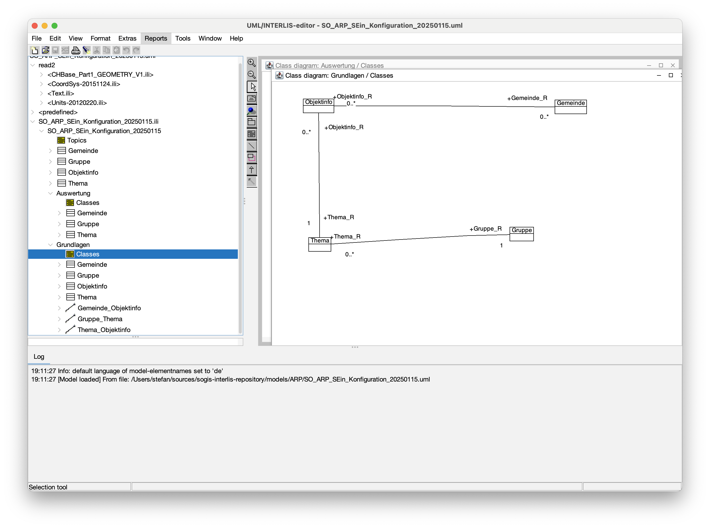

---
= INTERLIS leicht gemacht #49 - Der UML/INTERLIS-Editor ist tot, lang lebe der UML/INTERLIS-Editor
Stefan Ziegler
2025-04-13
:thoth-type: post
:thoth-status: published
:thoth-tags: INTERLIS,UML-Editor,UML,Java
:idprefix:
---
Der UML/INTERLIS-Editor wird völlig zu unrecht schlechtgeredet. Was gibt es daran auszusetzen? Spass beiseite. Aber so übel wie immer darüber gesprochen wird (von den Leuten, die eh nicht modellieren), ist er nicht. Es ist vielleicht nicht das sexieste Werkzeug ever aber interessanterweise kann ich auch seine positiven Seiten wertschätzen. Grundsätzlich denke ich, dass er logisch aufgebaut ist und entsprechend (halb-)intuitiv zu bedienen ist. Wenn man INTERLIS halt gar nicht versteht, kann man auch mit dem Editor keine Modelle erstellen. Mich dünkt, dass er mich das eine oder andere Mal definitiv was gelehrt hat aufgrund seines logischen Aufbaues. Was mich schaurig stört ist, dass Änderungen manchmal nicht übernommen werden. 

Wo Licht ist, ist auch Schatten: Wie oft habe ich schon den Dateinamen der ILI-Datei geändert und auf &laquo;Apply&raquo; oder &laquo;OK&raquo; geklickt und nichts ist passiert resp. der alte Namen stand wieder drin. Herrje. Oder wenn die Änderungen tatsächlich übernommen werden, dafür aber der komplette Element-Tree links zusammengeklappt wird. Übel. Und die Diagramme funktionieren zwar, das automatische Anordnen bei grösseren Modellen ist aber schlecht.

Ich wurde innerhalb kurzer Zeit zweimal gefragt, warum wir überhaupt mit dem UML/INTERLIS-Editor die Modelle erstellen. In unserer INTERLIS-Anfangszeit wäre die Antwort wohl gewesen, weil es man so macht. Jahre später war die Antwort: vor allem damit die Modelldateien immer gleich und schön formatiert sind. Immerhin erstellen bei uns circa acht Personen Datenmodelle (und nicht nur der/die Lernende oder der Praktikant), was wahrscheinlich etwa der Hälfte aller UML/INTERLIS-Editor-Benutzern weltweit entspricht. Wenn es nur noch das ist, könnte man dann nicht einfach den Code aus dem UML/INTERLIS-Editor dazu nutzen, einen Pretty-Printer (als CLI-Tool) zu erstellen, der die ILI-Datei liest und schön formatiert wieder speichert?

Zuerst muss man den entsprechenden Code im Github-Repository finden. Dank der guten Suche wird man relativ schnell fündig. Es sind vor allem zwei resp. vier Klassen, die sich um den Import und Export von ILI-Dateien kümmern:

- https://github.com/claeis/umleditor/blob/master/src/ch/ehi/umleditor/interlis/iliimport/ImportInterlis.java[ImportInterlis.java] und https://github.com/claeis/umleditor/blob/master/src/ch/ehi/umleditor/interlis/iliimport/TransferFromIli2cMetamodel.java[TransferFromIli2cMetamodel.java]
- https://github.com/claeis/umleditor/blob/master/src/ch/ehi/umleditor/interlis/iliexport/ExportInterlis.java[ExportInterlis.java] und https://github.com/claeis/umleditor/blob/master/src/ch/ehi/umleditor/interlis/iliexport/TransferFromUmlMetamodel.java[TransferFromUmlMetamodel.java]

Die Schwerstarbeit übernehmen die &laquo;Transfer&raquo;-Klassen. Nomen est Omen: Beim Import wandeln sie das Ili2c-Metamodell in ein internes UML-Editor-Metamodell um und umgekehrt. Somit muss man für meinen Pretty-Printer nur diese Klassen verwenden. Ein paar kleine Hürden gab es natürlich trotzdem:

Die Jar-Datei des UML/INTERLIS-Editors sind im Maven-Repository https://jars.interlis.ch publiziert und man kann sie in seinem Projekt ganz normal als Abhängigkeit definieren. Leider erschien eine Fehlermeldung:

[source,groovy,linenums]
----
FAILURE: Build failed with an exception.

* What went wrong:
Configuration cache state could not be cached: field `classpath` of task `:compileJava` of type `org.gradle.api.tasks.compile.JavaCompile`: error writing value of type 'org.gradle.api.internal.artifacts.configurations.DefaultUnlockedConfiguration'
> Could not resolve all files for configuration ':compileClasspath'.
   > Could not resolve ch.interlis:umleditor:3.10.3.
     Required by:
         root project :
      > Could not resolve ch.interlis:umleditor:3.10.3.
         > Could not parse POM https://jars.interlis.ch/ch/interlis/umleditor/3.10.3/umleditor-3.10.3.pom
            > Missing required attribute: dependency groupId
----

Ich gehe davon aus, dass es damit zusammenhängt, dass beim UML/INTERLIS-Editor nicht alle Abhängigkeiten aus einem Maven-Repository bezogen werden, sondern auch lokale verwendet werden (Mmmh, https://github.com/claeis/umleditor/blob/master/lib/jhotdraw53.jar[jhotdraw53] ist 23 Jahre alt gemäss https://sourceforge.net/projects/jhotdraw/files/JHotDraw/[SourceForge]... und wo ist wohl der Quellcode dieser lokalen Libraries?). D.h. ich muss neben einigen der lokalen Libraries zusätzlich die UML/INTERLIS-Editor-Abhängigkeit in meinem Pretty-Printer https://github.com/edigonzales/iliPrettyPrint/tree/main/lib[lokal vorhalten].

Eine weitere Unschönheit ist, dass ich für den Export die Klasse `TransferFromUmlMetamodel` copy/pasten musste und ein paar wenige Veränderungen vornehmen musste. Die Klasse ruft das https://github.com/edigonzales/iliPrettyPrint/blob/main/src/main/java/ch/so/agi/pprint/TransferFromUmlMetamodel.java#L333[GUI auf], das es bei mir nicht gibt. Und ich möchte von aussen steuern können, wo die schön formatierte ILI-Datei gespeichert wird. Letzten Endes aber Kleinigkeiten. Der Aufruf ist wie folgt:

[source,groovy,linenums]
----
java -jar iliprettyprint-0.0.11-all.jar --ili ../sources/iliPrettyPrint/src/test/data/SO_ARP_SEin_Konfiguration_20250115.ili --out ../tmp
----

Es gibt zudem eine `--modeldir`-Option, um Modell-Repositories wählen zu können. Herunterladen kann man den Pretty-Printer auf der https://github.com/edigonzales/iliPrettyPrint/releases[Github-Seite]. Funktional ist er mit dem UML/INTERLIS-Editor-Prozess &laquo;Modell-Import mit anschliessendem Modell-Export&raquo; identisch. Wenn es in diesem Workflow https://github.com/claeis/umleditor/issues/82[Probleme gibt], gibt es sie auch beim `IliPrettyPrinter`. Den Praxistest mit ein paar Modellen hat er bestanden. Erwähnenswert ist:

- Ein https://geo.so.ch/models/AGI/GeoW_FunctionsExt_23.ili[Funktionsmodell] hat zu jeder Funktion einige Metaattribute und einen normalen Kommentar `!!sample = "..."`. Dieser normale Kommentar verschwindet.
- Beim https://vsa.ch/models/2020/VSADSSMINI_2020_2_d_LV95-20230807.ili[Endgegner-Modell] verschwinden die Metaattribute `!!@ comment = "..."` bei der Einheiten-Definition `UNIT`.
- Constraints werden auf einer Zeile geschrieben. Bei langen Expressions ergibt das https://geo.so.ch/models/ARP/SO_Nutzungsplanung_20171118_Validierung_20231101.ili[sehr lange Zeilen]. Um diesen Umstand zu verbessern, bräuchte es zuerst Stilvorgaben.

`IliPrettyPrinter` ist als Tool eigentlich überflüssig. Diese Funktion sollte in den Compiler eingebaut werden (aber besser ohne Editor-Abhängigkeiten) im Sinne einer Entwicklung zu einem Linter o.ä. Was ich mir ebenfalls noch anschauen möchte ist, ob der Export in eine https://plantuml.com/[PlantUML]- oder https://mermaid.js.org/[Mermaid]-Datei einfach möglich ist. Dann entschärft sich eventuell auch die Diagramm-Situation. Ein andere Variante UML-Diagramme schöner (?) darzustellen, ist der Umweg über den https://de.wikipedia.org/wiki/XML_Metadata_Interchange[XMI-Output] des Compilers und einem Werkzeug, das diese XMI-Datei darstellen kann. So richtig erfolgreich bin ich damit noch nicht geworden. Mit https://eclipse.dev/papyrus/[Eclipse Papyrus] ging was, scheint mir aber zu kompliziert zu sein. Jedenfalls schaffe ich es momentan nicht mehr.

Was ich mir definitiv auch noch anschauen möchte, ist eine neue Theme für den UML/INTERLIS-Editor. Mit https://www.formdev.com/flatlaf/[FlatLaf] gibt es eine ansprechende Java-Swing-Theme. Ein quick 'n' dirty Test zeigt, dass es funktioniert, jedoch die Icons ersetzt werden müssten. Diese sehen nun noch steinzeitlicher aus:

Und zu guter Letzt noch der pixelige Splashscreen ersetzen und die Hilfe mit einer funktionierenden und nachgeführten Online-Hilfe ersetzen und ich bin schon fast wieder richtig Fan vom UML/INTERLIS-Editor.
