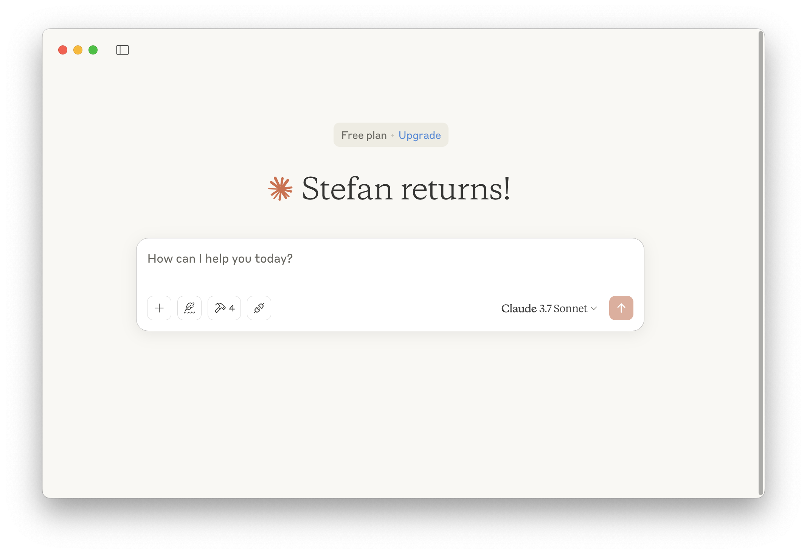
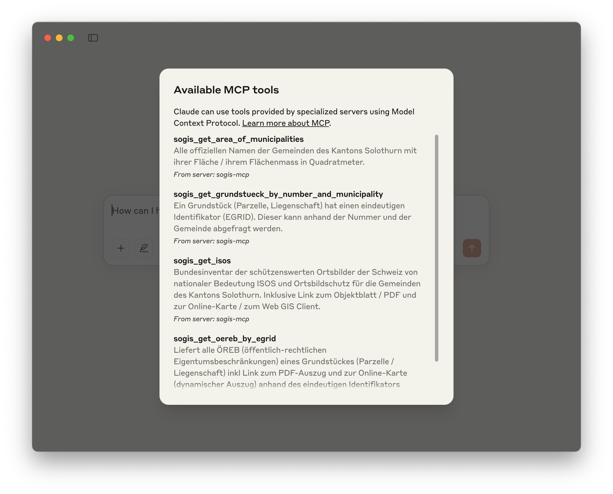
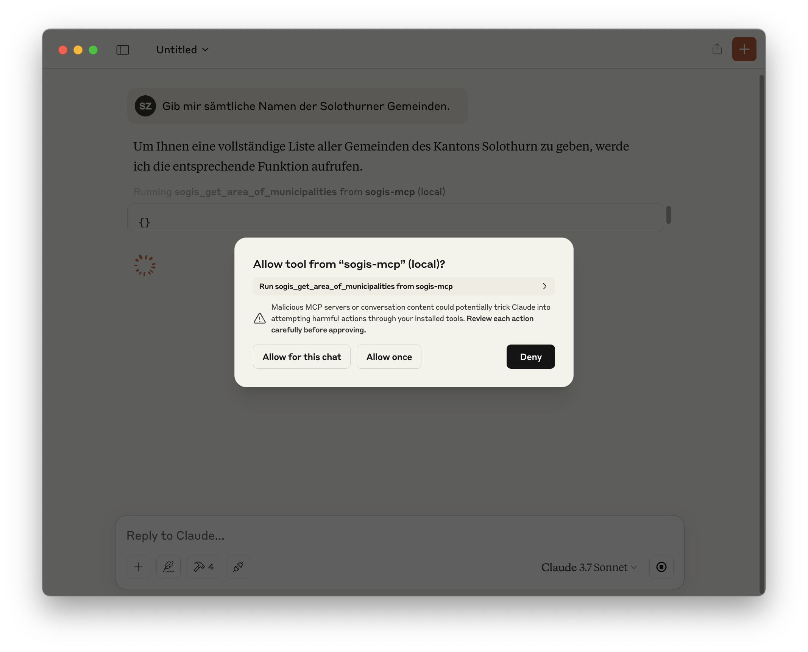
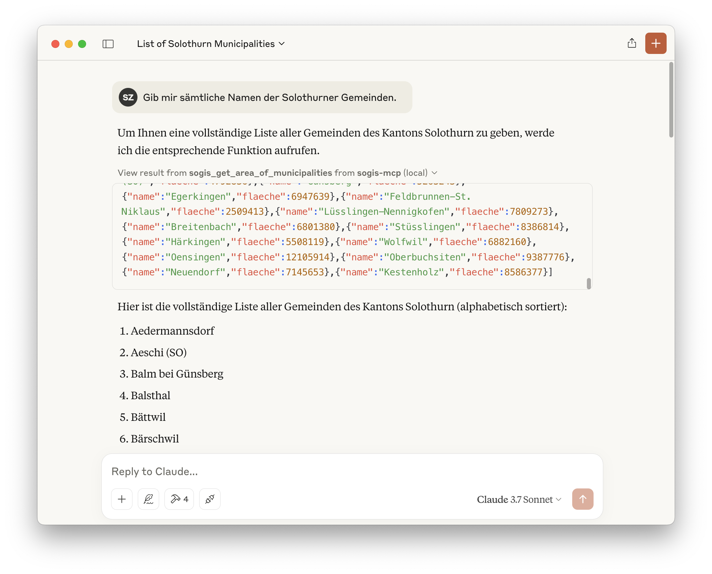
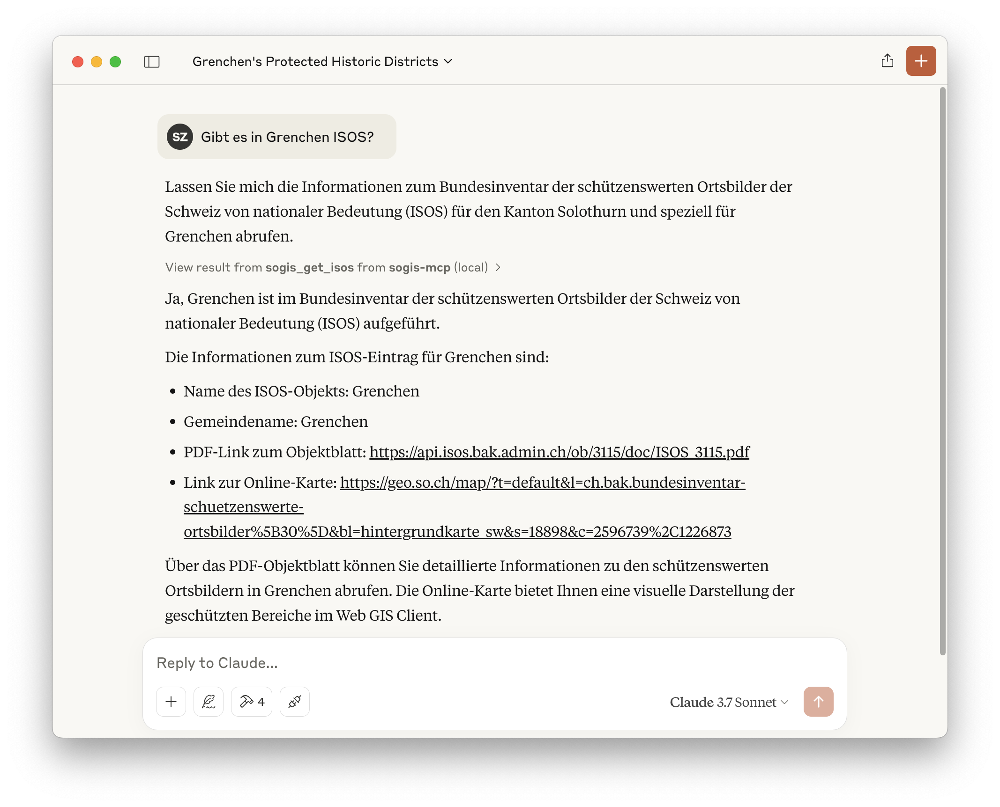
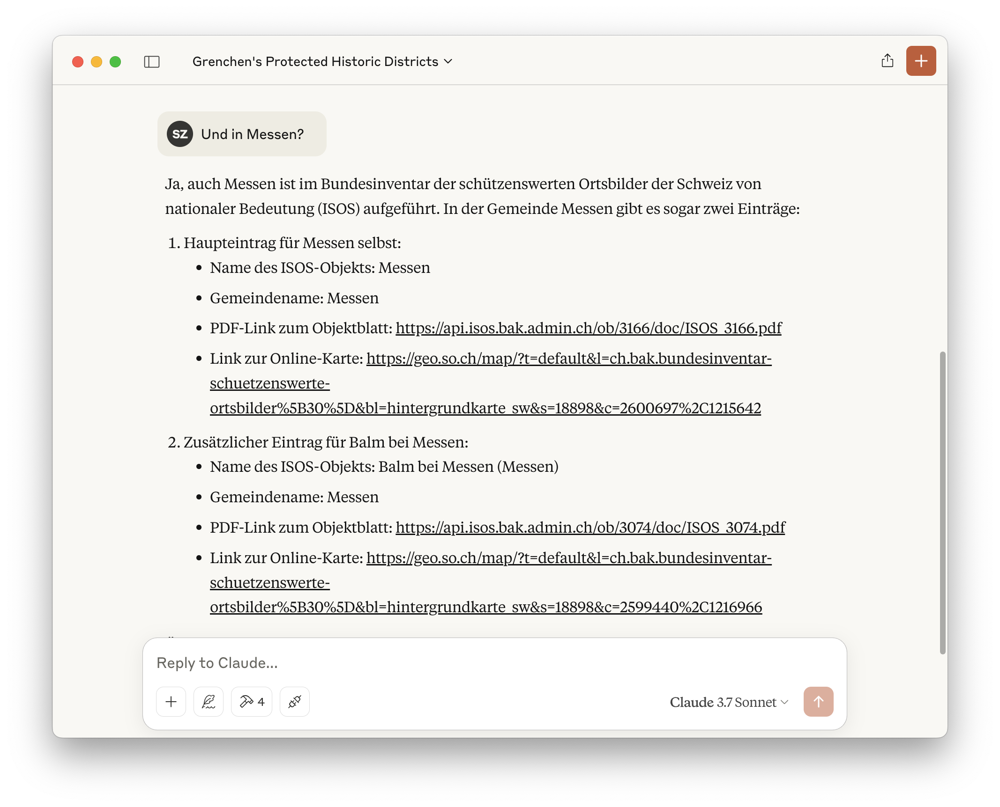
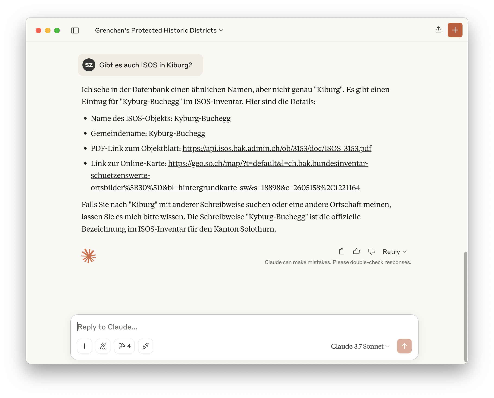
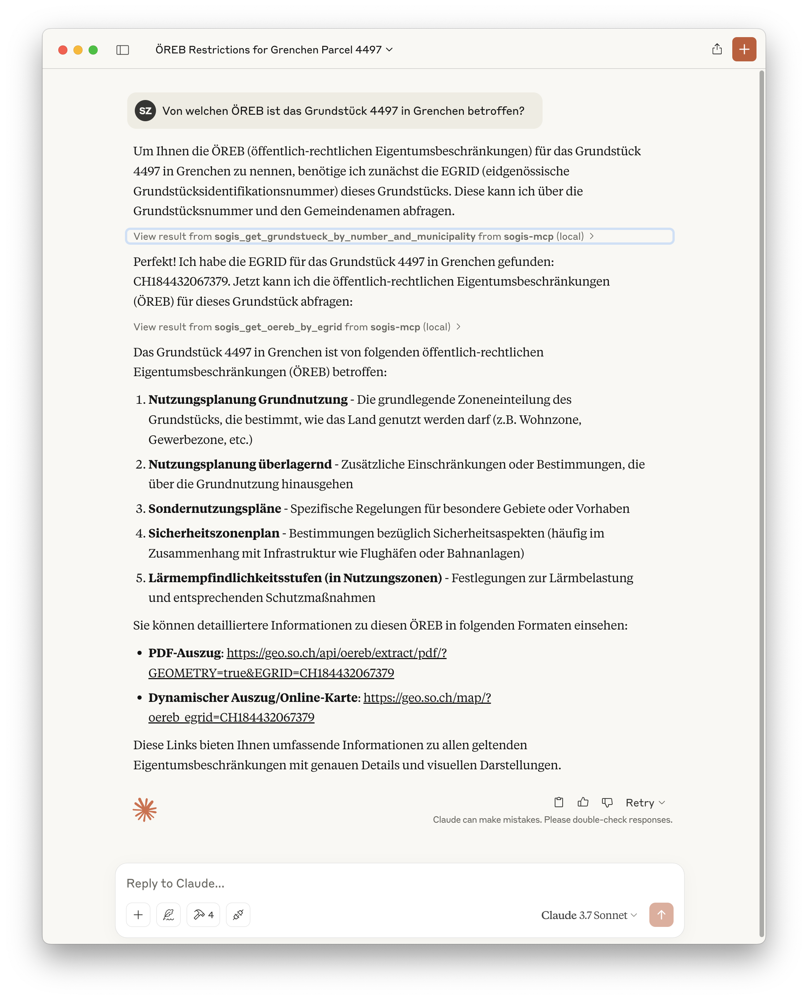

---
= AI - Model Context Protocol (MCP)
Stefan Ziegler
2025-04-16
:thoth-type: post
:thoth-status: published
:thoth-tags: Java,Spring Boot, AI, KI, Claude, MCP, ÖREB, OEREB
:idprefix:
---
So, ich steig' jetzt ebenfalls auf den fahrenden MCP-Zug auf. Der neueste KI-Hype. Was ist das Model Context Protocol? Ich glaube, vereinfacht darf man sagen, dass es sich um eine standardisierte Variante von Function-Calling handelt. Der LLM erlaubt/ermöglicht man das Aufrufen bestimmter (zur Verfügung gestellter) Funktionen. Was die Funktionen machen und was sie zurückliefern, ist völlig offen. Erfunden hat das Protokoll https://www.anthropic.com/news/model-context-protocol[Anthropic], die Firma hinter claude.ai.

Ich denke schon, dass eine öffentliche Verwaltung gewisse Mehrwerte mit LLM schaffen kann. Vor allem, wenn man auf eigene Daten zugreifen kann. Nun ist das so eine Sache. Bei uns ist halt in der Regel halb richtig, ganz falsch. Wem gehört ein Grundstück? Da gibt es eine richtige Antwort. Bei der Verwendung von LLM für die Beantwortung dieser und ähnlicher Fragen kann MCP sehr gut helfen. Das LLM entscheidet selbständig, dass es auf die Frage nicht mit seinem Basiswissen antworten kann und macht eine Anfrage via MCP. Die MCP-Funktion frägt dann z.B. beim Grundbuch (via GBDBS-Schnittstelle) nach und liefert den Namen des Eigentümers / der Eigentümerin. Das LLM macht anschliessend einen überzeugenden, toll klingenden Satz daraus.

Um bei Demos nicht gleich zu riskieren, dass die Leute wegen &laquo;LLM und Grundbuch&raquo; in Ohnmacht fallen, wähle ich andere Testfragen. Zum Aufwärmen soll mir das LLM alle Gemeindenamen des Kantons zurückliefern. Ich möchte auch fragen können, ob es in einer Gemeinde schützenswerte Ortsbilder (ISOS) gibt. Und zu guter Letzt soll es mir sagen, von welchen ÖREB-Themen ein Grundstück in einer Gemeinde betroffen ist.

Dazu braucht es einen MCP-Server und einen MCP-Client. Ich weiss nicht, ob es korrekt formuliert ist, aber ich würde sagen, dass der https://modelcontextprotocol.io/introduction#general-architecture[MCP-Client auch als LLM-Inferencer] wirkt. Client und Server können gemäss Standard unterschiedlich https://modelcontextprotocol.io/docs/concepts/transports[miteinander kommunizieren]: STDIO und Server-Sent Events. Für meine Tests reicht STDIO locker aus. Als Client wähle ich die https://claude.ai/download[Claude-Desktop-Anwendung]. Für die Implementierung des Servers wähle ich natürlich https://spring.io/projects/spring-boot[Spring Boot], https://spring.io/projects/spring-ai[Spring AI] und ein https://www.danvega.dev/blog/creating-your-first-mcp-server-java[Video] von His Masters Voice Dan Vega. Im Grunde genommen, muss man in Spring nur eine Service-Klasse mit einer Methode erstellen, welche die Businesslogik (im folgenden Beispiel eine Datenbankabfrage) enthält und diese korrekt annotieren, z.B.:

[source,java,linenums]
----
@Service
public class GemeindeService {
    private static final Logger log = LoggerFactory.getLogger(GemeindeService.class);

    private final JdbcClient jdbcClient;
    
    public GemeindeService(@Qualifier("pubJdbcClient") JdbcClient jdbcClient) {
        this.jdbcClient = jdbcClient;
    }
    
    @Tool(name = "sogis_get_area_of_municipalities", description = "Alle offiziellen Namen der Gemeinden des Kantons Solothurn mit ihrer Fläche / ihrem Flächenmass in Quadratmeter.")
    public List<Gemeinde> getGemeinden() {
        return jdbcClient.sql("SELECT gemeindename AS name,ST_Area(geometrie) AS flaeche FROM agi_hoheitsgrenzen_pub_v1.hoheitsgrenzen_gemeindegrenze")
                .query(Gemeinde.class)
                .list();
    }
}
----

Matchentscheidend ist die Beschreibung der Methode. Anhand dieser wird das LLM entscheiden für welche Frage es die Methode aufruft. Die Methoden müssen zusätzlich registriert werden:

[source,java,linenums]
----
@Bean
public List<ToolCallback> sogisTools(
        GemeindeService gemeindeService, 
        IsosService isosService,
        GrundstueckService grundstueckService,
        OerebService oerebService) {
    return List.of(ToolCallbacks.from(gemeindeService, isosService, grundstueckService, oerebService));
}
----

Weil die Kommunikation über STDIO geschieht, darf die Anwendung nichts loggen und keinen Banner in die Konsole rendern:

[source,yml,linenums]
----
spring.main.banner-mode=off
logging.pattern.console=
----

Das ist aber auch schon alles. Den vollständigen Quellcode gibt es im https://github.com/edigonzales/sogis-mcp-poc[Github-Repo]. Die Konfiguration des MCP-Clients / von Claude-Desktop geschieht über die JSON-Datei `claude_desktop_config.json`. Diese kommt im Claude-Applikations-Verzeichnis zu liegen:

[source,yml,linenums]
----
{
    "mcpServers" : {
        "sogis-mcp" : {
            "command" : "/Users/stefan/.sdkman/candidates/java/21.0.4-graal/bin/java",
            "args" : [
                "-jar",
                "/Users/stefan/sources/sogis-mcp-poc/build/libs/sogis-mcp-poc-0.0.1-SNAPSHOT.jar"
            ]
        } 
    }
}
----

Wenn alles so ist, wie es sein soll, sollte das GUI wie folgt aussehen:

Wichtig ist das Hammer-Symbol mit der Zahl Vier. Das bedeutet, dass es vier verfügbare MCP Tools (Funktionen) gibt:

Wie man auf dem Screenshot erkennt, habe ich vier MCP-Funktionen implementiert. Bis auf die Letzte sind alles Datenbankabfragen. Die ÖREB-Funktion ruft natürlich den ÖREB-Webservice auf und wertet die zurückgelieferte XML-Datei aus.

Was liefert Claude bei der einfachsten Frage? Freude herrscht: Claude frägt, ob er den MCP-Server benutzen darf. Das kann so eingestellt werden, dass nicht bei jeder gestellten Frage wieder nachgefragt wird:

Die Antwort des MCP-Servers kann man sich anzeigen lassen:

Das Resultat überzeugt. Er listet alle 106 Gemeinden auf. Lustigerweise hat Claude auch schon 107 Gemeinden gelistet gehabt (Drei Höfe 2x). Der MCP-Server liefert natürlich immer das korrekte Resultat. 

Jetzt möchte ich wissen, ob es in Grenchen ein schützenswertes Ortsbild gibt:

Die Antwort ist tiptop. Claude listet mir sogar die von der MCP-Funktion gelieferten Links zum PDF-Objektblatt und zum Web GIS Client auf. Ich will noch wissen, ob es in Messen schützenswerte Ortsbilder gibt (ja, zwei) und in Kyburg-Buchegg, wobei ich bewusst den Gemeindenamen falsch schreibe:

Claude erfüllt die Aufgabe auch hier. Nun zur Champions League: Ich möchte wissen, von welchen ÖREB-Themen das Grundstück 4497 in Grenchen betroffen ist. Dazu muss Claude zweimal eine MCP-Funktion aufrufen. Zuerst muss er aus Grundbuchnummer und Gemeindename den E-GRID ausfindig machen und anschliessend mit dem E-GRID eine andere MCP-Funktion aufrufen. Faszinierend ist für mich bereits, dass er Grundbuchnummer und Gemeindename korrekt der Funktion übergeben kann (und sie z.B. nicht vertauscht). Auch diese Aufgabe meistert Claude problemlos:

Wahrscheinlich lässt sich noch was rausholen, wenn man mit System-Prompts arbeiten würde/könnte und so ggf. die Themen selber besser beschreiben kann.

Löst MCP alle Probleme? Nein, insbesondere muss man aufpassen, dass man den Spagat hinkriegt zwischen sehr allgemeinen GIS-Fragestellungen und sehr spezifischen, die man mittels Funktionen beantworten will. Sind sie zu spezifisch, implementiert man sich wohl den Wolf. Sind sie zu allgemein, kann die LLM doch wieder keine schlüssige Antwort daraus formulieren.
