---
= INTERLIS leicht gemacht #50 - INTERLIS Developer Experience Improvements
Stefan Ziegler
2025-06-13
:thoth-type: post
:thoth-status: published
:thoth-tags: INTERLIS,UML-Editor,UML,Java,DevEx,ilivalidator,ili2c,Compiler,PlantUML,Mermaid
:idprefix:
---
Zum https://geobeer.ch[Geobeer]-Jubiläum (50. Ausgabe coming soon) gehe ich in Vorleistung und schreibe den 50. INTERLIS-leicht-gemacht-Beitrag. Es gibt ein paar Dinge, die mich beim täglichen Arbeiten mit INTERLIS und den Werkzeugen stören. Und ein paar Dinge, die ich zwar nicht wirklich benötige aber trotzdem hilfreich fände.

Beginnen wir mit den störenden Dingen: Ich habe verschiedenste Versionen der verschiedenen INTERLIS-Tools installiert. Das kann zum Debuggen von Bugs manchmal ganz hilfreich sein (&laquo;Das ging doch noch mit Version XY&raquo;). Das Herunterladen und in den korrekten Ordner kopieren, ist jetzt nicht so ein Ding. Was mich grundsätzlich eher stört, ist dass ich immer `java -jar /Users/stefan/apps/ili2c-5.5.3/ili2c.jar fubar.ili` tippen muss. Ja, jede Sekunde des Kantonsangestellten zählt. Ich bin grosser Fan von https://sdkman.io/[SDKMAN!]. Damit lassen sich einfach verschiedenste JDK und andere Java-Software installieren. Etwas Ähnliches für die INTERLIS-Werkzeuge habe ich mir immer gewünscht. Gescheitert ist es an meinem Unvermögen brauchbare Bash-Skripte zu schreiben. Times have changed: Nein, ich kann immer noch keine Bash-Skripte schreiben, aber ChatGPT kann es. Welcome https://github.com/edigonzales/ilitools-manager[_ilitools-manager_] (sehr origineller Name...).

Wie installiert man `ilitools-manager`? Als erstes muss gesagt werden, dass es nur in einer Shell unter Linux oder macOS funktioniert resp. unter Windows mit WSL2. Jedoch nicht in der Powershell. Zudem muss `curl` und `unzip` installiert sein. Unter macOS ist das bereits dabei, in meiner nackten Ubuntu-Installation musste ich glaube `unzip` installieren. Wenn diese Rahmenbedingungen erfüllt sind, reicht:

[source,bash,linenums]
----
curl -s https://raw.githubusercontent.com/edigonzales/ilitools-manager/refs/heads/main/install-ilitools.sh | bash
----

Anschliessend entweder ein Terminal neu öffnen oder `source ~/.bashrc`. Dann sollte _ilitools_ im Pfad verfügbar sein:

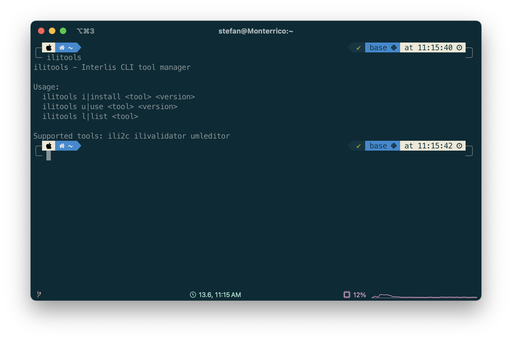

_ilitools_ kennt drei Befehle: Man kann sich für ein bestimmtes Werkzeug die vorhandenen Versionen anzeigen lassen, z.B. alle verfügbaren INTERLIS-Compiler, die man sich installieren lassen kann:

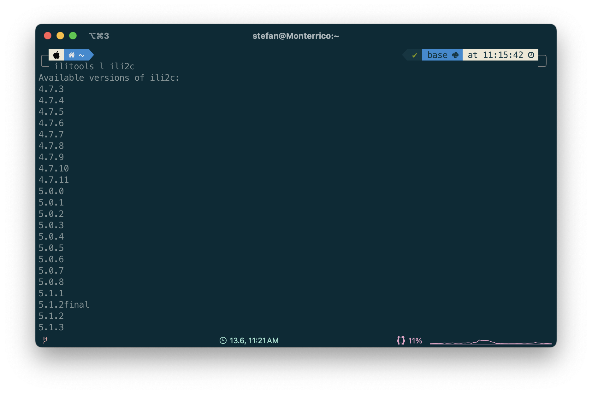

Zurzeit werden die Werkzeuge `ili2c`, `ilivalidator` und &laquo;oldie but goldie&raquo; UML/INTERLIS-Editor unterstützt. Zum Installieren einer Version reicht folgender Befehl:

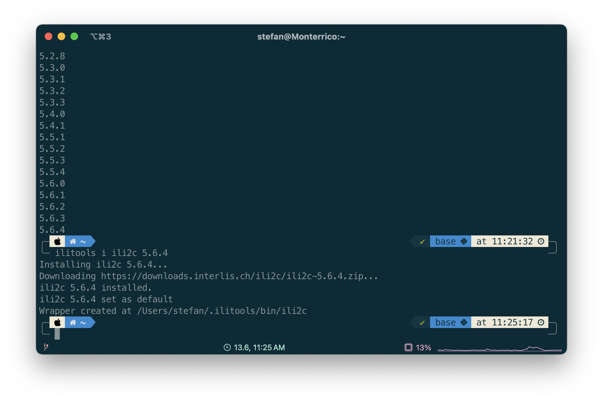

Das erstellt mir zusätzlich ein Wrapper-Skript `ili2c` mit dem ich den INTERLIS-Compiler starten kann:

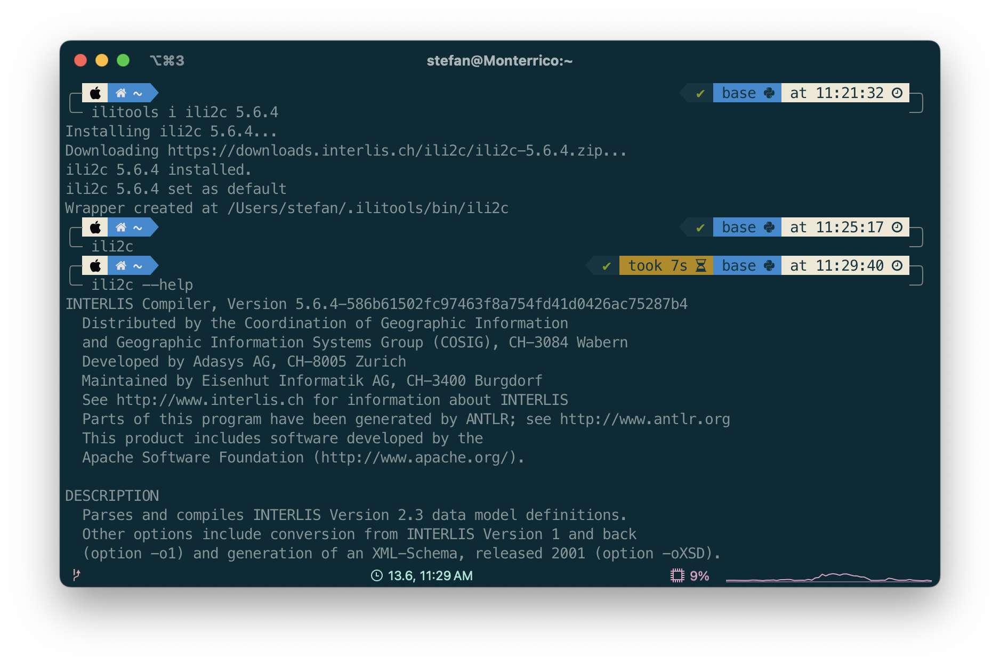

Wenn ich nochmals `ilitools l ili2c` ausführe, zeigt es mir in der Liste an, welche Versionen ich installiert habe (`(installed)`) und welches die vom Wrapper-Skript aktuell verwendete ist (`>`):

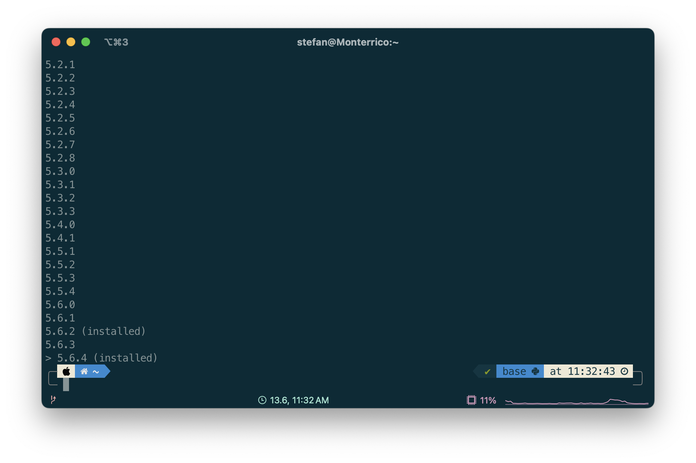

Mit `ilitools u ili2c 5.6.2` kann ich die zu verwendende Version ändern. 

Woher die Liste mit den Versionen stammt? Ich verwende die https://jars.interlis.ch/ch/interlis/ili2c-tool/maven-metadata.xml[maven-metadata.xml-Datei] aus dem Maven-Repository.

Nächstes Thema: https://code.visualstudio.com/[_Visual Studio Code_] wird dank der https://github.com/GeoWerkstatt/vsc_interlis2_extension[INTERLIS-Extension] von https://www.geowerkstatt.ch/[GeoWerkstatt] gerne zum Schreiben von INTERLIS-Modellen verwendet. Wie cool wäre es, wenn ich das Modell auch gleich mit dem INTERLIS-Compiler prüfen könnte und zwar ohne den Compiler installieren zu müssen? Wie soll das gehen? Viele Möglichkeiten dazu gibt es ja nicht. Ich habe mich dazu entschieden einen Webservice zu schreiben, der eine Datei entgegen nimmt, mit `ili2c` die Datei kompiliert und das Logfile zurückschickt. Eingebettet in eine Visual Studio Code Extension. Es gibt einen global verfügbaren Webservice, der standardmässig in der Extension konfiguriert ist. Man kann den Service jedoch auch einfach in der eigenen Organisation betreiben, damit die Modelle nicht irgendwo in einem schwarzes Loch (auf einem Hetzner-Server in Deutschland) verschwinden.

Eine besondere Anforderung habe ich an den Webservice gestellt: Er soll zukünftig fähig sein mit verschiedenen Compiler-Versionen umgehen zu können. Wie kann ich das mit Spring Boot umsetzen? Frägt man unbedarft das Internet, kommt als erstes natürlich das Stichwort &laquo;Microservice&raquo; zurück. D.h. für jede Version des Compilers einen eigenen Webservice. Das ist mir aber irgendwie zu mühselig. Am anderen Ende der Fahnestange wäre die Variante mit einer Spring Boot Anwendung und dem dynamischen Laden der korrekten Version der ili2c-Abhängigkeiten. Das Stichwort hier ist &laquo;Class Loader Isolation&raquo;. Das wiederum scheint mir zu heikel zu sein, da mein Verständnis dafür auch eher beschränkt ist. Den Mittelweg, den ich eingeschlagen habe, ist das WAR-Deployment. Dabei wird anstelle einer Fat-JAR-Datei (inkl. embedded Tomcat) eine WAR-Datei klassisch in einer Tomcat-Instanz deployed. D.h. ich kann für zukünftige Compiler-Versionen eine neue WAR-Datei erstellen und in der gleichen Tomcat-Instanz deployen (innerhalb eines https://github.com/edigonzales/ili-web-service-docker/blob/main/Dockerfile#L11[Dockerfiles]). Der Nachteil bei dieser Variante mit Spring Boot ist, dass jeweils das gesamte Spring Boot Framework ebenfalls in die WAR-Datei gepackt wird. Wenn man z.B. mit Jakarta EE unterwegs wäre, würde nur genau die Business-Logik (inkl. deren Abhängigkeiten) in die WAR-Datei gepackt. Es gäbe zwar verschiedene Workarounds für solche Thin-WAR-Dateien aber es sind halt Workarounds.

Zusätzlich zum Compiler möchte ich auch einen https://blog.sogeo.services/blog/2025/04/13/interlis-leicht-gemacht-number-49.html[INTERLIS-Modell-Pretty-Print-Service] anbieten und weil wir gerade dabei sind, möchte ich aus dem _iliprettyprint_ mehr machen als bloss Modelle schön formatieren. Weil ich dazu die Bibliotheken vom UML/INTERLIS-Editor verwende, habe ich mir vorgestellt, dass man sicher relativ einfach auch UML-Diagramme erstellen kann. Das Modell ist nach dem Einlesen dahingehend interpretiert und strukturiert, dass das Herstellen von z.B. https://plantuml.com/[PlantUML]- und https://mermaid.js.org/[Mermaid]-Code relativ einfach sein sollte. D.h. ich erstelle auch aus dem erweiterten iliprettyprint-Code eine WAR-Datei und deploye sie in einer Tomcat-Instanz.

In der Tomcat-Instanz laufen also zwei Anwendungen mit ingesamt drei API-Endpunkten:

- http://localhost:8080/ili2c/api/compile 
- http://localhost:8080/iliprettyprint/api/prettyprint
- http://localhost:8080/iliprettyprint/api/uml

Zu guter Letzt müssen wir uns um die Visual Studio Code Extension kümmern. Dazu muss ich - wie beim _ilitools manager_ - ChatGPT verwenden. Erstes kann ich überhaupt kein TypeScript programmieren und zweitens wüsste ich nicht wo beginnen mit der Extension und wie das gepackt und publiziert wird. Auch mit der Hilfe von ChatGPT war es bisschen hakelig. Aber am Ende hat es dann doch relativ wenig Aufwand benötigt. Die Extension hat den fantasievollen Namen &laquo;INTERLIS Tools&raquo;:

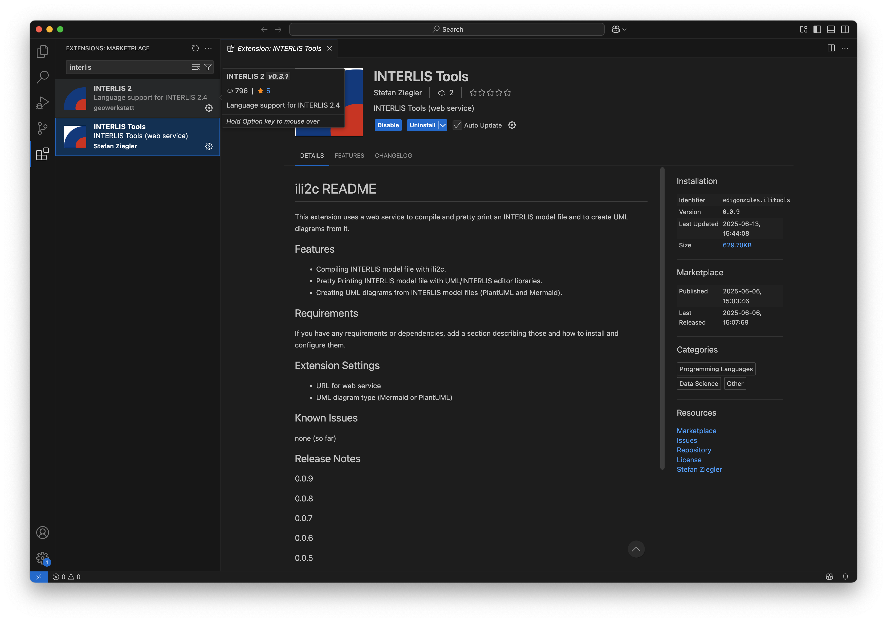

Wenn man eine INTERLIS-Modell-Datei im Editor lädt, fällt auf - jedenfalls ist es bei mir so -, dass die GeoWerkstatt-Extension automatisch ein UML-Diagramm (Mermaid) erstellt. Als zweites fällt auf, dass das Diagramm Fehler aufweist. Ich glaube, das hat damit zu tun, dass im Mermaid-Code für ein Objekt nicht ein eindeutiger Identifikator verwendet wird, sondern es wird nur der Name verwendet. So auch bei der Definition von Vererbungen. Aus diesem Grund zeigen alle Vererbungen irgendwie auf sich selber.

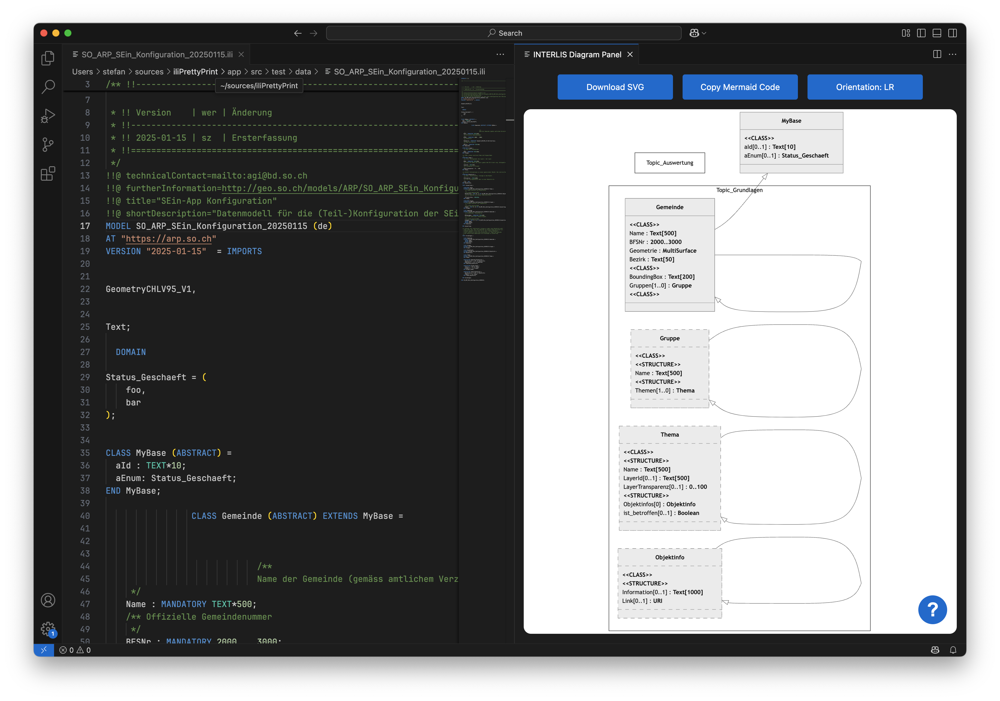

Für meine Extension kann man verschiedene Einstellungen vornehmen. Für jeden Service kann man den Endpunkt definieren und man kann zwischen zwei UML-Varianten wählen: PlantUML und Mermaid. Bei PlantUML schickt der Service die gerenderte PNG-Datei zurück, bei Mermaid den _Sourcecode_. Dieser wird in Visual Studio Code in einem eingebetteten Browser zu SVG gerendert.

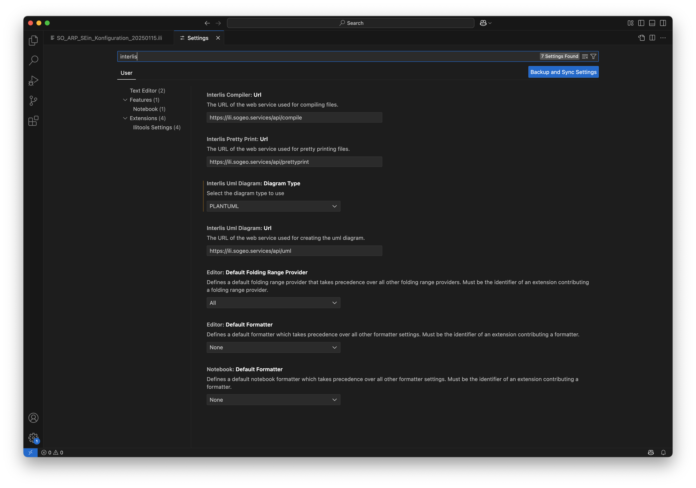

Das Kompilieren des INTERLIS-Modelles muss erstmalig mit `Ctrl+Shift+P` ausgewählt werden:

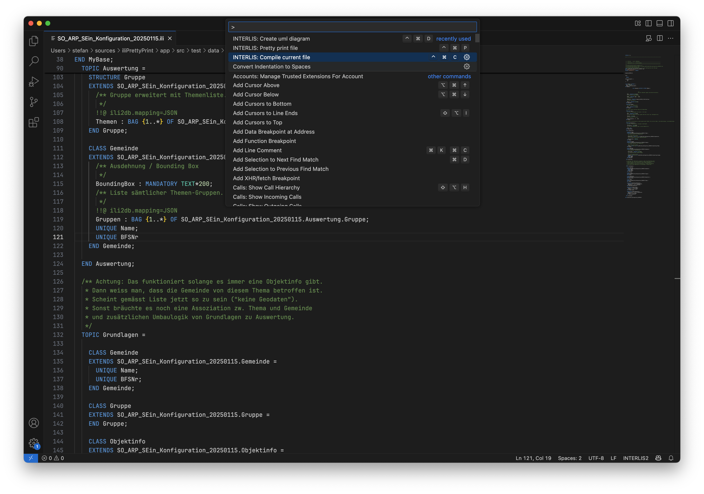

Allfällige Fehler werden in einem separaten Fenster geloggt:

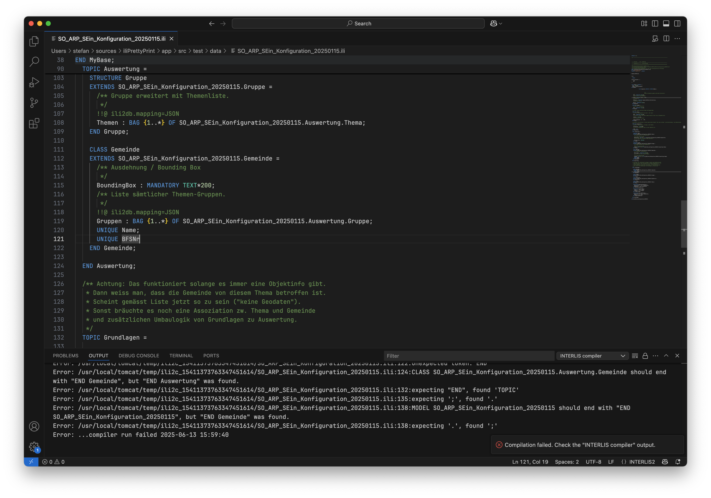

Die Modell-Datei wird anschliessend bei jedem Speichern geprüft:

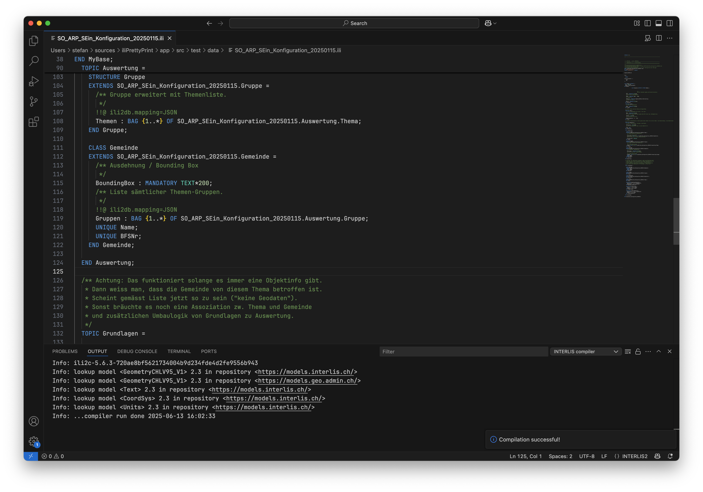

Ähnlich verhalten sich die Dienste für das Pretty Printing und das Herstellen des UML-Diagramms:

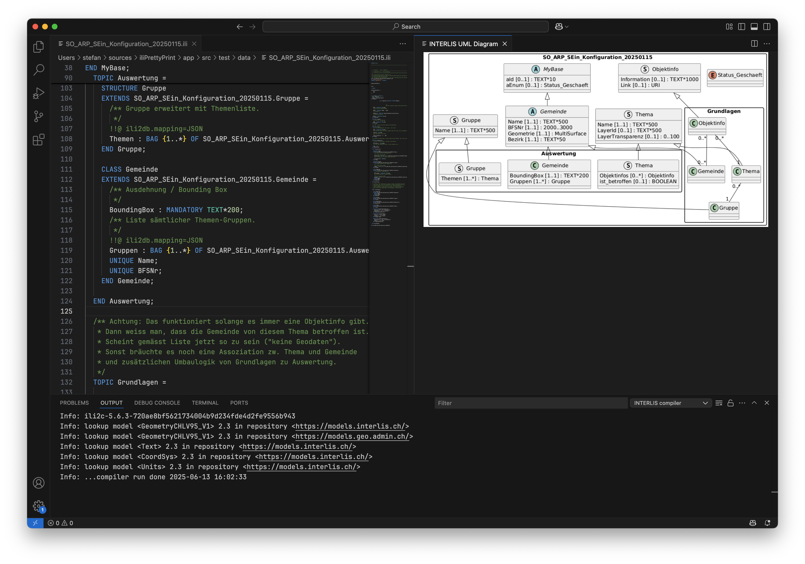

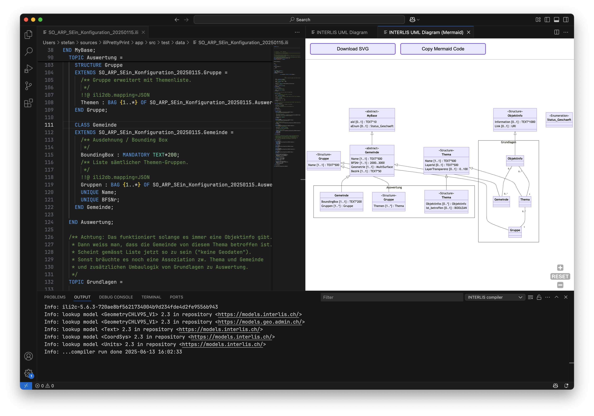

So und jetzt das Ganze auch noch für https://www.jedit.org/[jEdit]?

Links:

- https://hub.docker.com/repository/docker/sogis/ili-web-service/general
- https://github.com/edigonzales/ili-web-service-docker
- https://github.com/edigonzales/ili2c-web-service
- https://github.com/edigonzales/iliPrettyPrint
- https://github.com/edigonzales/ili-vscode
