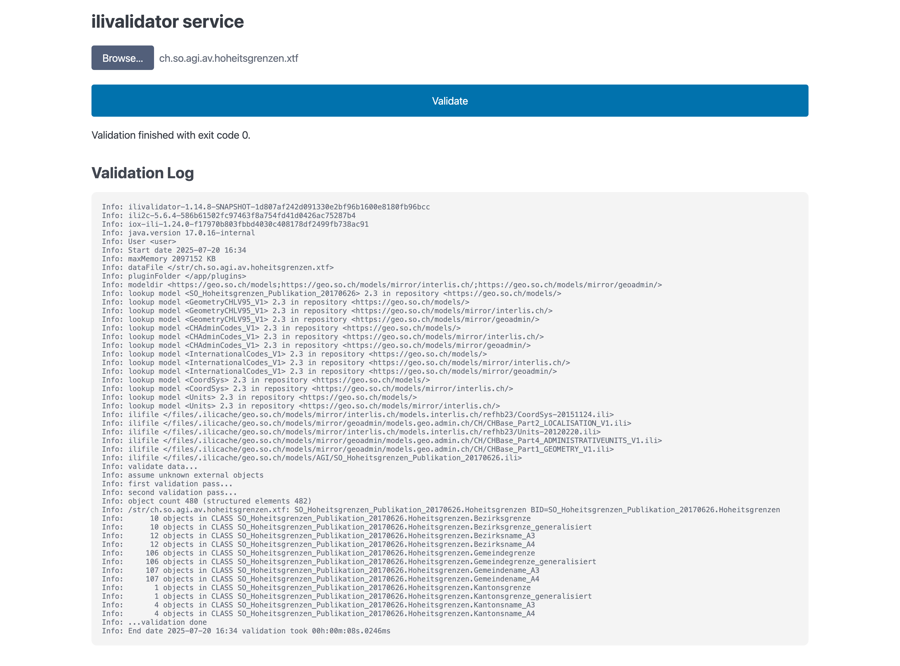

---
= INTERLIS leicht gemacht #51 - INTERLIS im Browser
Stefan Ziegler
2025-07-20
:thoth-type: post
:thoth-status: published
:thoth-tags: INTERLIS,ilivalidator,CheerpJ
:idprefix:
---
Ein Stück weit hat sich gedanklich eingebürgert, dass INTERLIS-Prüfungen nur via Webservice funktionieren. &laquo;Schuld&raquo; daran ist wohl die amtliche Vermessung mit dem dazugehörigen Checkservice. Damit wären wir auch gleich bei den positiven Aspekten eines Checkservices: Oftmals werden neben der eigentlichen Modellkonformität weitere Aspekte geprüft. Im Falle von https://github.com/claeis/ilivalidator[`ilivalidator`] sind diese in einem sogenannten Validierungsmodell (z.B. https://geo.so.ch/models/ARP/SO_Nutzungsplanung_20171118_Validierung_20231101.ili[Nutzungsplanung]) mit zusätzlichen INTERLIS-Constraints definiert. Manchmal benötigen diese Zusatzcontraints eigene INTERLIS-Funktionen. Also Funktionen, die nicht Bestandteil der INTERLIS-Spezifikation sind. Diese Funktionen (verpackt in einer Jar-Datei) müssen `ilivalidator` bekannt gemacht werden. Das alles ist machbar aber nicht sehr anwenderfreundlich. Man kann das als Auftraggeber (im Sinne von INTERLIS-Datenerfassung an Dritte beauftragen) vereinfachen, indem man im https://geo.so.ch/models/ilidata.xml[Datenrepository] ein sogenanntes Prüfprofil anlegt (entspricht einer metaConfig-Datei, z.B. https://geo.so.ch/models/ARP/SO_Nutzungsplanung_20171118_20231101-meta.ini[Nutzungsplanung]). Damit ist für die Auftragnehmer der ilivalidator-Aufruf viel einfacher: 

[source,bash,linenums]
----
java -jar ilivalidator.jar --metaConfig ilidata:SO_Nutzungsplanung_20171118_20231101-meta npl.xtf
----

Und schon werden sämtliche vom Auftragnehmer zusätzlich definierten Constraints und andere Spezialkonfigurationen bei der Validierung angewendet. Ist die Prüfung jedoch abhängig von zusätzlichem Code (also den zusätzlichen Funktionen), funktioniert es trotzdem nicht und der Auftragnehmer müsste die Jar-Datei(en) irgendwo herunterladen. Also auch zu kompliziert, insbesondere wenn im Jahre 2025 bereits ein Konsolenaufruf eine Herausforderung ist. Das ilivalidator-GUI hilft hier halt auch nicht weiter (&laquo;Was? Ilivalidator hat ein GUI?!&raquo;).

Aus diesem Grund ist ein zentral angebotener INTERLIS-Checkservice (inkl. sinnvoller maschineller Schnittstelle) nicht die dümmste Idee. Ein Grund warum `ilivalidator` überhaupt entstanden ist, war das Ziel, ihn frei verfügbar zu machen. Damit ist es auch möglich den (Prüf-)Algorithmus zu den Daten zu bringen und nicht die Daten zum Algorithmus. Der zentrale Checkservice hat entsprechend auch Nachteile: Die Daten verlassen die Organisation (oftmals zu einem Drittanbieter) und der Checkservice-Anbieter muss theoretisch beliebig viel Last verarbeiten können resp. er hat keine Ahnung, was ihn erwartet. Wir haben INTERLIS-Validierungen, die circa 8GB RAM benötigen. Dies aber nur ein paar Mal pro Jahr. Da wäre es eben einfacher, wenn der Auftragnehmer/Datenerfasser auf seinem Rechner (der wahrscheinlich mehr als das Doppelte an Arbeitsspeicher aufweist) die Validierung durchführen könnte und nicht wir mit unserem ilivalidator-web-service und diesem für drei Aufrufe pro Jahr 8GB RAM reservieren müssen. Ein weiteres Übel für den Diensteanbieter ist der Platzbedarf. Einerseits wenn die Transferdateien sehr gross werden (hier zudem noch die Firewall dazu kommt) und andererseits die temporären Dateien, die während der Validierung angelegt werden. Plattenplatz ist zwar relativ billig aber skaliert dann trotzdem nicht gegen unendlich.

Nun könnte man doch quasi &laquo;best of both worlds&raquo; anbieten: Einen INTERLIS-Checkservice, der die Transferdateien aber nicht auf einen fremden Server hochlädt, sondern lokal im Browser prüft. Wie das? Als erstes kommt einem https://webassembly.org/[WebAssembly] in den Sinn. Die Frage ist also bloss, wie mache ich aus dem `ilivalidator` eine WASM-Datei? Es stellt sich natürlich heraus, dass das nicht wirklich simpel ist. https://www.graalvm.org[GraalVM] hat eine https://www.graalvm.org/webassembly/docs/[WebAssembly-Laufzeitumgebung] aber ich will das Gegenteil. Und das https://graalvm.github.io/graalvm-demos/native-image/wasm-javac/[Gegenteil] steckt noch sehr in den Kinderschuhen. Ein zweites sehr interessantes Projekt ist https://teavm.org/[TeaVM]: Ein Ahead-of-Time Compiler, der aus Java-Bytecode JavaScript und WebAssembly erzeugt. Voller Vorfreude machte ich mich an einen Test aber schon bald stellte sich Ernüchterung ein. Man kann nicht einfach beliebige Java-Bibliotheken mir nichts, dir nichts nach WebAssembly kompilieren. Das hat damit zu tun, dass in WebAssembly nicht alles möglich ist, was mit Java geht und dass nicht alles was Java hergibt von TeaVM unterstützt wird. Zuerst musste ich SQLException-Klasse stubben nur um dann bei den antlr-Aufrufen von `ili2c` und den XML-Klassen zu scheitern. Also WebAssembly in dieser Form ad acta gelegt.

Ganz aufgeben kann/will man dann doch nicht. Es gibt noch https://cheerpj.com[CheerpJ]: Das ist eine (vollständige) JVM für den Browser in WebAssembly und JavaScript. Ein Fokus liegt z.B. auf der Weiterverwendung von Legacy-Apps (z.B. Applets oder Swing-Anwendungen). Man kann aber auch headless beliebige Java-Bibliotheken ansprechen. Gesagt, getan. Der Einfachheit halber habe ich `ilivalidator` zu einer Fat Jar kompiliert. Somit muss ich mich nur um _eine_ Jar-Datei kümmern. Die https://labs.leaningtech.com/blog/cheerpj-4.1#licensing[Lizenz] sieht vor, dass man für Open Source Projekte CheerpJ gratis verwenden darf. Man kann aber die JavaScript-Datei (und zu guter Letzt die Browser-JVM) nicht lokal hosten. Aber zum Ausprobieren reicht es. Man muss einzig eine _loader.js_-Datei laden. Die ganze &laquo;Anwendung&raquo; sieht wie folgt aus (CSS-Teil weggelassen):

[source,html,linenums]
----
<!DOCTYPE html>
<html lang="en">
<head>
  <meta charset="UTF-8" />
  <meta name="viewport" content="width=device-width, initial-scale=1.0" />
  <title>ilivalidator service</title>
  <link rel="stylesheet" href="https://cdn.jsdelivr.net/npm/@picocss/pico@2/css/pico.min.css">
  
  
</head>

<body>
  

  

    

  

  <main class="container">
    <h2>ilivalidator service</h2>
    
    <form onsubmit="handleFile(event)">
      <input 
        type="file" 
        id="fileInput" 
        accept=".xml,.xtf,.itf" 
        required
      />
      <button type="submit">Validate</button>
    </form>

    

    <section id="logContainer">
      <h3>Validation Log</h3>
      <pre id="logOutput">Loading...</pre>
    </section>
  </main>

  
  
</body>
</html>
----

Es gibt zwei technische Herausforderungen damit man überhaupt die Anwendung zum Laufen kriegt: Da ist neu der Umstand, dass die INTERLIS-Modellablagen korrekt CORS konfiguriert haben müssen, weil `ilivalidator` nun ja in einem Browser läuft und die Modelle suchen muss. Verschiedene Modellablagen sind nicht korrekt konfiguriert. Aus diesem Grund setze ich bewusst beim ilivalidator-Aufruf in Zeile 76 die `--modeldir`-Option und verwende unsere Mirror-Repositories. Eine weitere Herausforderung ist der Umgang mit Dateien. Da ist einerseits die Konvention, dass die Jar-Dateien im Root-Verzeichnis liegen müssen und dann mit dem Pfad `/app/...` angesprochen werden müssen. Weitere Konventionen gelten für den https://cheerpj.com/docs/guides/filesystem[Austausch] von Dateien zwischen JavaScript und Java, z.B. muss `ilivalidator` die zu prüfende XTF-Datei bekannt gemacht werden. Und JavaScript muss am Ende auf den Inhalt der Logdatei, die `ilivalidator` erstellt hat, zugreifen können. Funktionieren tut es grundsätzlich tadellos:

Perfekte Welt? Mitnichten. Im Logfile sieht man den Memory, der der JVM zugewiesen wurde. Das sind 2GB. Ich weiss nicht, ob man das steuern kann. Lokal wird der JVM bei mir (mit 16GB) standardmässig 4GB zugewiesen. So wie ich es verstehe, stehen einer 32bit-WebAssembly-Anwendung anscheinend maximal 4GB zur Verfügung (gemäss Spezifikation) oder nur 2GB durch Browser-Limits. Will man `ilivalidator` im Browser wirklich verwenden, müsste sicher mehr drinliegen als bloss die 2GB. Das andere und vielleicht gewichtigere Problem ist die Performance. Diese scheint mir nicht auf Java-Niveau zu sein. Dauert die Prüfung im Browser 8 Sekunden, ist es lokal bloss eine... Upsi. Es erinnert mich an die Tests, die ich mit `ilivalidator` gemacht habe und versuchte nur den Bytecode auszuführen (ohne das - während der Laufzeit - Runterkompilieren nach Maschinencode). 

INTERLIS im Browser scheint also nicht ganz so einfach zu sein und hat wohl auch einige Rahmenbedingungen, mit denen man leben muss. Dazu gehört sicher die Performance. Aber für den einen oder anderen (vielleicht exotischen) Usecase kann man mindestens mit CheerpJ ganz einfach die ilitools-Welt in den Browser bringen.

Links:

- https://github.com/edigonzales/ilivalidator-local-web-service