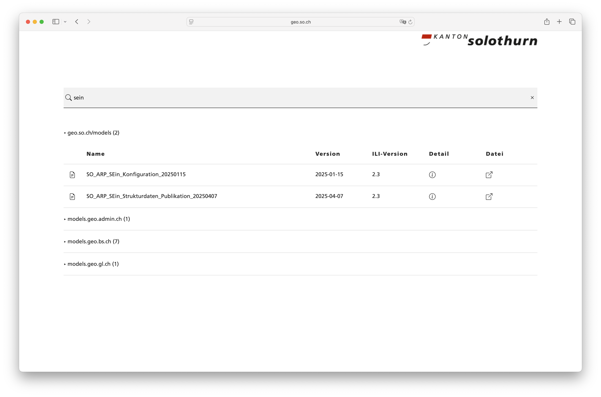

---
= INTERLIS leicht gemacht #52 - Neues vom Modelfinder
Stefan Ziegler
2025-07-21
:thoth-type: post
:thoth-status: published
:thoth-tags: INTERLIS,Java,Spring Boot,htmx,jte
:idprefix:
---
Vor Jahren habe ich eine https://geo.so.ch/modelfinder[Webanwendung] geschrieben, die regelmässig (2x pro Tag) die INTERLIS-Modellablagen (genauer die ilimodels.xml-Dateien) durchforstet, diese mit https://lucene.apache.org/[Lucene] indexiert und via GUI durchsuchbar macht. Die Anwendung ist in sich selber genügend, d.h. es gibt keine Abhängigkeiten zu einer Datenbank o.ä. Das soll auch so bleiben. 

&laquo;Klammer-Rant&raquo;: Leider stellte sich heraus, dass eine solche Anwendung (genau wie auch https://ilimodels.ch) nur halb sinnvoll ist: Es fehlt das gemeinsame Verständnis wie die ilimodels.xml-Datei abgefüllt werden soll. Welche Informationen gehören da rein? Eventuell fehlt auch noch ein Attribut oder auch zwei im darunterliegenden Datenmodell. Die Krux ist eben die, dass man nun nach &laquo;Naturgefahren&raquo; suchen kann, aber das MGDM nicht findet. Der Grund dafür ist, dass das MGDM in Englisch modelliert ist und der Name des Modelles &laquo;Hazard_Mapping_LV95_V1_3&raquo; ist. Nun gibt es im `ilimodels.xml` das `Tags`-Attribut, das beliebige Schlagwörter aufnehmen kann. Leider füllt hier Swisstopo nur das GeoIV-Nümmerli (z.B. 166.1) ab. Somit bringt die Indexierung dieses Attributes für das konkrete Problem auch nichts. Lange Rede, kurzer Sinn: Man findet heute eigentlich die gesuchten Modelle eher schlecht. &laquo;Jemand&raquo; müsste das endlich angehen. 

Von Zeit zu Zeit bin ich jedoch dankbar um unseren Modelfinder. Im Regelfall suche ich eigentlich eh nur unsere Modelle oder MGDM oder Kernmodelle. Via Modelfinder bin ich schneller als wenn ich einfach durchklicken würde. An unserer Lösung störte mich insbesondere die technische Umsetzung des Frontends. Dieses wurde mit https://www.gwtproject.org/[GWT] umgesetzt. Mit GWT schreibt man die JavaScript-Anwendung in Java und ein Transpiler wandelt den Java-Code in JavaScript um. Das funktioniert sehr gut und der Transpiler erzeugt effizientes JavaScript. Das ganze Drumherum ist aber für meine Usecases meistens ein Overkill. Oftmals habe ich bloss ein Suchfeld in dem der Benutzer z.B. nach Kartenlayer, nach Datensätzen oder ähnlichem suchen kann. Gefundene Objekte werden tabellarisch dargestellt. In diesem Fall sind es INTERLIS-Datenmodelle. Da ist nicht viel JavaScript drin. Man könnte natürlich JavaScript direkt schreiben, aber das will ich trotzdem lieber nicht, wenn ich es umgehen kann. Dabei kommt mir https://htmx.org/[HTMX] zu Hilfe. HTMX scheint mir ein wenig HTML auf Steroiden zu sein. Mit zusätzlichen Attributen kann z.B. jedes beliebige HTML-Element HTTP-Requests machen. Und es müssen nicht mehr zwingend `click` und `submit` Events sein, welche diese Requests triggern. Das offizielle Quickstart-Beispiel:

[source,html,linenums]
----

<!-- have a button POST a click via AJAX -->
<button hx-post="/clicked" hx-swap="outerHTML">
  Click Me
</button>
----

Was passiert da? Wenn man auf den Button klickt, wird ein AJAX-Request ausgeführt und der Inhalt des Buttons wird mit der Antwort ersetzt. Die Definition meines `input`-Elementes (das eigentliche Suchfeld nach Datenmodellen) sieht mit HTMX wie folgt aus:

[source,html,linenums]
----
<input id="search-input" class="search-input"
    type="text" 
    name="query" 
    hx-get="models" 
    hx-target="#results" 
    hx-trigger="input keyup changed delay:300ms"
    hx-headers='{"Accept": "text/html"}' 
    autocomplete="off" 
    placeholder="Search for INTERLIS models..." />
----

Als Templating-Engine verwende ich neuerdings https://jte.gg/[_jte_]. Mit https://www.thymeleaf.org/[Thymeleaf] wurde ich nie richtig warm. Entweder stimmt was mit mir nicht oder mit Thymeleaf.

Mit diesem Setup kann ich den ganzen GWT-&laquo;Ballast&raquo; über Bord werfen. Damit verschwindet auch ein weiteres Projekt, welches nicht Gradle, sondern Maven als Build-Tool verwendet. Nichts gegen Maven per se aber ich möchte mich bei uns auf ein Build-Tool beschränken und es fällt mir einfacher mit Gradle zu arbeiten. 

Die Startseite mit den Suchresultaten sieht nicht viel anders aus:

Neben den technischen (weniger sichtbaren) Neuerungen gibt es ein paar funktionale Neuerungen: Neu gibt es eine Detailansicht eines Datenmodelles. Die Detailansicht beinhaltet die Attribute aus der ilimodels.xml-Datei. Das hilft v.a. auch für das Aufdecken von Flüchtigkeitsfehlern. Interessanter wird es bei der Darstellung des Modelles. Es gibt eine textuelle Vorschau des Modelles mit Syntax Highlighting. Das Modell wird nicht zur Laufzeit vom Repository gelesen, sondern liegt ebenfalls im Suchindex vor. Das Syntax Hightlighing mache ich mit https://prismjs.com/[_Prism_]. Die dazugehörige Konfiguration habe ich der Konfiguration der https://github.com/GeoWerkstatt/vsc_interlis2_extension[Visual Studio Code INTERLIS Extension] entnommen und mittels ChatGPT umgewandelt. Das hat auf Anhieb funktioniert. Neben der textuellen Vorschau gibt es eine visuelle Vorschau mittels UML-Diagramm. Das UML-Diagramm wird mit bereits https://blog.sogeo.services/blog/2025/06/13/interlis-leicht-gemacht-number-50.html[vorhandenem Code] zur Laufzeit hergestellt. Zur Laufzeit weil ich beim Indexieren nicht die Modelle kompilieren will. Einige Modelle können nicht dargesestellt werden. Das liegt meines Erachtens jedoch an Fehlern in meinem Code. Diesen möchte ich eh nochmals refactoren und schauen, ob er gänzlich ohne UML/INTERLIS-Editor-Code auskommt. Ich bin nicht ganz sicher wie resp. wo ich das Diagramm darstellen will. Unterhalb des Modelles ist nicht ganz glücklich. Eigentlich will man doch das Modell lesen können und das UML-Diagramm gleichzeitig sehen können? Mal schauen, ob mir da noch eine gute Idee kommt. Für https://geo.so.ch/modelfinder/modelmetadata?serverUrl=http://models.geo.zh.ch&file=ARE/Abstandslinien_ZH_Master_V5.ili[grössere Modelle] muss ich noch das Zoom-und-Pan-JavaScript-Plugin einbauen. Aber so ganz grundsätzlich bin ich eigentlich zufrieden:

image::modelfinder02.png[alt="modelfinder 01", align="center"]

Wie bereits die alte Version des Modelfinders wollte ich auch die neue Version mit GraalVM in ein Native Image runterkompilieren und damit Ressourcen sparen. Das stellte sich aber als Unmöglichkeit heraus, weil die UML-Diagramm-Abhängigkeit UML/INTERLIS-Editor-Code verwendet, der wiederum AWT-Klassen referenziert. Das ist mit GraalVM noch ein Gefummel. Mit der Liberica-Version von GraalVM sollte es funktionieren. Bei mir nur theoretisch. Ich habe dann einen anderen Weg beschritten, um die Startup-Zeit und den Ressourcenbedarf der Java-Anwendung zu reduzieren. Java versucht mit dem https://openjdk.org/jeps/8335368[Projekt Leyden] diese Fragestellungen anzugehen und auch ohne das Runterkompilieren der gesamten Anwendung in ein Native Image zu lösen. In einem https://bell-sw.com/blog/how-to-use-cds-with-spring-boot-applications/[Bell Software Blogbeitrag] wird gezeigt, was heute mit Java 24 bereits möglich ist. Die Herstellung des Dockerimages wird zwar leicht komplizierter, die Startup-Zeit in unserem OpenShift-Cluster reduzierte sich aber von 2.5 Sekunden auf circa 0.8 Sekunden.

Links:

- https://geo.so.ch/modelfinder
- https://github.com/edigonzales/modelfinder

