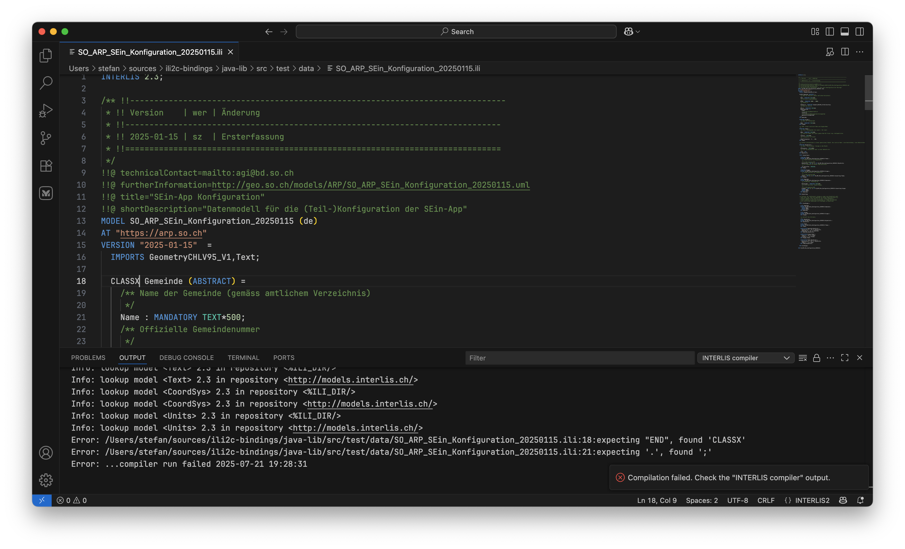

---
= INTERLIS leicht gemacht #53 - INTERLIS-Compiler-Bindings für Python und Node.js
Stefan Ziegler
2025-07-22
:thoth-type: post
:thoth-status: published
:thoth-tags: INTERLIS,ili2c,Java,GraalVM,Python,Node.js
:idprefix:
---
Im https://blog.sogeo.services/blog/2025/06/13/interlis-leicht-gemacht-number-50.html[50. INTERLIS-Beitrag] habe ich etwas über Verbesserungen der Developer Experience von INTERLIS geschrieben. Dafür habe ich eine Visual Studio Code Extension geschrieben, die drei Dinge macht: 

1. Prüft mit dem INTERLIS-Compiler die syntaktische Korrektheit eines Modelles. 
2. Formatiert die Modelldatei (wie es auch der INTERLIS-Compiler macht). 
3. Erstellt ein UML-Diagram (PlantUML oder Mermaid) aus einer Modelldatei. 

Die Businesslogik dazu steckt nicht in der VS Code Extension, sondern die Modelldatei wird an einen Webserver geschickt, der diese drei Aufgaben übernimmt und das entsprechende Resultat zurückschickt. Kann man so machen, aber schöner wäre natürlich, wenn das alles lokal (direkt mit der Extension) möglich wäre. Ggf. will man seine Daten nicht irgendwem auf einen Server laden oder man will nicht selber einen solchen Server betreiben. Das erklärte Ziel ist also den https://github.com/claeis/ili2c[INTERLIS-Compiler] _irgendwie_ in die VS Code Extension zu packen, aber selbstverständlich ohne von Java abhängig zu sein. In https://blog.sogeo.services/blog/2025/07/20/interlis-leicht-gemacht-number-51.html[meiner WebAssembly-Euphorie] dachte ich, dass es damit geht. Aber das stellte sich als nicht machbar heraus. Die Backup-Variante ist nun folgende: Wir kompilieren `ili2c` resp. einige Methoden davon mit https://www.graalvm.org[GraalVM] in eine Native Shared Library. Anschliessend erstellen wir eine Node-Modul &laquo;ili2c&raquo;, welches auf diese Library (je nach OS ist das eine .dll-, .so- oder .dylib-Datei) zugreift und gegen aussen ein API definiert. D.h. als Benutzer möchte ich sowas machen können:

[source,bash,linenums]
----
npm install ili2c
----

[source,javascript,linenums]
----
const ili2c = require('ili2c');
const result = ili2c.compileModel("test/Test1.ili", "ili2c.log");
----

Damit wäre der Grundstein gelegt, um das ili2c-Modul auch in der VS Code Extension zu verwenden. Der Weg dahin war aber nicht ganz so einfach und trivial und straight forward wie erwünscht. Es gab einige Hürden überwinden:

Der erste Schritt ist der einfachste. Das Herstellen der Native Shared Library. Ich habe das bereits ausführlich mit https://blog.sogeo.services/blog/2022/12/11/interlis-leicht-gemacht-number-33.html[`ilivalidator` und Python durchgespielt]. Es gibt für die Java-Methoden, die in der Shared Library landen sollen, verschiedene Rahmenbedingungen. Eine davon ist, dass sie statisch sein muss und man kann nur beschränkt Objekte als Parameter übergeben und zurückliefern. Im vorliegenden Fall ist das alles nicht tragisch kompliziert, ich möchte z.B. die Modelldatei und eine Logdatei (resp. der jeweilige Pfad als String) übergeben:

[source,java,linenums]
----
@CEntryPoint(name = "compileModel")
public static int compileModel(IsolateThread thread, CCharPointer iliFile, CCharPointer logFile) {   
    String iliFileStr = CTypeConversion.toJavaString(iliFile);
    String logFileStr = CTypeConversion.toJavaString(logFile);
    return compileModelImpl(iliFileStr, logFileStr);        
}

public static int compileModelImpl(String iliFile, String logFile) {
    try {
        Files.deleteIfExists(new File(logFile).toPath());
    } catch (IOException e) {
        e.printStackTrace();
    }
    FileLogger fileLogger = new FileLogger(new File(logFile), false);
    EhiLogger.getInstance().addListener(fileLogger);

    EhiLogger.logState("ili2c-"+TransferDescription.getVersion());
    EhiLogger.logState("ilifile <" + iliFile + ">");
    
    IliManager manager = new IliManager();        
    manager.setRepositories(Ili2cSettings.DEFAULT_ILIDIRS.split(";"));
    ArrayList<String> iliFiles = new ArrayList<String>();        
    iliFiles.add(iliFile);
    Configuration config;
    try {
        config = manager.getConfigWithFiles(iliFiles);
    } catch (Ili2cException e) {
        EhiLogger.getInstance().removeListener(fileLogger);
        fileLogger.close();
        return 1;
    } 
    
    DateFormat dateFormatter = new SimpleDateFormat("yyyy-MM-dd HH:mm:ss");
    Date today = new Date();
    String dateOut = dateFormatter.format(today);
    
    TransferDescription td = null;
    try {
        td = ch.interlis.ili2c.Ili2c.runCompiler(config);
    } catch (Ili2cFailure e) {
        EhiLogger.logError("...compiler run failed " + dateOut);
        EhiLogger.getInstance().removeListener(fileLogger);
        fileLogger.close();
        return 1;
    }

    EhiLogger.logState("...compiler run done " + dateOut);
    EhiLogger.getInstance().removeListener(fileLogger);
    fileLogger.close();
    return 0;
}
----

Die Methode mit der Annotation `@CEntryPoint` ist die Methode, die exponiert wird. Die Aufsplittung in zwei Methoden habe ich gemacht, damit ich in Java den Grossteil der Businesslogik testen kann. Das Resultat sind Header-Dateien (.h-Files) und die betriebssystemabhängigen Libraries. Mit den Github Actions kann man für Linux (amd64), Windows (amd64) und macOS (amd64 _und_ arm64) Binaries herstellen. Das bedeutet, dass das zukünftige ili2c-Node-Modul auf anderen Betriebssystemen und anderen Architekturen nicht funktionieren wird (was aber eher Exoten wären). Die Libraries sind keine statisch gelinkten Libraries, sondern benötigen z.B. unter Linux und macOS `libc` und `zlib`. Das ist aber in der Regel vorhanden und die Libraries funktionieren somit out-of-the-box. Auch unter Windows sollten sie soweit ohne weiteres Zutun funktionieren. Unter Linux kann man wirkliche statisch gelinkte Libraries herstellen, indem man sie gegen die musl-libc-Implementierung linkt. Dann könnte man die Bibliotheken z.B. auch in `FROM scratch` Dockerimages verwenden.

Das Ansprechen der Shared Native Libraries im Node-Module war sehr mühsam. Es gibt verschiedene Varianten wie das gemacht werden kann und als bequemer Mensch möchte man natürlich die vermeintlich einfachste Variante verwenden. Daraus wurde aber nichts. Die m.E. einfachere Variante ist das Laden der Library mit purem JavaScript. Dazu wird z.B. das `node-ffi-napi`-Modul benötigt. Und hier beginnt der Spiessrutenlauf. Das funktioniert nicht auf einem Apple Silicon Gerät. Dann gibt es Forks und Forks von Forks und neue Ansätze, die aber allesamt bei mir überhaupt nicht funktionierten oder zu einem Segfault führten. Somit musste ich die Kröte schlucken und die zweite Variante angehen. Bei dieser muss man ein natives Nodes.js Addon in C/C++ schreiben und gegen meine Shared Library linken. Da und bei der richtigen Konfiguration der Befehle etc. half mir mein neuer 23-Franken-Mitarbeiter (ChatGPT) sehr. Ich weiss nicht, ob ich das ohne ihn hingekriegt hätte. Gut, man hätte wahrscheinlich in einem Forum oder in einer Mailingliste nachgefragt. Ein Auszug aus diesem Addon:

[source,cpp,linenums]
----
Napi::Value CompileModel(const Napi::CallbackInfo& info) {
    Napi::Env env = info.Env();

    if (thread == nullptr) {
        Napi::Error::New(env, "Isolate not initialized. Call initIsolate first.").ThrowAsJavaScriptException();
        return env.Null();
    }

    if (info.Length() < 2 || !info[0].IsString() || !info[1].IsString()) {
        Napi::TypeError::New(env, "Expected (string iliFile, string logFile)").ThrowAsJavaScriptException();
        return env.Null();
    }

    std::string iliFile = info[0].As<Napi::String>();
    std::string logFile = info[1].As<Napi::String>();

    int res = compileModel(thread, const_cast<char*>(iliFile.c_str()), const_cast<char*>(logFile.c_str()));

    if (res < 0) {
        Napi::Error::New(env, "compileModel critical failure with code: " + std::to_string(res)).ThrowAsJavaScriptException();
        return env.Null();
    }

    // 0 means success, 1 means model compile failure
    return Napi::Boolean::New(env, res == 0);
}
---- 

Der JavaScript-Code, der mittels Node-API meine Libs anspricht und gegen aussen ein einfaches API definiert, ist eher trivial:

[source,javascript,linenums]
----
const path = require('path');

const platform = process.platform;
const arch = process.arch;

let runtime = "node";
if (process.versions.electron) {
  runtime = "electron";
}

if (process.platform === "win32") {
  const dllFolder = path.join(__dirname, 'prebuilds', `${platform}-${arch}`);
  process.env.PATH = `${dllFolder};${process.env.PATH}`;
}

const nativePath = path.join(__dirname, 'prebuilds', `${platform}-${arch}`, runtime, 'ili2c.node');
const native = require(nativePath);

let initialized = false;

// wrapper function that automatically handles isolate
function compileModel(iliFile, logFile) {
  if (!initialized) {
    native.initIsolate();
    initialized = true;
  }
  return native.compileModel(iliFile, logFile);
}

function prettyPrint(iliFile) {
  if (!initialized) {
    native.initIsolate();
    initialized = true;
  }
  return native.prettyPrint(iliFile);
}

// auto-teardown on exit
process.on('exit', () => {
  if (initialized) {
    native.tearDownIsolate();
  }
});

module.exports = {
  compileModel, prettyPrint
};
----

Das ist aber nicht das Ende des Leidenswegs. Das wird tiptop mit einer normalen Node.js-Anwendung funktionieren aber nicht mit Visual Studio Code. VS Code basiert auf Electron. Electron verwendet wie auch Node.js _V8_. Aber in einer anderen ABI-Version, d.h. die Binaries sind untereinander nicht kompatibel. Das betrifft aber nicht meine Native Shared Library, sondern bloss das Addon. Dieses muss für Node &laquo;pur&raquo; und für Electron separat kompiliert werden. 

Hat man das alles zusammen, ist es gar nicht mehr so wild. Vor allem dünkt mich, dass man es schon verstehen kann, was abgeht. Unterstützung benötigt man vor allem bei der korrekten Konfiguration der Befehle beim Herstellen der Binaries. Das Ganze resultierte jedoch zu einer umfangreichen Pipeline / Github Action. In meinem Fall habe ich alles in den gleichen Workflow in unterschiedliche Jobs gepackt. Ich bin momentan aber eher der Meinung, dass man sogar das Github-Repository - also den Code - eher wieder auseinanderpfrimeln sollte. Oder aber mindestens die Workflows trennen: ein Workflow inkl. Deployment der Native Shared Libraries, ein Workflow für die Node.js-Bindings und ein Workflow für die Python-Bindings. Heute führt eine kleine Änderung z.B. im Node.js-Binding-Code zu neuen Native Shared Libraries und auch neuen Python-Bindings. Das finde ich nicht gut.

In meiner nicht sehr elaborierten und first-ever Visual Studio Code https://github.com/edigonzales/ili-vscode/[Extension] (muss mindestens bissle aufgeräumt werden, das README.md ist doch eher peinlich) kann ich das ili2c-Node-Modul als Abhängigkeit definieren:

[source,json,linenums]
----
  "dependencies": {
    "ili2c": "^0.0.27",
  }
----

Man muss aufpassen, dass die Native Shared Libraries vor dem Paketieren der VS Code Extension an den richtigen Ort kopiert werden, sonst landen sie eben nicht in der Extension: 

[source,json,linenums]
----
  "scripts": {
    "vscode:prepublish": "npm run package && mkdir -p dist/prebuilds && cp -r node_modules/ili2c/prebuilds/* dist/prebuilds/",
    ...
    "watch": "mkdir -p dist/prebuilds && cp -r node_modules/ili2c/prebuilds/* dist/prebuilds/ && npm-run-all -p watch:*",
    ...
  }
----

Mit Version https://marketplace.visualstudio.com/items?itemName=edigonzales.ili2c[0.0.10 der Extension] wird nun auf den Webservice komplett verzichtet und für das Pretty Printing und das Kompilieren des Modelles wird mein ili2c-Node-Modul mit den Native Shared Libraries verwendet. Das Herstellen des UML-Diagramms habe ich aus der Extension entfernt. Soweit funktioniert es bei mir unter macOS tadellos, ob es unter Linux und Windows gleich gut funktioniert, kann ich nicht prüfen:

Was ist mit Python? Das ist eher ein Abfallprodukt und man kriegt das praktisch geschenkt. Dort gibt es keine ähnlichen Schwierigkeiten wie bei Node.js. Keine ABI-Unverträglichkeit und man kann ein Python-Paket zum Ansprechen der Native Shared Libraries verwenden:

[source,python,linenums]
----
from ctypes import *
from importlib_resources import files
import platform

if platform.uname()[0] == "Windows":
    lib_name = "libili2c.dll"
elif platform.uname()[0] == "Linux":
    lib_name = "libili2c.so"
else:
    lib_name = "libili2c.dylib"

class Ili2c:
    @staticmethod
    def create_ilismeta16(iliFile: str, xtfFile: str) -> bool:
        lib_path = files('ili2c.lib_ext').joinpath(lib_name)
        # str() seems to be necessary on windows: https://github.com/TimDettmers/bitsandbytes/issues/30
        dll = CDLL(str(lib_path))
        isolate = c_void_p()
        isolatethread = c_void_p()
        dll.graal_create_isolate(None, byref(isolate), byref(isolatethread))

        try:
            result = dll.createIlisMeta16(isolatethread, c_char_p(bytes(iliFile, "utf8")), c_char_p(bytes(xtfFile, "utf8")))
            return result == 0
        finally:
            dll.graal_tear_down_isolate(isolatethread)

    @staticmethod
    def compile_model(iliFile: str, logFile: str) -> bool:
        lib_path = files('ili2c.lib_ext').joinpath(lib_name)
        dll = CDLL(str(lib_path))
        isolate = c_void_p()
        isolatethread = c_void_p()
        dll.graal_create_isolate(None, byref(isolate), byref(isolatethread))

        try:
            result = dll.compileModel(isolatethread, c_char_p(bytes(iliFile, "utf8")), c_char_p(bytes(logFile, "utf8")))
            return result == 0
        finally:
            dll.graal_tear_down_isolate(isolatethread)

    @staticmethod
    def pretty_print(iliFile: str) -> bool:
        lib_path = files('ili2c.lib_ext').joinpath(lib_name)
        dll = CDLL(str(lib_path))
        isolate = c_void_p()
        isolatethread = c_void_p()
        dll.graal_create_isolate(None, byref(isolate), byref(isolatethread))

        try:
            result = dll.prettyPrint(isolatethread, c_char_p(bytes(iliFile, "utf8")))
            return result == 0
        finally:
            dll.graal_tear_down_isolate(isolatethread)
----

Installieren kann man das Python-Paket ganz normal:

[source,bash,linenums]
----
pip install ili2c
----

Ein Modell kompilieren:

[source,python,linenums]
----
from ili2c import Ili2c
result = Ili2c.compile_model("test/Test1.ili", "ili2c.log")
print(result)
----

In Python habe ich eine weitere Methode exponiert (`create_ilismeta16`). Diese erzeugt aus einem INTERLIS-Datenmodell die dazugehörige IlisMeta16-INTERLIS-Transferdatei. Nun kann man z.B. mit den XML-Fähigkeiten einer beliebigen Programmiersprache das INTERLIS-Datenmodell besser verstehen und daraus andere Dinge ableiten. Oder man spinnt - weil so spassig - mit XQuery 3.1 ein wenig rum und versucht aus dem XML Python Data Classes herzustellen:

[source,xquery,linenums]
----
xquery version "3.1";

declare namespace ili = "http://www.interlis.ch/xtf/2.4/INTERLIS";
declare namespace IlisMeta16 = "http://www.interlis.ch/xtf/2.4/IlisMeta16";

let $modelTid := "SO_ARP_SEin_Konfiguration_20250115"
let $classes :=
  //IlisMeta16:Class[
    starts-with(@ili:tid, concat($modelTid, ".")) and 
    IlisMeta16:Kind = 'Class'
  ]

return
  string-join(
    for $cls in $classes
    let $clsName := $cls/IlisMeta16:Name/text()
    let $clsTid := string($cls/@ili:tid)
    let $attrs := //IlisMeta16:AttrOrParam[IlisMeta16:AttrParent/@ili:ref = $clsTid]
    return
      string-join((
        "from dataclasses import dataclass",
        "from typing import Optional",
        "",
        "@dataclass",
        "class " || $clsName || ":",
        if (empty($attrs)) then
          "    pass"
        else
          string-join(
            for $attr in $attrs
            let $attrName := $attr/IlisMeta16:Name/text()
            let $doc := normalize-space($attr//IlisMeta16:Text/text())
            let $typeRef := $attr/IlisMeta16:Type/@ili:ref
            let $typeEl := //*[namespace-uri() = 'http://www.interlis.ch/xtf/2.4/IlisMeta16' and @ili:tid = $typeRef]
            let $typeKind := name($typeEl)
            let $pyType :=
              if ($typeKind = 'IlisMeta16:TextType') then "str"
              else if ($typeKind = 'IlisMeta16:NumType') then "float"
              else if ($typeKind = 'IlisMeta16:DateType') then "str" (: or use date :)
              else "Optional[str]" (: default fallback :)
            return
              "    " || $attrName || ": " || $pyType || (
                if ($doc) then "  # " || $doc else ""
              )
          , codepoints-to-string(10))  (: newline :)
      ), codepoints-to-string(10))
  , codepoints-to-string(10) || codepoints-to-string(10))  (: double newline between classes :)
----

[source,xquery,linenums]
----
from dataclasses import dataclass
from typing import Optional

@dataclass
class Gemeinde:
    Name: str  # Name der Gemeinde (gemäss amtlichem Verzeichnis)
    BFSNr: float  # Offizielle Gemeindenummer
    Geometrie: Optional[str]  # Geometrie
    Bezirk: str  # Name des Bezirks
    Handlungsraum: Optional[str]

from dataclasses import dataclass
from typing import Optional

@dataclass
class Gemeinde:
    BoundingBox: str  # Ausdehnung / Bounding Box
    Gruppen: Optional[str]  # Liste sämtlicher Themen-Gruppen.

from dataclasses import dataclass
from typing import Optional

@dataclass
class Gemeinde:
    pass

from dataclasses import dataclass
from typing import Optional

@dataclass
class Gruppe:
    pass

from dataclasses import dataclass
from typing import Optional

@dataclass
class Objektinfo:
    pass

from dataclasses import dataclass
from typing import Optional

@dataclass
class Thema:
    pass
----

Ist jetzt nicht das Ende der Fahnenstange aber mit wenig schon einiges erreicht. Vieles fehlt natürlich: Aufzähltypen, abstrakte Klassen, Strukturen, qualifizierte Klassennamen, etc. pp. Meine Prompts waren sicher nicht allzu gut und zu detailliert. Dazu müsste ich sicher auch das Metamodell besser verstehen.

Nochmals: Unter macOS funktioniert das alles tadellos. Wie es mit anderen Betriebssystemen aussieht, weiss ich nicht. Es gibt ein paar Tests in der Github Action, die auf jedem Betriebssystem laufen. Ob jedoch das Endprodukt wirklich überall funktionstüchtig ist, ist noch eine Unbekannte.