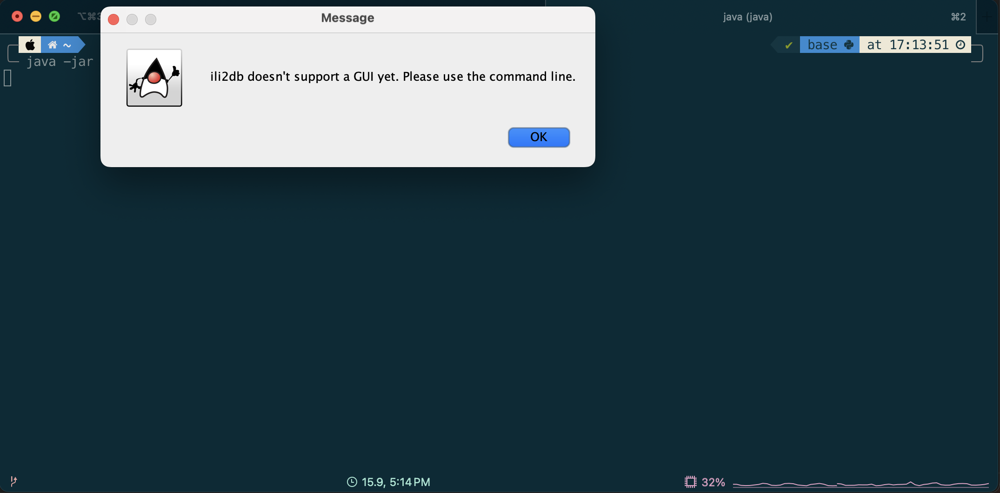
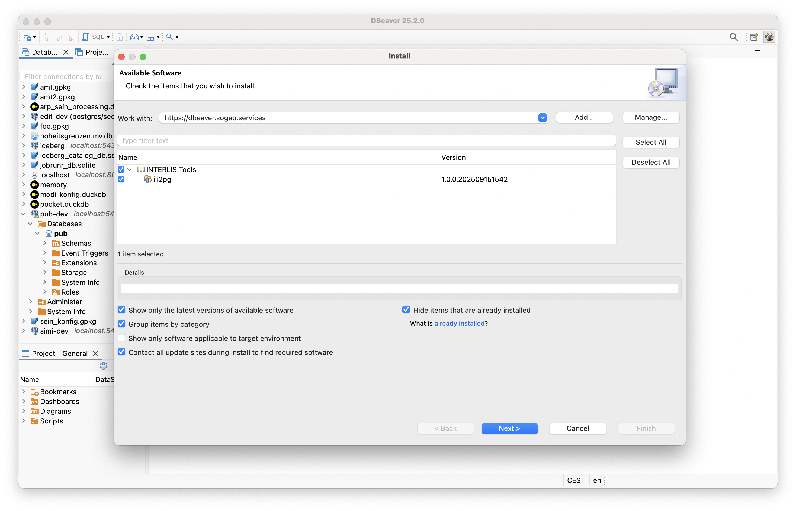
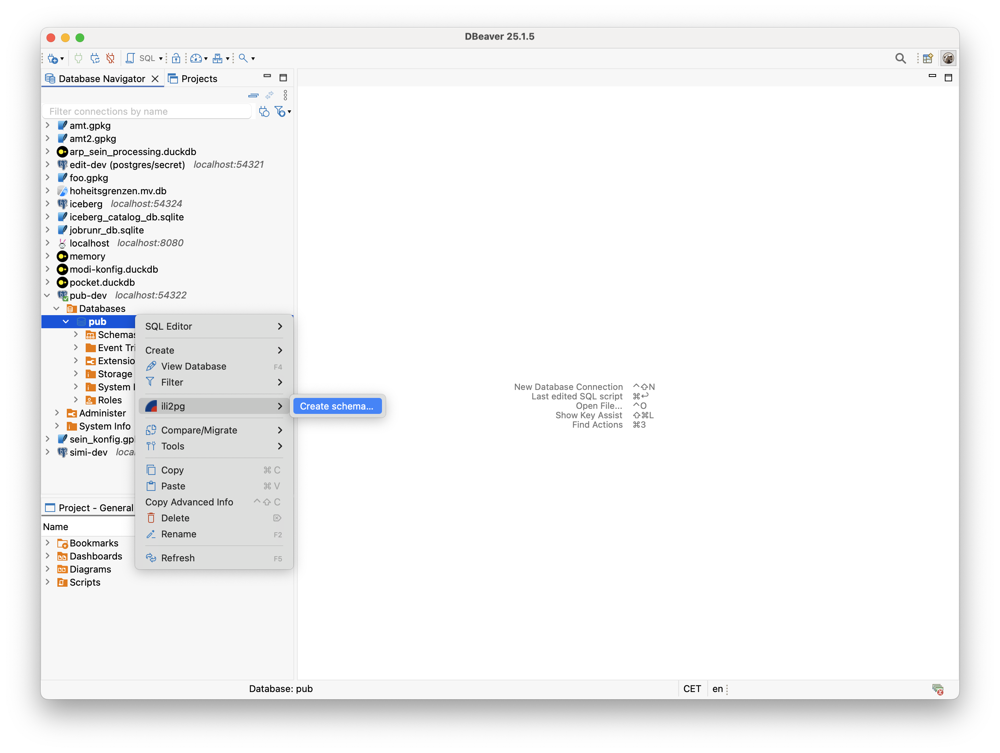
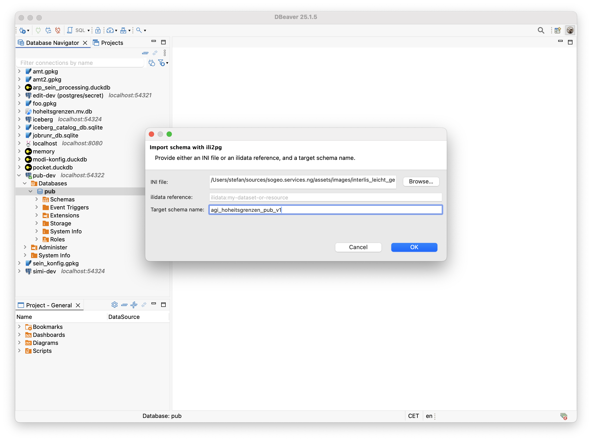
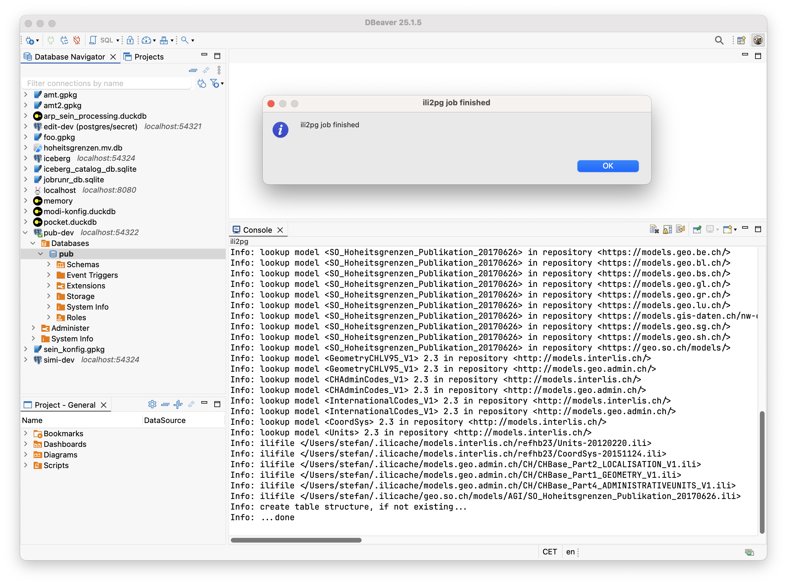
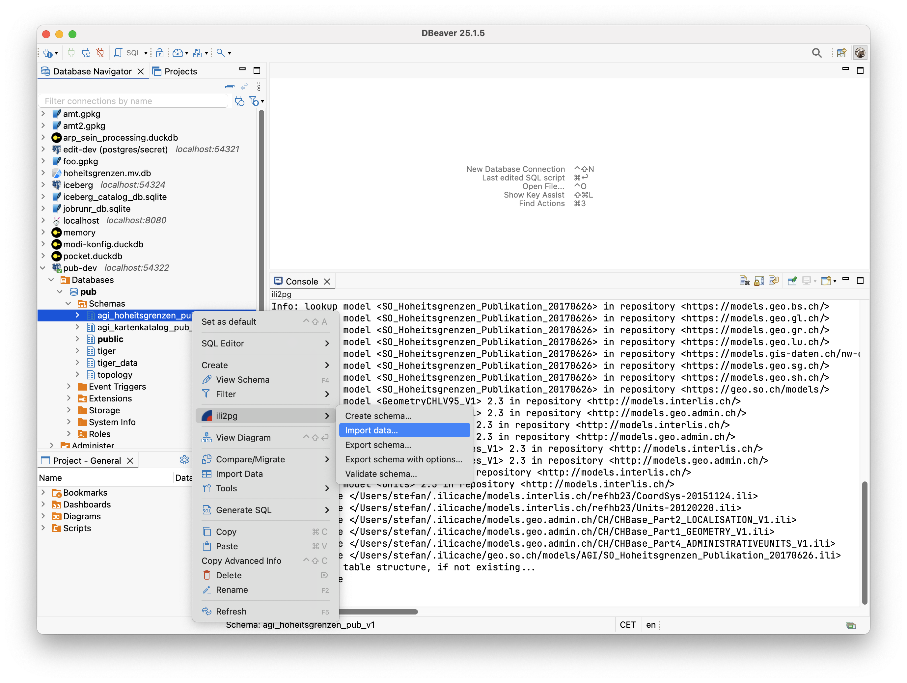
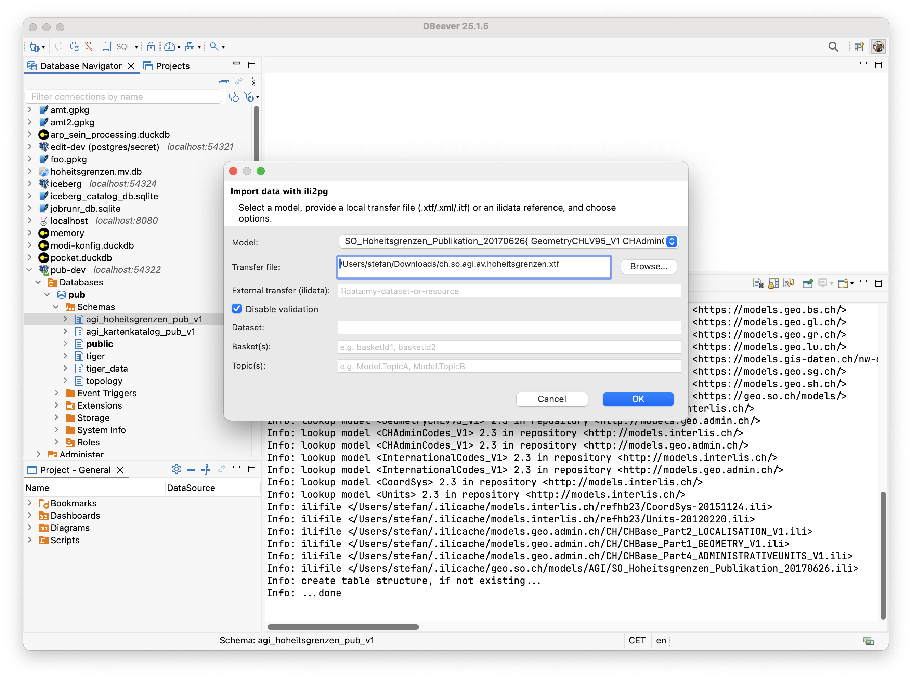
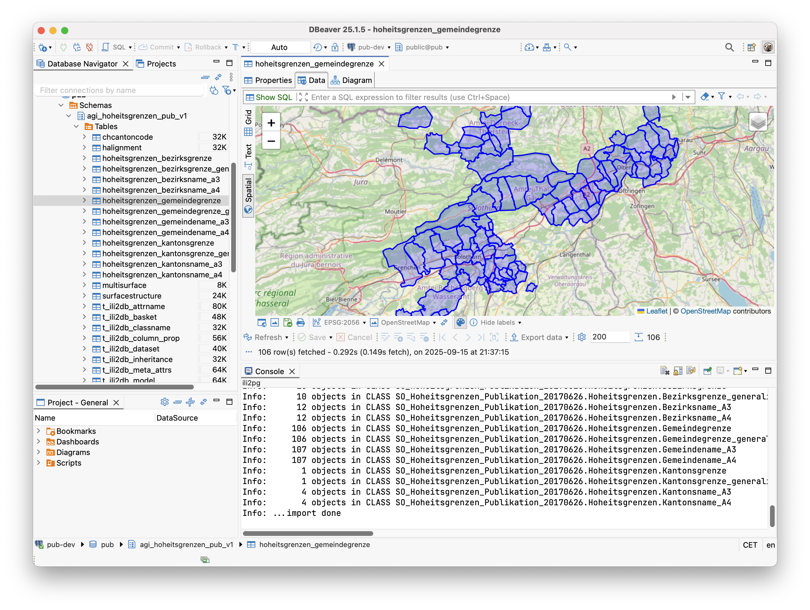

---
= INTERLIS leicht gemacht #55 - Des ili2pgs neue Kleider    
Stefan Ziegler
2025-09-15
:thoth-type: post
:thoth-status: published
:thoth-tags: INTERLIS,Java,Eclipse,dbeaver,ili2db,ili2pg
:idprefix:
---
Ili2pg hat bekanntlich ein Wahnsinns-GUI:

Und wenn das neue GUI nicht zu `ili2pg` kommt, muss `ili2pg` zum neuen GUI kommen. Und das &laquo;neue&raquo; GUI ist https://dbeaver.io/[dbeaver]. Ich denke, bei mir gab es wie zwei Auslöser ein ili2pg-dbeaver-Plugin zu schreiben: Ich hatte bereits vor längerer Zeit die Idee, dass es eigentlich ganz praktisch wäre, wenn man auf Knopfdruck Daten in einer PostgreSQL-Datenbank mit `ilivalidator` resp. `ili2pg` prüfen könnte. Und als ein Mitarbeiter vor kurzem meinte, dass er Daten mit `ili2pg` via Kommandozeile nicht aus der Datenbank exportieren kann, war der Zeitpunkt für mich gekommen, das anzupacken. Natürlich mit der arroganten Meinung, dass ich dafür sicher nicht mehr Zeit brauche, als der Mitarbeiter für den Export (was sich natürlich als eine totale Fehleinschätzung erwies).

&laquo;Im Prinzip&raquo; und &laquo;eigentlich&raquo; müsste das doch ganz schnell gehen. Beide Anwendungen sind in Java geschrieben. Wie schwer kann das noch sein? Die Antwort ist: ziemlich schwer. Und zwar nicht wegen der eigentlichen Business-Logik. Das habe ich schon ein paar Mal gemacht (also Schema anlegen, Daten importieren und exportieren und solches Zeugs). Sondern das ganze Drumherum, also das eigentliche Plugin. Es ist ein schönes Beispiel dafür, dass man nicht nur die Programmiersprache kennen muss, sondern das ganze Ökosystem, um erfolgreich und effizient entwickeln zu können. 

Der Stolperstein hier ist wie ein Plugin für Eclipse (dbeaver ist nichts Anderes als eine Eclipse-Anwendung) gepackt, bereitgestellt und installiert werden muss. Eclipse-Plugins sind https://en.wikipedia.org/wiki/OSGi[OSGi]-Bundles (plus noch ein paar spezifische Eclipse-Sachen). OSGi-Bundles sind Module für die Java-Welt: jedes Bundle ist ein JAR mit Metadaten (Manifest), das genau beschreibt, welche Pakete es bereitstellt und welche es benötigt. Dadurch können Module dynamisch geladen, gestartet, gestoppt und aktualisiert werden, ohne die gesamte Anwendung neu zu starten. Das Ganze stammt aber aus einer anderen Epoche, ist zwar mächtig, aber nicht sonderlich entwicklerfreundlich (dünkt mich). Es war für mich eine ziemliche Herausforderung eine Entwicklungsumgebung so hinzukriegen, damit ich relativ effizient programmieren konnte. Hot- resp. Livereload ist da nicht, resp. habe ich nicht hingekriegt. Das Zückerchen gab es dann am Schluss: wie stellt man nun so ein Plugin bereit? Es sind sogenannte Update-Sites (oder Repositories). Leider ist das wiederum auch nicht so trivial wie ein Maven Repository. Fazit hier: Mein Projekt ist momentan ein Eclipse-Projekt (kein Maven- oder Gradleprojekt) und ich muss es noch manuell deployen. 

Interessanter als mein Gejammer sind sicherlich die Features des Plugins. Wobei wir bei der Installation anfangen müssen. Wie soeben erwähnt, müssen die Plugins über eine Update-Site installiert werden. Ich habe für mein Plugin eine solche Update-Seite unter der URL https://dbeaver.sogeo.services/updates erstellt. In dbeaver muss man unter `Help` - `Install New Software` die Update-Site angeben und kann anschliessend das ili2pg-Plugin installieren:

Man muss verschiedenen Dingen &laquo;trusten&raquo;, so auch meiner Update-Seite. Nach einem Restart von dbeaver steht das Plugin zur Verfügung. Das Plugin macht sich zum ersten Mal bemerkbar, wenn ich mit der rechten Maustaste auf ein Datenbank-Icon klicke:

Aus Bequemlichkeit habe ich im GUI nicht jede Option nachgebildet, sondern nur die absolut Notwendigsten. Nämlich eine Option für den Schemanamen und eine Option für eine https://blog.sogeo.services/blog/2023/05/10/interlis-leicht-gemacht-number-35.html[INI-Datei]. Die INI-Datei beinhaltet alle Infos, die `ili2pg` benötigt, um eine Schema anzulegen:

[source,ini,linenums]
----
[ch.ehi.ili2db]
models=SO_Hoheitsgrenzen_Publikation_20170626
nameByTopic=true
defaultSrsCode=2056
createFk=true
createFkIdx=true
createMetaInfo=true
createUnique=true
createNumChecks=true
createTextChecks=true
createDateTimeChecks=true
createEnumTabs=true
strokeArcs=true
----

Die Logmeldungen erscheinen in einem speziellen &laquo;ili2pg&raquo;-Tab in der Konsole:

Will man Daten importieren, muss ich das soeben erstellte Schema anwählen und wiederum die rechte Maustaste klicken. Jetzt erscheinen mehrere Befehle:

Für den Datenimport werden mehr Optionen benötigt, um sinnvolle Imports machen zu können. Wahrscheinlich fehlt aber noch die eine oder andere (z.B. `--replace`) Option, um wirklich production-ready zu sein. Erwähnenswert ist die Option `Model`. Man muss ili2pg immer mitteilen, welches Modell man importieren resp. exportieren will. Aus den Metatabellen wird auch nicht ersichtlich, um welches Modell es sich handelte, als man Daten importierte. Es werden gleichberechtigt sämtliche benötigten Modelle in der Tabelle `t_ili2db_model` vorgehalten. Aus diesem Grund muss der Benutzer auch immer das Modell auswählen. Ich habe es nun so gelöst, dass ich vier Modellarten ignoriere (`TYPE`, `CONTRACTED`, `REFSYSTEM` und `SYMBOLOGY`). Diese wird man nicht importieren oder exportieren wollen. Sind nach Abzug dieser Modelle noch mehrere Modelle übrig, muss der Benutzer entscheiden. Ist nur noch eines übrig, wird automatisch dieses einzige Modell für den ili2pg-Befehl verwendet.

Das geht nun so weiter für die restlichen Befehle des Plugins: `Export schema...`, `Export schema with options...` und `Validate schema...`. Die Einstellungen zu den Modellrepositories kann man unter `Settings` - `ili2pg` vornehmen.

Die Dokumentation des Plugin-Repos ist noch ungenügend. Aber vielleicht kann jemand das Plugin bereits gewinnbringend einsetzen.

Links:

- https://dbeaver.sogeo.services/updates/
- https://github.com/edigonzales/dbeaver-ili2pg-plugin
- https://github.com/edigonzales/dbeaver-ilitools-feature
