---
= INTERLIS leicht gemacht #56 - Einfacher modellieren mit jEdit    
Stefan Ziegler
2025-09-16
:thoth-type: post
:thoth-status: published
:thoth-tags: INTERLIS,Java,jEdit,ili2c
:idprefix:
---
Wir modellieren INTERLIS-Modelle mit dem http://www.umleditor.org/[UML/INTERLIS-Editor]. Warum wir das so machen, weiss ich nicht mehr recht. Wahrscheinlich weil wir damals glaubten, dass man das halt so macht, obwohl das Teil bereits 2016 eher unmodern wirkte. Aber gegen unser neues Zeit- und Leistungserfassungstool scheint der UML/INTERLIS-Editor als hätte ihn Jony Ive persönlich designed. Aber das ist eine ganz andere Geschichte. Zurück zu den wichtigen Dingen des Lebens:

Nach all den Jahren können wir sagen, was uns wichtig ist: Die Datenmodelle sollen immer gleich formatiert sein und es muss eine visuelle Repräsentation in Form eines UML-Klassendiagramms vorhanden sein resp. einfach ableitbar sein. Nicht zwingend notwendig ist die Erstellung des Datenmodelles mit einem &laquo;Klick&raquo;-Editor. Die wirklichen Ur-Beweggründe für die Programmierung des _UML/INTERLIS-Editors_ kenne ich nicht, aber mich dünkt der Mehrwert / die Unterstützung bei der Modellierung marginal bis nicht vorhanden bis kontraproduktiv. Die Syntax von INTERLIS für die einfachen Fälle (also Modell, Topic, Klasse und Attribute) ist ja wirklich trivial. Mit einem Text-Editor, der mich noch ein wenig unterstützt, bin ich garantiert schneller als jemand, der gefühlte 1000 Mausklicks machen muss. Wird es komplizierter (beginnt bei mir bereits bei Assoziationen: Mmmh, wohin gehört welche Rolle?), muss ich sowieso in die Modelldatei nachschauen gehen. Und wenn es wirklich grausam wird (komplexe Constraints), müsste ein guter UML/INTERLIS-Editor *wirklich* gut sein, damit ich einen Mehrwert habe.

Zusammengefasst: Mir reicht ein Text-Editor mit Syntax-Highlighting, der die Syntax meines INTERLIS-Modelles überprüft (kompiliert) und mir eine read-only UML-Darstellung erstellt. https://blog.sogeo.services/blog/2025/07/22/interlis-leicht-gemacht-number-53.html[In einem älteren Beitrag] habe ich gezeigt, wie ich eine VSCode-Extension für den INTERLIS-Compiler `ili2c` programmiert habe. Technisch ist es nicht gerade straight forward mit der native shared library, aber machbar. Stärker wiegt aber der Umstand, dass VSCode mehr oder weniger komplett von Microsoft kontrolliert wird. Und das fand ich dann weniger gut. Schon nur, weil wir bereits mit Github zu Microsoft-Jünger geworden sind. Mit https://www.jedit.org/[jEdit] steht ein Veteran bereit, der bereits seit Jahren Syntax-Highlighting für INTERLIS bietet und zudem in Java geschrieben ist. Damit dürfte die Entwicklung eines Plugins für INTERLIS (hauptsächlich für `ili2c`) sehr gut machbar sein. Der Nachteil von jEdit ist sicher seine kleine Community und dass er nicht das https://en.wikipedia.org/wiki/Language_Server_Protocol[Language Server Protocol] unterstützt. Weil ich das doch ziemlich gut finde, habe ich mich schlau gemacht und mit https://theia-ide.org/[Eclipse Theia] eine Alternative für VSCode gefunden. Aber wieder zurück zu jEdit. Ich habe ein recht umfangreiches INTERLIS-Plugin für jEdit geschrieben. Ob ich später etwas für Eclipse Theia mache, weiss ich noch nicht.

JEdit ist https://www.jedit.org/users-guide/writing-plugins-part.html[einfach erweiterbar] und es gibt https://plugins.jedit.org/list.php[viele Plugins], die als Beispiele dienen. Was ich gut finde bei jEdit, ist die Einfachheit: 

[source,ini,linenums]
----
plugin.ch.so.agi.jedit.InterlisPlugin.menu=compileCurrentFile \
    toggleCompileOnSave \
    prettyPrintCurrentFile \
    interlis-collect-keywords \
    interlis-uml-show \
    interlis-uml-show-static \
    interlis.create-object-catalog

compileCurrentFile.label=Compile current file
toggleCompileOnSave.label=Toggle compile on save
prettyPrintCurrentFile.label=Pretty print current file
interlis-uml-show.label=Show UML diagram (interactive)
interlis-uml-show-static.label=Show UML diagram (static)
interlis-collect-keywords.label=Collect model tags
interlis.create-object-catalog.label=Export object catalog (.docx)
----

Dieser Eintrag in einer Properties-Datei erzeugt mir folgenden Menueintrag:

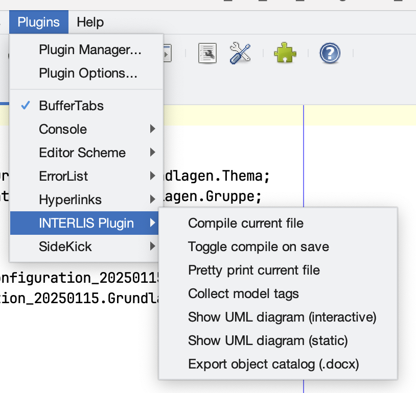

So einfach geht es eigentlich weiter. Es gibt auch eine Art Dependency Injection, wenn man sich auf andere Plugins abstützt und eine Implementierung einer Konsolenshell speziell für INTERLIS machen will. JEdit hat auch eine praktische Funktion wie eigene Fenster an das Hauptfenster gedockt werden kann. Die meisten dieser Dinge lassen sich einfach in einer zentralen Properties-Datei oder in verschiedenen XML-Dateien steuern.

Was habe ich alles für INTERLIS implementiert? Als allererstes habe ich das Syntax-Highlightung für INTERLIS 2.4 upgedatet. Dabei habe ich eine kleine funktionale Änderung bei den Kommentare vorgenommen. Neu werden Metaattribute separat behandelt. Die Farben wiederum sind nicht Bestandteil der Konfiguration, sondern können individuell in jEdit vorgenommen werden.

Als zweites wollte ich die Syntax des Modells kontrollieren indem ich das Modell mit `ili2c` kompiliere. Das geht natürlich sehr einfach aber ich wollte das Resultat (also der eigentlich Kommandozeilenoutput von `ili2c`) auch irgendwie in jEdit sichbar machen. Für solche Fälle ist das https://plugins.jedit.org/plugindoc/Console/[Console-Plugin] zweckdienlich. Man kann damit beliebige Shells implementieren. In meinem Fall wollte ich die Logmeldungen von `ili2c` reinschreiben:

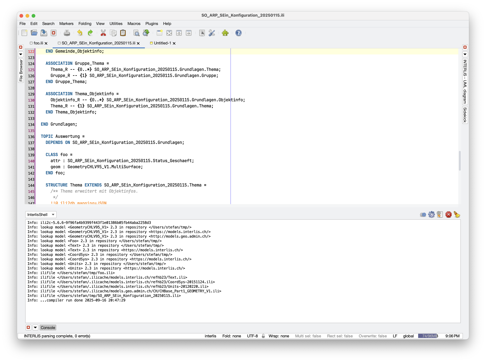

Es gibt die Möglichkeit, das Kompilieren an eine Tastenkombination zu binden, oder das Plugin bietet die Einstellung, dass die Datei nach jedem Speichern automatisch kompiliert wird (&laquo;Toggle compile on save&raquo;).

Was passiert wenn Fehler gefunden werden? Die Fehler werden natürlich in der Konsole geloggt. Es wird zusätzlich ein Fenster mit den Fehlern geöffnet. Mittels Klick auf eine dieser Fehlerzeilen, landet man am korrekten Ort in der Datei. Diese Fehlerliste hat leider noch einen Fehler: Wenn `ili2c` mehrere Fehler pro Zeile meldet, stimmt irgendwas nicht (auch die Sortierung der Zeilennummern funktioniert nicht).

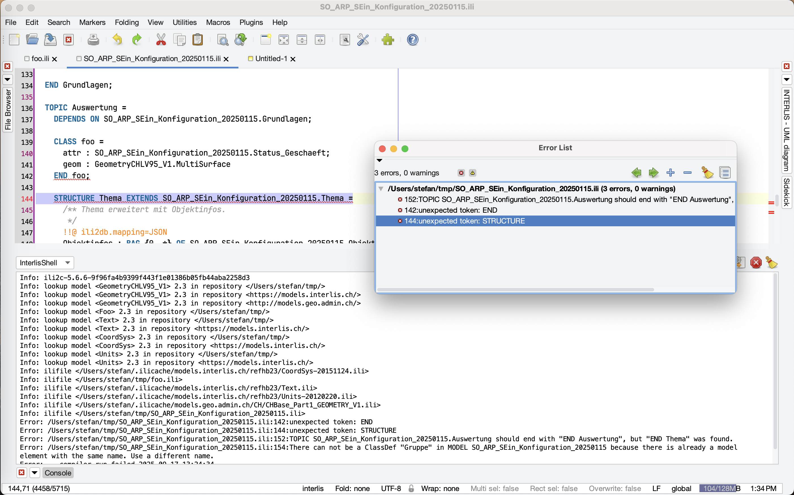

Ein Grund für die Verwendung vom UML/INTERLIS-Editor war, dass er die Modelle beim Export immer gleich formattiert. Für diesen Anwendungsfall gibt es im Plugin die &laquo;Pretty Print&raquo;-Funktion. Die Umsetzung war sehr einfach: `ili2c` liest die Modelldatei und schreibt sie wieder.

Ein weiteres wichtiges Feature für mich war die Unterstützung beim Schreiben von Klassen, Topics etc. Ich möchte, wenn ich beginne eine Klasse zu schreiben (`CLASS Fubar =`) nicht auch das Ende schreiben müssen (`END Fubar;`). Hier unterstützt mich das Plugin stark: Der Footer wird automatisch in den Editor geschrieben nachdem ich `=` getippt habe und der Cursor wird zwischen Header und Footer  platziert, so dass ich Attribute hinzufügen kann. Dies funktioniert für die Elemente `MODEL`, `TOPIC`, `CLASS`, `STRUCTURE` und `VIEW` mit den jeweiligen Modifiern (falls die so heissen). Also auch z.B. `CLASS Foo (ABSTRACT) EXTENDS ModelA.Bar =`. Beim Element `MODEL` schreibt es mir einen kompletten Kommentar-Header rein:

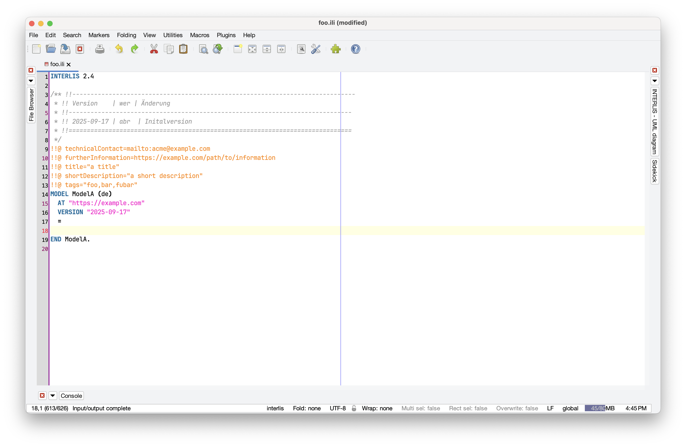

Weiter geht es mit Vorschlägen bei `IMPORTS`. Da schlägt mir das Plugin die Modelle der Standardrepositories (und ihren verknüpften Repositories) vor:

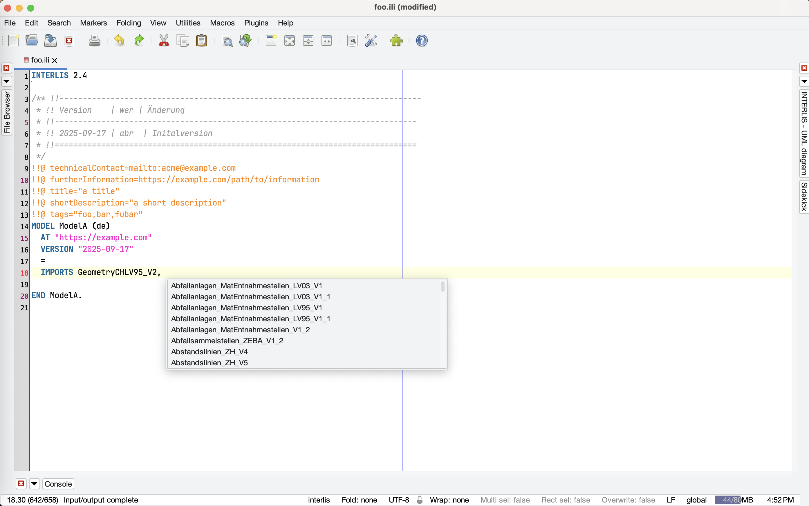

Die Vorschläge funktionieren auch bei Attributen, die z.B. eine Struktur oder ähnliches aus einem anderen Modell referenzieren. 

Ebenfalls umgesetzt ist das Anzeigen von importieren Modellen. Das funktioniert natürlich nur, wenn es mindestens eine erfolgreiche Kompilierung gab. Sonst kennt das Plugin das Modell ja gar noch nicht (gilt natürlich auch für andere Feature). Ein Klick auf das importierte Modell öffnet dieses in einem neuen Tab:

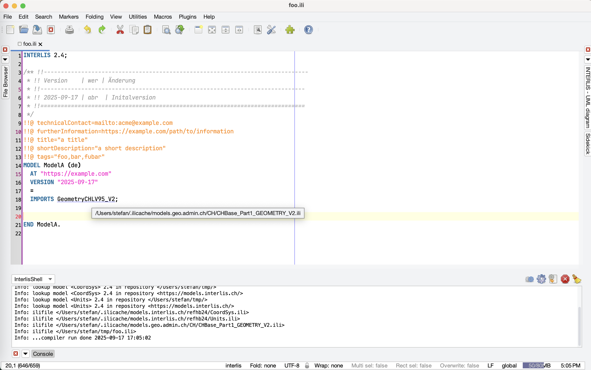

Zusätzlich gibt es so etwas wie eine Baumstruktur. Bei jEdit heisst es Sidekick oder Outline:

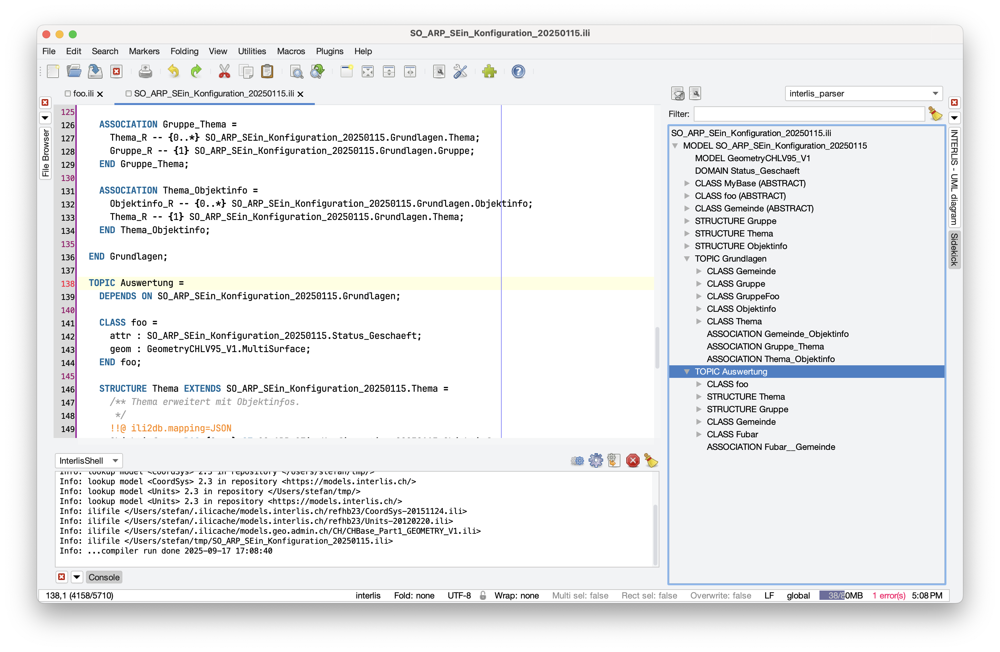

Last but not least und für mich zwingend, ist die visuelle Repräsentation als UML-Klassendiagramm. Ich habe zwei Varianten implementiert: eine interaktive und eine statische. Die interaktive Variante habe ich mit _jhotdraw_ umgesetzt. Das ist die gleiche Bibliothek wie sich auch UML/INTERLIS-Editor einsetzt. Das Problem bei dieser Bibliothek ist, dass sie nicht mehr wirklich unterhalten wird oder sehr spärlich. Die Bibliothek bietet sehr viel, um sehr schnell das gewünschte Resultat zu erhalten. Ich habe mich entschieden, dass ich pro Topic einen Tab in einem separaten (dockable) Fenster generiere und einen zusätzlichen Tab für die Topic-Übersicht (und andere Elemente auf der Modellebene):

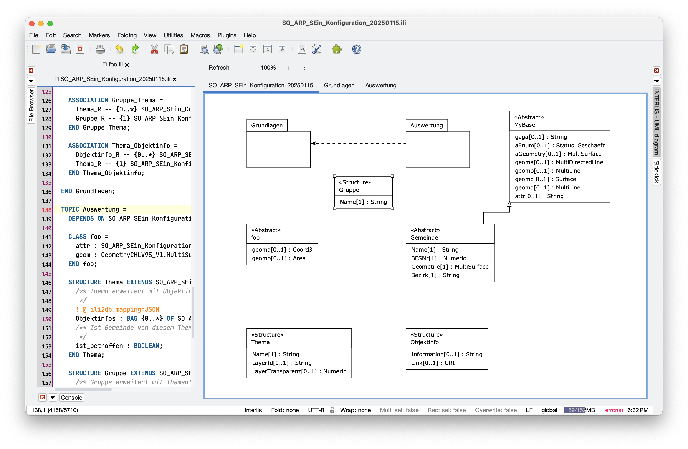

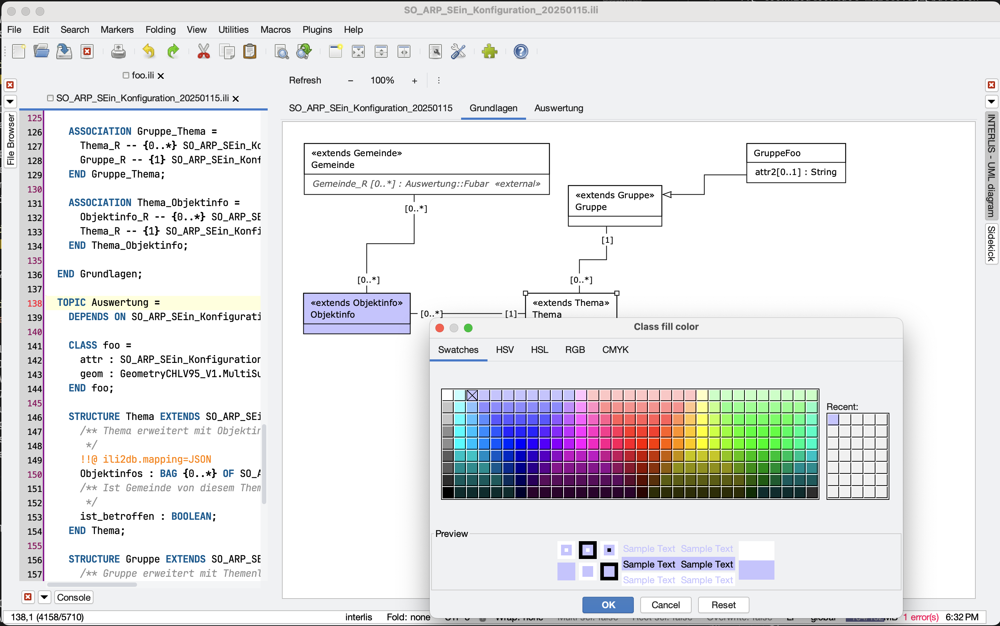

Die Objekte können umhergeschoben und eingefärbt werden. Das Ganze funktioniert nicht mal so schlecht für kleine und mittelgrosse Modelle. Bei grösseren Modellen bräuchte es einen sehr guten Platzierungsalgorithmus. Die UML-Diagramme können als PNG exportiert werden.

Bei der zweiten Variante wird ein https://blog.sogeo.services/blog/2025/09/08/interlis-leicht-gemacht-number-54.html[Mermaid-UML-Diagramm hergestellt]. Man kann zwar rein- und rauszoomen und rumpannen aber ansonsten ist es eine statische Angelegenheit. Das Diagramm wird im OS-Standardbrowser dargestellt. Java (Swing) bringt zwar auch eine Browserkomponente mit, die ist jedoch veraltet und da ist nix mit Javascript, SVG und CSS. Es gäbe in JavaFX eine aktuelle Browserkomponente aber ich wollte nicht noch weitere Abhängigkeiten im Plugin haben. Wenn das Datenmodell erfolgreich kompiliert wird, wird das Klassendiagramm im Browser automatisch nachgeführt.

Eigentlich wollte ich hier ja aufhören, aber habe trotzdem noch zwei Funktionen hinzugefügt. Die erste ermittelt mittels KI aus den Topic- und Klassennamen sowie dem Metaattribut `shortDescription` 10 bis 15 Synonyme, die man als Tags für die `ilimodels.xml`-Datei verwenden kann. Ich lasse die Tags auch gleich in verschiedene Sprachen übersetzen. Damit wäre es für eine https://geo.so.ch/modelfinder[Suchmaschine] endlich möglich auch das MGDM Hazard Mapping (= Naturgefahren) zu finden. Leider ist hier die User Experience noch ungenügend. Da es relativ lange geht (warum ist mir nicht klar), fehlt ein Feedback in der Anwendung, dass was passiert. Gewisse Zeit später erscheint folgendes:

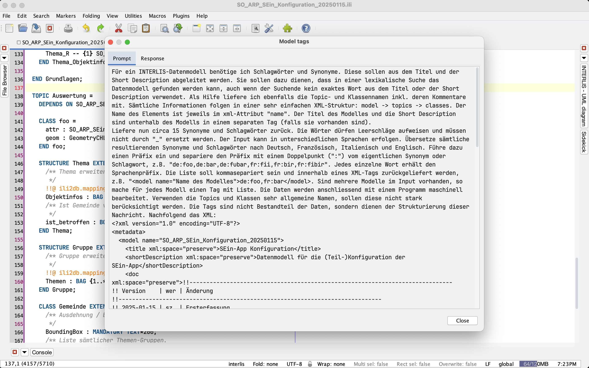

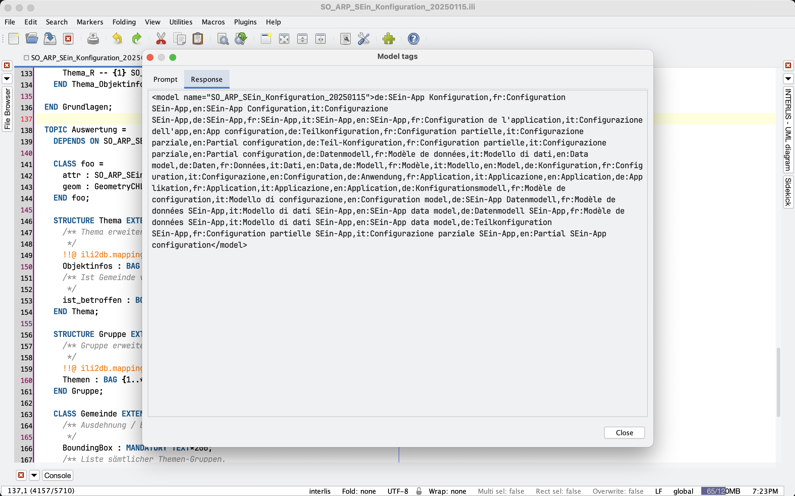

Die Tags erfassen wir bei uns als Metaattribut zum Modell. Unser automatisierter INTERLIS-Modellrepository-Herstellungsprozess liest diese aus und füllt sie in der `ilimodels.xml`-Datei ab.

Die letzte Funktion ist ein Export eines Objektkataloges in eine Wordatei. Das ist mir persönlich nicht wichtig, da wir eigentlich so einen Objektkatalog nicht verwenden. Es wird sich zeigen, ob er überlebt oder aus dem Plugin rausfliegt (ist halt nur LibreOffice, aber trotzdem .docx):

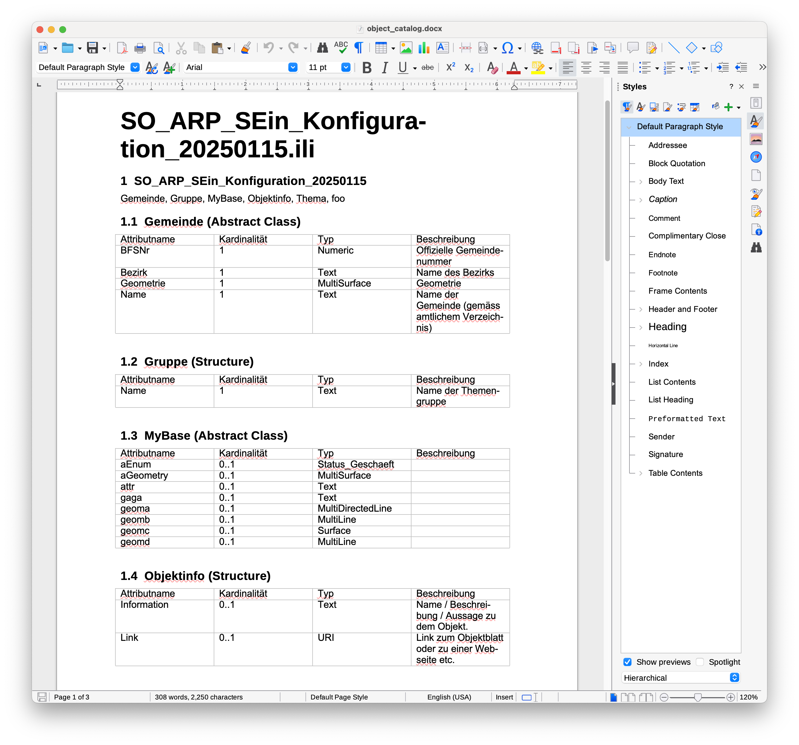

Sämtliche Funktionen des Plugins sind sicher noch buggy und teilweise ist es auch inkonsistent in der Bedienung. Nach ersten Tests wird sich zeigen, was uns wirklich wichtig ist und weiterverfolgt wird. 

Ein (hoffentlich) Sorglospaket kann man https://drive.proton.me/urls/41HWZWEJG4#iNAreL3aBVGb[hier] herunterladen. Die Zipdatei auspacken und ins Verzeichnis wechseln. Anschliessend kann jEdit mit dem INTERLIS-Plugin wie folgt gestartet werden:

[source,bash,linenums]
----
java -jar jedit.jar -settings=./portable-settings -log=2
----

Es läuft ab Java 11. Unter macOS ist Java 17 oder höher empfohlen, ansonsten macht das Arbeiten mit dem interaktiven UML-Klassendiagramm nicht Spass. Es ist viel https://openjdk.org/jeps/382[zu käsig]. Reingepackt habe ich zudem eine modernere Theme und ein Font, den ich persönlich sehr gut zum Entwicklen finde (JetBrains Mono).

Und als nächstes möchte ich einen INTERLIS-MCP-Server integrieren. Dafür muss aber zuerst überhaupt der MCP-Server her.

Links:

- https://github.com/edigonzales/jedit_interlis_plugin
- https://drive.proton.me/urls/41HWZWEJG4#iNAreL3aBVGb

