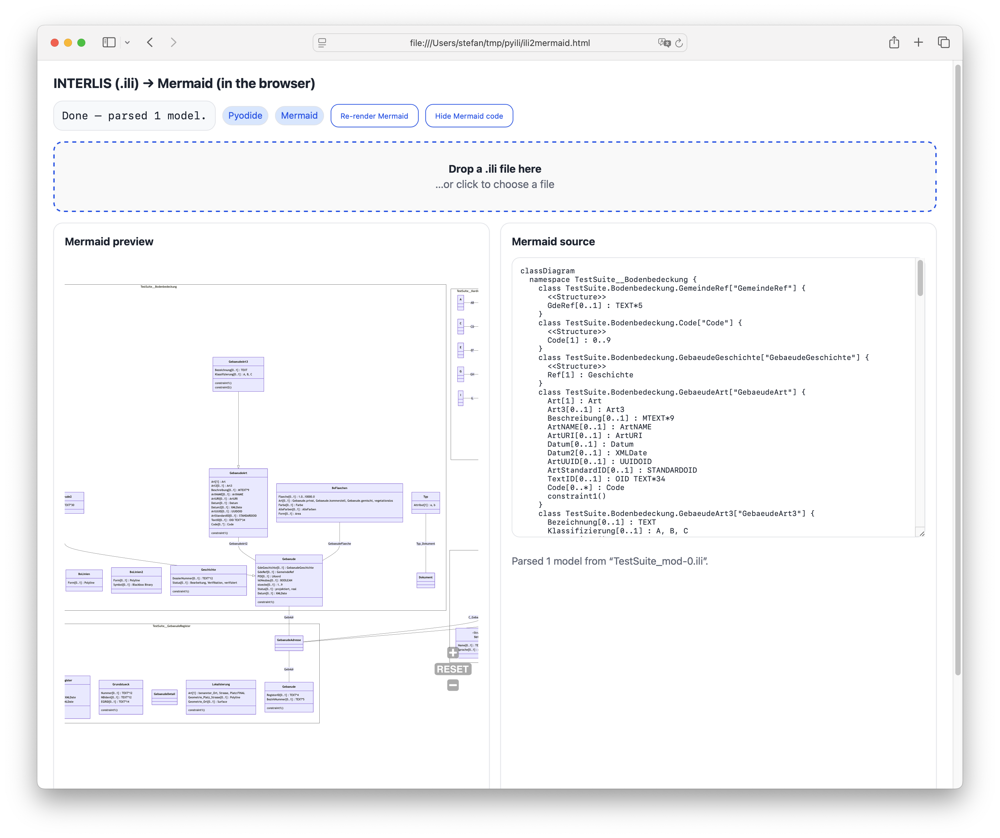

---
= INTERLIS leicht gemacht #57 - Python, Python und nochmals Python 
Stefan Ziegler
2025-10-17
:thoth-type: post
:thoth-status: published
:thoth-tags: INTERLIS,Java,ili2c,Python
:idprefix:
---
Ich habe bereits mehrere Male über INTERLIS und Python geschrieben und gezeigt, dass man durchaus was damit machen kann:

- https://blog.sogeo.services/blog/2025/07/22/interlis-leicht-gemacht-number-53.html
- https://blog.sogeo.services/blog/2022/12/11/interlis-leicht-gemacht-number-33.html
- https://blog.sogeo.services/blog/2021/02/02/interlis-leicht-gemacht-number-22.html

Das funktioniert soweit tadellos. Der funktionale Nachteil dieses Approaches mit https://www.graalvm.org/[GraalVM] ist, dass man quasi nur immer einen Befehl ausführen kann und immer nur genau eine simple Antwort zurück bekommt. Z.B. kann man sehr gut eine INTERLIS-Transferdatei validieren, aber die Antwort kann faktisch nur sein: valide oder nicht valide. Klar gibt es die Logdatei, die man auslesen kann. Ähnlich bei `ili2db`: Hier muss und will man als Anwender der Software viele Optionen mitgeben und entsprechend muss man hier Lösungen finden, weil im Prinzip nur einfache Datentypen übergeben werden können (z.B. JSON als String und wieder als JSON interpretieren). Das alles mag für einige Fragestellungen gar nicht so problematisch sein, für eine ist sie denkbar ungünstig: Was mache ich, wenn ich mehr über das INTERLIS-Datenmodell wissen will? Ganz einfache und dumme Fragestellung: Wie viele Klassen gibt es in meinem Modell und wie heissen sie? Den INTERLIS-Compiler `ili2c` habe ich ebenfalls als Versuch in eine native shared library kompiliert und als https://pypi.org/project/ili2c/[Python Package] angeboten. Diese library liefert aber eben nur zurück, ob das Modell syntaktisch korrekt ist oder nicht. Jetzt könnte man natürlich in Java das Modell mit der entsprechenden Java-API auslesen und ebenfalls wieder strukturiert als String (z.B. JSON) an den Python Code zurückliefern. Dieser Python Code müsste den String wiederum interpretieren können. Machbar aber auch aufwändig und man hat immer noch die shared native library an der Backe. Diese Variante wird m.E. sehr ähnlich aber ohne den ersten Schritt momentan auf Wunsch verschiedener Kantone umgesetzt. Man wählt den Weg über die ilismeta-Datei. Das ist das Datenmodell abgebildet in einem INTERLIS-Metamodell als Transferdatei. Dabei muss die Python-Logik &laquo;nur&raquo; XML interpretieren können. Mein Problem mit dieser Lösung: Woher kriege ich diese ilismeta-Datei? Der Deal müsste doch sein: &laquo;Python only&raquo;.

Zugegebenermassen leicht angefixt, dachte ich mir: Mmmmh, mit https://chatgpt.com/codex[ChatGPT Codex] könnte man doch Teile des ili2c-Codes nach Python umschreiben lassen. Interessant an diesem Experiment ist meines Erachtens fast weniger das https://pypi.org/project/ili2c-python/[Resultat], sondern der Weg dahin und was es für zukünftige Programmierarbeiten bedeutet. Und auf beides habe ich natürlich nicht die perfekte und definitive Antwort.

Was ich am Ende haben wollte, war sowas wie die https://github.com/claeis/ili2c/blob/master/ili2c-core/src/main/java/ch/interlis/ili2c/metamodel/TransferDescription.java[TransferDescription] damit ich sämtliche Informationen aus einem INTERLIS-Datenmodell direkt mit Python auslesen kann. Ili2c basiert auf _antlr2_, mit dem man nicht Python-Klassen herstellen kann. Ich wusste, dass es für INTERLIS 2.4 bereits eine antlr4-Grammatik https://github.com/maxcollombin/interlis-antlr-parser[gibt]. Ebenfalls war (und ist) mir diese ganze Parser/Lexer-Welt noch eine ziemliche Unbekannte. Ich habe also ChatGPT Codex beauftragt das https://github.com/claeis/ili2c/tree/master/ili2c-core/src/main/java/ch/interlis/ili2c/metamodel[Java metamodel-Package] (wo auch die TransferDescription drin ist) nach Python umzuschreiben und ihm die antlr4-Grammatik mitgeliefert. Das hat mit verschiedenen weiteren Schritten halbwegs funktioniert, bis ich merkte, dass ich nur die vereinfachte antlr4-Grammatik aus dem Repository verwendet habe. Unterwegs habe ich festgestellt, dass natürlich (weil auch beauftragt) Tests geschrieben werden, nur halt teilseise mit syntaktisch falschen Datenmodellen (weil von ChatGPT selber hergestellt). Das ist sicher eine Lektion, die man lernen kann: Die Testmodelle müssen stimmen. Ich habe mich dazu entschlossen nochmals von Null zu starten und eben die Testmodelle mitzuliefern. Bei diesem Startprompt habe ich Wahrscheinlich den Fehler gemacht, dass ich nicht genug erwähnt habe, dass ich explizit dieses Metamodell als Abstraktionslayer haben will. Inkl. sämtlicher Typen (z.B. EnumerationType, TextType etc.). Sondern als Ziel habe ich ihm gesetzt, dass ich UML-Klassendiagramme mit Mermaid herstellen will. Was auch schon relativ gut gelang ohne all dieses Type-Klassen. Aber trotzdem kam ich beim zweiten Mal schneller an mein Resultat.

Neben dem eigentlichen Parser wollte ich noch die ilirepository-Logik in Python haben. D.h. Python sucht nun - gleich wie ili2c - ein Modell in den INTERLIS-Modellablagen und speichert es in einem lokalen Cache. Dieses Feature habe ich zuerst losgelöst vom Parser entwickeln lassen und erst als es mehr oder weniger korrekt funktionierte mit einem weiteren Auftrag an ChatGPT im Parser implementiert.

Ich glaube nicht, dass es funktionieren würde, wenn man gar nichts von INTERLIS versteht und/oder gar nichts vom Resultat versteht, was man erreichen will (das Java-Metamodell in Python). Hellsehen kann ChatGPT immer noch nicht. 

Die andere Frage ist: würde man mit sowas früher oder später in Produktion gehen? Jein. Wahrscheinlich falls es eher Wegwerf-Code ist (aber was heisst dann schon Produktion), kann man es riskieren. Oder falls man es nur in einem engeren Kreis braucht und immer noch das Wissen hat, richtig zu reagieren und notfalls Bugs zu fixen (oder fixen zu lassen). Auch wenn Tests geschrieben werden, sind manche Tests schlicht nutzlos, da sie nicht das Testen, was eigentlich sinnvollerweise getestet werden sollte. Im konkreten Fall könnte ich mir gut vorstellen, dass die Basis, die gelegt wurde, gar nicht mal so schlecht ist und dass man mit ein wenig reingesteckter Liebe noch weit kommt. Man müsste sich sicher die Grundarchitektur zu Gemüte führen und z.B. die Tests genauer anschauen etc. pp.

Einige einfache Beispiele:

Modell in Modellablage suchen:

[source,ini,linenums]
----
import logging

from ili2c.ilirepository import IliRepositoryManager

logging.basicConfig(level=logging.INFO)

manager = IliRepositoryManager(["https://models.interlis.ch/"])
for metadata in manager.list_models():
    logging.info("%s %s -> %s", metadata.name, metadata.version, metadata.full_url)

metadata = manager.find_model("DMAV_Grundstuecke_V1_0")
if metadata:
    local_path = manager.get_model_file(metadata.name)
    logging.info("Cached copy stored at %s", local_path)
----

Modell parsen:

[source,ini,linenums]
----
import logging
from pathlib import Path

from ili2c.pyili2c import parser
from ili2c.pyili2c.metamodel import Table

logging.basicConfig(level=logging.INFO)

settings = parser.ParserSettings(
    ilidirs=["examples/models"],
    repositories=["http://models.interlis.ch/"],
)

transfer_description = parser.parse(
    Path("examples/models/DMAV_Grundstuecke_V1_0.ili"),
    settings=settings,
)

for model in transfer_description.getModels():
    logging.info("Loaded model %%s (schema %%s)", model.getName(), model.getSchemaLanguage())
----

UML-Klassendiagramm herstellen:

[source,ini,linenums]
----
import logging

from ili2c.pyili2c import parser
from ili2c.pyili2c.mermaid import render

logging.basicConfig(level=logging.INFO)

transfer_description = parser.parse("path/to/model.ili")
mermaid_source = render(transfer_description)
logging.info("Generated diagram:\n%s", mermaid_source)
----

Das funktioniert jedenfalls mit meinem neuen https://raw.githubusercontent.com/edigonzales/ili2c/refs/heads/master/python/tests/pyili2c/data/TestSuite_mod-0.ili[Lieblings-Test-Modell] und mit seinem https://github.com/edigonzales/ili2c/blob/master/python/tests/pyili2c/data/SO_ARP_SEin_Konfiguration_20250115.ili[Vorgänger].

Was kann man nun mit dem Python Package anstellen? Man erstellt einen https://raw.githubusercontent.com/edigonzales/ili2c/refs/heads/master/python/tests/pyili2c/data/ili2mermaid.html[Mermaid-Renderer], der lokal im Browser läuft. Der Python-Code läuft in einer https://pyodide.org/en/stable/[Python-WebAssembly-Variante]:

Damit die Modellablagen verwendet werden können, müssen sie CORS unterstützen, was bei den meisten nicht der Fall ist. Auch aus diesem Grund habe ich die wichtigsten Repos bei uns https://geo.so.ch/models/mirror/[gecached] und kann sie für solche Fälle verwenden.

Die Tage unter die Augen gekommen: https://martinfowler.com/articles/exploring-gen-ai/sdd-3-tools.html[Spec Driven Development]. Unter Umständen würde das hier gut funktionieren.

Links:

- https://pypi.org/project/ili2c-python/
- https://github.com/edigonzales/ili2c