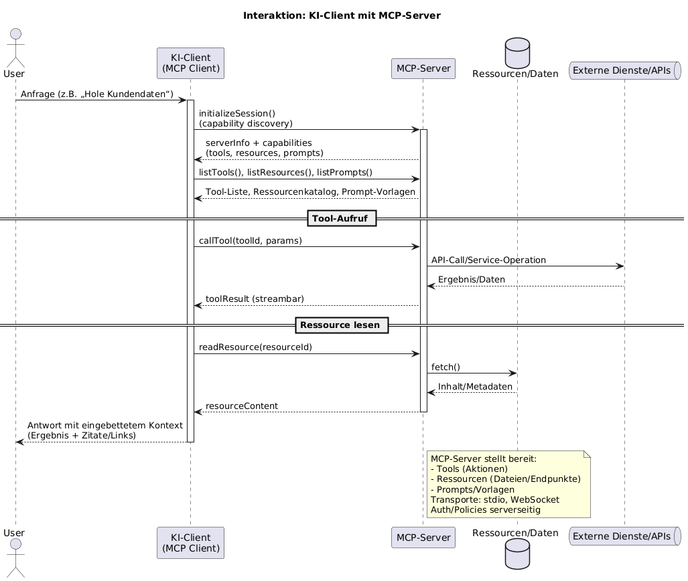
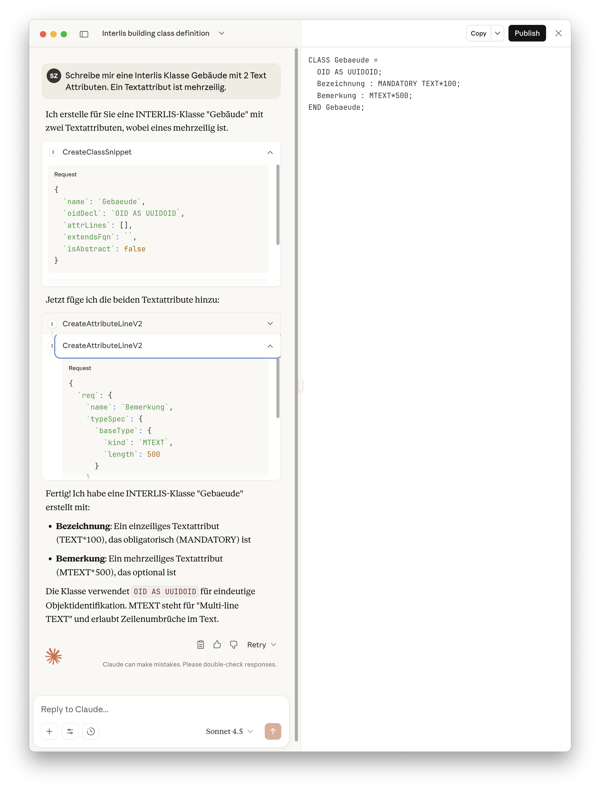
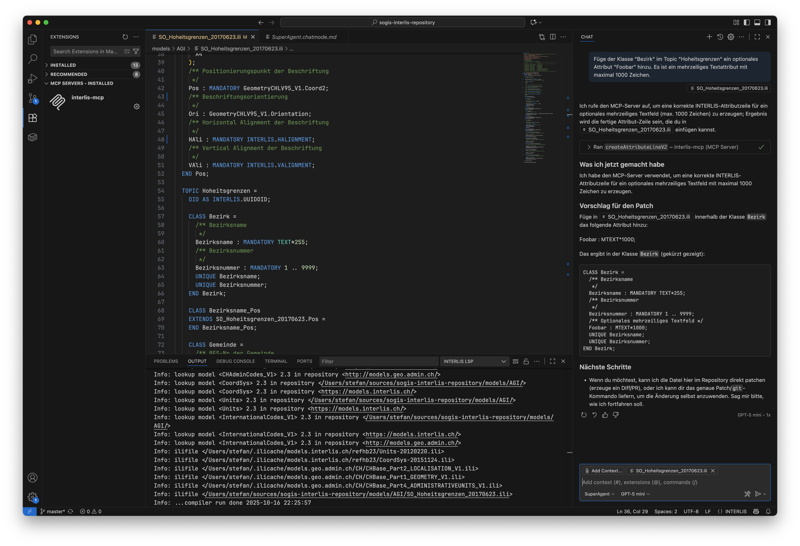

---
= INTERLIS leicht gemacht #58 - Jetzt aber wirklich einfach gemacht 
Stefan Ziegler
2025-10-18
:thoth-type: post
:thoth-status: published
:thoth-tags: INTERLIS,Java,ili2c,Spring AI,AI,KI
:idprefix:
---
Ich glaube ja immer noch, dass die einfachen Dinge in INTERLIS nicht schwierig zu modellieren sind. Die Syntax scheint mir sehr überschaubar. Schwieriger wird es bei komplizierteren Constraints. Das liegt mir nicht. Die grösste Herausforderung ist sowieso ein gutes Modell zu schreiben, das der Fragestellung gerecht wird und wirklich weniger die einfache Syntax.

&laquo;Aber&raquo; wäre es im momentanen KI-Hype nicht doch schön, man könnte ein LLM beauftragen, es solle eine Klasse soundso mit den und den Attributen eines bestimmten Typs erstellen? Ich habe die Erfahrung gemacht, dass z.B. ChatGPT zwischenzeitlich recht gut &laquo;INTERLIS kann&raquo;. Interessanterweise kennt es auch den INTERLIS-Compiler recht gut, um damit zu programmieren. Aber wie kann man sicher sein, dass da nicht kompletter Mist rauskommt, wenn man Modellierungsfragen stellt? Man kann dazu z.B. einen MCP-Server verwenden. Was ist das?

MCP (Model Context Protocol) ist ein offenes Protokoll, mit dem KI-Clients (z. B. Chat- oder Agent-Apps) sicher und standardisiert auf externe MCP-Server zugreifen. Ein MCP-Server stellt dem Modell Tools, Ressourcen/Daten und Prompts bereit. Der Client entdeckt die Fähigkeiten des Servers, ruft Tools auf, liest Ressourcen und erhält Ergebnisse – transportagnostisch (z. B. stdio oder WebSocket).

Den MCP-Server habe ich mit Spring Boot und Spring AI umgesetzt. Beim Austausch via STDIO ist wirklich darauf zu achten, dass nichts nach STDIO geloggt wird, vor allem auch beim Hochfahren der Anwendung nicht. Austausch via STDIO bedeutet, dass das Teil lokal laufen muss. Es gibt noch die Möglichkeit den Austausch via WebSocket stattfinden zu lassen. Im letzteren Fall poppen oft Fragen hinsichtlich Authentifizierung und Autorisierung auf.

Ich verzichte hier auf das Auflisten sämtlicher Tools, die der MCP-Server unterstützt. Ein vollständige Liste findet sich im https://github.com/edigonzales/interlis-mcp/blob/main/docs/USER_GUIDE.md#tool-reference[User Guide] des Github-Repos.

Wie kann man den Server nun benutzen? Als wichtigster Reminder: Es braucht schon noch eine KI, also ein LLM. Als erstes hat meines Wissens Claude Desktop MCP unterstützt. Hier muss man die Datei `claude_desktop_config.json` konfigurieren. Diese liegt unter macOS im Ordner `~/Library/Application Support/Claude` und sieht z.B. so aus:

[source,json,linenums]
----
{
    "mcpServers" : {
        "sogis-mcp" : {
            "command" : "/Users/stefan/.sdkman/candidates/java/21.0.4-graal/bin/java",
            "args" : [
                "-jar",
                "/Users/stefan/sources/sogis-mcp-poc/build/libs/sogis-mcp-poc-0.0.1-SNAPSHOT.jar"
            ]
        },
        "interlis-mcp": {
            "command" : "/Users/stefan/.sdkman/candidates/java/21.0.4-graal/bin/java",
            "args": ["-jar", "/Users/stefan/sources/interlis-mcp/build/libs/interlis-mcp.jar"],
            "env": {
                "JAVA_TOOL_OPTIONS": "-Xms512m -Xmx512m"
            }
        } 
    }
}
----

Hier ein Beispiel mit Claude Desktop:

Man erkennt gut den strukturierten Request, den der Client an den MCP-Server macht:

[source,json,linenums]
----
{
  `name`: `Gebaeude`,
  `oidDecl`: `OID AS UUIDOID`,
  `attrLines`: [],
  `extendsFqn`: ``,
  `isAbstract`: false
}
----

Was genau übermittelt werden kann und in welcher Struktur, weiss der Client, weil der MCP-Server seine Tools beschreibt und diese Beschreibung auch ausliefert (ähnlich GetCapabilities von WMS o.ä.).

Auch Visual Studio Code unterstützt MCP-Server. Hinzufügen kann man sie über den `MCP: Add Server` Befehl. Das Hinzufügen geschieht anschliessend interaktiv. Am Ende landet die Konfig doch wieder in einer JSON-Datei, die man auch selber bearbeiten kann. Out-of-the-box ist in VSCode Copilot der Client. Hier habe ich noch nicht ganz den Durchblick. Ich glaube, man hat ein paar ChatGPT-Requests geschenkt, anschliessend muss der Rubel rollen. Erwähnenswert ist vielleicht folgendes (mit viel Halbwissen): Man kann sich einen eigenen Chatmodus erstellen (siehe Screenhot ganz unten rechts &laquo;SuperAgent&raquo;). Ich habe dies machen müssen, um Copilot dazu zu bringen, dass er bei INTERLIS-Fragen immer meinen MCP-Server fragt und nicht selber etwas wurstelt.

[source,json,linenums]
----
---
description: 'Description of the custom chat mode.'
tools: ['interlis-mcp']
---
Bitte verwende für alle INTERLIS-Modellbausteine immer den MCP-Server.
----

Neben der grundsätzlichen Sinnhaftigkeit, gibt es auch ein paar Nachteile: (1) Ich denke, dass es relativ aufwändig wird, wenn man praktisch die ganze INTERLIS-Sprache so umsetzen will. Aber vielleicht ist es auch bloss Fleissarbeit und gute Prompts. Und (2): Weil der MCP-Server nicht immer komplette Modelle zurückliefert resp. erstellt, kann man diese Konstrukte nicht mit `ili2c` prüfen. Entweder baut man sich einen &laquo;Snippet-Compiler&raquo; oder man macht z.B. um eine vom Server erstellt Klasse noch ein generisches &laquo;Mantel-Modell&raquo; drum und prüft dann mit `ili2c`.

Links:

- https://github.com/edigonzales/interlis-mcp