---
= INTERLIS leicht gemacht #59 - INTERLIS IDE
Stefan Ziegler
2025-10-19
:thoth-type: post
:thoth-status: published
:thoth-tags: INTERLIS,Java,ili2c,LSP,Theia,IDE
:idprefix:
---
Ich denke, dass man jetzt aufhören sollte mit dem Projekt &laquo;neuer UML/INTERLIS Editor&raquo;. Warum noch viel Geld und Stunden verlochen, wenn es - tadaaa - meine https://edigonzales.github.io/interlis-ide/[_INTERLIS IDE_] gibt.

Ich habe bereits für jEdit ein https://blog.sogeo.services/blog/2025/09/17/interlis-leicht-gemacht-number-56.html[INTERLIS-Plugin] geschrieben und dann feststellen müssen, dass (a) die Akzeptanz eher ein Kampf wäre und (b) Visual Studio Code schon auch Vorteile hat. Es gibt jedoch ein sehr grosses Aber! Die ganze Entwicklung von Visual Studio Code ist stark von Microsoft abhängig. Auch wenn das die meisten Digitalisierungs-&laquo;Profis&raquo; etc., die in die kantonale Verwaltungen strömen, nicht stört, mich tut es! Und darum war ich positiv überrascht, dass es mit https://theia-ide.org/[Eclipse Theia] einen kompatiblen Editor gibt. Er verwendet im Frontend sogar den gleichen Kern wie Visual Studio Code aber Theia selber ist mehr Framework als fertiges Produkt. Die _Theia IDE_ ist also ein Produkt, das auf dem Theia Framework aufsetzt. Die Extensions von Visual Studio Code sind kompatibel. Nichts sprach also gegen die Portierung des jEdit-Plugins in eine VSCode-Extension.

Um das als VSCode-Extension anständig zu machen, muss man einen Language Server implementieren und drumherum eine kleine VSCode-Extension bauen. Den Language Server kann man eigentlich in irgendeiner Sprache programmieren. Er muss am Ende des Tages einfach auf der Zielplattform, wo auch VSCode läuft, ausführbar sein. Weil ich unbedingt wollte, dass sich die INTERLIS-Datenmodelle mit dem offiziellen INTERLIS-Compiler `ili2c` prüfen lassen können, musste es Java sein (umgesetzt mit https://github.com/eclipse-lsp4j/lsp4j[_lsp4j_]). Damit der Anwender sich nicht um eine Java Runtime auf seinem PC kümmern muss, liefere ich neben dem Language Server auch gleich eine möglichst kleine JRE mit. Und zwar für hoffentlich alle gängigen Betriebssysteme. Die Extension kümmert sich um das Starten und Beenden des Language Servers. Davon merkt der Anwender nichts. Die Kommunikation zwischen Editor und Language Server läuft via STDIO und JSON. Theoretisch funktioniert der Language Server auch mit anderen Editoren / IDE wie z.B. Eclipse IDE und Netbeans. Es gibt gewisse Standardfunktionen, die funktionieren werden. Implementiert der Language Server zusätzliche Befehle, müsste ein Client diese auch implementieren, sonst bringen sie nichts. Soweit die Theorie.

Was kann https://github.com/edigonzales/interlis-lsp[mein Language Server] in Kombination mit der https://marketplace.visualstudio.com/items?itemName=edigonzales.interlis-editor[VSCode-Extension]?

**Datenmodell kompilieren:**

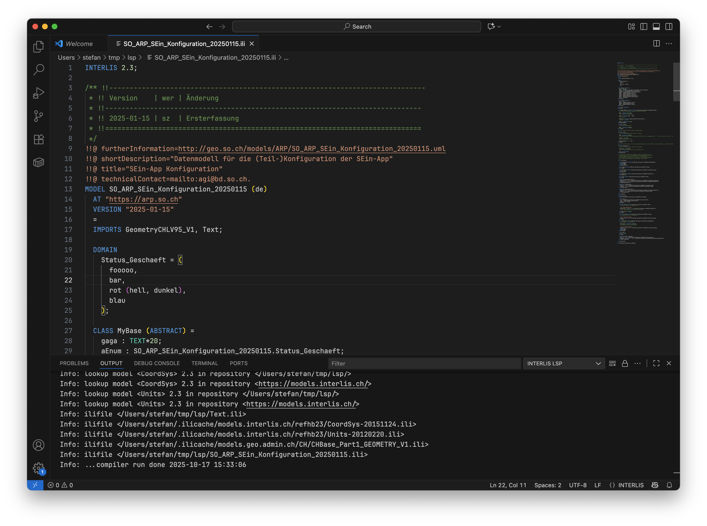

Werden Fehler gefunden, sind diese strukturiert und können mittels Klick angesprungen werden:

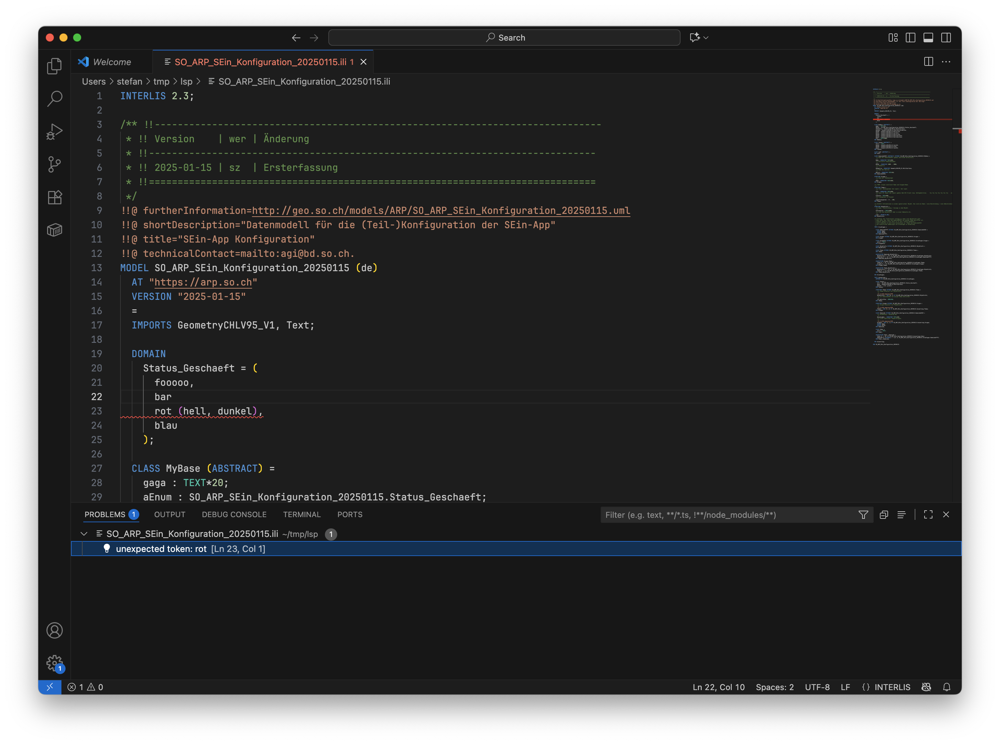

**Modell und Objekt Suggestions:**

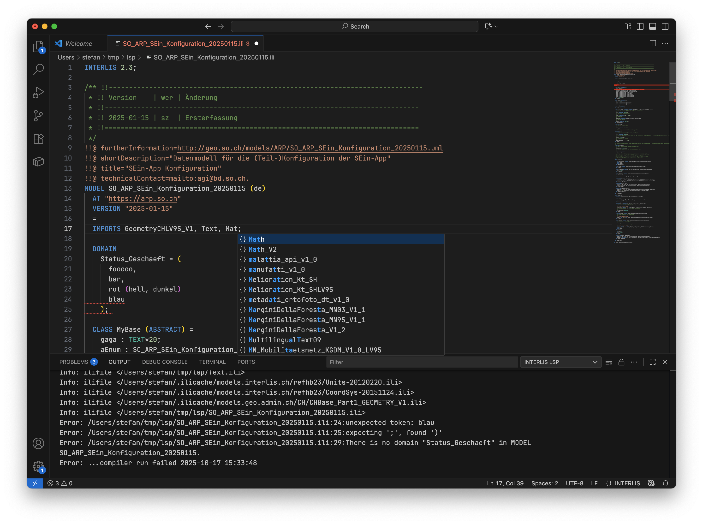

**Pretty Print:**

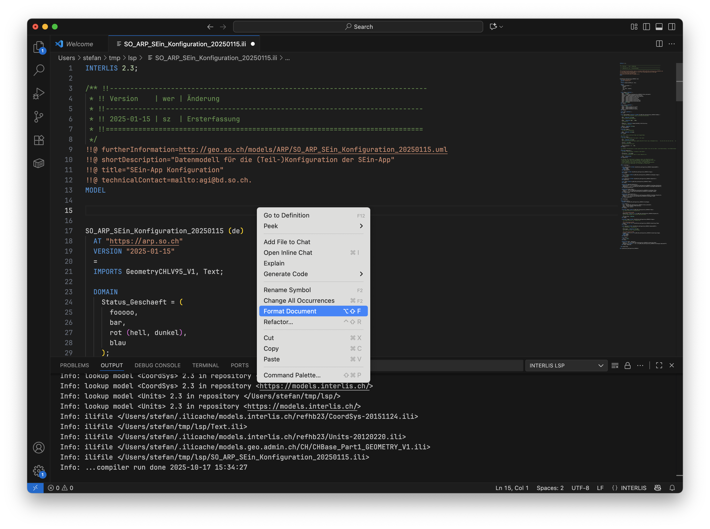

**Rename-Funktion:**

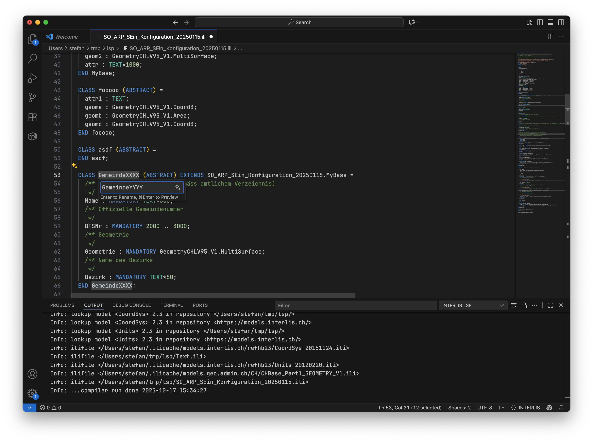

(Könnte noch bisschen wackeling sein...)

**UML-Klassendiagramm:**

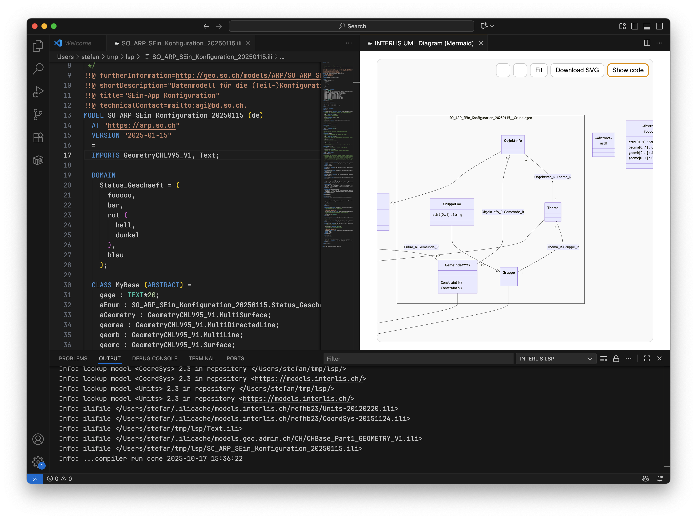

Es kann auch ein PlantUML-Klassendiagramm erstellt werden. Zudem ist der jeweilige Code kopierbar, um das Diagramm nach eigenen Wünschen anzupassen.

**Objektkatalog (HTML und .docx):**

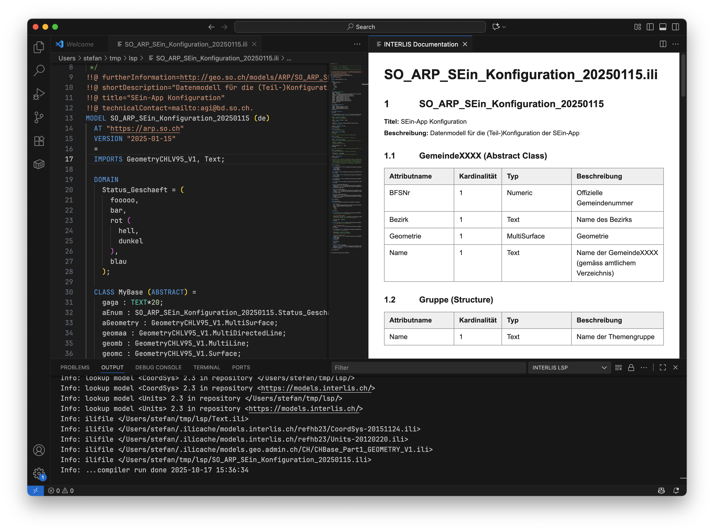

**Verlinkte Modelle:**

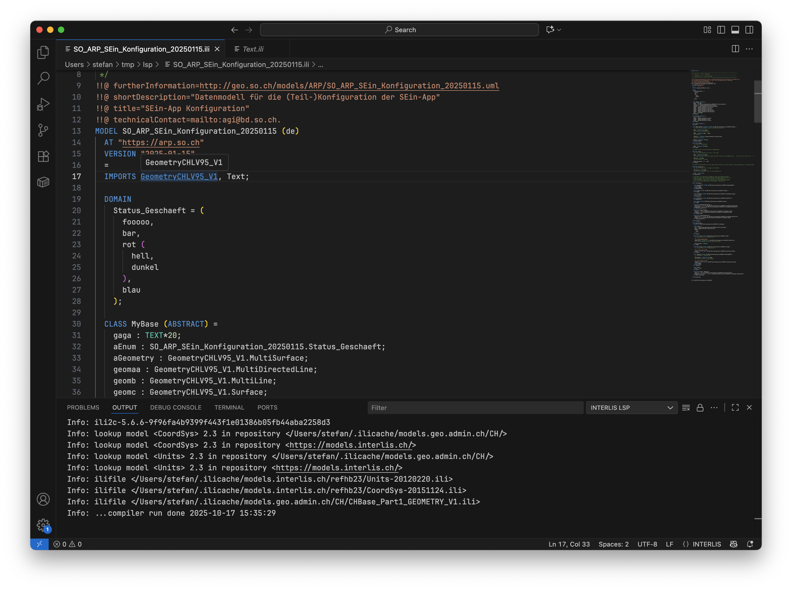

Importierte Modelle und deren Objekte können geöffnet und angesprungen werden.

**Hierarchie-Baum:**

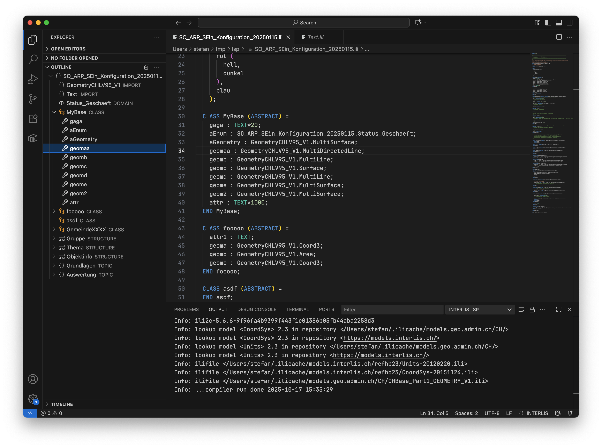

Und ja, das ist jetzt alles noch nicht battle proven. Aber ein guter Start. Und wie man richtig erkennen kann, sind alle Screenshots mit VSCode gemacht. Was ist nun mit _Eclipse Theia IDE_? Funktioniert genau gleich. Man lädt die https://theia-ide.org/#theiaidedownload[Software herunter] und installiert die https://open-vsx.org/extension/edigonzales/interlis-editor[Extension]:

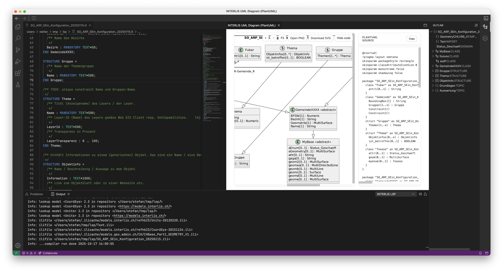

Und was ist die &laquo;INTERLIS IDE&raquo;? Momentan noch nichts anderes als eine geforkte und leicht angepasste _Theia-IDE_ und eingebauter VSCode-Extension:

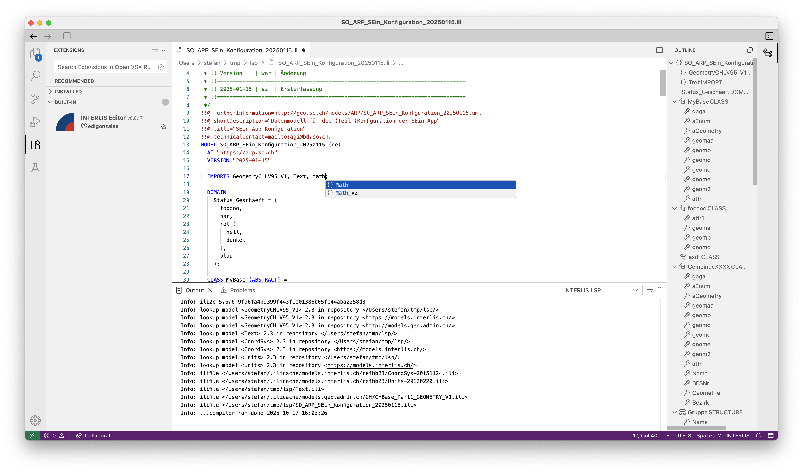

Ob das langfristig wirklich notwendig ist, weiss ich noch nicht. Immerhin könnte so eine getailorete Variante den Einstieg vereinfachen? Nur sollten die https://github.com/edigonzales/interlis-ide/releases[bereitgestellten Installationspakete] aber auch problemlos funktionieren... Unter macOS laufe ich natürlich prompt in ein Problem und man muss den Klassiker machen:

[source,json,linenums]
----
xattr -dr com.apple.quarantine InterlisIDE.app
----

Sonst kommt die Fehlermeldung, dass die Anwendung kaputt ist. Endziel hier wären natürlich signierte Pakete oder aber mindestens eine bessere Fehlermeldung.

Ein zweiter Grund für den speziellen Theia-Build wäre, falls eine VSCode-Extension nicht mehr reicht, um alle Anforderungen zu erfüllen. Und Anforderungen führt mich gleich noch zum Thema, dass sowohl UML-Diagramm wie auch Objektkatalog read-only sind. Auch wenn ich es technisch interessant finde, wenn man in jeder der drei Ansichten editieren könnte, so frage ich mich doch wie wichtig das wirklich ist (UML möchte ich mir zwar noch anschauen, aber eher aus Neugier und eventuell der Möglichkeit, dass man notfalls bezüglich Platzierung selber eingreifen kann). In einem Workshop habe ich das Argument gehört, dass ein Jurist seinen Input in der Objektkatalog-Ansicht machen kann. Da frage ich mich dann schon (noch sehr neutral), in welchem Universum wir leben. Definitiv nicht im gleichen und nicht weil wir schlechte Juristinnen und Juristen haben, sondern &laquo;Hallo Usecase?!?&raquo;.

Neben den mächtigeren Erweiterungsmöglichkeiten (als Visual Studio Code) bietet das Theia-Framework auch noch Microsoft-freie Kollaboration. Man kann den Server - falls man möchte - sogar selber hosten. Und man kann die IDE auch als Browser-Anwendung laufen lassen, entweder lokal und in Kubernetes.

Die Pakete konnte ich unter den verschiedenen Betriebssystemen nicht ausprobieren. Mir steht nur macOS zur Verfügung. Die VSCode-Extension wurde unter Windows ausprobiert und sollte funktionieren.

Also, machen wir doch weniger Papiere und Workshops und arbeiten an etwas Konkretem.

Links:

- https://theia-ide.org/
- https://github.com/edigonzales/interlis-lsp
- https://marketplace.visualstudio.com/items?itemName=edigonzales.interlis-editor
- https://open-vsx.org/extension/edigonzales/interlis-editor
- https://edigonzales.github.io/interlis-ide/