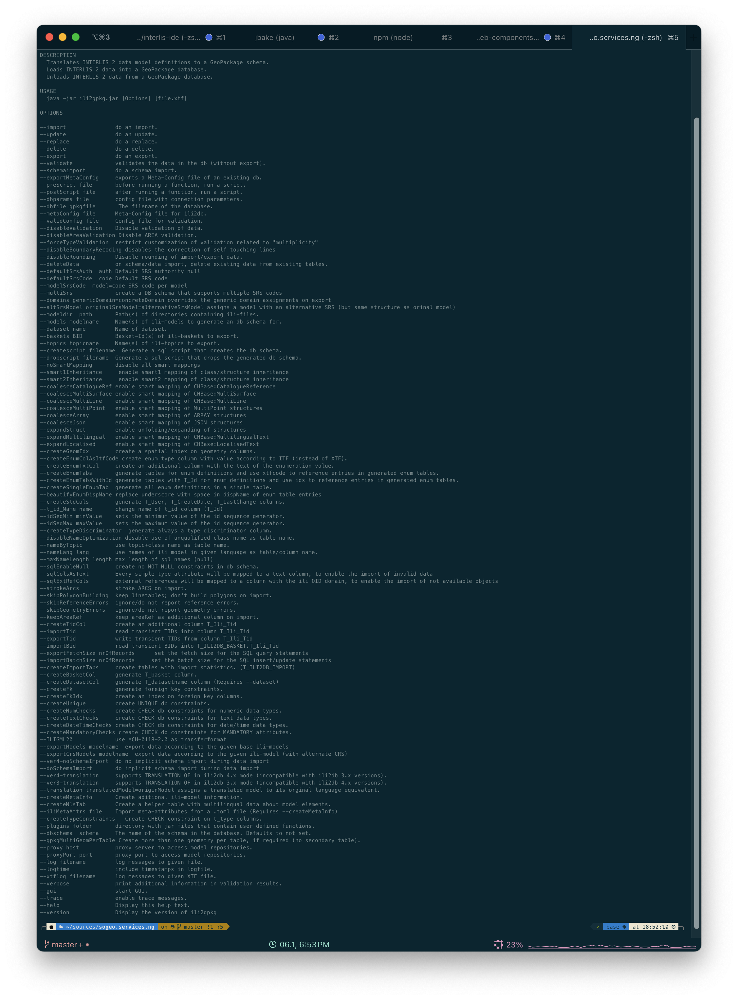
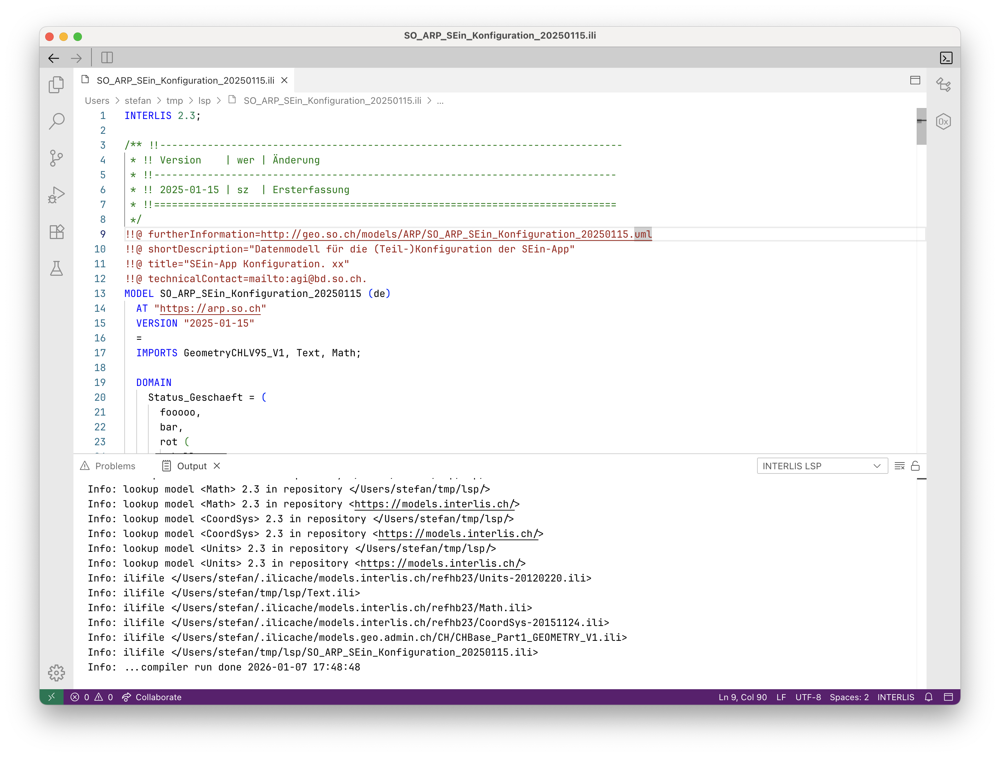
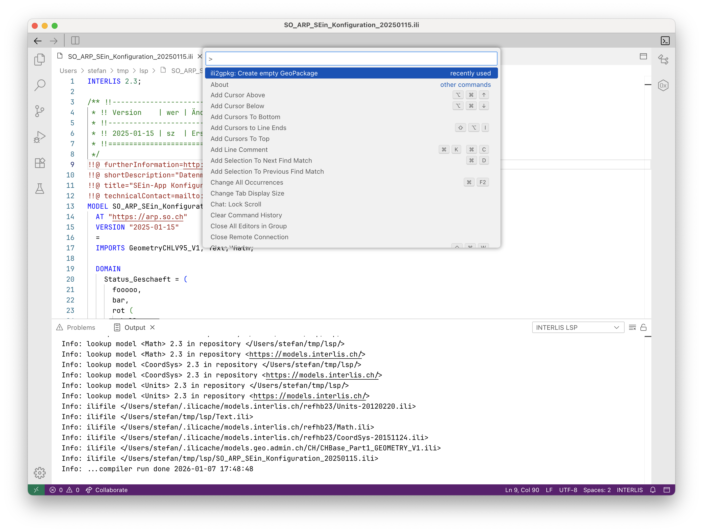
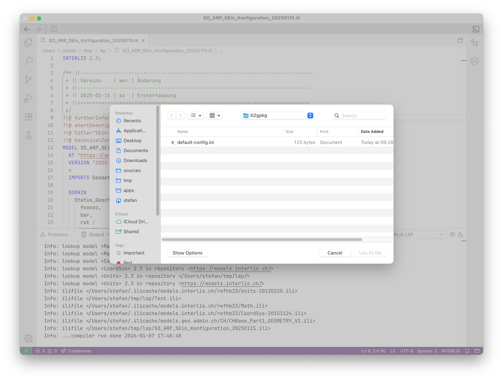
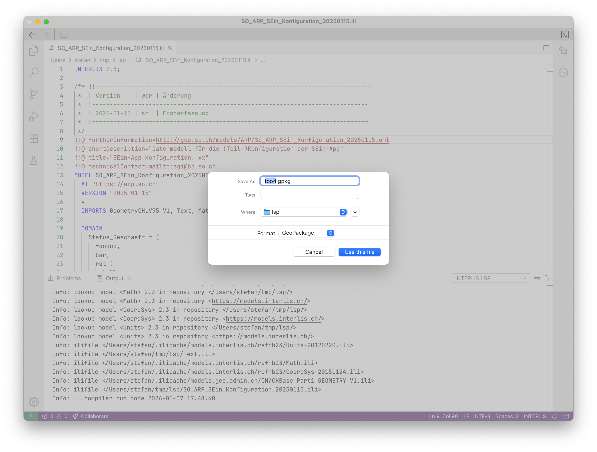
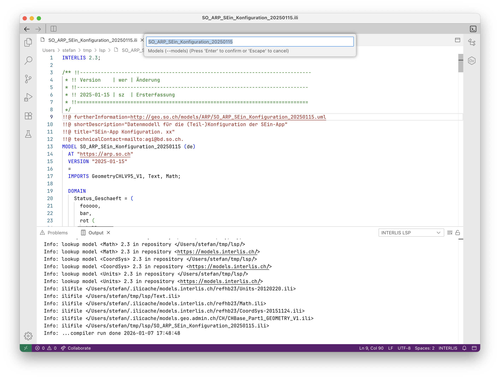
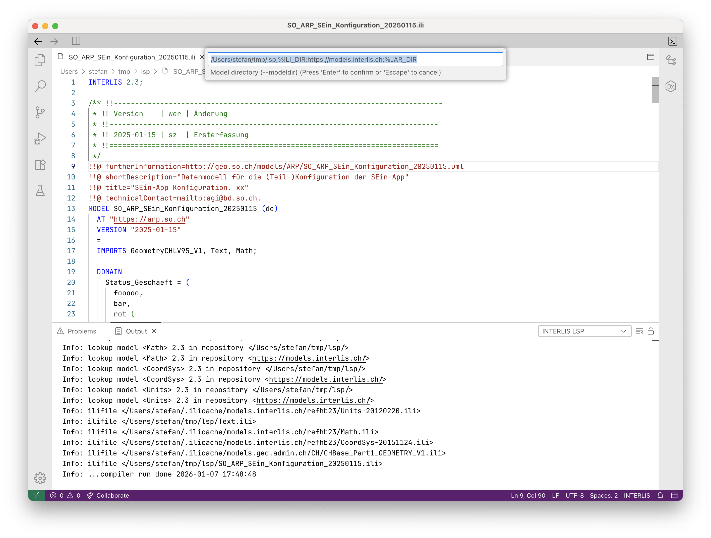
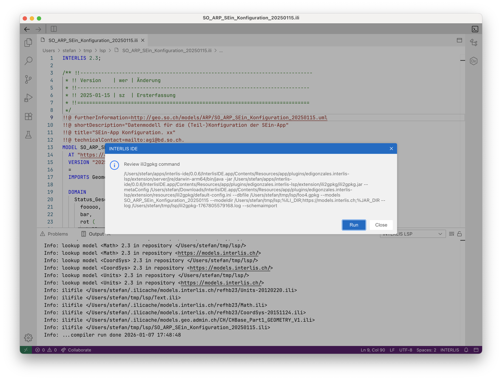
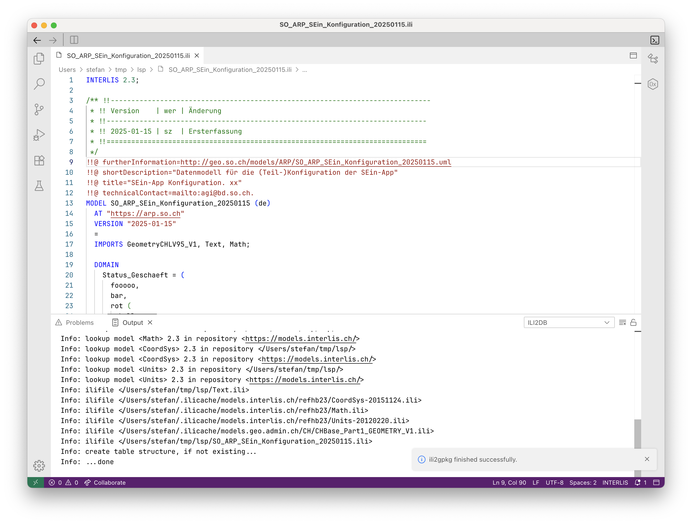
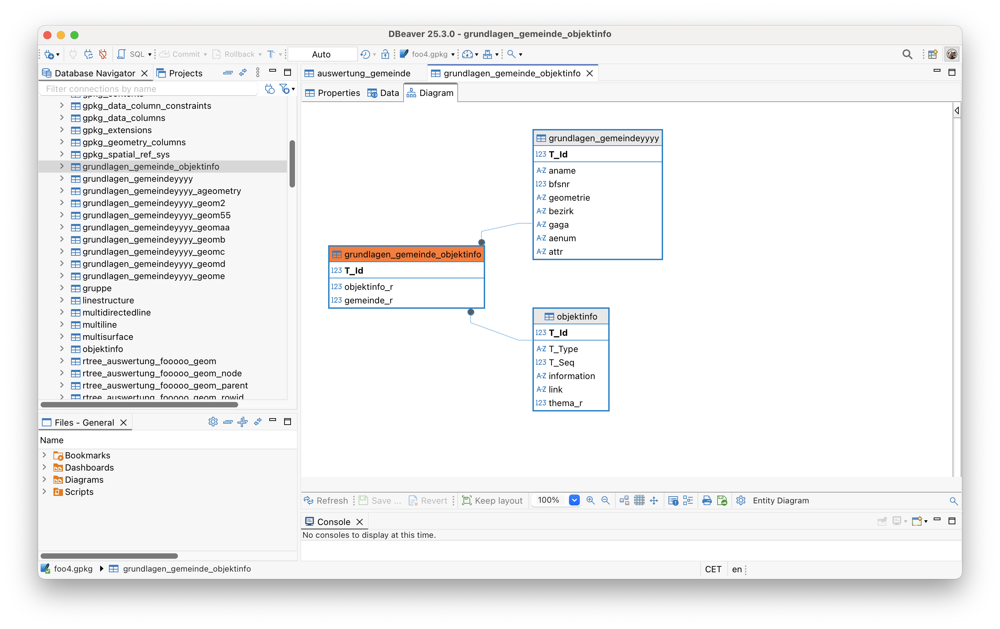

---
= INTERLIS leicht gemacht #60 - INTERLIS IDE noch besser gemacht
Stefan Ziegler
2026-01-06
:thoth-type: post
:thoth-status: published
:thoth-tags: INTERLIS,Java,ili2c,LSP,Theia,IDE,ili2gpkg
:idprefix:
---
Auch im neuen Jahr heisst das Motto wieder &laquo;INTERLIS macht Spass&raquo; und es gibt auch zukünftig viel Neues und Tolles über das man berichten kann und selber ausprobieren darf.

Ich habe die Tage an https://edigonzales.github.io/interlis-ide/[meiner INTERLIS IDE] gearbeitet. Dabei rausgekommen ist die Version https://github.com/edigonzales/interlis-ide/releases/tag/v0.0.6[0.0.6] und als VS Code Plugin die Version https://marketplace.visualstudio.com/items?itemName=edigonzales.interlis-editor[0.0.25].

Als erstes musste ich einen https://github.com/edigonzales/interlis-lsp/issues/58[Bug] fixen. Das Problem war nicht nur beim graphml-Export vorhanden, sondern bereits auch beim Mermaid- und PlantUML-Diagramm, verursacht durch Referenzen auf Objekte in anderen Datenmodellen. Das sollte nun behoben sein.

Spannender ist aber ein neu eingebautes Feature: Ist es nicht so, dass man häufig das Modell auch abgebildet in einer Datenbank sehen möchte? Das beantwortet Fragen wie z.B. &laquo;Wie wird die Vererbung abgebildet?&raquo; oder &laquo;Hat die JSON-Abbildung das gemacht, was ich erwarte?&raquo; etc. pp. Meine Idee war nun, dass ich in der Extension einfach `ili2gpkg` mitliefern kann (Java ist ja bereits an Bord) und so in der Extension integriere, dass der Benutzer mit möglichst wenig Klicks eine GPKG-Datei erstellen kann. 

Das Mitliefern ist das kleinste Problem. Mühseliger wird es bei der guten Umsetzung für die Ausführung des ili2gpkg-Kommandos. Wenn ich es richtig verstanden habe, kann man in VS Code nicht einfach hübsche GUIs in die Extension packen. Sondern man ist beim Ausführen von Kommandos sehr eingeschränkt, d.h. man wählt das Kommando aus und wizard-mässig kann man immer weitere Angaben zum Kommando machen und mit Enter bestätigen. Das ist bei der Anzahl an möglichen ili2gpkg-Optionen suboptimal:

Fair enough: Nicht alle sind relevant für die Erstellung des Schemas und der Tabellen. Aber es bleibt ein grosse Anzahl und kein Benutzer will 30 Mal Enter drücken. Abhilfe schafft die Meta-Config-ini-Datei. In dieser ini-Datei lassen sich die ili2gpkg-Optionen speichern und nur noch die Allerwichtigsten müssen vom Benutzer gewählt resp. bestätigt werden. 

[source,ini,linenums]
----
[ch.ehi.ili2db]
defaultSrsCode=2056
createEnumTabs=true
nameByTopic=true
createFk=true
createGeomIdx=true
createUnique=true
----

Dieser Ansatz führt zur berechtigten Frage was passiert, wenn ich andere Werte für diese Optionen verwenden will? Meine Lösung dafür: der Benutzer wählt einfach ein anderes ini-File aus. Die VS Code Extension bringt bereits eine ini-Datei mit, die der Benutzer nur zu bestätigen braucht oder aber er kann eine eigene ini-Datei auswählen.

Bilder sagen mehr als 1000 Worte.

Ausgangslage (ein hoffentliches kompilierendes INTERLIS-Datenmodell):

Auswahl des ili2gpkg-Kommandos:

Auswahl der ini-Datei. Entweder die eingebaute Default-Datei oder eine eigene:

Name und Speicherort der resultierenden GPKG-Datei:

Wahl des Datenmodelles. Es wird der Namen des aktuellen Datenmodelles vorgeschlagen:

Auswahl der Modelrepositories. Es werden die Standardrepositories und der Speicherort des aktuellen Modelles vorgeschlagen:

Fenster mit dem auszuführenden ili2gpkg-Kommando zwecks Review/Debugging:

Log-Messages in einem neuen Channel (siehe oben rechts im Output-Fenster &laquo;ILI2DB&raquo;):

Und jetzt? Entweder kann man sich die GeoPackage-Datei in dbeaver anschauen:

Oder es gibt auch SQLite-Extensions für VS Code resp. Theia. Leider habe ich da keine brauchbare gefunden, die ER-Diagramme darstellen kann. Und ausserdem könnte man das ER-Diagramm ebenfalls wieder mit Mermaid oder PlantUML direkt im Language-Server machen (analog dem UML-Klassendiagramm).

