---
= INTERLIS leicht gemacht #61 - INTERLIS goes AI
Stefan Ziegler
2026-01-12
:thoth-type: post
:thoth-status: published
:thoth-tags: INTERLIS,Java,MCP,Theia,AI,KI,Agent
:idprefix:
---
Während man noch darüber diskutiert, ob der Jurist in einem UML-Klassendiagramm selber Hand an ein INTERLIS-Datenmodell anlegen würde und so die Monate ins Land ziehen lässt, bin ich einen Schritt weiter: Warum überhaupt in einem GUI rumklicken oder INTERLIS-&laquo;Code&raquo; schreiben? Warum das nicht gleich der KI überlassen? Ich habe bereits im Oktober mit https://blog.sogeo.services/blog/2025/10/18/interlis-leicht-gemacht-number-58.html[meinem INTERLIS-MCP-Server angefangen] und wollte ihn nun weiterentwickeln Richtung _brauchbar_. _Brauchbar_ heisst für mich, dass er ein korrektes Datenmodell zurückliefern kann resp. das LLM fähig ist aus Snippets ein korrektes Datenmodell zu erstellen und dass er selbstverständlich die meist genutzten Anwendungsfälle abdecken kann. Letzteres bleibt noch die Achillesferse, weil die Sprache halt schon sehr umfangreich ist. Genauso wichtig für _brauchbar_ ist das Tooling drum herum. Da habe ich im Oktober eigentlich nicht viel gemacht, ausser hingekriegt, dass die Tools des MCP-Servers aufgerufen werden.

Den INTERLIS-MCP-Server gibt es als Docker Image https://hub.docker.com/repository/docker/sogis/interlis-mcp/general[hier]. Der Quellcode zum Selberbauen https://codeberg.org/sogis/mcp-interlis[hier].

Meine Idee wie man damit arbeiten kann, ist immer noch folgende: Ich habe in VS Code oder Eclipse Theia ein INTERLIS-Modell geöffnet und ein Chatfenster. Im Chatfenster kann ich mit Prosaeingaben das Modell ergänzen oder verändern wie es mir beliebt. Aber beginnen wir beim Tooling noch einen Schritt vorher. Ich habe mich immer ein wenig gefragt, was bei einem MCP-Server eigentlich rauskommt? Die https://modelcontextprotocol.io/specification/2025-11-25[Spezifikation] erklärt das zwar aber man will es sehen. Dazu gibt es den https://modelcontextprotocol.io/docs/tools/inspector[MCP Inspector]. In meinem Fall rufe ich den Inspector mit diesem Befehl auf:

[source]
----
npx @modelcontextprotocol/inspector java -jar interlis-mcp.jar
----

Der Inspector bietet z.B. die Möglichkeit sämtliche Tools des Servers aufzulisten und die dazugehörigen Input-Parameter:

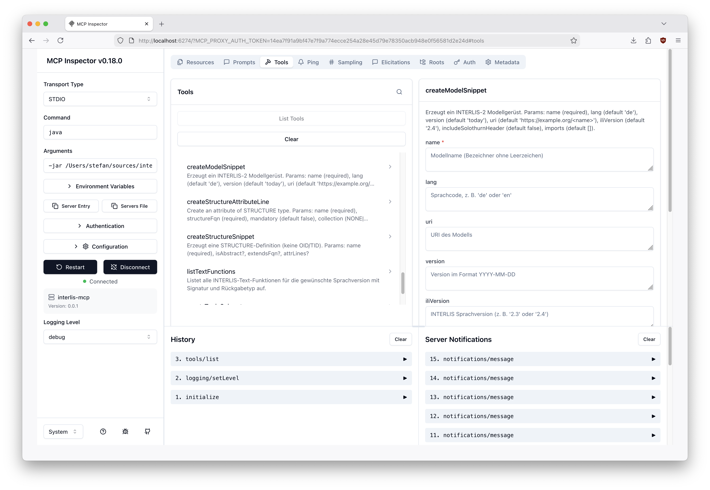

So bleibt das nicht irgendeine schwarze Magie, sondern man sieht wie Client und Server miteinander kommunizieren können. Der nächste Schritt ist das Erfassen des Servers in VS Code. Das geht mit dem Kommando `MCP: Add Server ...`. Da klickt man sich durch, gibt das Startkommando des MCP-Servers an (siehe Inspector) und gibt dem Server einen eindeutigen Namen. Es öffnet sich die Datei `mcp.json`:

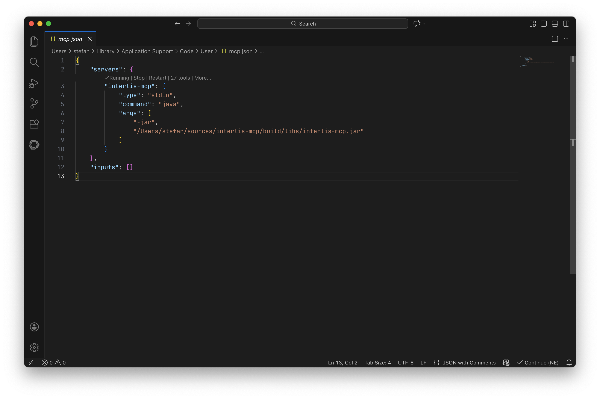

Man sieht im grauen Kleingedruckten, dass der Server bereits gestartet ist und 27 Tools anbietet. Als nächstes will ich via OpenAI-API Zugriff auf verschiedene LLM haben. Das geht mit dem Befehl `Chat: Manage Language Models`. Und hier dünkt mich das ganze VS Code Copilot Zeugs eher einschränkend. Man kann nur bestimmte Anbieter konfigurieren:

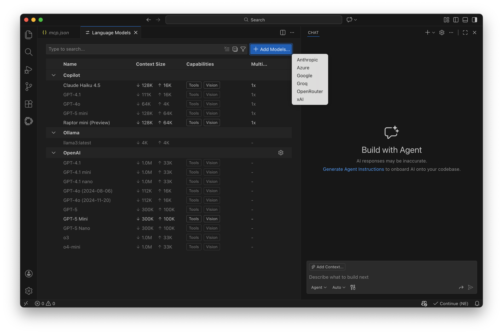

Die Konfiguration ist denkbar einfach, man muss den Provider aussuchen und den API-Key eintöggelen. Aber einen Drittanbieter (z.B. Infomaniak) mit einer OpenAI-kompatiblen API geht nicht. Modelle kann man einzeln freischalten (im Screenshot nur GPT-5-mini). 

Der letzte Schritt ist das Erzeugen eines Custom Agents (Befehl: `Chat: New Custom Agent ...`). Es öffnet sich eine Markdown-Datei mit `<Namen>.agent.md`:

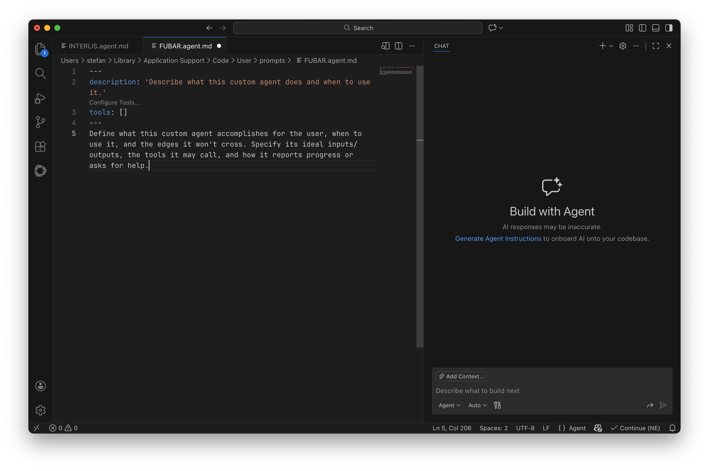

Im Header beschreibt man den Agenten und definiert auf welche Tools er Zugriff haben soll:

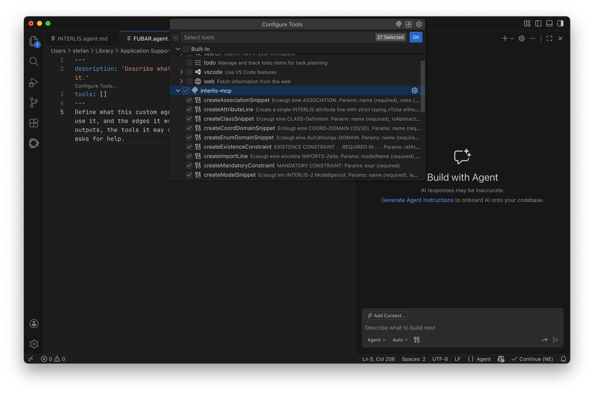

In der restlichen Datei macht man nun dem Agenten Vorgaben was er tun soll und was nicht. Bei mir sind das https://codeberg.org/sogis/mcp-interlis/src/commit/81ff7370e23a3aef8fc1cd47a675766dd6dd01d8/docs/INTERLIS.agent.md[circa 330 Zeilen] geworden, wobei ich sicher noch ein wenig ausmisten kann:

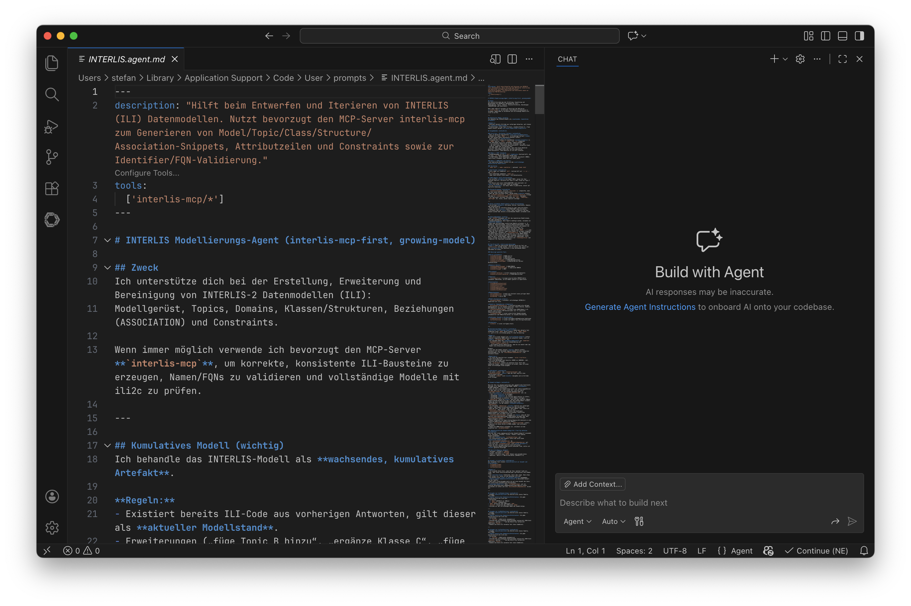

Endlich ist VS Code ready mir richtig beim Modellieren zu helfen. Dazu muss ich den INTERLIS-Agenten auswählen und das passende Modell:

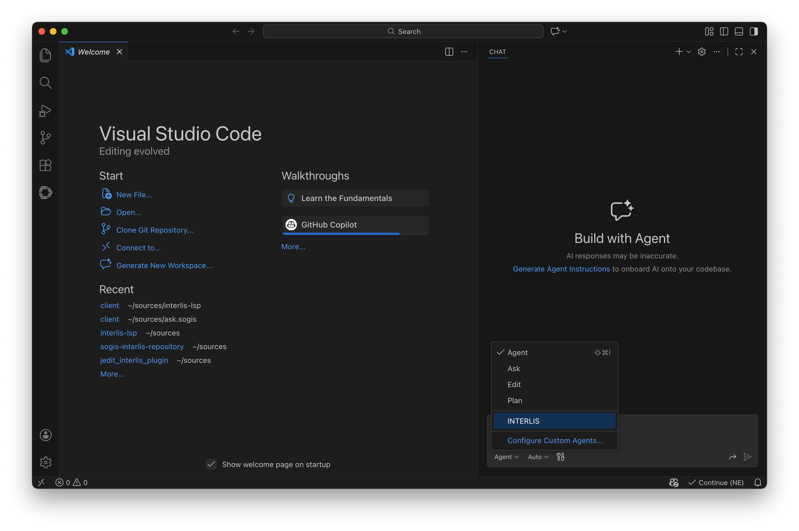

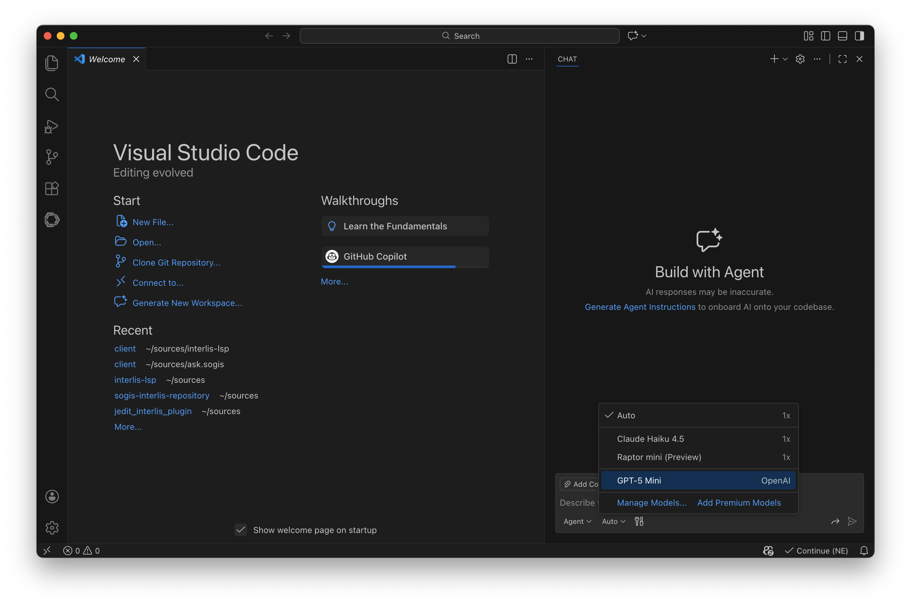

Testen wir den Agenten und wollen alle INTERLIS-Text-Funktionen sehen. Er fragt zuerst nach, ob er überhaupt den MCP-Server verwendet darf. Das kann man relativ feingranular einstellen. Ich erlaube es ihm ohne ständig nachzufragen für diese Session:

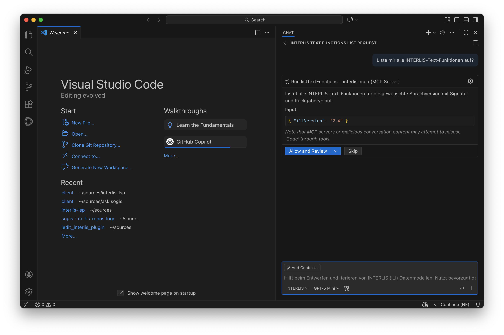

Als nächstes lasse ich mir ein leeres Datenmodell erstellen:

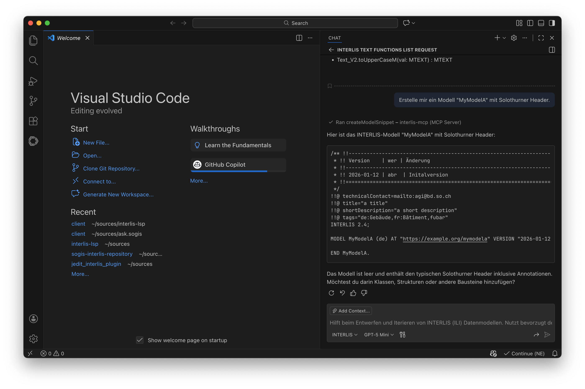

Das Praktische an VS Code ist, dass ich einen Code-Block in eine neue, zu erstellende Datei kopieren lassen kann. Noch praktischer wird es wenn ich in einem Folgebefehl eine Klasse erstellen lasse und die neue ili-Datei als Kontext mitliefere (siehe kleiner Badge &laquo;MyModelA.ili&raquo; unter meinem Prompt):

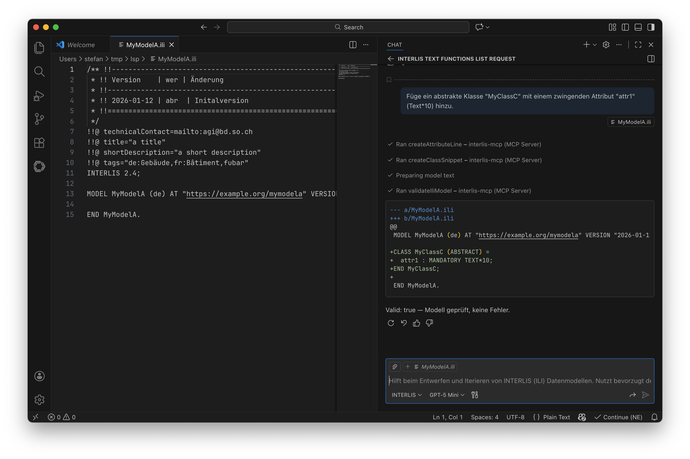

Der Agent liefert mir ein Diff zurück, dass ich auf die bestehende ili-Datei anwenden kann:

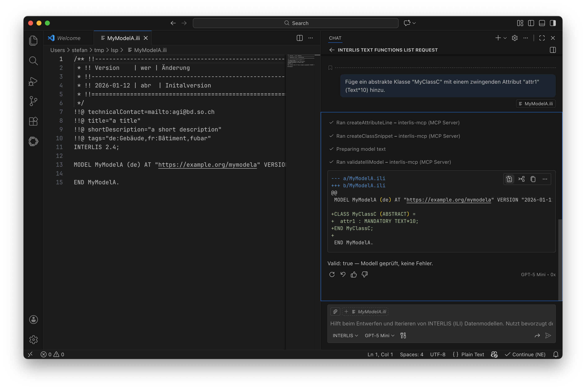

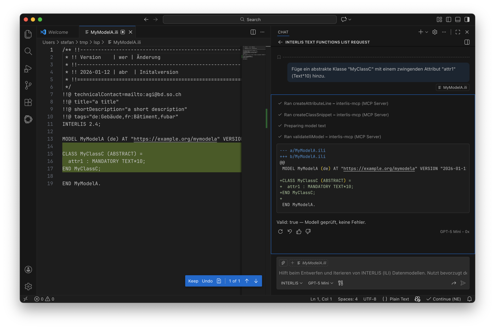

Und wenn man im Chatfenster genau hinschaut, sieht man oberhalb den MCP Tool Call `Ran validateIliModel - interlis-mcp (MCP-Server)`. Hier prüft der Agent das vollständige Modell auf syntaktische Korrektheit mit `ili2c` (das ebenfalls als Tool exponiert ist, dito Pretty Print).

Viel, wenn nicht fast alles, vom Verhalten des Agenten stecken in meinen circa 330 Zeilen. Unsicher bin ich, ob es sinnvoll ist, z.B. mehrere Modi anzubieten: immer ganzes Modell, nur Snippets oder Diff-Code-Blöcke. Da fehlt mir die Erfahrung wie gut man das dem Agenten beibringen kann.

Wie erwähnt, ist es schade, dass man nicht die LLM von Infomaniak in Copilot nutzen kann. Es gibt aber einen Haufen an VS Code Extensions, die man ausprobieren kann. Eines davon ist z.B. _Continue_. Der Aufbau und Konfiguration ist leicht anders und womöglich muss das Agenten-File jeweils auf das Tooling (und ggf. an die LLM-Familie) angepasst werden.

Was gibt es noch zu tun? Einiges: 

- Ich müsste mit einem Realweltbeispiel die wichtigsten Funktionen ergänzen (und vor allem prüfen).
- Wie funktionieren Agenten in Eclipse Theia?
- Den MCP-Server kann man auch gut in den https://edigonzales.github.io/interlis-ide/[besten INTERLIS-Editor] dazupacken.
- Reizen würde mich noch sowas wie ein &laquo;fractional compiler&raquo; der einzelne INTERLIS-Snippets auf syntaktische Korrektheit prüft (ili2c kann nur ganze Datenmodelle).
