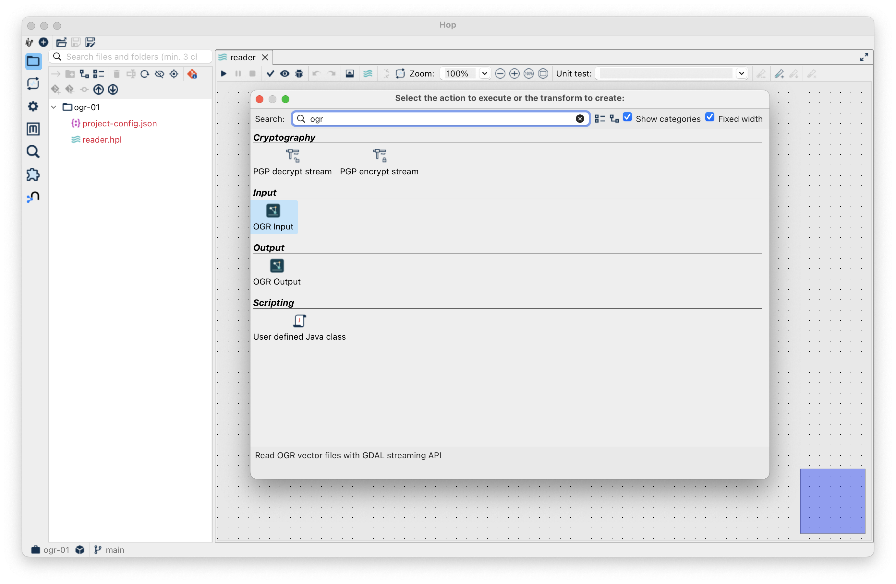
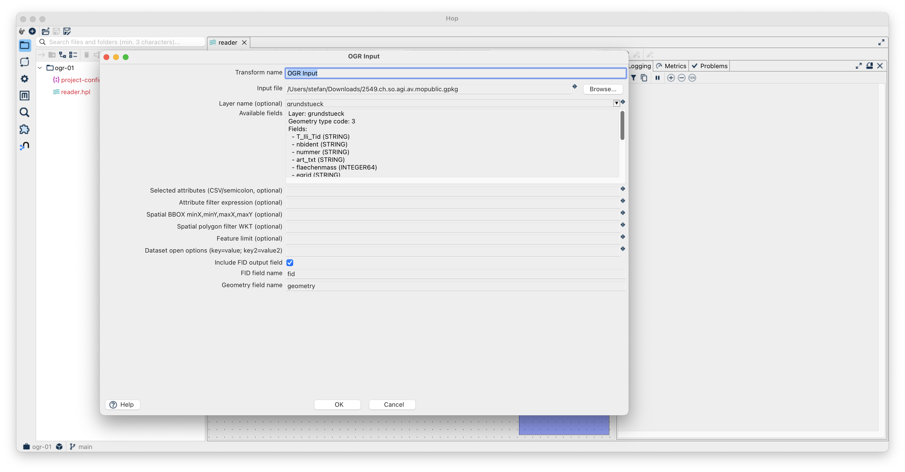
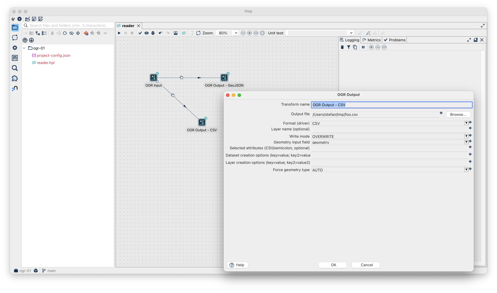

---
= Let's Hop #1 - Laying the Foundation
Stefan Ziegler
2026-03-06
:thoth-type: post
:thoth-status: published
:thoth-tags: ogr, gdal, apache hop, hop, java
:idprefix:
---
Apache Hop hat vielleicht ein https://www.geowebforum.ch/t/webinar-moeglichkeiten-der-enterprise-und-geo-datenintegration-mit-apache-hop-10-02-2026-11-12-uhr/1320/3[halbes Momentum]. Obwohl wir lieber https://gretl.app[ohne GUI] unterwegs sind, fand ich bereits https://blog.sogeo.services/blog/2014/02/09/fun-with-geokettle-episode-1.html[(Geo-)Kettle] https://blog.sogeo.services/blog/2014/11/29/fun-with-geokettle-episode-2.html[eine gute Sache]. Es war schon immer eine gute Basis, um nicht mehr von FME abhängig zu sein. Hätte man vor 10 Jahren angefangen, wäre man nun 10 Jahre weiter. Lieber vergibt man aber als öffentliche Hand einen 44 Millionen Auftrag. Freihändig... weil alternativlos... Ich hoffe, dass das aber ein Generationenproblem ist und/oder ein geopolitisches, das sich dann so oder so von fast alleine löst.

Ausser bei GeoKettle war es immer das Problem wie man &laquo;Geo&raquo; nach Kettle resp. Apache Hop bringt. Bei GeoKettle war das Problem, dass es ein Fork war und nicht mittels einem Plugin-Ansatz funktionierte. Klar gibt es Workarounds wie alles in PostgreSQL/PostGIS oder DuckDB machen. Aber dann kann man sich fragen, warum man überhaupt noch Apache Hop verwenden will. 

Es gibt vielleicht drei grössere Themenfelder damit man &laquo;Geo&raquo; in Apache Hop machen kann:

1. Es gibt keinen nativen Geometrie-Datentyp.
2. Es gibt keine Import- und Exportfunktionen von GIS-Datenformaten.
3. Es gibt keine Geoprocessing-Funktionen.

https://www.atolcd.com/[Atol CD] hat ein GIS-Plugin für Apache Hop geschrieben, dass im Prinzip die drei Dinge löst: https://github.com/atolcd/hop-gis-plugins. Ich dachte mir dann, warum muss man eigentlich die ganzen Import- und Exportfunktionen nochmals programmieren, wenn es GDAL/OGR gibt? Und es gibt ein ogr2ogr-Plugin von https://www.ost.ch/de/[OST]: https://gitlab.ost.ch/apache-hop-plugin-sa/apache-hop-plugin-ogr2ogr. Wenn ich es aber richtig verstehe, ist das bloss ein Wrapper um das `ogr2ogr` CLI. Und da muss ich passen. Was bringt mir eine Java-Anwendung und damit verbunden die Einfachheit der Installation, wenn ich anschliessend noch eher non-trivial GDAL/OGR installieren muss? Und wie soll das gemeinsam verpackt und bereitgestellt werden? Für mich ein No-Go.

Ja, Apache Hop ist Java und GDAL/OGR ist in C++/C geschrieben. Ist das ein Problem? Jein. Es gibt schon seit geraumer Zeit Java-Bindings für GDAL/OGR. Das ist aber ein Mega-Geknorze und so richtig unterhalten sind sie meines Erachtens auch nicht mehr. Ich habe das paar Mal probiert und es war immer kein gutes Erlebnis. Das so ein Verheiraten aber auch gut funktionieren kann, zeigt z.B. der SQlite-JDBC-Treiber. Der verwendet ebenfalls native libraries.

Was nun? Java kennt seit Version 22 die https://openjdk.org/jeps/454[Foreign Function & Memory API]. Die Java Foreign Function & Memory API ist eine moderne Schnittstelle, mit der Java-Programme direkt auf nativen Code ausserhalb der Java Virtual Machine zugreifen können. Sie ermöglicht es, Funktionen aus in C oder C++ geschriebenen Bibliotheken aufzurufen, ohne auf ältere, komplexere Technologien wie JNI zurückgreifen zu müssen. Ein minimales Beispiel (für macOS):

_mylib.c_:
[source,c,linenums]
----
int add(int a, int b) {
    return a + b;
}
----

C-Bibliothek kompilieren:

[source,bash,linenums]
----
clang -shared -o libmylib.dylib mylib.c
----

_Main.java_:
[source,java,linenums]
----
import java.lang.foreign.*;
import java.lang.invoke.MethodHandle;
import static java.lang.foreign.ValueLayout.*;

public class Main {
    public static void main(String[] args) throws Throwable {
        Linker linker = Linker.nativeLinker();

        // Bibliothek laden
        SymbolLookup lib = SymbolLookup.libraryLookup("libmylib.dylib", Arena.global());

        // Funktionssignatur: int add(int, int)
        MethodHandle add = linker.downcallHandle(
                lib.find("add").orElseThrow(),
                FunctionDescriptor.of(JAVA_INT, JAVA_INT, JAVA_INT)
        );

        int result = (int) add.invokeExact(3, 4);
        System.out.println("Result: " + result);
    }
}
----

Java kompilieren:

[source,bash,linenums]
----
javac Main.java
----

Java ausführen:

[source,bash,linenums]
----
java -Djava.library.path=. Main
----

Das Resultat ist:

[source,bash,linenums]
----
Result: 7
----

Für GDAL/OGR ist das natürlich weitaus umfangreicher. Aber heute geht das - zumindest als PoC - eigentlich ganz mühelos: https://github.com/edigonzales/gdal-java-bindings/. Als erstes habe ich Bindings für ein paar CLI Tools gemacht (`gdal_translate`, `ogro2ogr`). Später musste ich natürlich die API aufbohren, da ich genau nicht nur z.B. einen Formatumbau machen will, sondern direkt auf einzelne Records zugreifen will, damit Apache Hop auch streamen kann.

Neben dem eigentlichen Herstellen der Bindings gibt es weitere Herausforderungen, die man irgendwie lösen muss. Spannend ist die Frage des Packaging. Die GDAL/OGR Binaries sind relativ gross (circa 1 GB) und natürlich OS-abhängig. D.h. wenn wir die Java-Bindings (inkl. GDAL/OGR) für die wahrscheinlich drei verbreitesten Betriebssysteme anbieten wollen, kommt das was zusammen. Momentan habe ich das so gelöst, dass es ein https://jars.sogeo.services/snapshots/ch/so/agi/gdal-ffm-core[Core-Paket] gibt und https://jars.sogeo.services/snapshots/ch/so/agi/gdal-ffm-natives/0.1.0-gdal3.11.1-SNAPSHOT[je ein Paket pro OS] mit den Binaries. Die schiere Grösse kommt weniger vom Programm selber, sondern von den Ressourcen, die GDAL/OGR mitliefert (insb. Transformationsdateien). Ich habe noch eine https://jars.sogeo.services/#/snapshots/ch/so/agi/gdal-ffm-natives-swiss/0.1.0-gdal3.11.1-SNAPSHOT[&laquo;swiss&raquo;-Variante] gemacht, die viel kleiner ist und für uns im Regelfall reichen sollte. Wenn ich die Bindings so paketiere, sind nachfolgende Arbeiten aber auch immer OS-abhängig. Für's Erste lass ich es aber so. Ganz so schlimm finde ich es nicht, da ich immer noch in der Lage bin einfach self-contained Distributionen anbieten zu können.

Als nächstes muss man das eigentliche Apache Hop Plugin programmieren. Auch das geht heute halt schneller als früher: https://github.com/edigonzales/hop-gdal-plugin. Den nativen Geometrietyp habe ich aus dem AtolCD-Plugin extrahiert und als eigenes Plugin publiziert: https://github.com/edigonzales/hop-geometry-type-plugin/. Das kann aber nur eine temporäre Lösung sein. Ich erachte die Integration eines solchen Geometrietyps als einen ersten wichtigen Schritt. Wenn das nicht passiert, muss wieder jeder was basteln und es führt zu Inkompatibilitäten.

Wenn ich Apache Hop mit dem Plugin starte, habe ich neu einen `ogr-reader` und `ogr-exporter`:

Der `ogr-reader` Transformer sollte mehr oder weniger intuitiv sein:

Man könnte selbstverständlich noch andere ogr2ogr-Optionen bereits beim Import exponieren.

Die Pipelinevorschau zeigt die Records innerhalb der Tabelle der ausgewählten Geopackage-Datei:

image::hop03.png[alt="Apache Hop", align="center"]

Mit dem `ogr-exporter`-Transformer können wir die Geodaten in anderen (allen von ogr unterstützten) Formaten speichern:

So ganz alleine ergibt das hop-gdal-Plugin noch wenig Sinn. Spannend wird es später in Verbindung mit Geoprocessing-Operationen. Und was natürlich cool ist, man muss nicht mehr das Rad neu erfinden, um viele Geodatenformate in Apache Hop zu unterstützen.

Weil das Plugin aufgrund der Paketierung der Java-GDAL-Bindungs noch OS-abhängig ist, habe ich hier für macOS, Linux und Windows aktuelle Apache Hop Distributionen gemacht inkl. GDAL-Plugin: https://github.com/edigonzales/hop-distributions/releases

Weil wir die Java FFM-API verwenden, brauchen wird mindestens Java 22. In den Build-Pipelines verwende ich Java 23. Das wäre also die Mindestversion, um Apache Hop zu starten. Bei mir mache ich das so:

[source,bash,linenums]
----
HOP_JAVA_HOME=/Users/stefan/.sdkman/candidates/java/25.0.1-tem \
HOP_OPTIONS="--enable-native-access=ALL-UNNAMED -Xmx2048m" \
./hop-gui.sh
----

Probiert es aus und meldet Fehler.