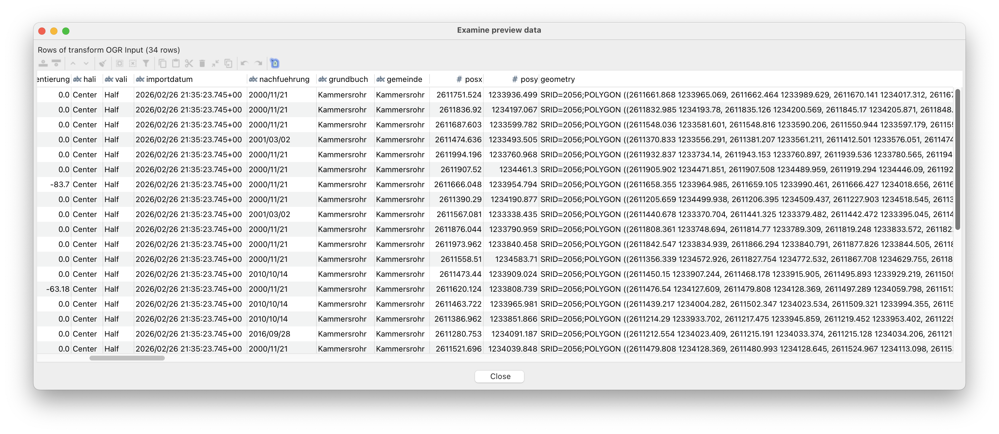
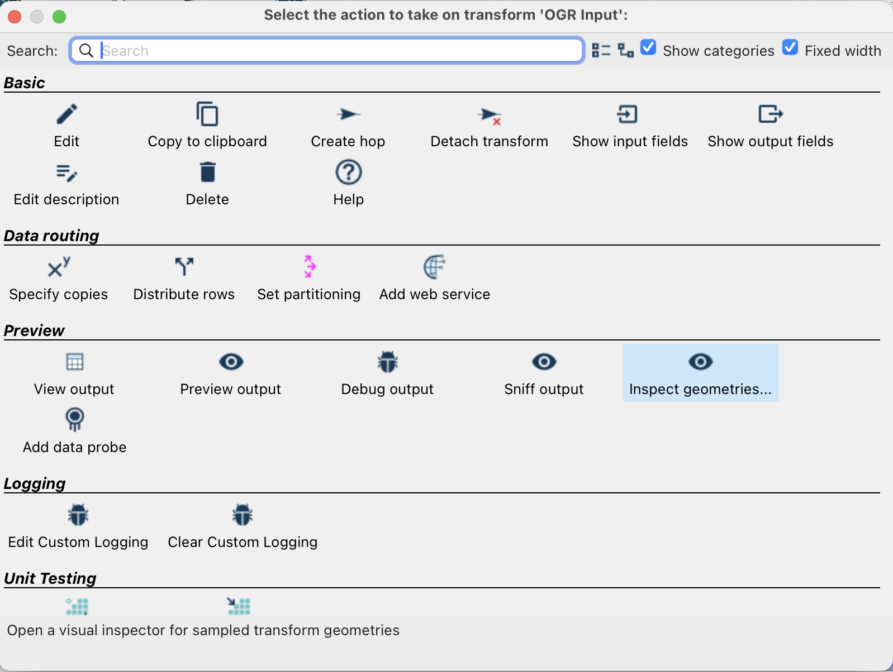
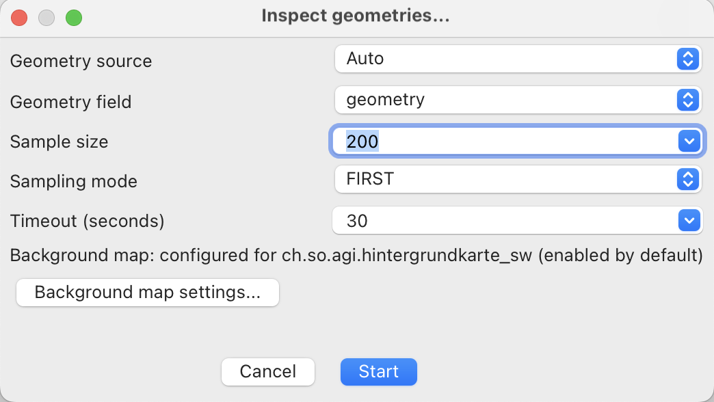
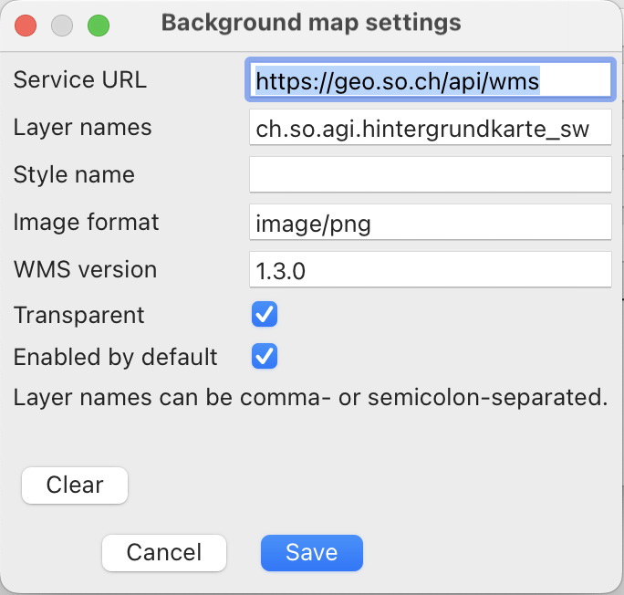
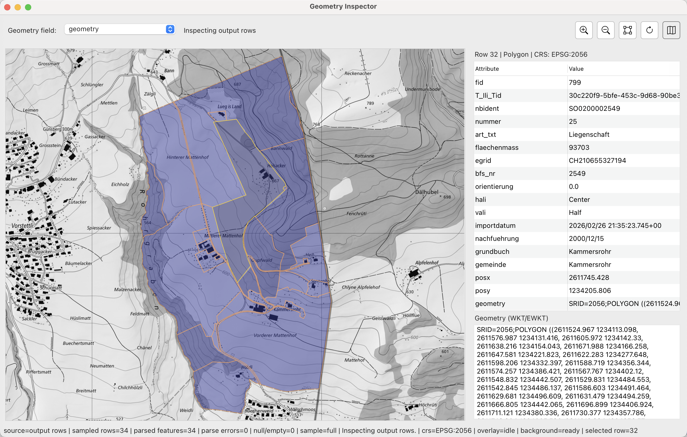

---
= Let's Hop #2 - Die Idee ist gut, die Vorschau ist besser
Stefan Ziegler
2026-03-09
:thoth-type: post
:thoth-status: published
:thoth-tags: ogr, gdal, apache hop, hop, java, geotools
:idprefix:
---
Nachdem wir Import und Export von https://blog.sogeo.services/blog/2026/03/06/lets-hop-01.html[Geodatenformaten erledigt haben], könnte man auf die Idee kommen, dass man die Geometrien innerhalb einer Pipeline auch anschauen möchte. In Apache Hop nennt sich das _Preview_:

Dank des https://github.com/edigonzales/hop-geometry-type-plugin/[nativen Geometriedatentypes] erscheinen die Geometrien in tabellarischer Form in EWKT. Das ist zwar schön und gut aber Geometrien will ich in der Regel nicht als blossen Text anschauen müssen, sondern tatsächlich auch sehen: Hallo https://github.com/edigonzales/hop-geometry-inspector-plugin/[Geometry-Inspector-Plugin].

Das Geometry-Inspector-Plugin bettet sich neben den bereits bestehenden Preview-Funktionen ein:

Wählt man die Inspect Geometries Aktion, erscheint ein zweites Fenster mit verschiedenen Optionen:

- Geometry source: `Auto` | `Output` | `Input`. Das ist notwendig, weil nicht jeder Transformer Output-Geometrien hat. Entsprechend müssen auch Input-Geometrien verwendet werden können.
- Geometry field: Falls es mehrere Geometrieattribute hat, kann man das gewünschte wählen.
- Sample size: Die Anzahl der Features, die gerendert werden sollen.
- Sampling mode: `FIRST` | `LAST` | `RANDOM`. Welche Features sollen verwendet werden.

Zusätzlich kann man _einen_ Hintergrundkarten-WMS verwenden:

Klickt man den Start-Button, sollte die Preview-Karte inkl. Featureinfo-Abfrage erscheinen:

Die Karte wurde mit https://geotools.org/[GeoTools] umgesetzt. GeoTools kennt zwar einige High Level Komponenten, wie z.B. https://docs.geotools.org/stable/userguide/unsupported/swing/jmapframe.html[JMapFrame], diese sind aber unsupported und passen nicht wirklich zu einem https://eclipse.dev/eclipse/swt/[SWT]-basiertem GUI wie Apache Hop. Aus diesem Grund habe ich nur das eigentliche Rendering und die Kommunikation mit dem WMS von GeoTools übernommen.

Die Kartenkomponente ist noch nicht allzu umfrangreich. So kann man das Aussehen der Geometrien oder das Koordinatensystem nicht ändern. Vom WMS wird jeweils das Koordinatensystem der Geometrien requestet. Ein Transformation findet aber nie statt. Ein komplettes Desktop-GIS nachbauen, will man zwar nicht, aber das eine oder andere Feature hat sicher noch Platz.

Am Schwierigsten war interessanterweise der Umgang mit dem nativen Geometrietyp. Dieser existiert zwar, aber er existiert nur als Plugin. Und soweit ich es verstanden haben, führt das zu Problemen, weil mehrere Plugins diesen Geometrietyp als Bibliothek mitliefern: Das ogr-Plugin streamt Records mit diesem Geometrietypen. Das Geometry-Inspector-Plugin erwartet einen solchen Geometrietypen zum Rendern. Weil aber die beiden Plugins in einem unterschiedlichen Classloader geladen werden, sind es eben nicht die identischen Java-Klassen. D.h. `instanceof` funktioniert nicht so wie man sich das vorstellen würde. Würde sich aber in Wohlwollen auflösen, wenn der Geometrietyp in den Hop-Kern wandern würde.

Probiert es aus und meldet Fehler. Das https://github.com/edigonzales/hop-distributions/releases[Komplettpaket] wurde mit dem Geometry-Inspector upgedatet.

[source,bash,linenums]
----
HOP_JAVA_HOME=/Users/stefan/.sdkman/candidates/java/25.0.1-tem \
HOP_OPTIONS="--enable-native-access=ALL-UNNAMED -Xmx2048m" \
./hop-gui.sh
----