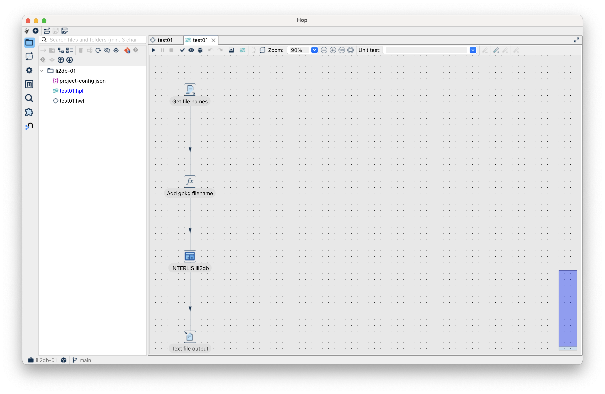
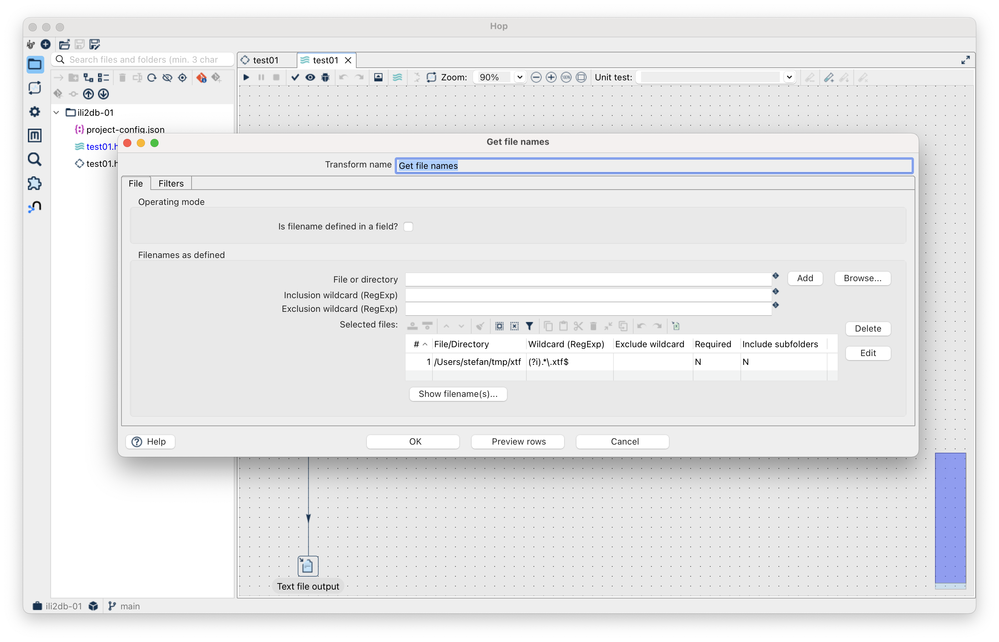
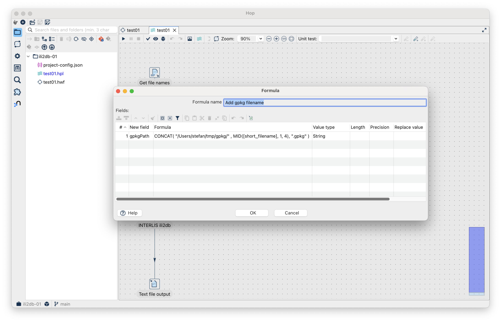
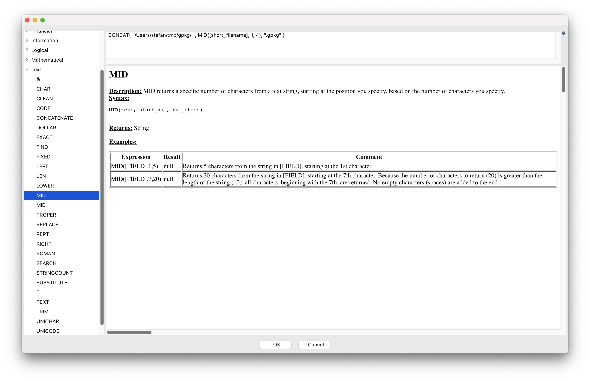
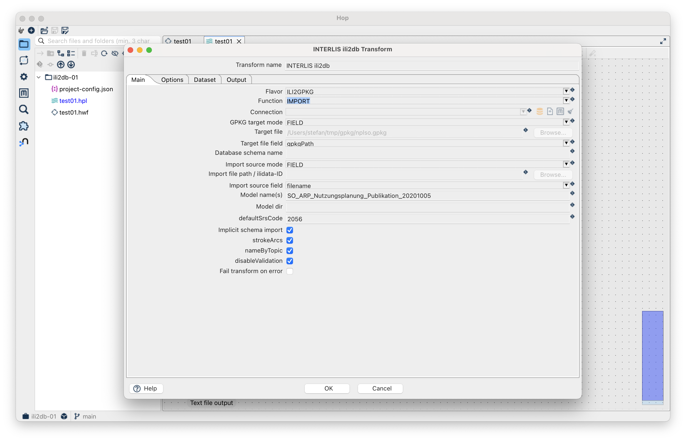
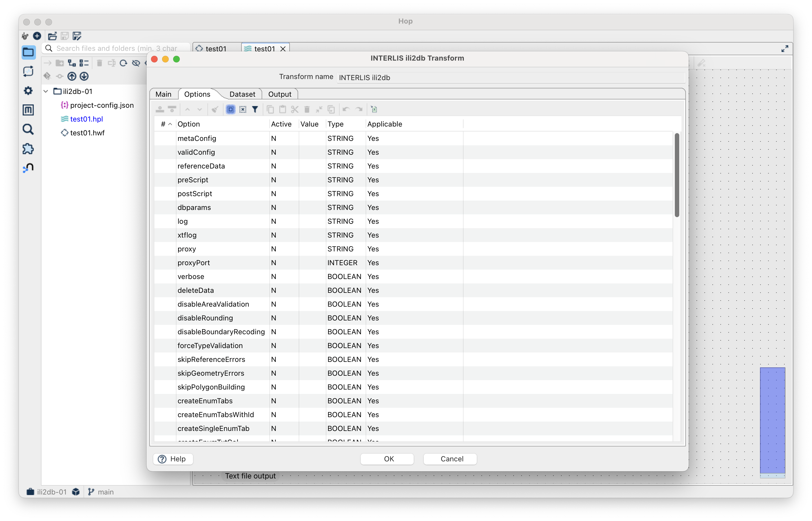
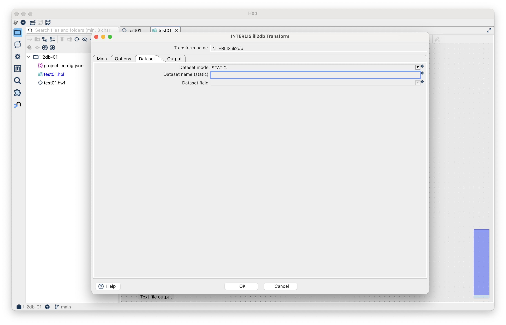
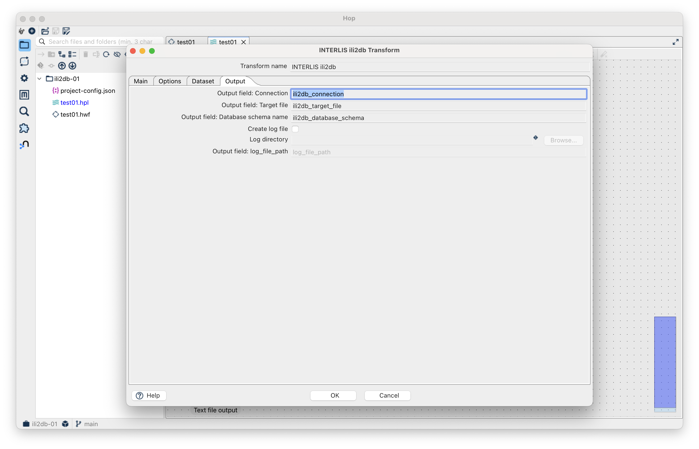
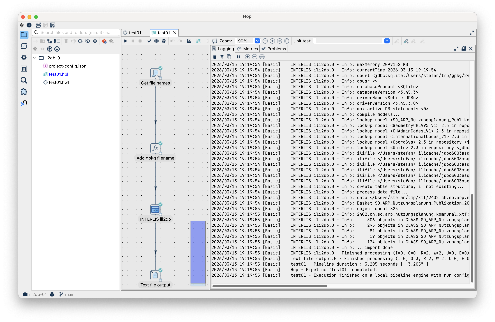

---
= Let's Hop #3 - A native ili2db Integration for Apache Hop
Stefan Ziegler
2026-03-13
:thoth-type: post
:thoth-status: published
:thoth-tags: interlis, apache hop, hop, java, ili2db
:idprefix:
---
Es musste ja soweit kommen. Here it is, ein https://github.com/edigonzales/hop-ili2db-plugin[ili2db-Plugin] für Apache Hop. Es gibt das Plugin als Action wie auch als Transform. Korrekterweise müsste es wahrscheinlich &laquo;ili2db Input&raquo; heissen, da es sich momentan nur um den Import kümmert. 

Die Idee ist, dass es nicht für jeden Flavor ein Plugin gibt, sondern ein ili2db-Plugin, welches die unterschiedlichen Flavor beinhaltet. Wie immer scheint mir eine der Herausforderung die schiere Fülle an möglichen Usecases und die sehr hohe Anzahl an Optionen zu sein. Wie man das sinnvoll dem Benutzer bereitstellt? Schwierig. Notfalls argumentiert man (aka Ausrede) einfach mit: &laquo;Profi-Software&raquo;.

Was das Plugin (in Teilen kann) erkläre ich am Besten mit einem Transform-Beispiel: Ich möchte alle XTF-Dateien in einem Verzeichnis mit `ili2gpkg` in GeoPackages umwandeln. Die Pipeline sieht am Ende so aus (&laquo;Text file output&raquo; ist nur noch fürs Debuggen):

Als erstes lesen wir alle Dateinamen mit der Endung .xtf aus einem Verzeichnis und bilden den Stream:

In unserem Fall aus dem Verzeichnis _/Users/stefan/tmp/xtf/_. Man darf ja nicht vergessen, nach der Auswahl des Verzeichnisses den &laquo;Add&raquo;-Button zu drücken. Sonst passiert nämlich nichts. Als nächstes fügen wir diesem Stream eine Spalte hinzu: Nämlich den Speicherort inkl. Dateinamen der GeoPackage-Datei, die aus jedem XTF erstellt werden soll:

Im Feld `Formula` schreibt man die Expression, die es braucht, um aus dem XTF-Dateinamen den Speicherort inkl. GPKG-Dateinamen pro Row zu erzeugen. Es ist halt so ein klassischer Feldrechner (interessanterweise basierend auf _Apache POI_. Leider fehlt sowas wie ein Extension Point, um eigene Funktionen registrieren zu können):

Nun kommt das Spannende. Der Import der Daten in eine GeoPackage-Datei:

Die ersten beiden Optionen dürften klar sein. Es stehen alle Funktionen zur Verfügung ausser - wie bereits erwähnt - Export. `Connection` kann nur ausgewählt werden, falls man den ili2pg-Flavor wählt. Bei GeoPackage oder anderen (zukünftigen) dateibasierten Datenbanken muss man den Namen der zu erstellenden Datei angeben. Das kann entweder statisch sein oder eben aus einem Feld aus dem Stream stammen. Wir wählen das im vorangegangenen Schritt erzeugte Feld `gpkgPath`. Ähnlich verhält es sich beim zu importierenden XTF. Auch hier kann man entweder statisch was hinschreiben oder wieder ein Feldname aus dem Stream wählen. Die XTF-Dateien müssen nicht lokal vorliegen, sondern sie können auch in einem INTERLIS-Datenrepository publiziert sein. In diesem Fall muss es einfach die ID des Datensatzes sein (`ilidata:xxxx`). Die anderen Optionen dürften wieder klar sein. Ich habe im Haupt-Tab noch die für mich wichtigsten (sehr subjektiv) Optionen exponiert. Man hat aber im zweiten Tab Zugriff auf alle Optionen:

Man kann auch mit Datasets arbeiten. Hier müsste ich noch schauen, ob das so implementiert ist, dass man es auch sinnvoll verwenden kann:

Zu guter Letzt hat der Transformer auch einige Output-Felder:

Das Resultat eines gelungenen Pipeline-Runs sieht so aus:

Probiert es aus und meldet Fehler. Das https://github.com/edigonzales/hop-distributions/releases[Komplettpaket] wurde mit dem ili2db-Plugin upgedatet.

[source,bash,linenums]
----
HOP_JAVA_HOME=/Users/stefan/.sdkman/candidates/java/25.0.1-tem \
HOP_OPTIONS="--enable-native-access=ALL-UNNAMED -Xmx2048m" \
./hop-gui.sh
----